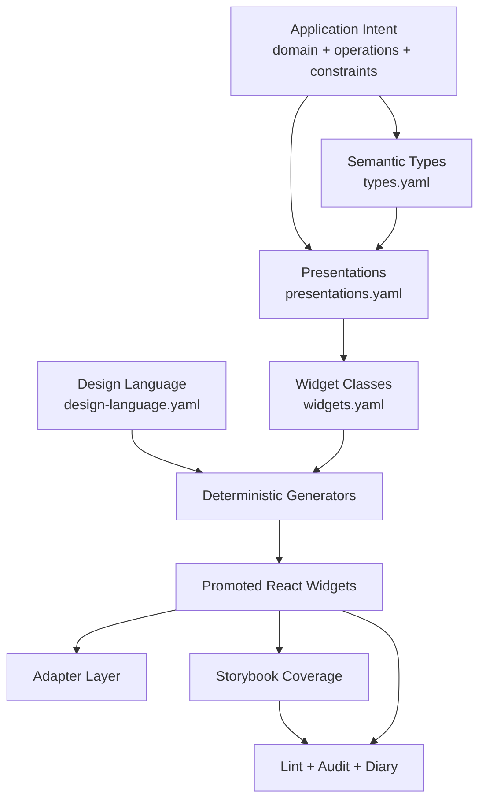

# Design System Factory: Vision and Scope

## Executive Summary

DMETA-001 is the first runthrough of a "design system factory" — a meta-DSL and toolchain that produces complete, production-ready React applications for dense operational information. The factory takes application intent, semantic archetypes, presentation rules, and design criteria as input, then produces running applications built on React + Vite + RTK Query + Tailwind as output.

The key differentiator from a traditional component library is the **presentation-based UI paradigm**: application-specific entities are mapped onto reusable semantic archetypes, and those archetypes can appear in multiple typed presentations (compact reference, dense row, summary card, detail panel, etc.). Actions declare which semantic archetypes they accept as arguments, enabling right-click invocation and value-filling from on-screen representations.

The graphic design system is not one fixed look. It is a **typographic dense-information UI archetype**: sober, low-chrome, visually calm, and optimized for legibility under high information load. The log-presentation-based-ui and image-collector apps are reference instances of that archetype, not the only possible skin.

## Problem Statement

Applications that handle dense operational information — logs, realtime events, agent workflows, retail logistics pipelines, order fulfillment states, incident queues, build systems, monitoring streams — need UIs that make large volumes of state and text legible without drowning the user in chrome. Traditional component libraries assume moderate data density and decorative visual identity. What we need instead is:

1. **High-density legibility**: pages that can show hundreds of data-rich entries without visual noise.
2. **Semantic archetype rendering**: domain-specific objects are mapped onto reusable functional archetypes such as Actor, Work Item, Event, State, Resource, Relation, Metric, and Timeline Span.
3. **Presentation polymorphism**: the same archetype instance can render differently depending on context — compact reference, inline token, table row, summary strip, card, or detail panel.
4. **Action-level type awareness**: operations declare what semantic archetypes they consume, so they can be triggered by right-clicking on-screen representations or having their arguments filled by selecting matching presentations.
5. **Deterministic generation**: widget classes, shared helpers, and types are projected from IR schemas, not hand-written from scratch each time.
6. **Process discipline**: the scaffold → promote → harden → lint → audit workflow from HAIR-041 is preserved and extended.

## Proposed Solution: The Factory Model

### What the factory produces

A complete, shippable React application with:
- Typed semantic models (TypeScript interfaces for domain objects)
- A presentation registry (mapping semantic types to their presentation variants)
- Generated widget scaffolds (component classes with typed props, action slots, story plans)
- Generated shared design helpers (tokens, typography, action styles, data attributes)
- Promoted production widgets (real implementation with accessibility, interaction, HTML)
- An adapter layer that converts runtime JSON → typed props → widgets → typed callbacks → dispatch
- Storybook stories proving distinct widget states
- Lint and validation tooling

### What the factory consumes

1. **Semantic archetype definitions** — which reusable functional roles exist and how application-domain entities map onto them
2. **Presentation definitions** — how each archetype can appear on screen, what each variant requires, and which density/context it serves
3. **Widget class definitions** — what component classes consume those archetypes and presentations
4. **Design language rules** — shared visual semantics (tokens, typography, spacing, actions, layout, density)
5. **Application intent** — what the app is for, what operations exist, what data flows through it, and which archetypes it instantiates

### The layer model

### Target stack

- **React** + **Vite** + **TypeScript** — the application runtime
- **RTK Query** — data fetching and caching
- **Tailwind CSS** — utility styling with design-token integration
- **A simple typography baseline** — usually mono or highly legible sans/mono pairing, with few roles and carefully constrained weight/size changes
- **A sober information palette** — neutral surface/text colors with judicious status and category accents, not decorative color

### The graphic design system

The aesthetic is an archetype rather than a single theme. The two existing reference applications demonstrate useful instances of it:

#### From log-presentation-based-ui
- Token-based rendering: every semantic element is a `PresentationToken` with `kind`, `semanticType`, `tone`
- Operation registry: actions declare `startsFrom: SemanticType[]` so they can be discovered from right-click context
- Candidate presentation: arguments are filled by selecting on-screen values of the matching type
- Four text roles: body (13px ink), label (13px muted uppercase), caption (13px ink uppercase), display (24-28px ink)
- Status accents only: info/success/warning/danger colors appear on semantic tokens, not as decoration
- Monospace-first: Berkeley Mono for all text, tabular-nums for data

#### From image-collector
- Programme № 1 CSS: 1 family · 1 weight · 2 sizes · 2 cases · 3 values · 4 roles
- Subtle cool-grey/neutral surfaces with no decorative background noise
- Zero-radius scrollbars
- Ink selection highlight
- Strict typographic hierarchy: no font-size or font-weight outside the four roles

## Design Decisions

### Decision 1: Proposal A — extend, don't replace

The HAIR-041 widget IR workflow is proven. The factory extends it with:
- `types.yaml` — semantic type layer (new)
- `presentations.yaml` — presentation registry layer (new)
- `widgets.yaml` — existing widget IR schema, extended with semantic-type references
- `design-language.yaml` — existing design language IR, extended for presentation chrome

Rationale: replacing the proven pipeline would lose the process discipline (scaffold → promote → harden → lint → audit). Adding layers preserves that discipline while introducing the new concepts.

### Decision 2: Presentation-based UI, not just component-based UI

Every domain object is mapped onto a **semantic archetype identity** that is separate from its visual rendering. In an agentic dashboard, an Actor might be an Agent or User; in retail logistics, an Actor might be a Customer, Picker, Warehouse, or Carrier. The interaction model remains congruent even when the concrete domain names change. Actions declare their argument types in terms of semantic archetypes and/or mapped domain types, not widget props.

This enables:
- Right-click on any Actor presentation → see all Actor-targeted operations for that app
- Selecting a compact reference → auto-fills any action that requires the corresponding archetype/domain argument
- Switching presentation without changing the underlying data binding

### Decision 3: High-volume data as first-class concern

Unlike HAIR-041 (which was CRUD/admin-focused), this factory targets dense operational systems:
- Streaming or incrementally updating records (logs, orders, jobs, shipments, workflow steps)
- Real-time status changes (agent processes, tool executions, fulfillment state, incident queues)
- Tabular and timeline data with inline semantic references
- Filterable, searchable, sortable dense displays
- Keyboard-first navigation for expert users

This means widget classes should be named around reusable information structures rather than one domain:
- `RecordStream` — virtualized, token-rich sequence of events or records
- `DenseTable` — sortable, filterable grid with inline semantic presentations
- `ProcessPanel` — live-updating workflow/process/pipeline view
- `ActionPalette` — action-first keyboard and context interface
- `DetailDrawer` — contextual detail for any selected presentation

### Decision 4: Sober typographic information UI as the design archetype

The design language is not "a theme." It is a constraint system for producing calm, dense, readable applications:
- Few type roles, with explicit purposes
- Small set of sizes and weights
- Judicious spacing and rhythm, not ornamental layout
- Neutral surfaces and text by default
- Status/category color used sparingly and semantically
- Low chrome; visual distinction comes from typography, spacing, alignment, and carefully constrained contrast

A concrete app may choose Berkeley Mono with a subtle cool-grey neutral palette, or a related sober palette and typeface. What must remain stable is the information-design archetype: dense, legible, restrained, texture-free, and semantically colored.

## Alternatives Considered

### Alternative 1: Full compiler architecture from scratch
Rejected for DMETA-001. Would require designing a complete compiler before having any concrete examples. Proposal A (extend the existing pipeline) is safer and still allows compiler evolution later.

### Alternative 2: Traditional component library
Rejected. A component library without the meta-layer loses the process discipline, cannot do presentation-based UI, and has no way to enforce the design language across widgets.

### Alternative 3: AI-first generation (prompt → full app)
Rejected for the first runthrough. The factory should produce deterministic, auditable, reviewable artifacts. AI-assisted drafting is fine, but the source of truth must be the IR schemas, not LLM context.

## Implementation Sequence

Following the Collaborative Schema Design Sessions playbook:

1. **Phase 1 (this ticket)**: Elicit semantic archetype model — define reusable functional roles for dense operational applications
2. **Phase 2**: Elicit presentation model — define presentation variants per archetype and per domain mapping
3. **Phase 3**: Define widget classes — what components consume archetypes and presentations
4. **Phase 4**: Define design-language archetype — sober typographic information UI as formal IR
5. **Phase 5**: Draft example YAML — pressure-test the schemas across at least two different domains
6. **Phase 6**: Formalize the schema — required fields, validation rules, generation targets
7. **Phase 7**: Build generators and validate — scaffold, design helpers, lint
8. **Phase 8**: Promote pilot widgets — small generic set first (RecordStream, DenseTable, ProcessPanel, ActionPalette)

## Open Questions

1. **What is the first archetype inventory?** Candidate archetypes: Actor, Work Item, Event, State, Resource, Relation, Metric, Timeline Span, Command, Annotation. Which are essential for v1?
2. **How do domain mappings work?** For example, Agent/Customer/Warehouse/Carrier can all map to Actor in different applications, while ToolCall/ShipmentStep/BuildJob can map to Work Item or Event.
3. **Which presentation variants are archetypal vs domain-specific?** Compact reference, inline token, dense row, summary card, detail panel, timeline marker, status badge.
4. **How generic should streaming semantics be?** Does the archetype layer need notions like append-only stream, mutable process, finite pipeline, and historical ledger?
5. **How strict is the graphic design archetype?** Which constraints are mandatory (density, typographic hierarchy, sober texture-free neutral palette), and which are theme choices (exact font, neutral temperature, accent colors)?
6. **Tailwind integration with design tokens**: how tightly should the generated design helpers couple to Tailwind's config vs. plain CSS custom properties?

## Related Artifacts

### Playbooks (in ticket playbooks/)
- `01-collaborative-schema-design-sessions-for-presentation-based-ui.md` — the session protocol we'll follow
- `02-widget-ir-to-finished-widget-playbook.md` — the proven promotion workflow
- `03-admin-dsl-widget-design-system-review-playbook.md` — how to detect drift
- `04-widget-playbook-compliance-audit-guide.md` — compliance verification
- `05-intern-widget-compliance-review-kickoff.md` — intern-style review kickoff

### Specifications (in ticket specifications/)
- `01-design-system-dsl-data-structures-and-toolchain.md` — the full technical spec from HAIR-041

### Sources (in ticket sources/)
- `01-article-dsl-for-creating-design-systems.md` — the DSL pattern article
- `08-admin-dsl-react-widget-ir-catalog.md` — widget IR source catalog
- `09-widget-definition-ir-yaml-format-spec.md` — formal YAML schema spec
- `admin-dsl-widget-ir/` — all HAIR-041 YAML source artifacts (pass model, shared types, widget categories, design language, storybook manifest)

### Live code references
- `2026-05-19--log-presentation-based-ui/` — working PBUI reference app
- `2026-05-19--image-collector/` — working minimal typography reference app
