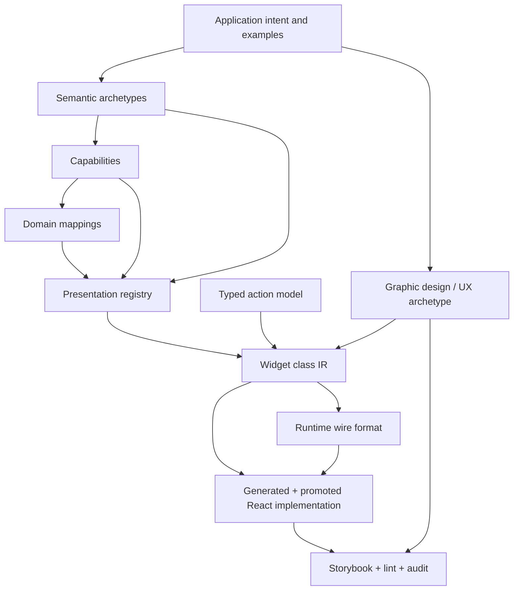

# Playbook: Collaborative Schema Design Sessions for Presentation-Based UI

## Purpose

This playbook describes how to run collaborative design sessions for the DMETA design-system factory. The goal is not to design one application directly. The goal is to turn human intent, examples, visual references, and domain pressure into durable intermediate artifacts and then into concrete DSL schemas, playbooks, generators, lint rules, and React implementation workflows.

The target output path is:

```text
collaborative discussion + this playbook
  -> intermediate semantic/archetype document
  -> intermediate graphic design/UX archetype document
  -> concrete widget DSL spec
  -> concrete implementation/review playbooks
  -> computational codegen/linting/tools
  -> hard design guidelines
  -> concrete domain-specific design system instance
```

The central idea is **presentation-based UI**: application-specific entities are mapped onto reusable semantic archetypes and capabilities, then rendered through typed presentations. Actions declare what semantic archetypes/capabilities/domain types they accept, so users can invoke actions from on-screen representations and fill action arguments by selecting matching representations.

## Collaboration Contract

### The human provides

- Product intent and target app family.
- Concrete example domains.
- Visual references and aesthetic constraints.
- Acceptance criteria and tradeoff decisions.
- Naming pressure from real operational work.
- Rejection of abstractions that are too broad or too speculative.

### The agent provides

- Terminology extraction and stabilization.
- Layer separation.
- Schema proposals and alternatives.
- Example YAML before formal schema hardening.
- Ambiguity detection.
- Validation invariants.
- Artifact organization.
- Implementation sequencing.
- Diary, decision log, and follow-up tasks.

The human should not need to arrive with a complete schema. The agent should not invent domain semantics without validation.

## Core Layer Model

Always begin by separating these layers:



Each layer answers a different question.

| Layer | Question |
| --- | --- |
| Application intent | What app family are we designing for? |
| Semantic archetypes | Which reusable operational roles recur across domains? |
| Capabilities | What reusable affordances/projections/actions can an object have? |
| Domain mappings | How do app-specific objects map onto archetypes and capabilities? |
| Presentations | How can semantic values appear on screen? |
| Actions | What operations can be launched or filled from semantic representations? |
| Widget class IR | What reusable React component classes consume those presentations? |
| Design/UX archetype | What visual and interaction constraints make the UI dense but calm? |
| Runtime wire format | What can the backend/runtime send safely? |
| React implementation | What gets generated, promoted, tested, and audited? |

## Key Distinctions

### Archetype vs capability

An **archetype** is a reusable functional role that appears across many applications: `Actor`, `WorkItem`, `Event`, `Resource`, `TimelineSpan`, `Metric`, `ActionSpec`, `ActionInvocation`.

A **capability** is a reusable affordance or behavior: `identifiable`, `labelable`, `stateful`, `temporal`, `inspectable`, `relatable`, `actionable`, `streamable`, `measurable`, `schedulable`.

An archetype is usually a named bundle of capabilities. In the current IR, archetypes form an explicit inheritance tree/DAG rooted at the abstract `Archetype` class. Common parents such as `Entity`, `WorkItem`, `Resource`, and `Relation` contribute inherited capabilities and recommended presentations; domain-specific archetypes should extend the nearest semantic parent instead of copying its fields. A concrete domain type may map to multiple concrete archetypes, but it should not map to abstract roots or abstract helper parents.

Capabilities also form an explicit inheritance tree/DAG rooted at the abstract `Capability` class. A specialized capability such as `filter_source` or `facetable` inherits required projections, presentations, actions, and filters from its parents. This means the authoring question is not only “which capabilities exist?” but also “what reusable capability class does this capability extend?”

Authoring rules:

- `Archetype` and `Capability` are explicit abstract roots with `extends: []`.
- Every non-root archetype/capability must declare at least one `extends` parent.
- Use `abstract: true` for taxonomy and helper nodes that should never appear directly in domain mappings.
- Multiple inheritance is allowed when it models a real semantic intersection, but parent order is meaningful because inherited arrays are merged in stable parent order.
- Domain examples are validated against the effective inherited model, so required projections inherited from parent capabilities must be mapped.

### Capability-level presentation vs archetype-level presentation

A presentation belongs to a capability when it represents one reusable affordance:

- `status_badge` -> `stateful`
- `timestamp_inline` -> `temporal`
- `compact_id` -> `identifiable`
- `metric_cell` -> `measurable`
- `relation_link` -> `relatable`

A presentation belongs to an archetype when it composes multiple capabilities into a recognizable operational object:

- `actor_chip` -> `Actor`
- `work_item_row` -> `WorkItem`
- `event_row` -> `Event`
- `timeline_span_card` -> `TimelineSpan`

A presentation belongs to a concrete domain type only when the generic archetype/capability presentation is insufficient.

### State archetype vs stateful capability

Most objects are not `State` objects. They have the `stateful` capability.

`status_badge` is the representation of the `stateful` capability.

A `State` archetype is only needed when state itself is first-class, for example:

- workflow state definition;
- state-machine node;
- transition target;
- policy/configured state;
- status taxonomy.

### ActionSpec vs ActionInvocation vs Event

A tool call, job, shipment step, or backend operation may have multiple semantic layers:

1. **ActionSpec** — the definition/signature of a callable operation.
2. **ActionInvocation** — a concrete scheduled/running/completed execution.
3. **Event** — an append-only observation emitted during or because of the invocation.

Do not flatten these unless the concrete app really has only one layer.

### Ranges vs hard rules

The generic design archetype should use ranges and constraints. A concrete design-system instance chooses exact hard values.

Generic archetype:

```text
few type roles, 11-20px range, low chrome, semantic color, compact density
```

Concrete instance:

```text
body = 13px / 400 / 1.4, row height = 28px, radius = 2px, divider = rgba(0,0,0,.12)
```

Only concrete instances can be fully linted.

## Required Session Outputs

A successful collaborative session must leave durable artifacts, not just chat history.

Required outputs:

1. Glossary.
2. Decision log.
3. Open questions log.
4. Example domains.
5. Semantic archetype inventory.
6. Capability inventory.
7. Domain mapping examples.
8. Presentation inventory.
9. Action model sketch.
10. Graphic design/UX archetype notes.
11. Example YAML fragments.
12. Validation invariants.
13. Generation targets.
14. Implementation sequence.
15. Diary update.

## Phase 0 — Orientation and Sources

### Inputs

- Human intent.
- Existing apps or prototypes.
- Visual references.
- Prior design-system/toolchain artifacts.
- Target stack constraints.

### Agent tasks

1. Read all source material.
2. Copy durable references into the ticket or long-term document area.
3. Summarize current understanding.
4. Identify which assumptions are concrete-domain-specific vs generic.
5. Create or update diary and tasks.

### Exit criteria

- The app family is described.
- At least two example domains are named.
- Visual direction is summarized.
- Source artifacts are organized.

## Phase 1 — Elicit Semantic Archetypes

Do not start with only one domain's nouns. Start with reusable operational roles.

Good prompts:

- What kinds of things are inspected, filtered, tracked, assigned, executed, or compared?
- Which concrete domain objects from different domains behave similarly?
- Which concepts have stable identity?
- Which concepts are append-only observations?
- Which concepts represent work in progress?
- Which concepts define actions vs execute actions?

Candidate archetypes:

- `Actor`
- `WorkItem`
- `Event`
- `Resource`
- `Relation`
- `Metric`
- `TimelineSpan`
- `ActionSpec`
- `ActionInvocation`
- `Annotation`

### Exit criteria

The team can map at least two distinct domains onto the archetype set without obvious distortion.

## Phase 2 — Elicit Capabilities and Projections

Capabilities define what presentations, actions, filters, and validations can rely on.

Good prompts:

- What must be identifiable?
- What can have state?
- What has time, duration, or interval semantics?
- What can be inspected?
- What can be acted on?
- What is related to what?
- What can be aggregated or measured?

Candidate capabilities:

- `identifiable`
- `labelable`
- `stateful`
- `temporal`
- `inspectable`
- `relatable`
- `actionable`
- `streamable`
- `append_only`
- `measurable`
- `aggregatable`
- `schedulable`
- `executable`
- `spatial`

For each capability, define:

- required projections;
- optional projections;
- capability-level presentations;
- useful filters;
- useful actions;
- validation invariants.

### Exit criteria

Every capability has at least one concrete consumer: presentation, action, validation rule, generator output, or widget contract.

## Phase 3 — Elicit Presentations and Actions

A presentation is a named display contract, not just a visual component.

Prompts:

- Which capability-level presentations recur everywhere?
- Which archetype-level presentations are needed?
- Which domain-level presentations are truly special?
- Which presentations are selectable/actionable?
- Which actions can start from which archetypes/capabilities?
- Which actions need additional arguments?
- Can those arguments be filled from on-screen representations?

Minimum presentation examples:

- `compact_ref`
- `inline_token`
- `status_badge`
- `timestamp_inline`
- `metric_cell`
- `dense_row`
- `summary_card`
- `detail_panel`
- `timeline_marker`

Minimum action examples:

- `inspect`
- `copy_reference`
- `filter_by_value`
- `filter_by_state`
- `open_related`
- `retry_work_item`
- `schedule_action`
- `compare_metrics`

### Exit criteria

The team can explain whether each presentation attaches to a capability, archetype, or domain type.

## Phase 4 — Elicit Graphic Design and UX Archetype

Do not choose hard theme values too early. First define the visual/UX archetype.

Prompts:

- What makes this UI readable after hours of use?
- What should be dense, and what should breathe?
- Which information needs color, and which does not?
- Which controls should be visible at rest vs revealed on hover/focus?
- Which interactions must be keyboard-first?
- Which constraints should later become lint rules?

Expected archetype qualities:

- sober;
- typographic;
- low chrome;
- dense but breathable;
- semantically colored;
- keyline/alignment driven;
- keyboard/context fluent;
- progressive disclosure oriented.

### Exit criteria

The team has a range-based design archetype that can later be hardened into exact design tokens.

## Phase 5 — Draft Example YAML Before Formalizing

Write examples before committing to schema rules.

Required examples:

1. Archetype/capability definitions.
2. Domain mapping for an agent workflow domain.
3. Domain mapping for a non-agent domain, such as retail logistics.
4. Presentation definitions.
5. Action definitions.
6. Widget definitions.
7. Design-language range or token definitions.

Pressure-test questions:

- Is any field repeated too often?
- Does any schema layer absorb another layer's responsibility?
- Can the examples generate useful TypeScript?
- Can invalid references be detected?
- Can actions discover valid source presentations?
- Can a concrete UI be built from the artifacts?

### Exit criteria

Example YAML feels coherent in at least two domains.

## Phase 6 — Formalize Schemas and Invariants

For every field ask:

1. What artifact consumes this field?
2. Is it used for generation, validation, runtime interpretation, or review?
3. Can it be derived from another layer?
4. What invariant can be checked?
5. Is it generic, concrete-domain-specific, or theme-instance-specific?

Expected schema artifacts for DMETA v0:

```text
sources/dmeta-ir/
  00-index.yaml
  01-core-model.yaml                  # core-model package/index
  core-model/
    core-model.yaml                   # metadata, logical types, authoring guidance
    archetypes.yaml                   # archetypes with description + long_description
    capabilities.yaml                 # capabilities with description + long_description
    presentations.yaml                # presentations and actions
    examples/
      <domain-example>.yaml           # one pressure-test domain per file
  02-design-language.yaml
  03-widgets.yaml
```

Authoring context requirements:

- `01-core-model.yaml` and each core-model subfile must include enough prose context for a new reader to understand what the file is for.
- Use `summary` for short tables and generated manifests.
- Use `long_summary` for intern guides, generated documentation, review context, and LLM-assisted workflows.
- Every archetype and capability must include both `description` and `long_description`.
- Every non-root archetype and capability must include `extends`; abstract taxonomy nodes must include `abstract: true`.
- Every formal presentation and action should include both `description` and `long_description` once it is promoted beyond a sketch.
- Design-language YAML should avoid opaque token lists: sections should include `long_summary`, and roles/recipes/states/rules should include `description`, `long_purpose`, or `long_description` where useful.
- Every core-model subfile should include `references` to the relevant design docs, especially `dmeta/design-docs/02-semantic-archetype-and-capability-model.md` and `dmeta/design-docs/05-dmeta-core-model-and-widget-ir-spec.md`.
- Domain examples belong under `core-model/examples/`, one file per domain, so pressure tests do not make the core package index unreadably large.

Expected invariants:

- Every referenced archetype exists and has a valid path to the abstract `Archetype` root.
- Every referenced capability exists and has a valid path to the abstract `Capability` root.
- No domain type maps an abstract archetype or abstract capability directly.
- Every required capability projection, including inherited required projections, is mapped by concrete domain types that claim it.
- Every presentation requirement resolves to a projection.
- Every action argument references known archetypes/capabilities/domain types.
- Every widget references known presentations or presentation slots.
- Concrete design tokens obey the chosen hard design rules.

### Exit criteria

The schema has consumers, examples, and validation rules.

## Phase 7 — Define Generation Targets

Connect schemas to generated outputs.

| Input | Output |
| --- | --- |
| `01-core-model.yaml` + `core-model/archetypes.yaml` | TypeScript archetype metadata, validators, generated docs |
| `core-model/capabilities.yaml` | Projection interfaces, capability guards, presentation hooks, generated docs |
| `core-model/presentations.yaml` | Presentation registry, action registry, argument collection helpers |
| `core-model/examples/*.yaml` | Domain pressure tests, future domain adapter examples |
| `03-widgets.yaml` | Component scaffolds, metadata sidecars, stories |
| `02-design-language.yaml` | Tokens, typography, density, action/presentation styles |
| Future Storybook manifest | Coverage reports and audit targets |

### Exit criteria

No schema field exists without a consumer.

## Phase 8 — Implementation Kickoff

Once schemas are accepted, re-enter the proven workflow:

1. Validate schema.
2. Generate scaffolds and helpers.
3. Promote widgets manually.
4. Preserve metadata sidecars.
5. Keep adapter boundaries explicit.
6. Harden Storybook stories.
7. Run lint and validation.
8. Update diary, changelog, and tasks.

### Exit criteria

A concrete domain-specific design-system instance has at least:

- one dense stream/table;
- one detail panel;
- one presentation token/ref flow;
- one typed action launched from a presentation;
- one argument-filled action using selected on-screen representations.

## Anti-Patterns

### One giant schema

Do not combine archetypes, capabilities, domain mappings, presentations, widgets, actions, runtime pages, and design tokens into one file.

### Concrete domain leakage

Do not make `Agent`, `Shipment`, `Order`, or `ToolCall` universal factory concepts. Map them to archetypes/capabilities.

### Capability as vague tag

A capability must define projections, presentations, actions, validations, or generation outputs.

### Presentation hidden in widgets

If a widget invents how status, references, timestamps, or metrics render locally, the presentation registry has failed.

### Design skin too early

Do not hard-code one exact graphic theme into the generic archetype. Harden exact values only for concrete instances.

### Storybook-as-gallery

Storybook is a coverage and audit system, not merely a demo gallery.

## Working Rules

1. Start from examples, but generalize to archetypes and capabilities.
2. Keep domain mappings separate from factory archetypes.
3. Attach presentations to the lowest reusable layer that makes sense.
4. Use ranges in the generic design archetype; hard values in concrete design systems.
5. Preserve the HAIR-041 scaffold -> promote -> harden -> lint -> audit workflow.
6. Keep every session artifact in durable documents.
7. Maintain a decision log and diary.
8. Pressure-test against at least two domains before formalizing.
9. Every schema field needs a generator, validator, runtime, or review consumer.
10. Treat visual design rules as part of the DSL/toolchain, not as informal taste.

## Suggested First Pressure Test

Use two deliberately different domains:

1. **AI agent workflow dashboard**
   - Agent, Session, ToolSpec, ToolRun, ToolEvent, LogEvent.

2. **Retail logistics/order pipeline**
   - Order, Shipment, Carrier, Warehouse, Package, ScanEvent, DelayReason.

A good schema should map both without rewriting the generic factory vocabulary.

## Practical Takeaway

The design-system factory should not produce a single component library. It should produce a repeatable language-and-toolchain process for dense operational applications.

The collaborative session succeeds when the team can move from incomplete intent to:

- semantic archetypes;
- capabilities;
- presentation contracts;
- typed actions;
- widget IR;
- design-language rules;
- generators;
- lint/audit;
- and finally a concrete React design-system instance.
