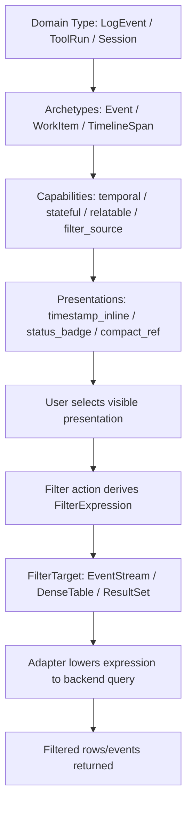

# Filter Semantics for High-Density Event-Oriented DMETA Applications

## Executive Summary

DMETA's current archetype/capability model already hints at filtering. Several capabilities list filter operators: `stateful` supports `equals`, `not_equals`, and `in`; `temporal` supports `before`, `after`, and `between`; `relatable` supports relation filters; `measurable` supports comparison and range filters. This is useful, but it is not yet a complete filtering model.

The missing concept is that filtering is not only an action on a value. Filtering is a multi-part semantic relationship among:

- the **surface or collection being filtered**: an event stream, dense table, result window, timeline, search result set, queue, or trace;
- the **filterable subject type**: the records inside that surface, such as `LogEvent`, `ToolRun`, `Session`, `Shipment`, or `ScanEvent`;
- the **filter dimension**: a field, projection, relation, derived facet, full-text index, or time window that can constrain the subject set;
- the **filter value source**: a visible object that can become a constraint, such as an `Agent`, `Client`, `Session`, `StatusBadge`, timestamp, metric value, or relation link;
- the **filter expression**: the actual active constraint, such as `session_id = abc`, `client_id = web`, `state in [failed, blocked]`, or `timestamp between T1 and T2`;
- the **filter UI state**: chips, pills, quick filters, facets, search text, and saved filter presets.

The current DMETA model treats objects such as `Actor`, `Event`, `WorkItem`, `Resource`, and `TimelineSpan` well. It does not yet model **pure filter objects**, **filter dimensions**, or **filterable surfaces** well enough. This matters for high-density and event-oriented applications because filtering is not an optional helper feature. It is the main navigation and comprehension mechanism.

This document proposes that DMETA add a first-class filtering layer with three related ideas:

1. **A `filterable` capability** for things that can be constrained by filter expressions, especially streams, result sets, tables, and collection-like semantic surfaces.
2. **A `filter_source` / `filter_value` capability** for things whose presentations can create filter expressions, such as actors, sessions, clients, states, metrics, timestamps, labels, and relation links.
3. **A `FilterSpec` / `FilterCriterion` / `FilterPreset` archetype family** for pure filter objects: values that are not domain records themselves but represent constraints, saved queries, facet buckets, or active filter chips.

The goal is not to turn DMETA into a database query language. The goal is to give the design system enough semantic structure to generate and validate consistent filtering interactions across logs, agent sessions, event streams, workflow queues, dense tables, and operational dashboards.

## Problem Statement

### The current model has filter operators but no filtering architecture

The current `capabilities.yaml` file already includes filter metadata:

```yaml
stateful:
  filters:
    - equals
    - not_equals
    - in

temporal:
  filters:
    - before
    - after
    - between

relatable:
  filters:
    - has_relation
    - relation_equals

measurable:
  filters:
    - lt
    - lte
    - gt
    - gte
    - between
```

This says that values exposed by these capabilities can participate in filters. It does not say:

- what surface receives the filter;
- whether the selected object is itself being filtered or is being used as a filter value;
- which record types a filter applies to;
- whether a value is a literal, relation reference, full semantic object, facet bucket, or saved filter;
- how a `FilterBar`, `SearchBox`, `RecordStream`, `DenseTable`, and `ActionPalette` coordinate;
- how filters are serialized into backend queries;
- how generated widgets know which filter dimensions exist;
- how active filter chips retain semantic identity and action behavior.

For simple tables, implicit filter metadata may be enough. For high-density event-oriented systems, it is not enough.

### Event-oriented applications depend on filtering as a primary interaction

In a dense operational system, users rarely read all records. They progressively narrow the current surface:

- show events for one session;
- show tool calls for one agent;
- show events emitted by one client;
- show failed invocations in the last hour;
- show shipments delayed by one carrier;
- show scan events at one facility;
- show logs containing one trace id;
- show metric outliers for one workflow run;
- show only events related to the selected order.

In these systems, filtering is equivalent to navigation. A user moves through the application by turning visible semantic presentations into constraints. The design system must therefore understand filtering at the same semantic level as inspection, relation traversal, context menus, and action argument collection.

### Some objects can be filtered, some objects can filter, and some objects are filters

The user correction is important:

> Some things are pure filters. Some objects can be used as filter. Some objects can be filtered. For example, filtering agent sessions by client or on a session id, and filtering event streams.

This implies three roles that the current model does not separate clearly:

| Role | Example | Meaning |
|---|---|---|
| Filter target | `EventStream`, `DenseTable`, `SessionList`, `ResultSet` | A surface/collection that can be constrained. |
| Filter value source | `Client`, `Session`, `Agent`, `StatusBadge`, `timestamp`, `metric_cell` | A visible value that can become a constraint. |
| Pure filter object | `client = web`, `session_id = abc`, `last 15 min`, `Failed only`, `SavedFilter` | A semantic object representing the constraint itself. |

The same domain object can participate in more than one role. A `Session` can be a record in a filtered session table. A `Session` compact reference can also be used to filter an event stream by `session_id`. An active filter chip can then represent the pure criterion `session_id = selected_session.id`.

### Current archetypes are object-oriented, not collection/query-oriented

The current archetypes are:

- `Actor`
- `WorkItem`
- `Event`
- `Resource`
- `Relation`
- `Metric`
- `TimelineSpan`
- `ActionSpec`
- `ActionInvocation`
- `Annotation`

These are good for individual semantic subjects. They do not explicitly model:

- a stream as a first-class semantic surface;
- a query result as a first-class semantic surface;
- a filter dimension as a first-class object;
- an active filter criterion as a first-class presentation;
- a saved filter or filter preset;
- a facet bucket/count returned by a backend.

The result is that filtering risks becoming an ad hoc widget feature rather than a first-class part of the semantic model.

## Current System Orientation for a New Intern

This section explains the existing pieces before proposing changes.

### DMETA core model files

The core model lives under:

```text
/home/manuel/workspaces/2026-05-19/dmeta-dsl/dmeta/sources/dmeta-ir/
  01-core-model.yaml
  core-model/
    core-model.yaml
    archetypes.yaml
    capabilities.yaml
    presentations.yaml
    examples/
      agent-workflow.yaml
      retail-logistics.yaml
```

The important files for this design are:

- `design-docs/02-semantic-archetype-and-capability-model.md` — the conceptual source for archetypes, capabilities, projections, presentations, and actions.
- `design-docs/05-dmeta-core-model-and-widget-ir-spec.md` — the current concrete schema specification.
- `sources/dmeta-ir/core-model/archetypes.yaml` — the current list of reusable semantic roles.
- `sources/dmeta-ir/core-model/capabilities.yaml` — the current list of reusable affordances/projections/operators.
- `sources/dmeta-ir/core-model/presentations.yaml` — the current presentation and action contracts.
- `sources/dmeta-ir/03-widgets.yaml` — the current widget inventory, including `RecordStream`, `DenseTable`, `DetailDrawer`, and `ActionPalette`.
- `ttmp/.../design-doc/02-generic-widget-baseline-for-dense-operational-design-systems.md` — the prior DMETA-001 document that identified `FilterBar` and `SearchBox` as baseline widgets.

### The current semantic pipeline

DMETA currently thinks about applications like this:

```text
concrete domain type
  -> semantic archetypes
  -> capabilities
  -> projections
  -> presentations
  -> widgets
  -> typed actions
```

Example:

```text
ToolRun
  -> ActionInvocation + WorkItem
  -> identifiable + labelable + stateful + temporal + executable + relatable
  -> id, label, state, start_time, end_time, duration_ms, actor_ref
  -> dense_row, status_badge, duration_cell, relation_link
  -> DenseTable / RecordStream / DetailDrawer
  -> inspect, retry_work_item, cancel_work_item, filter_by_state
```

This is good for rendering and action dispatch. Filtering needs one more layer because a filter is not always a property of the selected object alone. It is a relationship between the selected value and a target collection.

### Existing action support for filtering

`presentations.yaml` currently defines `filter_by_value` and `filter_by_state` actions. The simplified idea is:

```yaml
filter_by_value:
  accepts:
    - presentation: inline_token
    - presentation: compact_ref
    - presentation: metric_cell
  result:
    kind: apply_filter

filter_by_state:
  accepts:
    - capability: stateful
    - presentation: status_badge
    - presentation: state_cell
  result:
    kind: apply_filter
```

This is a useful starting point. The missing fields are:

- which filter target receives the filter;
- which filter dimension is being set;
- which operator should be used by default;
- how to serialize the criterion;
- how to display the active criterion;
- whether the criterion is local to the current surface or global to the workspace;
- how to distinguish a relation filter from a literal equality filter.

### Existing widget support for filtering

`03-widgets.yaml` defines `DenseTable` as sortable/filterable in prose, and the previous generic widget baseline recommends `FilterBar` and `SearchBox`. However, the widget IR does not yet include formal contracts for:

- active filter chips;
- filter dimensions;
- available facet values;
- query text;
- filter scope;
- filter expression callbacks;
- serialization/lowering to backend APIs.

The semantic model should define those pieces before the widget IR tries to scaffold them.

## Proposed Solution

### Overview

Add filtering as a first-class semantic subsystem in the DMETA core model. The system should explicitly represent:

1. **Filterable targets** — semantic surfaces/collections that can accept filters.
2. **Filter dimensions** — fields, projections, relations, and derived facets that can be constrained.
3. **Filter value sources** — presentations that can create constraints.
4. **Filter expressions** — serializable predicates over target records.
5. **Filter presentations** — active chips, facet rows, filter badges, and query summaries.
6. **Filter actions** — add, remove, replace, pin, invert, save, clear, and explain filters.

The proposed model extends the existing archetype/capability/action structure rather than replacing it.



### Core distinction: target, source, and criterion

DMETA should use these names consistently:

| Concept | Meaning | Example |
|---|---|---|
| `FilterTarget` | The collection/surface being constrained. | Event stream, session table, shipment queue. |
| `FilterDimension` | A known axis that can be constrained. | `client_id`, `session_id`, `state`, `timestamp`, `agent_id`. |
| `FilterValueSource` | A visible presentation that can supply a value. | `<Session #abc>`, `<Client web>`, `<Status failed>`. |
| `FilterExpression` | The serializable predicate. | `{ dimension: "session_id", op: "eq", value: "abc" }`. |
| `FilterCriterion` | A semantic object representing an active expression. | Active chip `session_id = abc`. |
| `FilterPreset` | A saved or reusable set of criteria. | `Failed tool calls in last hour`. |

These are not necessarily all YAML archetypes on day one, but they should be part of the conceptual model and TypeScript runtime contract.

## Proposed Archetype Additions

### 1. `FilterSpec`

`FilterSpec` represents a definition of a filterable dimension or filter operation. It is analogous to `ActionSpec`, but for query constraints.

Examples:

- `session_id` dimension for `LogEvent` and `ToolEvent` streams.
- `client_id` dimension for `Session` lists.
- `state` dimension for `WorkItem` queues.
- `timestamp` time-window dimension for event streams.
- `actor_ref` relation dimension for tool runs.

Suggested YAML sketch:

```yaml
FilterSpec:
  description: Definition of a filter dimension or filter operation that can constrain a target collection.
  default_capabilities:
    - identifiable
    - labelable
    - parameterized
    - inspectable
  recommended_presentations:
    - compact_ref
    - filter_dimension_label
    - detail_panel
  examples:
    - SessionIdFilter
    - ClientFilter
    - StateFilter
    - TimeWindowFilter
```

### 2. `FilterCriterion`

`FilterCriterion` represents an active constraint, usually shown as a chip in a `FilterBar`.

Examples:

- `client_id = web`
- `session_id = sess_123`
- `state in [failed, blocked]`
- `timestamp between 10:00 and 11:00`
- `actor_ref = agent_7`

Suggested YAML sketch:

```yaml
FilterCriterion:
  description: Active predicate constraining a filter target.
  default_capabilities:
    - identifiable
    - labelable
    - actionable
    - inspectable
  recommended_presentations:
    - filter_chip
    - inline_token
    - detail_panel
  examples:
    - ActiveClientFilter
    - ActiveSessionFilter
    - FailedStateFilter
```

### 3. `FilterPreset`

`FilterPreset` represents a saved query or reusable group of criteria.

Examples:

- `Failed tool calls in last hour`
- `Current client sessions`
- `Delayed shipments by carrier`
- `Critical events since deploy`

Suggested YAML sketch:

```yaml
FilterPreset:
  description: Saved or reusable collection of filter criteria.
  default_capabilities:
    - identifiable
    - labelable
    - actionable
    - inspectable
    - parameterized
  recommended_presentations:
    - compact_ref
    - summary_card
    - detail_panel
```

### 4. `ResultSet` or `RecordSet`

A high-density application often needs a semantic object representing the current result collection. This is not a domain record; it is a query result or surface state.

Examples:

- current event stream window;
- filtered table result;
- search results;
- live tail of a log;
- trace result set;
- workflow queue page.

Recommended name: `ResultSet` if we emphasize query results, or `RecordSet` if we emphasize UI records. `ResultSet` is probably better because it includes filter/search/sort/window state.

Suggested YAML sketch:

```yaml
ResultSet:
  description: Collection or query result surface containing records that can be filtered, searched, sorted, windowed, or inspected.
  default_capabilities:
    - identifiable
    - labelable
    - filterable
    - searchable
    - aggregatable
    - inspectable
  recommended_presentations:
    - result_summary
    - filter_summary
    - detail_panel
```

### 5. Should `EventStream` be an archetype?

The current model has `Event` and `streamable`. `streamable` means an individual subject can appear in an ordered feed. It does not represent the stream itself.

There are two options:

- Add `EventStream` as a first-class archetype.
- Use `ResultSet` + `filterable` + `streaming`/`live` capabilities to represent streams.

Recommendation for v0.1: do **not** add `EventStream` immediately. Add `ResultSet`/`RecordSet` and let `RecordStream` be a widget over a filterable result set whose records are `Event`, `WorkItem`, or `ActionInvocation`. Add `EventStream` later only if stream-specific semantics become too important to express as capabilities.

## Proposed Capability Additions

### 1. `filterable`

A subject or surface can accept filter expressions.

This should usually attach to collection-like semantic objects: result sets, stream surfaces, tables, timelines, queues, and domain collection endpoints. It can also attach to a domain type when the type's collection endpoint is filterable.

YAML sketch:

```yaml
filterable:
  description: Subject or surface can be constrained by typed filter expressions.
  projections:
    filter_target_id:
      type: string
      required: true
      description: Stable id for the filter target or result surface.
    filter_dimensions:
      type: list
      required: false
      description: Available dimensions that can constrain this target.
    active_filters:
      type: list
      required: false
      description: Active filter expressions or criteria.
  presentations:
    - filter_summary
  actions:
    - apply_filter
    - clear_filters
  filters: []
  long_description: >
    Filterable means the subject is not merely a value that can appear in a filter;
    it is the thing being filtered. Event streams, dense tables, search result sets,
    workflow queues, and live trace windows are filterable surfaces. The adapter
    owns backend query lowering, but widgets and generated registries need this
    capability to know where filter expressions can be applied.
```

### 2. `filter_source` or `filter_value`

A subject can be used to create a filter expression.

Examples:

- `Agent` compact reference filters event stream by `agent_id`.
- `Session` compact reference filters logs by `session_id`.
- `Client` compact reference filters sessions by `client_id`.
- `StatusBadge` filters records by `state`.
- `TimestampText` can start a time-window filter.
- `MetricCell` can create threshold filters.

Recommended name: `filter_source`, because the subject is a source from which one or more filters can be derived. `filter_value` is also understandable, but it implies a literal scalar rather than a semantic object.

YAML sketch:

```yaml
filter_source:
  description: Subject presentation can derive one or more filter expressions for compatible targets.
  projections:
    filter_keys:
      type: list
      required: false
      description: Candidate filter dimensions this subject can populate.
    filter_value:
      type: json
      required: false
      description: Default scalar or structured value to use in a filter expression.
    filter_label:
      type: string
      required: false
      description: Human label for active filter chips.
  presentations:
    - filter_value_token
  actions:
    - filter_by_value
    - filter_by_relation
  long_description: >
    Filter_source means a visible semantic presentation can be turned into a constraint.
    It is distinct from filterable: an Agent token may filter an EventStream, but the
    Agent token is not the EventStream. The runtime must match filter sources to
    compatible filter targets through dimensions, relation paths, or adapter-provided
    filter mappings.
```

### 3. `searchable`

Text search should not be conflated with structured filtering. It is often used together with filters, but it has different semantics: tokenization, indexing, highlighting, scope, and query syntax.

YAML sketch:

```yaml
searchable:
  description: Subject or collection can be narrowed by text query.
  projections:
    search_text:
      type: string
      required: false
      description: Text indexed for search on a single record.
    search_scope:
      type: string
      required: false
      description: Named search scope for a collection or surface.
  presentations:
    - search_summary
  actions:
    - apply_search
    - clear_search
```

### 4. `facetable`

A result set can expose counts by dimension values.

Examples:

- count by state;
- count by client;
- count by agent;
- count by severity;
- count by facility;
- count by event type.

YAML sketch:

```yaml
facetable:
  description: Subject or result set can expose grouped filter buckets with counts.
  projections:
    facets:
      type: list
      required: false
      description: Available facet buckets and counts for the current result set.
  presentations:
    - facet_bucket
  actions:
    - apply_facet_filter
```

### 5. `sortable` and `windowable`

Sorting and result windows often travel with filtering. They are not filters, but they are part of the same query state.

Sketch:

```yaml
sortable:
  projections:
    sort_keys:
      type: list
      required: false

windowable:
  projections:
    cursor:
      type: string
      required: false
    limit:
      type: integer
      required: false
    live_tail:
      type: boolean
      required: false
```

These can wait until `ResultWindowControls` becomes formal, but the design should reserve the concepts now.

## Proposed Presentation Additions

Filtering needs presentations, not only actions.

### `filter_chip`

Represents an active `FilterCriterion`.

```yaml
filter_chip:
  description: Compact active filter criterion shown in FilterBar.
  layer: archetype
  applies_to:
    archetypes: [FilterCriterion]
  requires:
    - filter_expression
    - filter_label
  optional:
    - filter_target_id
    - dimension
    - operator
  role: filter_chip
  density: compact
  interaction:
    selectable: true
    context_menu: true
    copy: false
  style_recipe: filter_chip
```

Behavior:

- click/select reveals actions such as remove, invert, inspect, pin, copy expression;
- close button removes criterion;
- context menu exposes more operations;
- visual style must remain low-chrome because many chips can be active.

### `filter_dimension_label`

Represents an available filter dimension.

Examples:

- `Client`
- `Session`
- `State`
- `Time window`
- `Agent`
- `Event type`

This presentation appears in filter builders, facet panels, and documentation.

### `filter_value_token`

Represents a selectable filter value or facet bucket.

Examples:

- `client: web (12 sessions)`
- `state: failed (8)`
- `agent: planner (32 events)`
- `facility: JFK-2 (144 scans)`

### `filter_summary`

Represents the filter state of a result set.

Examples:

- `7,432 events · 3 filters · live tail off`
- `42 sessions · client = web · since 09:00`
- `18 failed tool runs · grouped by agent`

This presentation belongs to `ResultSet`/`filterable` targets.

### `facet_bucket`

Represents a count bucket returned by the backend for a dimension.

Examples:

- `failed 18`
- `completed 231`
- `client:web 42`
- `agent:planner 99`

A facet bucket is both a presentation and a filter source.

## Proposed Action Changes

### Current actions should become target-aware

`filter_by_value` currently says "add a filter matching selected presentation value." It should include target selection semantics.

Proposed shape:

```yaml
filter_by_value:
  description: Add a filter expression derived from a selected presentation value.
  category: filter
  accepts:
    - capability: filter_source
    - presentation: inline_token
    - presentation: compact_ref
    - presentation: metric_cell
  arguments:
    source:
      mode: selected_presentation
      required: true
      accepts:
        - capability: filter_source
    target:
      mode: current_filter_target
      required: true
      accepts:
        - capability: filterable
    dimension:
      mode: inferred_or_choice
      required: true
    operator:
      mode: inferred_or_choice
      required: true
  result:
    kind: apply_filter
```

### New filter actions

DMETA should eventually define these actions:

| Action | Purpose |
|---|---|
| `apply_filter` | Add one criterion to a filter target. |
| `remove_filter` | Remove one active criterion. |
| `replace_filter` | Replace an existing criterion for the same dimension. |
| `clear_filters` | Clear all filters for a target. |
| `pin_filter` | Promote a local filter to workspace/global scope. |
| `invert_filter` | Turn equality into inequality or inclusion into exclusion. |
| `save_filter_preset` | Save active criteria as a reusable preset. |
| `apply_filter_preset` | Apply a saved preset. |
| `explain_filter` | Show how a filter was derived and where it applies. |
| `apply_search` | Apply full-text search to a searchable target. |
| `clear_search` | Clear text search. |

### Action-first and object-first filtering

Presentation-based filtering should support both directions.

Object-first:

```text
click <Session sess_123>
  -> actions: INSPECT, COPY_REFERENCE, FILTER_CURRENT_STREAM_BY_SESSION
click FILTER_CURRENT_STREAM_BY_SESSION
  -> EventStream receives criterion session_id = sess_123
```

Action-first:

```text
type FILTER
  -> compatible filter-source presentations are highlighted
click <Session sess_123>
  -> choose target/dimension if ambiguous
  -> EventStream receives criterion session_id = sess_123
```

Filter-first:

```text
click + Filter
  -> choose dimension Client
  -> choose operator equals
  -> choose value web
  -> Session table receives criterion client_id = web
```

The third path requires pure filter UI, not just presentation selection.

## Proposed Runtime API

This section gives TypeScript-style APIs for a future implementation. These are not current code; they are implementation targets.

### `FilterTargetRef`

```ts
export type FilterTargetRef = {
  targetId: string;
  sourceSurface: string;          // e.g. "event-stream", "session-table"
  domainType: string;             // record type, e.g. "LogEvent"
  archetypes: ArchetypeId[];      // usually Event, WorkItem, TimelineSpan, etc.
  capabilities: CapabilityId[];   // includes "filterable"
  availableDimensions: FilterDimension[];
  activeFilters: FilterExpression[];
  search?: SearchExpression;
  sort?: SortExpression[];
  window?: ResultWindow;
};
```

### `FilterDimension`

```ts
export type FilterDimension = {
  id: string;                     // "session_id", "client_id", "state"
  label: string;                  // "Session", "Client", "State"
  valueType: "string" | "number" | "datetime" | "boolean" | "enum" | "relation" | "semantic_ref";
  operators: FilterOperator[];
  sourceCapabilities?: CapabilityId[];
  sourceArchetypes?: ArchetypeId[];
  sourcePresentations?: PresentationId[];
  backendField?: string;          // adapter-owned field path
  relationPath?: string;          // e.g. "event.session.client_id"
  defaultOperator?: FilterOperator;
};
```

### `FilterExpression`

```ts
export type FilterExpression = {
  id: string;
  targetId: string;
  dimensionId: string;
  operator: FilterOperator;
  value: unknown;
  valueLabel?: string;
  source?: PresentationRef;
  scope: "surface" | "workspace" | "global";
  createdBy: "presentation" | "filter_bar" | "preset" | "url" | "adapter";
};
```

### `FilterOperator`

```ts
export type FilterOperator =
  | "eq"
  | "neq"
  | "in"
  | "not_in"
  | "contains"
  | "starts_with"
  | "lt"
  | "lte"
  | "gt"
  | "gte"
  | "between"
  | "exists"
  | "not_exists"
  | "has_relation"
  | "relation_eq";
```

### `FilterActionRequest`

```ts
export type FilterActionRequest = {
  kind:
    | "apply_filter"
    | "remove_filter"
    | "replace_filter"
    | "clear_filters"
    | "apply_search"
    | "clear_search";
  target: FilterTargetRef;
  expression?: FilterExpression;
  expressionId?: string;
  search?: SearchExpression;
};
```

### Adapter lowering

Widgets should not know backend query syntax. The adapter translates `FilterExpression` into API requests.

```ts
export interface FilterAdapter {
  applyFilter(target: FilterTargetRef, expression: FilterExpression): Promise<ResultSetPayload>;
  removeFilter(target: FilterTargetRef, expressionId: string): Promise<ResultSetPayload>;
  clearFilters(target: FilterTargetRef): Promise<ResultSetPayload>;
  applySearch(target: FilterTargetRef, search: SearchExpression): Promise<ResultSetPayload>;
}
```

Example lowering:

```ts
function lowerExpression(expr: FilterExpression): BackendQueryParam {
  switch (expr.operator) {
    case "eq":
      return { field: expr.dimensionId, op: "=", value: expr.value };
    case "between":
      return { field: expr.dimensionId, op: "between", value: expr.value };
    case "relation_eq":
      return { relation: expr.dimensionId, value: expr.value };
  }
}
```

The adapter is the right place for backend-specific field paths, permissions, query syntax, and transport.

## Example: Filtering Agent Sessions by Client and Session ID

Assume these domain records:

```yaml
domain_types:
  Client:
    archetypes: [Actor]
    capabilities:
      identifiable:
        id: client_id
      labelable:
        label: client_name
      filter_source:
        filter_keys: [client_id]
        filter_value: client_id
        filter_label: client_name

  Session:
    archetypes: [TimelineSpan]
    capabilities:
      identifiable:
        id: session_id
      labelable:
        label: session_label
      temporal:
        start_time: started_at
        end_time: ended_at
      relatable:
        actor_ref: client_id
      filter_source:
        filter_keys: [session_id]
        filter_value: session_id
        filter_label: session_label

  SessionResultSet:
    archetypes: [ResultSet]
    capabilities:
      filterable:
        filter_target_id: sessions
        filter_dimensions:
          - client_id
          - session_id
          - started_at
```

Flow:

```text
User clicks <Client web>
  -> presentation has filter_source(filter_keys: [client_id])
  -> current target is SessionResultSet(filter_dimensions: [client_id, session_id, started_at])
  -> match succeeds on client_id
  -> create FilterExpression(client_id eq web)
  -> render active <FilterCriterion client = web>
  -> adapter reloads session result set
```

Pseudo-implementation:

```ts
function deriveFilterFromPresentation(
  source: PresentationRef,
  target: FilterTargetRef,
): FilterExpression[] {
  const sourceKeys = source.filter?.keys ?? [];

  return target.availableDimensions
    .filter(dim => sourceKeys.includes(dim.id))
    .map(dim => ({
      id: createId(),
      targetId: target.targetId,
      dimensionId: dim.id,
      operator: dim.defaultOperator ?? "eq",
      value: source.filter?.value ?? source.semanticId,
      valueLabel: source.label,
      source,
      scope: "surface",
      createdBy: "presentation",
    }));
}
```

## Example: Filtering Event Streams

Event streams are the strongest reason for this model. A stream may show events of many kinds, but users select semantic values inside those events to narrow the stream.

Domain example:

```yaml
domain_types:
  LogEvent:
    archetypes: [Event]
    capabilities:
      identifiable:
        id: event_id
      temporal:
        timestamp: ts
      stateful:
        state: severity
      relatable:
        actor_ref: agent_id
        work_item_ref: session_id
      streamable:
        sequence: offset

  EventResultSet:
    archetypes: [ResultSet]
    capabilities:
      filterable:
        filter_target_id: event_stream
        filter_dimensions:
          - session_id
          - agent_id
          - severity
          - timestamp
          - event_type
      searchable:
        search_scope: event_message
      windowable:
        cursor: next_cursor
        live_tail: live
```

Object-first flow:

```text
In RecordStream:
  10:02:03 <Agent planner> <Session sess_123> ERROR tool failed

User selects <Session sess_123>
  -> context actions include Filter event stream by Session

User chooses it
  -> active filter chip appears: Session = sess_123
  -> RecordStream reloads only matching events
```

Facet flow:

```text
Facet panel shows:
  severity
    error 24
    warning 113
    info 921

User clicks error 24
  -> active filter chip appears: severity = error
  -> stream narrows
```

Time-window flow:

```text
User selects timestamp 10:02:03
  -> action: Filter around this time
  -> ActionParameterForm asks for window size: ±5 min
  -> expression: timestamp between 09:57:03 and 10:07:03
```

## Impact on Current DMETA Meta Design System

### 1. Archetypes should include query/filter objects

The current archetype inventory is object/event/action oriented. It should expand to include at least one query/filter archetype. Recommended next addition:

- `ResultSet` — collection/query result surface.
- `FilterCriterion` — active constraint object.

Optional later additions:

- `FilterSpec` — formal filter dimension/operator definition.
- `FilterPreset` — saved reusable filter group.

This avoids forcing filters into `Annotation`, `ActionSpec`, or `Relation`, all of which are close but semantically wrong.

### 2. Capabilities should distinguish filter target vs filter source

Current capabilities say that a value supports certain filter operators. That is only the source side. Add:

- `filterable` for targets/surfaces;
- `filter_source` for values/presentations that can derive expressions;
- `searchable` for text query;
- eventually `facetable`, `sortable`, and `windowable`.

This lets the runtime answer:

```text
Can this visible presentation become a filter?
Can the current surface accept that filter?
Which dimension/operator/value should be used?
```

### 3. Presentations should include active filter and facet presentations

Add presentations such as:

- `filter_chip`
- `filter_dimension_label`
- `filter_value_token`
- `filter_summary`
- `facet_bucket`

These presentations matter because active filters are also semantic objects. A chip should be selectable, removable, inspectable, and explainable.

### 4. Actions should be target-aware

`filter_by_value` and `filter_by_state` should be retained, but future schema should include target/dimension/operator logic. The target may be:

- the current focused `RecordStream`;
- the current `DenseTable`;
- a selected result set;
- a default surface in the workspace;
- a user-chosen target if multiple targets are compatible.

### 5. Widgets need filter contracts

The generic widget baseline should be updated with explicit filter contracts:

- `FilterBar` consumes active `FilterCriterion[]` and emits remove/replace/clear actions.
- `SearchBox` emits `SearchExpression` or query text scoped to a `FilterTargetRef`.
- `RecordStream` receives a `FilterTargetRef` or result-set state.
- `DenseTable` receives a `FilterTargetRef`, sort state, and result window controls.
- `ActionPalette` can enter a filter-building mode.
- `PresentationToken`/`CompactReference` can expose filter-source metadata.
- `ResultWindowControls` coordinate cursor/page/live-tail state.

### 6. Design language should treat filters as dense operational grammar

Active filter chips must not become large decorative pills. In this design system, filters are compact operational state.

Rules:

- filter chips should be text-first and low-chrome;
- each chip should show dimension, operator if needed, and value;
- removable affordance should be visible but visually quiet;
- many active filters should wrap or collapse predictably;
- facet buckets should align counts and labels for scanning;
- filter summaries should show result count and active constraints without stealing visual priority from the data.

## Implementation Guide for a New Intern

### Step 1: Read the existing model

Start with these files:

```text
design-docs/02-semantic-archetype-and-capability-model.md
design-docs/05-dmeta-core-model-and-widget-ir-spec.md
sources/dmeta-ir/core-model/archetypes.yaml
sources/dmeta-ir/core-model/capabilities.yaml
sources/dmeta-ir/core-model/presentations.yaml
sources/dmeta-ir/03-widgets.yaml
```

Understand the current pipeline:

```text
archetype -> capability -> projection -> presentation -> widget -> action
```

Then add this mental model:

```text
filter target + filter dimension + filter source presentation -> filter expression -> result set update
```

### Step 2: Add draft archetypes in `archetypes.yaml`

Do not immediately add every idea. Start with two:

```yaml
ResultSet:
  description: Collection or query result surface containing records that can be filtered, searched, sorted, windowed, or inspected.
  default_capabilities:
    - identifiable
    - labelable
    - filterable
    - searchable
    - aggregatable
    - inspectable
  recommended_presentations:
    - filter_summary
    - summary_card
    - detail_panel
  examples:
    - EventStreamWindow
    - SessionSearchResults
    - ShipmentQueue

FilterCriterion:
  description: Active predicate constraining a filter target.
  default_capabilities:
    - identifiable
    - labelable
    - actionable
    - inspectable
  recommended_presentations:
    - filter_chip
    - inline_token
    - detail_panel
  examples:
    - ClientEqualsWeb
    - SessionEqualsSess123
    - FailedStateOnly
```

Add `long_description` paragraphs matching the style of the current file.

### Step 3: Add draft capabilities in `capabilities.yaml`

Start with:

```yaml
filterable:
  description: Subject or surface can be constrained by typed filter expressions.
  projections:
    filter_target_id:
      type: string
      required: true
      description: Stable id for the filter target or result surface.
    filter_dimensions:
      type: list
      required: false
      description: Available dimensions that can constrain this target.
    active_filters:
      type: list
      required: false
      description: Active filter expressions or criteria.
  presentations:
    - filter_summary
  actions:
    - apply_filter
    - clear_filters

filter_source:
  description: Subject presentation can derive one or more filter expressions for compatible targets.
  projections:
    filter_keys:
      type: list
      required: false
      description: Candidate filter dimensions this subject can populate.
    filter_value:
      type: json
      required: false
      description: Default scalar or structured value for a filter expression.
    filter_label:
      type: string
      required: false
      description: Human label for filter chips.
  presentations:
    - filter_value_token
  actions:
    - filter_by_value
    - filter_by_relation
```

Then add `searchable` if the widget work includes `SearchBox`.

### Step 4: Add presentations in `presentations.yaml`

Add `filter_chip`, `filter_summary`, and maybe `facet_bucket` first. Do not add every possible filter presentation until a widget needs it.

Minimum:

```yaml
filter_chip:
  description: Compact active filter criterion shown in FilterBar.
  layer: archetype
  applies_to:
    archetypes: [FilterCriterion]
  requires_any:
    - filter_expression
    - filter_label
  role: filter_chip
  density: compact
  interaction:
    selectable: true
    context_menu: true
    copy: false
  style_recipe: filter_chip
```

### Step 5: Update actions

Extend `filter_by_value` and `filter_by_state` conceptually before changing the validator. The schema may need new argument modes:

- `current_filter_target`
- `inferred_or_choice`
- `filter_dimension_choice`
- `operator_choice`

Example:

```yaml
arguments:
  target:
    mode: current_filter_target
    required: true
  dimension:
    mode: inferred_or_choice
    required: true
  operator:
    mode: inferred_or_choice
    required: true
```

If the validator rejects unknown modes, update validator allowed modes in the same commit.

### Step 6: Update widget IR

Add or enrich these widgets:

- `FilterBar`
- `SearchBox`
- `ResultWindowControls`
- `PresentationCell`
- `RecordStream`
- `DenseTable`
- `ActionPalette`

Minimum `FilterBar` contract sketch:

```yaml
- id: dmeta.filter_bar
  name: FilterBar
  status: draft
  classification:
    level: molecule
    role: filter_state_control
  intent:
    purpose: Render active filter criteria and quick filter controls for a filterable target.
    adapter_boundary: Receives typed FilterTargetRef and FilterExpression objects; emits typed filter action requests.
  consumes:
    archetypes: [FilterCriterion, ResultSet]
    capabilities: [filterable]
    presentations: [filter_chip, filter_summary]
  contract:
    props:
      FilterBarProps:
        fields:
          target:
            type: FilterTargetRef
            required: true
          activeFilters:
            type: FilterExpression[]
            required: true
    action_slots:
      onRemoveFilter:
        accepts: FilterExpression
      onClearFilters:
        accepts: FilterTargetRef
      onApplyFilter:
        accepts: FilterActionRequest
```

### Step 7: Update generated TypeScript types

When the generator exists, it should emit:

```text
src/dmeta/core/filters.ts
src/dmeta/core/filterMatching.ts
src/dmeta/core/filterSerialization.ts
```

Suggested functions:

```ts
export function getCompatibleFilterDimensions(
  source: PresentationRef,
  target: FilterTargetRef,
): FilterDimension[];

export function deriveFilterExpressions(
  source: PresentationRef,
  target: FilterTargetRef,
): FilterExpression[];

export function formatFilterLabel(expr: FilterExpression): string;

export function isFilterSource(ref: PresentationRef): boolean;

export function isFilterTarget(ref: PresentationRef | FilterTargetRef): boolean;
```

### Step 8: Add validation rules

Validator should eventually check:

- every `filterable` capability has `filter_target_id`;
- filter dimensions reference valid projections, relations, or adapter-defined fields;
- filter operators are valid for the dimension value type;
- `filter_source.filter_keys` can match at least one dimension in examples;
- `filter_chip` references the `FilterCriterion` archetype;
- filter actions use valid argument modes;
- widgets that claim to consume `filterable` use known types and presentations.

### Step 9: Pressure-test with examples

Update or add example snippets for:

- agent workflow: filter event stream by `agent_id`, `session_id`, `client_id`, `state`, and time window;
- retail logistics: filter scan events by `shipment_id`, `carrier_id`, `facility_id`, `state`, and time window;
- pure filter preset: `failed actions in last hour`.

### Step 10: Run validation

Existing command:

```bash
cd /home/manuel/workspaces/2026-05-19/dmeta-dsl/dmeta
GOWORK=off go run ./cmd/dmeta validate-ir --root ./sources/dmeta-ir --include-info --output table
```

If Go files are changed:

```bash
GOWORK=off gofmt -w pkg/dmeta/validator/*.go
GOWORK=off go test ./...
```

## Design Decisions

### Decision 1: Filtering should be modeled semantically, not as only widget state

A `FilterBar` is not enough. It can render active filters, but it cannot decide which selected semantic presentation should constrain which target. That decision belongs in the semantic model and action/filter matching helpers.

### Decision 2: Distinguish filter target from filter source

This is the most important change. `filterable` and `filter_source` should be separate capabilities.

Reason:

- An event stream is filterable.
- A session token can be a filter source.
- An active filter chip is a filter criterion.

Combining these roles makes action matching ambiguous.

### Decision 3: Add `ResultSet` before adding `EventStream`

`ResultSet` is more general and covers tables, streams, search results, queues, and timelines. `EventStream` can be added later if event-specific streaming semantics need a narrower archetype.

### Decision 4: Active filters are semantic presentations

An active filter chip should not be treated as inert UI decoration. It should carry identity, expression data, target scope, and actions.

### Decision 5: Backend query syntax remains adapter-owned

DMETA should model filter semantics, not prescribe SQL, GraphQL, REST query parameters, OpenSearch syntax, or backend index structure. The adapter lowers typed `FilterExpression` objects into the concrete backend call.

### Decision 6: Search is related but distinct

Structured filters and text search should compose, but they are not the same. `searchable` should be separate from `filterable`, even though many result sets will have both.

## Alternatives Considered

### Alternative: Keep `filters` arrays on capabilities only

Rejected as insufficient. Operator lists on `stateful` and `temporal` are useful but cannot describe target scope, active criteria, filter chips, facets, or backend query lowering.

### Alternative: Treat filters as actions only

Rejected. `filter_by_value` is an action, but active filters and filter dimensions must also be representable as presentations and stateful objects.

### Alternative: Make `Filter` one large archetype

Rejected for now. Filtering has several semantic objects: definitions, active criteria, presets, result sets, and facet buckets. A single `Filter` archetype would become vague. Start with `ResultSet` and `FilterCriterion`; add `FilterSpec` and `FilterPreset` later.

### Alternative: Add `EventStream` immediately

Deferred. Event streams are central, but `ResultSet` covers more cases and avoids overfitting the core model to logs before table/search/queue filtering is equally understood.

### Alternative: Let every widget implement its own filter model

Rejected. That would fragment behavior across `DenseTable`, `RecordStream`, `SearchBox`, `FilterBar`, and `ActionPalette`. DMETA needs common filter types so generated helpers, stories, and adapters remain compatible.

## Implementation Plan

### Phase 1: Documentation and design agreement

- Use this document as the DMETA-001 reflection/design guide.
- Review the proposed names: `filterable`, `filter_source`, `ResultSet`, `FilterCriterion`.
- Decide whether `FilterSpec` and `FilterPreset` should be added now or later.

### Phase 2: Minimal IR additions

- Add `ResultSet` and `FilterCriterion` to `archetypes.yaml`.
- Add `filterable` and `filter_source` to `capabilities.yaml`.
- Add `filter_chip` and `filter_summary` to `presentations.yaml`.
- Update `filter_by_value` / `filter_by_state` action descriptions to mention target-awareness.

### Phase 3: Validator update

- Add new capabilities/archetypes/presentations to known model validation through the normal YAML loading path.
- Add warnings for missing `long_description` as already done for other core entries.
- Add optional checks for filter operator validity once filter dimensions are formalized.

### Phase 4: Widget IR update

- Add `FilterBar`, `SearchBox`, and `ResultWindowControls` to widget IR or future split widget package.
- Update `RecordStream` and `DenseTable` contracts to receive filter/result-set state.
- Update `ActionPalette` contract so it can collect filter targets/dimensions when needed.

### Phase 5: Example domains

- Update `agent-workflow.yaml` to show filtering event streams by agent/session/client/state/time.
- Update `retail-logistics.yaml` to show filtering scan events by shipment/carrier/facility/state/time.

### Phase 6: Generator/runtime work

- Generate filter TypeScript types.
- Generate filter matching helpers.
- Generate sample Storybook stories:
  - event stream with active session filter;
  - dense table with state/client filters;
  - filter chip remove/clear behavior;
  - action-first filter selection.

## Open Questions

1. Should the name be `filter_source`, `filter_value`, or `filterable_value`?
2. Should `ResultSet` be an archetype, or should collection/surface state live only in widget IR?
3. Should `FilterSpec` be formal in v0.1, or can filter dimensions live inside the `filterable` capability until tooling matures?
4. Should active filter chips be `FilterCriterion` archetype presentations, or plain widget state with `PresentationRef` metadata?
5. How should filter scope be represented: surface, workspace, route, global, or backend-defined?
6. How should filters compose with relation traversal: is `open_related` a navigation action, a filter action, or both depending on target?
7. Should `SearchBox` emit a `SearchExpression` separate from `FilterExpression`, or should text search be a filter operator such as `contains_text`?

## References

- `/home/manuel/workspaces/2026-05-19/dmeta-dsl/dmeta/design-docs/02-semantic-archetype-and-capability-model.md`
- `/home/manuel/workspaces/2026-05-19/dmeta-dsl/dmeta/design-docs/04-concrete-dmeta-system-spec.md`
- `/home/manuel/workspaces/2026-05-19/dmeta-dsl/dmeta/design-docs/05-dmeta-core-model-and-widget-ir-spec.md`
- `/home/manuel/workspaces/2026-05-19/dmeta-dsl/dmeta/sources/dmeta-ir/core-model/archetypes.yaml`
- `/home/manuel/workspaces/2026-05-19/dmeta-dsl/dmeta/sources/dmeta-ir/core-model/capabilities.yaml`
- `/home/manuel/workspaces/2026-05-19/dmeta-dsl/dmeta/sources/dmeta-ir/core-model/presentations.yaml`
- `/home/manuel/workspaces/2026-05-19/dmeta-dsl/dmeta/sources/dmeta-ir/03-widgets.yaml`
- `/home/manuel/workspaces/2026-05-19/dmeta-dsl/dmeta/ttmp/2026/05/19/DMETA-001--design-system-factory-first-runthrough-of-presentation-based-ui-dsl-for-high-volume-data-applications/design-doc/02-generic-widget-baseline-for-dense-operational-design-systems.md`
