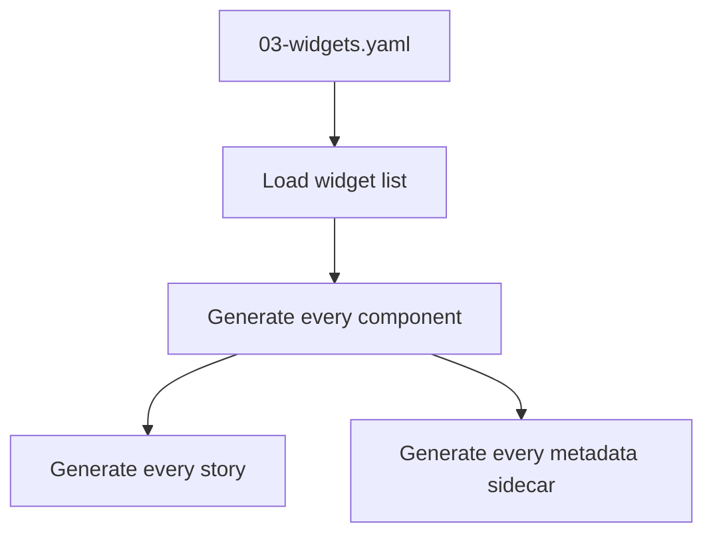
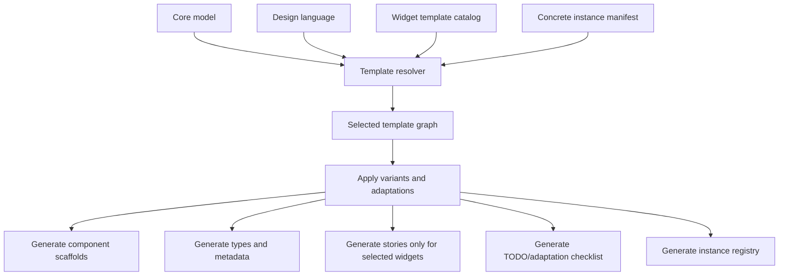

# Widget Templates and Instance Selection for DMETA Meta Design Systems

## Executive Summary

DMETA is a **meta design-system factory**, not a single dense-operations component library. The current widget thinking has drifted toward a default baseline catalog: `PresentationToken`, `DenseTable`, `RecordStream`, `DetailDrawer`, `ActionPalette`, plus many generic helper widgets from the Hair Booking admin system such as `WorkbenchShell`, `Panel`, `Tabs`, `SplitPane`, `FilterBar`, `SearchBox`, `KeyValueList`, and `ComparisonTable`. That baseline is useful as inventory, but it should not be treated as a mandatory widget set for every concrete design-system instance.

A concrete DMETA instance should select and adapt widgets based on the application shape. A large-scale book OCR dashboard might need one big dashboard display, a specialized OCR-progress stream, a searchable/autocomplete corpus selector, and a batch-status panel. It may not need tabs, split panes, drawers, comparison tables, or generic key-value inspectors. An event-debugging console might need `RecordStream`, `FilterBar`, `SearchBox`, `DetailDrawer`, and `ActionPalette`. A monitoring wallboard may need no drawer at all because it is read-only and display-oriented.

Therefore, the next structural change should be:

```text
sources/dmeta-ir/
  03-widgets.yaml              # becomes a widget-template package index or compatibility entrypoint
  widget-templates/
    00-index.yaml
    presentations.yaml
    streams.yaml
    tables.yaml
    filters.yaml
    actions.yaml
    surfaces.yaml
    layout.yaml
    dashboards.yaml
    forms.yaml
    states.yaml
    data-display.yaml
    optional-comparison.yaml
    optional-markdown-preview.yaml
```

The files in `widget-templates/` should describe **template families** and **template variants**, not guaranteed components. A concrete design-system instance should then have an instance manifest that selects a subset, adapts names and props, disables unused affordances, specializes behavior, and records which templates were promoted to real widgets.

This changes code generation from:

```text
read 03-widgets.yaml
  -> scaffold every listed widget
```

to:

```text
read core model + design language + widget template catalog + concrete instance manifest
  -> resolve selected templates
  -> apply instance adaptations
  -> generate instance-specific scaffolds, metadata, stories, registries, and TODOs
```

The generator becomes a **template resolver and instantiator**, not a bulk component scaffold generator.

## Problem Statement

### The current widget IR implies too much universality

`dmeta/sources/dmeta-ir/03-widgets.yaml` currently defines a small set of widgets:

- `PresentationToken`
- `StatusBadge`
- `CompactReference`
- `MetricCell`
- `RecordStream`
- `DenseTable`
- `DetailDrawer`
- `ActionPalette`

These are broadly relevant to dense/event applications, but even they should not be mandatory in every concrete design-system instance. A read-only wallboard may not need `ActionPalette`. A single-screen OCR control center may not need `DetailDrawer` if the dashboard itself is the detail surface. A domain-specific search application may need a specialized `SearchBox` with autocomplete, preview rows, entity grouping, and keyboard command behavior that differs from a generic dense-operations search box.

The prior DMETA-001 document `02-generic-widget-baseline-for-dense-operational-design-systems.md` identified many helper widgets that often appear in real applications:

- shell and layout widgets;
- panels, split panes, tabs, toolbars;
- filter and search controls;
- table helper widgets;
- bulk action bars;
- result window controls;
- empty/loading/error states;
- key-value lists;
- comparison tables;
- overlay surfaces and confirmation dialogs;
- action parameter forms and basic fields.

That document is still valuable, but the phrase "always-present baseline" is too strong for a meta design system. In a meta-system, these are **available templates**. Concrete systems should choose them intentionally.

### A meta design system must preserve optionality

A concrete design system is allowed to be smaller than the template catalog. It is also allowed to specialize heavily. Examples:

#### Book OCR at scale

Possible application shape:

- one major operational dashboard;
- OCR job state over thousands of books/pages;
- batch ingestion progress;
- page/error thumbnails;
- corpus/project selection;
- OCR engine or model selection;
- queue/backpressure indicators;
- quality review states;
- autocomplete over books, authors, batches, ISBNs, page ids, and job ids.

Likely templates:

- dashboard frame;
- status/metric presentations;
- batch/job stream or dense queue table;
- specialized autocomplete search;
- filter chips for corpus, batch, state, engine, and time;
- maybe a preview frame for page images or OCR text;
- maybe an action parameter form for retry/reprocess.

Unlikely templates:

- generic tabs if the display is one large dashboard;
- split panes if the dashboard has fixed regions;
- detail drawers if drilldown is route-based or not needed;
- comparison tables except for specialized OCR quality comparisons;
- generic key-value lists except inside an optional inspector.

#### Agent event debugging console

Likely templates:

- `RecordStream`;
- `FilterBar`;
- `SearchBox`;
- `DetailDrawer`;
- `ActionPalette`;
- `PresentationToken`;
- `ResultWindowControls`;
- `ContextMenuTrigger`.

Unlikely templates:

- dashboard grid;
- preview frame unless tool output needs previews;
- comparison table unless comparing runs;
- large form widgets except action parameters.

#### Logistics operations queue

Likely templates:

- `DenseTable`;
- `FilterBar`;
- `SearchBox`;
- `StatusBadge`;
- `CompactReference`;
- `DetailDrawer` or route detail page;
- `BulkActionBar`;
- `ResultWindowControls`.

Optional:

- map/location templates;
- calendar/schedule pack;
- comparison table for carriers/routes;
- key-value inspector.

The template catalog should be rich enough for all of these. No single concrete instance should be forced to include all of it.

### Code generation must not over-generate

If the generator scaffolds every template into every instance, several bad outcomes follow:

- generated projects contain unused components;
- Storybook coverage becomes noisy;
- intern work spreads across widgets that the product does not need;
- design review treats unselected widgets as commitments;
- application teams waste time deleting or ignoring scaffolds;
- future upgrades become harder because generated files include irrelevant local modifications.

The generator should scaffold only selected templates and should record why each one was selected.

## Current System Orientation for a New Intern

### Files to read first

Start with these files in the dmeta repository:

```text
/home/manuel/workspaces/2026-05-19/dmeta-dsl/dmeta/design-docs/04-concrete-dmeta-system-spec.md
/home/manuel/workspaces/2026-05-19/dmeta-dsl/dmeta/design-docs/05-dmeta-core-model-and-widget-ir-spec.md
/home/manuel/workspaces/2026-05-19/dmeta-dsl/dmeta/sources/dmeta-ir/03-widgets.yaml
/home/manuel/workspaces/2026-05-19/dmeta-dsl/dmeta/ttmp/2026/05/19/DMETA-001--design-system-factory-first-runthrough-of-presentation-based-ui-dsl-for-high-volume-data-applications/design-doc/02-generic-widget-baseline-for-dense-operational-design-systems.md
/home/manuel/workspaces/2026-05-19/dmeta-dsl/dmeta/ttmp/2026/05/19/DMETA-001--design-system-factory-first-runthrough-of-presentation-based-ui-dsl-for-high-volume-data-applications/design-doc/03-filter-semantics-for-high-density-event-oriented-dmeta-applications.md
```

The current system has three important IR areas:

```text
core-model/
  archetypes.yaml       # semantic roles: Event, WorkItem, ResultSet, FilterCriterion, etc.
  capabilities.yaml     # affordances/projections: stateful, filterable, filter_source, etc.
  presentations.yaml    # display/action contracts: compact_ref, filter_chip, inspect, apply_filter, etc.

02-design-language.yaml # visual and interaction guidance
03-widgets.yaml         # current widget IR, still too close to a fixed catalog
```

The key issue is that `03-widgets.yaml` mixes two concerns:

1. **template catalog** — possible widget types the meta system knows how to scaffold;
2. **instance selection** — actual widgets chosen for a concrete design-system instance.

Those concerns should be split.

### Current widget IR shape

A current widget entry looks roughly like:

```yaml
- id: dmeta.record_stream
  name: RecordStream
  status: draft
  classification:
    level: organism
    role: dense_record_stream
  intent:
    purpose: Render virtualizable ordered records/events/work items with selectable semantic presentations.
    adapter_boundary: Receives normalized row models and typed callbacks; does not own backend dispatch.
  consumes:
    archetypes: [Event, WorkItem, ActionInvocation]
    presentations: [dense_row, inline_token, status_badge, timestamp_inline, compact_ref]
  contract:
    props: {}
    action_slots: {}
  stories: []
  outputs: {}
```

This shape is still useful. The proposed change is not to throw it away. The proposed change is to interpret entries like this as **templates** unless an instance manifest selects them.

## Proposed Solution

### Split the widget catalog into `widget-templates/`

Create a sibling directory next to `core-model/`:

```text
sources/dmeta-ir/
  core-model/
  widget-templates/
    00-index.yaml
    presentations.yaml
    streams.yaml
    tables.yaml
    filters.yaml
    actions.yaml
    surfaces.yaml
    layout.yaml
    dashboards.yaml
    forms.yaml
    states.yaml
    data-display.yaml
    optional-comparison.yaml
    optional-markdown-preview.yaml
  03-widgets.yaml
```

`03-widgets.yaml` can remain for compatibility at first. It should eventually become either:

1. an index pointing to `widget-templates/`, or
2. an alias/compatibility entrypoint that imports the template package.

Recommended transitional shape:

```yaml
schema_version: 0
artifact_type: dmeta_widget_template_package
summary: Widget template package index for DMETA v0.
files:
  templates_dir: ./widget-templates
  index: ./widget-templates/00-index.yaml
  presentations: ./widget-templates/presentations.yaml
  streams: ./widget-templates/streams.yaml
  tables: ./widget-templates/tables.yaml
  filters: ./widget-templates/filters.yaml
  actions: ./widget-templates/actions.yaml
  surfaces: ./widget-templates/surfaces.yaml
  layout: ./widget-templates/layout.yaml
  dashboards: ./widget-templates/dashboards.yaml
  forms: ./widget-templates/forms.yaml
  states: ./widget-templates/states.yaml
```

### Treat widgets as templates, not commitments

A widget template should describe:

- what semantic concepts it can render;
- which capabilities/presentations/actions it consumes;
- what common variants exist;
- what can be adapted in a concrete instance;
- which other templates it often composes with;
- what it should generate if selected;
- what questions an instance author must answer before selecting it.

A template does **not** say:

- every DMETA instance must include this widget;
- every selected instance must keep the default name;
- every generated prop is final;
- every optional action slot must be implemented;
- every story must be relevant.

### Add template metadata fields

The current format can be preserved and extended. Suggested additional fields:

```yaml
- id: dmeta.template.filters.search_box
  name: SearchBox
  status: template
  template:
    category: filters
    selection: optional
    maturity: draft
    default_importance: common
    not_always_needed: true
    selection_questions:
      - Does the instance need free-text search, structured search, autocomplete, or all three?
      - Is search scoped to one result surface or global across the workspace?
      - Does search return suggestions, entity previews, or direct navigation targets?
    adaptation_points:
      - autocomplete_sources
      - query_syntax
      - suggestion_grouping
      - keyboard_behavior
      - empty_state
      - search_scope_labels
    common_variants:
      - simple_text_search
      - scoped_search
      - autocomplete_entity_search
      - command_search_hybrid
    avoid_when:
      - The application is display-only and all narrowing is done through fixed controls.
      - The surface is small enough that search adds more complexity than value.
  consumes:
    capabilities: [searchable]
    presentations: [search_summary, compact_ref, inline_token]
  contract: {}
  outputs: {}
```

The key fields are:

| Field | Purpose |
|---|---|
| `selection` | Whether the template is required by a selected pattern, common, optional, or rare. |
| `selection_questions` | Prompts for instance design sessions. |
| `adaptation_points` | Explicit places the instance is expected to modify. |
| `common_variants` | Named starting points for generation. |
| `avoid_when` | Conditions where the template should not be selected. |

### Add an instance manifest

A concrete design-system instance should have its own manifest. Example path:

```text
instances/book-ocr-dashboard/
  dmeta-instance.yaml
```

Example:

```yaml
schema_version: 0
artifact_type: dmeta_instance
id: book_ocr_dashboard
summary: Dashboard design system for large-scale book OCR operations.

core_model:
  domain_example: book_ocr
  archetypes:
    - WorkItem
    - Event
    - Resource
    - Metric
    - ResultSet
    - FilterCriterion

selected_templates:
  - template: dmeta.template.dashboard.operational_dashboard
    as: OcrOperationsDashboard
    variant: multi_region_dashboard
    reason: Main app is a single high-density dashboard rather than a page/workbench suite.

  - template: dmeta.template.presentations.status_badge
    as: OcrJobStatusBadge
    variant: state_badge
    adaptations:
      state_values: [queued, running, needs_review, failed, complete]

  - template: dmeta.template.streams.record_stream
    as: OcrJobEventStream
    variant: compact_event_stream
    adaptations:
      virtualized: true
      live_tail: true
      row_density: compact

  - template: dmeta.template.filters.search_box
    as: OcrCorpusSearch
    variant: autocomplete_entity_search
    adaptations:
      autocomplete_sources:
        - book_title
        - author
        - isbn
        - batch_id
        - page_id
        - job_id
      suggestion_grouping: by_entity_type
      search_scope_labels: [current batch, all corpus, failed pages]

excluded_templates:
  - template: dmeta.template.layout.tabs
    reason: Initial OCR dashboard is one fixed operational display, not a tabbed workspace.
  - template: dmeta.template.layout.split_pane
    reason: No master/detail split in the first dashboard layout.
  - template: dmeta.template.surfaces.detail_drawer
    reason: Drilldown is deferred; selected job details are shown inline in dashboard regions.
  - template: dmeta.template.data_display.comparison_table
    reason: OCR comparison is specialized and rare; defer until quality-review flows exist.
```

This manifest is what the generator should use to decide what to scaffold.

## How This Influences Code Generation

### Old generator model

The old mental model is:



This assumes the widget IR is a concrete catalog for one design system. That is too rigid for DMETA.

### New generator model

The generator should become an instantiation pipeline:



The generator now has four inputs:

1. core semantic model;
2. design-language rules;
3. widget template catalog;
4. concrete instance manifest.

It should generate only selected templates.

### Generator stages

#### Stage 1: Load package inputs

```ts
type DmetaGenerationInputs = {
  coreModel: CoreModelPackage;
  designLanguage: DesignLanguagePackage;
  widgetTemplates: WidgetTemplatePackage;
  instance: DmetaInstanceManifest;
};
```

Pseudo-code:

```ts
function loadGenerationInputs(root: string, instancePath: string): DmetaGenerationInputs {
  return {
    coreModel: loadCoreModel(`${root}/sources/dmeta-ir/01-core-model.yaml`),
    designLanguage: loadDesignLanguage(`${root}/sources/dmeta-ir/02-design-language.yaml`),
    widgetTemplates: loadWidgetTemplates(`${root}/sources/dmeta-ir/03-widgets.yaml`),
    instance: loadInstanceManifest(instancePath),
  };
}
```

#### Stage 2: Resolve selected templates

The resolver matches selected template ids against the catalog, validates variants, and computes dependencies.

```ts
type ResolvedTemplate = {
  template: WidgetTemplate;
  instanceName: string;
  variant: string;
  adaptations: Record<string, unknown>;
  generatedOutputs: OutputPlan;
  warnings: GenerationWarning[];
};
```

Pseudo-code:

```ts
function resolveSelectedTemplates(inputs: DmetaGenerationInputs): ResolvedTemplate[] {
  const result: ResolvedTemplate[] = [];

  for (const selected of inputs.instance.selectedTemplates) {
    const template = inputs.widgetTemplates.byId[selected.template];
    if (!template) throw new Error(`Unknown widget template ${selected.template}`);

    validateVariant(template, selected.variant);
    validateAdaptations(template, selected.adaptations);
    validateConsumes(template, inputs.coreModel);

    result.push({
      template,
      instanceName: selected.as ?? template.name,
      variant: selected.variant ?? template.defaultVariant,
      adaptations: selected.adaptations ?? {},
      generatedOutputs: planOutputs(template, selected),
      warnings: collectSelectionWarnings(template, selected),
    });
  }

  return addRequiredDependencies(result, inputs.widgetTemplates);
}
```

#### Stage 3: Apply adaptation overlays

Templates should define adaptation points. Instance manifests supply values.

Example template:

```yaml
adaptation_points:
  autocomplete_sources:
    type: list
    required_for_variants: [autocomplete_entity_search]
  suggestion_grouping:
    type: enum
    values: [flat, by_entity_type, by_recentness]
  keyboard_behavior:
    type: enum
    values: [input_only, command_palette_like]
```

Example validation:

```ts
function validateAdaptations(template: WidgetTemplate, adaptations: Record<string, unknown>) {
  for (const key of Object.keys(adaptations)) {
    if (!template.adaptationPoints[key]) {
      warn(`Unknown adaptation ${key} for ${template.id}`);
    }
  }

  for (const point of requiredAdaptationPoints(template)) {
    if (!(point.id in adaptations)) {
      error(`Missing required adaptation ${point.id} for ${template.id}`);
    }
  }
}
```

#### Stage 4: Generate instance-specific output

Instead of emitting `SearchBox.tsx`, the generator emits the selected concrete name, such as `OcrCorpusSearch.tsx`.

```text
src/dmeta/instances/book-ocr-dashboard/widgets/OcrCorpusSearch/
  OcrCorpusSearch.tsx
  OcrCorpusSearch.types.ts
  OcrCorpusSearch.metadata.ts
  OcrCorpusSearch.stories.tsx
  index.ts
```

The metadata sidecar should preserve the template lineage:

```ts
export const OcrCorpusSearchMetadata = {
  templateId: "dmeta.template.filters.search_box",
  instanceId: "book_ocr_dashboard",
  variant: "autocomplete_entity_search",
  adaptations: {
    autocompleteSources: ["book_title", "author", "isbn", "batch_id", "page_id", "job_id"],
    suggestionGrouping: "by_entity_type",
  },
  selectedBecause: "Corpus/job lookup is a primary operator task.",
};
```

#### Stage 5: Generate story coverage for selected variants only

Template stories should be filtered by selection and variant.

Example:

```yaml
stories:
  common:
    - default
    - loading
    - error
  variants:
    simple_text_search:
      - simple_query
    autocomplete_entity_search:
      - grouped_suggestions
      - keyboard_selection
      - no_results
```

Generator logic:

```ts
function storiesForSelection(template: WidgetTemplate, variant: string): string[] {
  return [
    ...template.stories.common,
    ...(template.stories.variants[variant] ?? []),
  ];
}
```

This avoids generating irrelevant stories.

### What should code generation produce?

For each selected template:

- component scaffold;
- type file;
- metadata sidecar;
- Storybook stories for selected variants;
- adapter TODO file if the widget needs runtime integration;
- promotion checklist;
- design-language recipe references;
- test placeholders only for selected behavior.

For the instance overall:

- widget registry;
- presentation/widget mapping registry;
- action slot registry;
- selected template manifest lockfile;
- instance README;
- generation report listing selected and excluded templates.

Example generation report:

```markdown
# DMETA Instance Generation Report: book_ocr_dashboard

## Selected templates
- OcrOperationsDashboard from dmeta.template.dashboard.operational_dashboard
- OcrCorpusSearch from dmeta.template.filters.search_box
- OcrJobEventStream from dmeta.template.streams.record_stream

## Explicitly excluded templates
- Tabs — fixed dashboard does not need tabbed navigation
- SplitPane — no master/detail layout in v0
- DetailDrawer — details shown inline for v0
- ComparisonTable — deferred until OCR quality comparison flow

## Required manual decisions
- Define exact OCR job state color mapping.
- Implement autocomplete backend adapter.
- Decide whether page thumbnail previews belong in dashboard v0.
```

## Proposed Template Package Structure

### `widget-templates/00-index.yaml`

Purpose:

- list template files;
- declare package version;
- define validation policy;
- record template categories.

Sketch:

```yaml
schema_version: 0
artifact_type: dmeta_widget_template_index
summary: Selectable/adaptable widget templates for DMETA design-system instances.
files:
  presentations: ./presentations.yaml
  streams: ./streams.yaml
  tables: ./tables.yaml
  filters: ./filters.yaml
  actions: ./actions.yaml
  surfaces: ./surfaces.yaml
  layout: ./layout.yaml
  dashboards: ./dashboards.yaml
  forms: ./forms.yaml
  states: ./states.yaml
categories:
  - presentations
  - streams
  - tables
  - filters
  - actions
  - surfaces
  - layout
  - dashboards
  - forms
  - states
validation:
  require_unique_template_ids: true
  require_selection_guidance: true
  require_adaptation_points_for_optional_behavior: true
```

### `widget-templates/presentations.yaml`

Templates:

- `PresentationToken`
- `StatusBadge`
- `CompactReference`
- `MetricCell`
- `PresentationCell`
- `TimestampCell` if needed

These are common for dense/event systems, but concrete instances may still rename/adapt them.

### `widget-templates/streams.yaml`

Templates:

- `RecordStream`
- `EventTimeline`
- `LiveTailStream`
- optional `TimelineLane`

Selection guidance:

- choose `RecordStream` for high-volume logs/events/traces;
- choose `EventTimeline` for causality/phase visualization;
- avoid streams for static dashboards where aggregates are enough.

### `widget-templates/tables.yaml`

Templates:

- `DenseTable`
- `PresentationCell`
- `BulkActionBar`
- `ResultWindowControls`

Selection guidance:

- choose tables for sortable/comparable sets;
- avoid tables for wallboards or one-purpose status displays;
- do not generate `BulkActionBar` unless multi-selection actions exist.

### `widget-templates/filters.yaml`

Templates:

- `FilterBar`
- `SearchBox`
- `FacetPanel`
- `SavedFilterMenu`
- `ResultSummary`

Selection guidance:

- choose `FilterBar` when result sets have structured constraints;
- choose `SearchBox` when text query or autocomplete is a primary workflow;
- specialize search heavily for domain-specific entity lookup;
- avoid facets unless backend can provide buckets/counts.

### `widget-templates/layout.yaml`

Templates:

- `WorkbenchShell`
- `PageHeader`
- `Panel`
- `Toolbar`
- `SplitPane`
- `Tabs`

Selection guidance:

- `Panel` and `Toolbar` are common, not mandatory;
- `SplitPane` should be selected only for true master/detail workflows;
- `Tabs` should be selected only when information architecture requires tab switching;
- one-big-dashboard apps may select `DashboardFrame` instead.

### `widget-templates/dashboards.yaml`

Templates:

- `OperationalDashboard`
- `DashboardRegion`
- `MetricSummaryStrip`
- `QueueHealthPanel`
- optional `DashboardGrid`

This file matters because many concrete instances are dashboard-first, not table-first.

### `widget-templates/surfaces.yaml`

Templates:

- `DetailDrawer`
- `OverlaySurface`
- `ConfirmDialog`
- `InlineInspector`

Selection guidance:

- choose `DetailDrawer` only when preserving list/table context is required;
- choose `InlineInspector` for dashboards where details live in fixed regions;
- choose `ConfirmDialog` only when side-effecting actions exist.

### `widget-templates/data-display.yaml`

Templates:

- `KeyValueList`
- `ComparisonTable`
- `MarkdownBlock`
- `PreviewFrame`

Selection guidance:

- mark `KeyValueList` and `ComparisonTable` as optional/rare, not baseline;
- `PreviewFrame` may be important for OCR/page/document workflows;
- `MarkdownBlock` is useful for docs/tool output but has sanitization concerns.

### `widget-templates/forms.yaml`

Templates:

- `ActionParameterForm`
- `FieldGroup`
- `FieldShell`
- `TextField`
- `SelectField`
- `SwitchField`
- `DateTimeField`
- `DurationField`
- `NumberField`

Selection guidance:

- generate only fields required by selected actions/filter builders;
- avoid full CRUD forms unless the instance explicitly needs editable resources.

### `widget-templates/states.yaml`

Templates:

- `EmptyState`
- `LoadingState`
- `InlineError`
- `DisconnectedState`
- `StaleDataIndicator`

Selection guidance:

- these are more likely than most to be generated broadly, but variants still depend on the selected widgets and data-loading model.

## Template Selection Model

### Selection status values

Templates should declare their default selection status:

| Status | Meaning |
|---|---|
| `core_if_selected_pattern` | Required only when a larger selected pattern depends on it. |
| `common` | Often useful but not automatic. |
| `optional` | Select only when the instance has a matching workflow. |
| `rare` | Select only with explicit justification. |
| `domain_pack` | Belongs to optional pack such as media, maps, calendar, finance, OCR previews. |

Example:

```yaml
template:
  selection: optional
  default_importance: common
```

### Selection should be justified

Instance manifests should require a reason for every selected non-core template:

```yaml
selected_templates:
  - template: dmeta.template.layout.split_pane
    as: TraceSplitPane
    reason: Operators need to keep the event stream visible while inspecting selected trace details.
```

This makes generated projects auditable.

### Exclusions should be allowed

Exclusions are useful documentation:

```yaml
excluded_templates:
  - template: dmeta.template.surfaces.detail_drawer
    reason: Dashboard v0 uses fixed inline detail regions and route-level drilldown instead.
```

Exclusions prevent future reviewers from assuming a missing widget was forgotten.

## Instance Adaptation Model

### Adaptation is expected, not exceptional

Every useful template has adaptation points. Examples:

#### `SearchBox`

- simple text search;
- entity autocomplete;
- command palette hybrid;
- result preview rows;
- scoped search;
- query syntax help.

#### `FilterBar`

- fixed quick filters;
- arbitrary filter chips;
- facet-driven chips;
- pinned workspace filters;
- compact collapsed filter summary.

#### `RecordStream`

- live tail vs static query result;
- event row density;
- token rendering strategy;
- grouping by session/time/source;
- virtualization;
- payload preview behavior.

#### `DenseTable`

- sortable columns;
- row selection;
- bulk actions;
- presentation-aware cells;
- cursor pagination;
- server-side filter/sort.

#### `DetailDrawer`

- side drawer;
- bottom drawer;
- inline inspector;
- route detail page;
- fixed dashboard region.

A concrete design-system instance should record these choices in the manifest, and generated metadata should preserve them.

### Adaptation overlay pseudo-schema

```yaml
adaptations:
  props:
    rename:
      records: jobs
    add:
      selectedBatchId:
        type: string
        required: false
  behavior:
    live_tail: true
    virtualized: true
    grouping: by_batch
  presentations:
    row: ocr_job_row
    status: ocr_job_status_badge
  actions:
    enabled:
      - inspect
      - retry_work_item
      - filter_by_state
    disabled:
      - cancel_work_item
```

The generator can use this overlay to scaffold closer to the concrete need.

## Code Generation Architecture

### New package types

```ts
export type WidgetTemplatePackage = {
  schemaVersion: number;
  artifactType: "dmeta_widget_template_package";
  templates: Record<string, WidgetTemplate>;
};

export type WidgetTemplate = {
  id: string;
  name: string;
  status: "template" | "draft" | "deprecated";
  category: string;
  classification: WidgetClassification;
  intent: WidgetIntent;
  template: TemplateSelectionMetadata;
  consumes?: WidgetConsumes;
  contract: WidgetContract;
  variants?: Record<string, WidgetVariant>;
  adaptationPoints?: Record<string, AdaptationPoint>;
  stories?: StoryPlan;
  outputs?: OutputTemplate;
};

export type DmetaInstanceManifest = {
  id: string;
  artifactType: "dmeta_instance";
  selectedTemplates: SelectedTemplate[];
  excludedTemplates?: ExcludedTemplate[];
};
```

### Generator command shape

Future CLI commands could be:

```bash
dmeta validate-widget-templates --root ./sources/dmeta-ir

dmeta plan-instance \
  --root ./sources/dmeta-ir \
  --instance ./instances/book-ocr-dashboard/dmeta-instance.yaml \
  --output markdown

dmeta scaffold-instance \
  --root ./sources/dmeta-ir \
  --instance ./instances/book-ocr-dashboard/dmeta-instance.yaml \
  --out ./generated/book-ocr-dashboard
```

### Planning before scaffolding

`plan-instance` should be required before scaffolding. It should report:

- selected templates;
- dependencies automatically included;
- missing required adaptations;
- unknown template ids;
- unused core model concepts;
- selected widgets with no matching design-language recipe;
- expected generated files;
- story coverage plan;
- manual decisions.

Pseudo-output:

```text
Instance: book_ocr_dashboard

Selected templates:
  ✓ OcrOperationsDashboard <- dmeta.template.dashboard.operational_dashboard
  ✓ OcrCorpusSearch <- dmeta.template.filters.search_box (autocomplete_entity_search)
  ✓ OcrJobEventStream <- dmeta.template.streams.record_stream

Warnings:
  ! OcrCorpusSearch requires autocomplete adapter implementation.
  ! OcrJobEventStream selected live_tail=true but instance has no windowable ResultSet mapping yet.

Excluded:
  - Tabs: fixed dashboard, no tabbed IA
  - DetailDrawer: inline detail region in v0
```

### Generated metadata sidecars

Every generated widget should preserve template lineage:

```ts
export const metadata = {
  generatedBy: "dmeta scaffold-instance",
  instanceId: "book_ocr_dashboard",
  templateId: "dmeta.template.filters.search_box",
  variant: "autocomplete_entity_search",
  selectedAs: "OcrCorpusSearch",
  reason: "Operators need autocomplete over corpus, batches, pages, and jobs.",
  adaptations: {...},
  manualPromotionRequired: true,
};
```

### Do not overwrite promoted widgets by default

The generator must preserve the HAIR-041 lesson: scaffolding is not final implementation. Once a widget is promoted, regeneration should avoid overwriting it unless explicitly requested.

Suggested rules:

```text
if output does not exist:
  create scaffold
else if output metadata status == scaffolded and --force-scaffold:
  overwrite
else if output metadata status == promoted:
  do not overwrite; emit migration note
else:
  write .next file or patch suggestion
```

## Validation Rules

### Template package validation

The validator should check:

- template ids are unique;
- template category matches file/category;
- consumed archetypes/capabilities/presentations exist;
- action slots reference known action/request types;
- variants reference valid adaptation points;
- `selection_questions` exist for optional/common/rare templates;
- `avoid_when` exists for rare or easy-to-overuse templates;
- output paths contain placeholders or are clearly template-relative.

### Instance manifest validation

The validator should check:

- selected template ids exist;
- selected aliases are valid component names;
- selected variants exist;
- required adaptation points are supplied;
- selected templates do not conflict;
- dependencies are satisfied or auto-included;
- excluded templates exist;
- selected templates consume only core concepts available to the instance;
- selected templates have design-language recipes or explicit TODOs.

Example conflict:

```yaml
conflicts_with:
  - dmeta.template.surfaces.detail_drawer
```

A fixed dashboard inline inspector template may conflict with `DetailDrawer` for the same detail role unless both are explicitly scoped.

## How This Changes the Meaning of the Generic Widget Baseline Document

The earlier document `02-generic-widget-baseline-for-dense-operational-design-systems.md` should be reinterpreted as a **candidate template inventory**, not a mandatory baseline. Its value is still high because it identifies generic helper widgets that real applications often need. The correction is that "always-present" should become:

```text
available in the template catalog and easy to select when the instance requires it
```

The document's recommendations should be translated into selection metadata:

| Earlier recommendation | New interpretation |
|---|---|
| Must add `WorkbenchShell` | Add shell template; select for multi-page/workbench apps. |
| Must add `Tabs` | Add tabs template; select only for tabbed IA. |
| Must add `SplitPane` | Add split-pane template; select only for master/detail. |
| Must add `FilterBar` | Add filter template; select when result sets are filterable. |
| Must add `SearchBox` | Add search template; adapt heavily to domain search/autocomplete. |
| `KeyValueList` baseline | Make optional inspector/data-display template. |
| `ComparisonTable` baseline-ish | Make rare/optional comparison template. |
| `DetailDrawer` required | Make one detail-surface option among drawer, inline inspector, route detail. |

## Design Decisions

### Decision 1: Widget definitions are templates by default

A widget entry in DMETA should be understood as a possible starting point. It becomes a concrete component only when selected by an instance manifest.

### Decision 2: Keep the current widget entry format, but add template metadata

The current fields are useful and should not be discarded. Add selection/adaptation/variant metadata rather than replacing the format wholesale.

### Decision 3: Concrete instances select and adapt templates

Instances should declare selected templates, aliases, variants, adaptations, and reasons. This makes generation auditable and keeps applications small.

### Decision 4: Code generation should scaffold selected templates only

The generator should not produce every known widget. It should produce the resolved selected template graph for one instance.

### Decision 5: Exclusions are useful design artifacts

If an application does not need tabs, split panes, drawers, key-value lists, or comparison tables, the instance manifest should be able to say so explicitly.

### Decision 6: Search and filters must be adaptation-heavy

Search and filtering are especially domain-sensitive. A book OCR search box is not the same as a log search box. The template catalog should provide structure, but concrete instances should define autocomplete sources, scope, result preview behavior, and backend adapters.

### Decision 7: Dashboard-first instances need first-class templates

The template catalog should not assume every dense app is table-first or stream-first. Dashboard-first applications need dashboard frames, regions, metric strips, queue panels, and inline inspectors.

## Alternatives Considered

### Alternative: Keep one fixed `03-widgets.yaml` catalog

Rejected. It implies all listed widgets belong to every generated design system and encourages over-generation.

### Alternative: Delete generic helper widgets from DMETA

Rejected. Helper widgets are still valuable, but they should be selectable templates rather than mandatory baseline components.

### Alternative: Create separate generators for every application family

Rejected. The template/instance model allows shared infrastructure while still supporting very different applications.

### Alternative: Generate no widgets, only docs

Rejected. DMETA's value includes scaffold generation, metadata sidecars, Storybook seeds, and adapter-boundary discipline. The correction is selective generation, not no generation.

### Alternative: Treat adaptations as manual-only and outside YAML

Rejected. Adaptations should be recorded because they explain why the generated widget differs from the template and guide regeneration/migration.

## Implementation Plan

### Phase 1: Documentation agreement

- Treat this document as the design correction for widget IR.
- Update language in future docs from "baseline widgets" to "widget templates" or "candidate template inventory."
- Keep the previous generic widget baseline document as source material but reinterpret it.

### Phase 2: Create `widget-templates/`

- Add `sources/dmeta-ir/widget-templates/00-index.yaml`.
- Split current `03-widgets.yaml` entries into focused template files.
- Move current semantic widgets into `widget-templates/presentations.yaml`, `streams.yaml`, `tables.yaml`, `surfaces.yaml`, and `actions.yaml` as appropriate.
- Add template metadata fields: selection guidance, adaptation points, variants, avoid-when, and selection questions.

### Phase 3: Convert `03-widgets.yaml` to package index

Transitional option:

- keep current entries for compatibility;
- add `files:` pointing to `widget-templates/`;
- update loader to support either monolithic or split widget templates.

Preferred option once loader is ready:

- make `03-widgets.yaml` a widget-template package index only;
- load all subfiles from `widget-templates/`.

### Phase 4: Add instance manifest schema

- Create an example instance manifest for a small pilot, possibly:
  - `instances/agent-event-console/dmeta-instance.yaml`; or
  - `instances/book-ocr-dashboard/dmeta-instance.yaml` as a pressure test.
- Define `selected_templates`, `excluded_templates`, `adaptations`, and `reason` fields.

### Phase 5: Update validator

Add validation for:

- widget template package loading;
- template id uniqueness;
- template selection metadata;
- adaptation point schemas;
- instance manifest selected templates;
- required adaptations;
- selected template dependencies/conflicts.

### Phase 6: Update generator

Change generator from:

```text
scaffold all widgets in 03-widgets.yaml
```

to:

```text
scaffold selected templates from instance manifest
```

Add commands:

```bash
dmeta plan-instance
dmeta scaffold-instance
dmeta validate-widget-templates
```

### Phase 7: Storybook and promotion workflow

- Generate only selected stories.
- Add metadata sidecars with template lineage.
- Preserve promoted widgets by default.
- Generate migration notes instead of overwriting promoted code.

## Intern Checklist

If you are implementing this, follow this order:

1. Read this document and the previous widget baseline document.
2. Inspect `sources/dmeta-ir/03-widgets.yaml`.
3. Create `sources/dmeta-ir/widget-templates/00-index.yaml`.
4. Move one category first, not all categories. Start with `presentations.yaml` or `filters.yaml`.
5. Update the loader to read both old monolithic and new split template package forms.
6. Add validator tests for duplicate template ids and unknown consumed presentations.
7. Create one example instance manifest.
8. Write `plan-instance` before `scaffold-instance`.
9. Only after planning works, scaffold selected templates.
10. Do not overwrite promoted widget implementations.

## Open Questions

1. Should `03-widgets.yaml` become a pure index immediately, or remain monolithic until the loader supports split packages?
2. What is the first concrete instance manifest to pressure-test: agent event console, book OCR dashboard, street deli, or another app?
3. Should `KeyValueList` and `ComparisonTable` live in `data-display.yaml` as optional templates or in an optional pack?
4. Should dashboard templates become a first-class category now, or wait until a dashboard-focused instance exists?
5. How formal should adaptation point schemas be in v0: human prose, loose maps, or validated types?
6. Should selected templates be generated under `src/dmeta/widgets/` or under `src/dmeta/instances/<id>/widgets/`?
7. How should migrations work when a template changes after an instance has promoted a widget?

## References

- `/home/manuel/workspaces/2026-05-19/dmeta-dsl/dmeta/sources/dmeta-ir/03-widgets.yaml`
- `/home/manuel/workspaces/2026-05-19/dmeta-dsl/dmeta/sources/dmeta-ir/core-model/archetypes.yaml`
- `/home/manuel/workspaces/2026-05-19/dmeta-dsl/dmeta/sources/dmeta-ir/core-model/capabilities.yaml`
- `/home/manuel/workspaces/2026-05-19/dmeta-dsl/dmeta/sources/dmeta-ir/core-model/presentations.yaml`
- `/home/manuel/workspaces/2026-05-19/dmeta-dsl/dmeta/design-docs/04-concrete-dmeta-system-spec.md`
- `/home/manuel/workspaces/2026-05-19/dmeta-dsl/dmeta/design-docs/05-dmeta-core-model-and-widget-ir-spec.md`
- `/home/manuel/workspaces/2026-05-19/dmeta-dsl/dmeta/ttmp/2026/05/19/DMETA-001--design-system-factory-first-runthrough-of-presentation-based-ui-dsl-for-high-volume-data-applications/design-doc/02-generic-widget-baseline-for-dense-operational-design-systems.md`
- `/home/manuel/workspaces/2026-05-19/dmeta-dsl/dmeta/ttmp/2026/05/19/DMETA-001--design-system-factory-first-runthrough-of-presentation-based-ui-dsl-for-high-volume-data-applications/design-doc/03-filter-semantics-for-high-density-event-oriented-dmeta-applications.md`
