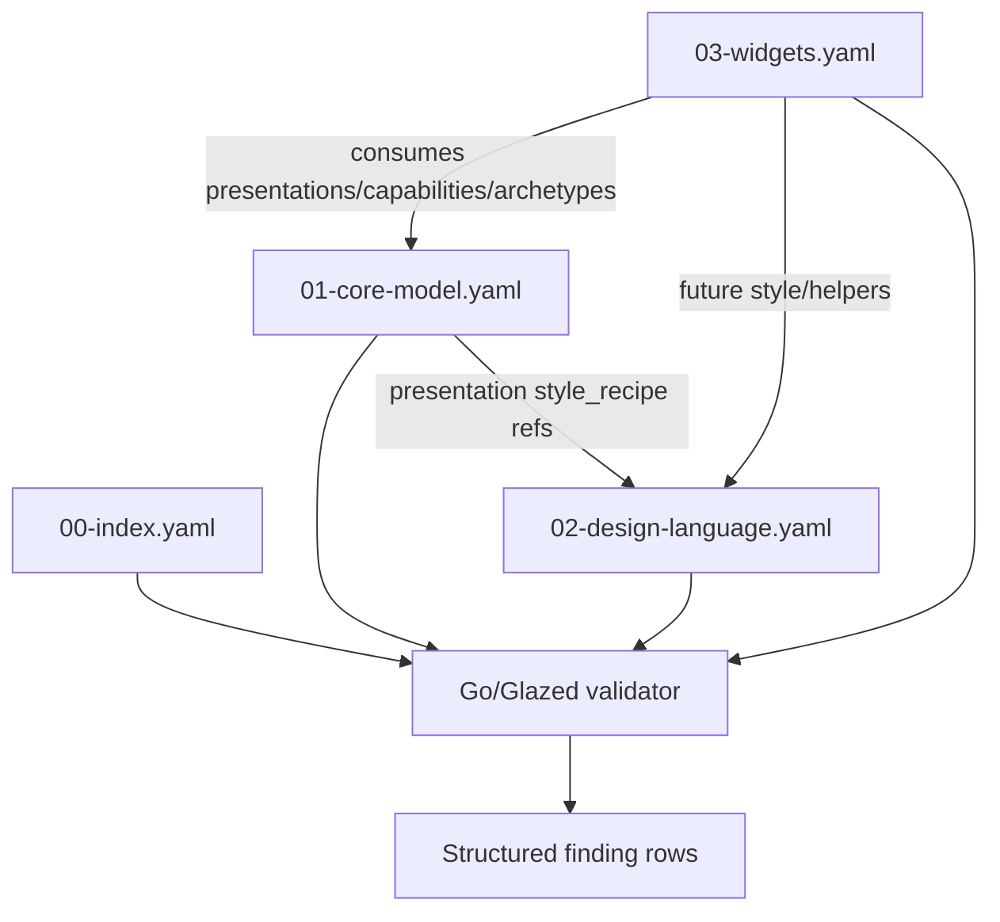

# DMETA IR Validator Intern Design and Implementation Guide

## Executive Summary

This guide explains how to build the first executable validator for the DMETA v0 design-system factory. The validator is a Go CLI program built with the Glazed framework. Its job is to read the four DMETA YAML source artifacts, check that they are structurally coherent, validate cross-references, and emit machine-readable rows describing validation findings.

The validator is intentionally the first computational tool in the DMETA toolchain. Before we generate TypeScript registries, design helpers, widget scaffolds, or lint rules, we need confidence that the source IR is internally consistent.

The command we are building should eventually run like this:

```bash
go run ./cmd/dmeta validate-ir --root ./sources/dmeta-ir --output table
```

Expected behavior:

- load `00-index.yaml`;
- load `01-core-model.yaml`;
- load `02-design-language.yaml`;
- load `03-widgets.yaml`;
- validate artifact types and schema versions;
- validate that references point to existing ids;
- emit one structured row per finding;
- exit non-zero if errors are found;
- optionally emit an OK summary row when valid.

## System Context

DMETA is a design-system factory for dense operational UIs. It is not a single React app. It is a small language-and-toolchain process that produces domain-specific design systems for applications such as:

- AI agent workflow dashboards;
- retail logistics/order pipelines;
- agricultural sensor logs;
- ecommerce backends;
- build/CI systems;
- monitoring and incident queues.

The core idea is that concrete domain objects map onto generic semantic structures:

- archetypes such as `Actor`, `WorkItem`, `Event`, `Resource`, `TimelineSpan`;
- capabilities such as `identifiable`, `labelable`, `stateful`, `temporal`, `inspectable`;
- presentations such as `compact_ref`, `status_badge`, `dense_row`, `metric_cell`;
- actions such as `inspect`, `filter_by_state`, `retry_work_item`.

The validator checks this semantic mesh before later tooling consumes it.

## File References

Read these files before editing the validator:

```text
dmeta/design-docs/04-concrete-dmeta-system-spec.md
dmeta/design-docs/05-dmeta-core-model-and-widget-ir-spec.md
dmeta/design-docs/06-dmeta-design-language-and-tooling-spec.md

dmeta/sources/dmeta-ir/00-index.yaml
dmeta/sources/dmeta-ir/01-core-model.yaml
dmeta/sources/dmeta-ir/02-design-language.yaml
dmeta/sources/dmeta-ir/03-widgets.yaml
```

Glazed framework references:

```text
glazed/pkg/cmds
glazed/pkg/cmds/fields
glazed/pkg/cmds/schema
glazed/pkg/cmds/values
glazed/pkg/cli
glazed/pkg/middlewares
glazed/pkg/settings
glazed/pkg/types
```

Skill guidance used for this project:

```text
/home/manuel/.pi/agent/skills/glazed-command-authoring/SKILL.md
```

## The DMETA v0 IR Package

The source package lives at:

```text
dmeta/sources/dmeta-ir/
```

It contains four files.

### `00-index.yaml`

This is the package manifest.

It declares:

- `schema_version`;
- `artifact_type: dmeta_ir_index`;
- paths to the other artifacts;
- expected artifact types;
- consumers;
- validation policy flags.

The validator should use it as the entry point.

### `01-core-model.yaml`

This is the semantic source of truth.

It defines:

- `logical_types`;
- `archetypes`;
- `capabilities`;
- `presentations`;
- `actions`;
- `domain_examples`;
- `validation` policy.

This file is the richest validation target. Most cross-reference checks happen here.

### `02-design-language.yaml`

This is the visual/design-language source artifact.

It defines:

- `theme_axes`;
- `typography`;
- `density`;
- `spacing`;
- `color`;
- `borders`;
- `elevation`;
- `layout`;
- `presentation_recipes`;
- `interaction_states`;
- `data_attributes`;
- `lint_rules`;
- `validation` policy.

The validator should ensure this file is internally coherent and that recipe names referenced from presentations exist.

### `03-widgets.yaml`

This is the widget-class IR.

It defines generic dense-operational widgets such as:

- `PresentationToken`;
- `StatusBadge`;
- `CompactReference`;
- `MetricCell`;
- `RecordStream`;
- `DenseTable`;
- `DetailDrawer`;
- `ActionPalette`.

Each widget declares what it consumes and what files later generators should create.

## Conceptual Diagram



## Validator Responsibilities

The validator is not a full compiler. It should be precise about the checks it owns.

### It should validate

- YAML files parse.
- Required top-level fields exist.
- Artifact types are correct.
- Schema versions match expectations.
- Ids are unique.
- Cross-references resolve.
- Known enum-like values are used.
- Domain examples map required capability projections.
- Widget `consumes` references resolve.
- Widget output paths are unique.
- Presentation `style_recipe` references resolve to design-language recipes.

### It should not yet validate

- full JSON Schema semantics;
- every possible TypeScript type string;
- accessibility correctness;
- React implementation correctness;
- whether output files exist;
- Storybook coverage;
- exact visual design linting in promoted code.

Those are later tools.

## Validation Finding Model

The validator should emit one row per finding.

Recommended fields:

| Field | Type | Meaning |
| --- | --- | --- |
| `severity` | string | `info`, `warning`, or `error` |
| `code` | string | Stable machine-readable code |
| `artifact` | string | `index`, `core_model`, `design_language`, `widgets` |
| `path` | string | Logical path such as `presentations.status_badge.style_recipe` |
| `message` | string | Human-readable explanation |
| `hint` | string | Optional fix guidance |

Example row:

```text
severity=error
code=unknown_presentation
artifact=widgets
path=widgets.dmeta.presentation_token.consumes.presentations[status_badge]
message=Widget references presentation "status_badge", but it is not defined in core model.
hint=Add the presentation to 01-core-model.yaml or remove the reference.
```

## Exit Codes

Recommended exit behavior:

- exit `0` when no `error` findings exist;
- exit `1` when at least one `error` finding exists;
- warnings alone should not fail by default;
- a future `--strict` flag can make warnings fail.

## Glazed CLI Shape

The CLI should expose a Glazed command so users can select output formats:

```bash
dmeta validate-ir --root ./sources/dmeta-ir --output table
dmeta validate-ir --root ./sources/dmeta-ir --output json
dmeta validate-ir --root ./sources/dmeta-ir --output yaml
```

### Why Glazed?

Glazed gives us structured command output. That matters because validation findings should be readable by humans and also pipeable into scripts, reports, or CI.

### Command settings

Recommended flags:

| Flag | Type | Default | Purpose |
| --- | --- | --- | --- |
| `--root` | string | `sources/dmeta-ir` | Directory containing the four YAML files. |
| `--strict` | bool | `false` | Treat warnings as errors. |
| `--fail-on-warning` | bool | `false` | Alias/explicit behavior for warning failure. |
| `--include-info` | bool | `false` | Emit info findings such as success rows. |

## Glazed API References

Use these imports:

```go
import (
    "github.com/go-go-golems/glazed/pkg/cmds"
    "github.com/go-go-golems/glazed/pkg/cmds/fields"
    "github.com/go-go-golems/glazed/pkg/cmds/schema"
    "github.com/go-go-golems/glazed/pkg/cmds/values"
    "github.com/go-go-golems/glazed/pkg/cli"
    "github.com/go-go-golems/glazed/pkg/middlewares"
    "github.com/go-go-golems/glazed/pkg/settings"
    "github.com/go-go-golems/glazed/pkg/types"
)
```

Command skeleton:

```go
type ValidateIRCommand struct {
    *cmds.CommandDescription
}

type ValidateIRSettings struct {
    Root          string `glazed:"root"`
    Strict        bool   `glazed:"strict"`
    FailOnWarning bool   `glazed:"fail-on-warning"`
    IncludeInfo   bool   `glazed:"include-info"`
}

func NewValidateIRCommand() (*ValidateIRCommand, error) {
    glazedSection, _ := settings.NewGlazedSchema()
    commandSettingsSection, _ := cli.NewCommandSettingsSection()

    desc := cmds.NewCommandDescription(
        "validate-ir",
        cmds.WithShort("Validate DMETA v0 IR YAML files"),
        cmds.WithFlags(
            fields.New("root", fields.TypeString, fields.WithDefault("sources/dmeta-ir")),
            fields.New("strict", fields.TypeBool, fields.WithDefault(false)),
        ),
        cmds.WithSections(glazedSection, commandSettingsSection),
    )

    return &ValidateIRCommand{CommandDescription: desc}, nil
}
```

Run method pattern:

```go
func (c *ValidateIRCommand) RunIntoGlazeProcessor(
    ctx context.Context,
    vals *values.Values,
    gp middlewares.Processor,
) error {
    s := &ValidateIRSettings{}
    if err := vals.DecodeSectionInto(schema.DefaultSlug, s); err != nil {
        return err
    }

    findings, err := validator.ValidateRoot(ctx, s.Root)
    if err != nil {
        return err
    }

    for _, f := range findings {
        row := types.NewRow(
            types.MRP("severity", f.Severity),
            types.MRP("code", f.Code),
            types.MRP("artifact", f.Artifact),
            types.MRP("path", f.Path),
            types.MRP("message", f.Message),
            types.MRP("hint", f.Hint),
        )
        if err := gp.AddRow(ctx, row); err != nil {
            return err
        }
    }

    if HasFailingFindings(findings, s.Strict || s.FailOnWarning) {
        return fmt.Errorf("validation failed")
    }
    return nil
}
```

## Recommended Go Package Layout

Inside the `dmeta` repository:

```text
go.mod
cmd/dmeta/main.go
pkg/dmeta/validator/
  model.go
  load.go
  validate.go
  findings.go
pkg/dmeta/cmds/
  validate_ir.go
```

### `cmd/dmeta/main.go`

Responsibilities:

- create Cobra root command;
- initialize logging if practical;
- register `validate-ir` command;
- execute root command.

For v0, a minimal Cobra root is acceptable if full Glazed help/docs wiring takes too long. But the subcommand should still be a proper Glazed command built with `cli.BuildCobraCommandFromCommand`.

### `pkg/dmeta/validator/model.go`

Responsibilities:

- define Go structs for YAML files;
- prefer maps for flexible sections;
- use typed structs where validation needs fields.

### `pkg/dmeta/validator/load.go`

Responsibilities:

- read YAML files from root;
- unmarshal with `gopkg.in/yaml.v3`;
- attach source path metadata;
- return a `Package` struct.

### `pkg/dmeta/validator/validate.go`

Responsibilities:

- run all validation passes;
- return `[]Finding`;
- avoid printing directly.

### `pkg/dmeta/validator/findings.go`

Responsibilities:

- define `Finding`;
- helper constructors: `Error`, `Warning`, `Info`;
- severity helpers.

### `pkg/dmeta/cmds/validate_ir.go`

Responsibilities:

- define Glazed command;
- decode settings;
- call validator;
- emit rows;
- return failure if needed.

## Data Model Sketch

```go
type Package struct {
    Root           string
    Index          IndexFile
    CoreModel      CoreModelFile
    DesignLanguage DesignLanguageFile
    Widgets        WidgetIRFile
}

type IndexFile struct {
    SchemaVersion int                      `yaml:"schema_version"`
    ArtifactType  string                   `yaml:"artifact_type"`
    Artifacts     map[string]IndexArtifact `yaml:"artifacts"`
}

type CoreModelFile struct {
    SchemaVersion  int                         `yaml:"schema_version"`
    ArtifactType   string                      `yaml:"artifact_type"`
    Archetypes     map[string]Archetype        `yaml:"archetypes"`
    Capabilities   map[string]Capability       `yaml:"capabilities"`
    Presentations  map[string]Presentation     `yaml:"presentations"`
    Actions        map[string]Action           `yaml:"actions"`
    DomainExamples map[string]DomainExample    `yaml:"domain_examples"`
}
```

Use `map[string]any` sparingly for substructures that are not important yet.

## Validation Passes

### Pass 1: artifact identity

Pseudocode:

```text
if index.artifact_type != "dmeta_ir_index": error
if core.artifact_type != "dmeta_core_model": error
if design.artifact_type != "dmeta_design_language": error
if widgets.artifact_type != "dmeta_widget_ir": error
if schema_version != 0: warning or error
```

### Pass 2: index file paths

Pseudocode:

```text
for each artifact in index.artifacts:
    path = root / artifact.path
    if path does not exist:
        error missing_artifact_file
    if declared artifact_type does not match loaded file artifact_type:
        error artifact_type_mismatch
```

### Pass 3: core model references

Pseudocode:

```text
for archetype in core.archetypes:
    for cap in archetype.default_capabilities:
        require core.capabilities[cap]
    for pres in archetype.recommended_presentations:
        require core.presentations[pres]

for capability in core.capabilities:
    for pres in capability.presentations:
        require core.presentations[pres]
    for action in capability.actions:
        require core.actions[action]

for presentation in core.presentations:
    for cap in presentation.applies_to.capabilities:
        require core.capabilities[cap]
    for arch in presentation.applies_to.archetypes:
        require core.archetypes[arch]
    if presentation.style_recipe != "":
        require design.presentation_recipes[style_recipe]
```

### Pass 4: action references

Pseudocode:

```text
for action in core.actions:
    for accept in action.accepts:
        validate selector references known capability/archetype/presentation/domain_type
    for argument in action.arguments:
        validate mode is known
        for accept in argument.accepts:
            validate selector references known capability/archetype/presentation/domain_type
```

Known argument modes:

- `selected_presentation`
- `presentation_candidate`
- `free_text`
- `number_input`
- `choice`
- `confirmation`
- `parameter_form`

### Pass 5: domain examples

Pseudocode:

```text
for example in core.domain_examples:
    for domain_type in example.domain_types:
        for archetype in domain_type.archetypes:
            require core.archetypes[archetype]
        for capability_name, mapping in domain_type.capabilities:
            require core.capabilities[capability_name]
            for required projection in capability.projections:
                if projection.required and mapping missing projection:
                    error missing_required_projection_mapping
```

### Pass 6: design-language internal references

Pseudocode:

```text
for axis in design.theme_axes:
    require default in values

for recipe in design.presentation_recipes:
    require typography role exists
    for state in recipe.states:
        require interaction_states.states[state]

for lint_rule in design.lint_rules:
    require severity in [info, warning, error]
```

### Pass 7: widget references

Pseudocode:

```text
seenWidgetIDs = set
seenOutputs = set

for widget in widgets.widgets:
    require unique widget.id
    require widget.name not empty
    for presentation in widget.consumes.presentations:
        require core.presentations[presentation]
    for capability in widget.consumes.capabilities:
        require core.capabilities[capability]
    for archetype in widget.consumes.archetypes:
        require core.archetypes[archetype]
    for output path in widget.outputs:
        require output path unique
    require metadata output exists
```

## Error Handling Strategy

Loading errors are different from validation findings.

If a YAML file cannot be read or parsed, return a Go error because validation cannot proceed reliably.

If a file loads but has bad references, return findings.

This distinction matters:

```text
read/parse failure -> command error immediately
semantic validation issue -> structured finding row
```

## Testing Strategy

Minimum tests:

1. `TestValidateCurrentIRHasNoErrors`
   - Loads `sources/dmeta-ir`.
   - Asserts no error-severity findings.

2. `TestUnknownPresentationIsReported`
   - Creates in-memory or temp copy with bad widget presentation reference.
   - Asserts `unknown_presentation` error.

3. `TestMissingRequiredProjectionMapping`
   - Creates domain example missing required `id` mapping.
   - Asserts `missing_required_projection_mapping` error.

4. `TestDesignRecipeReferencesKnownTypographyRole`
   - Bad recipe typography role.
   - Asserts error.

For the first pass, running against the current files via `go run` is acceptable. Add tests once the model stabilizes.

## Implementation Plan

### Step 1: Create module and package skeleton

Files:

```text
go.mod
cmd/dmeta/main.go
pkg/dmeta/validator/findings.go
pkg/dmeta/validator/model.go
pkg/dmeta/validator/load.go
pkg/dmeta/validator/validate.go
pkg/dmeta/cmds/validate_ir.go
```

### Step 2: Implement YAML models and loader

- Use `gopkg.in/yaml.v3`.
- Keep structs permissive enough for v0.
- Use maps for id-indexed sections.

### Step 3: Implement validation passes

Start with reference checks rather than full schema validation.

### Step 4: Implement Glazed command

- Add `--root`, `--strict`, `--fail-on-warning`, `--include-info`.
- Emit rows with fields described above.

### Step 5: Run against current IR

```bash
go run ./cmd/dmeta validate-ir --root ./sources/dmeta-ir --output table
```

Fix either code or IR if findings reveal genuine inconsistencies.

### Step 6: Commit

Commit the guide, ticket tasks/diary, module skeleton, validator implementation, and validation fixes in logical intervals.

## Common Pitfalls

### Pitfall: over-modeling the YAML

Do not build a huge statically typed AST for every field on day one. The schema is still v0. Type what validation needs, leave less important nested content as flexible maps/slices.

### Pitfall: printing inside validator package

The validator package should return findings. Only the CLI layer should format output.

### Pitfall: treating warnings as failures by default

Warnings should not fail unless `--strict` or `--fail-on-warning` is set.

### Pitfall: widgets consuming raw domain types

The widget IR should consume presentations, capabilities, and archetypes. Concrete domain types are example pressure tests, not widget implementation dependencies.

### Pitfall: mixing load errors and findings

Parse/read errors should be Go errors. Semantic issues should be findings.

## Definition of Done

The ticket is done when:

- The intern guide is written and uploaded to reMarkable.
- The ticket has tasks and a diary.
- `go run ./cmd/dmeta validate-ir --root ./sources/dmeta-ir --output table` runs.
- Current DMETA v0 IR validates with no error-severity findings.
- The command emits Glazed structured rows.
- Code is formatted.
- Relevant files are committed.

## API Quick Reference

### Glazed row emission

```go
row := types.NewRow(
    types.MRP("severity", finding.Severity),
    types.MRP("code", finding.Code),
    types.MRP("artifact", finding.Artifact),
    types.MRP("path", finding.Path),
    types.MRP("message", finding.Message),
    types.MRP("hint", finding.Hint),
)
err := gp.AddRow(ctx, row)
```

### YAML loading

```go
func loadYAML[T any](path string) (T, error) {
    var out T
    b, err := os.ReadFile(path)
    if err != nil {
        return out, err
    }
    if err := yaml.Unmarshal(b, &out); err != nil {
        return out, err
    }
    return out, nil
}
```

### Finding helper

```go
func Error(artifact, path, code, message, hint string) Finding {
    return Finding{
        Severity: "error",
        Artifact: artifact,
        Path: path,
        Code: code,
        Message: message,
        Hint: hint,
    }
}
```

## Final Notes for the Intern

Your goal is not to make the perfect schema validator. Your goal is to make the first reliable executable boundary around the DMETA IR. Keep the validator small, explicit, and boring.

A good validator answers simple questions:

- Do the files exist?
- Are they the right kind of files?
- Do names point to things that exist?
- Do required mappings exist?
- Can future generators trust this package enough to run?

If it answers those questions cleanly, it has done its job.
