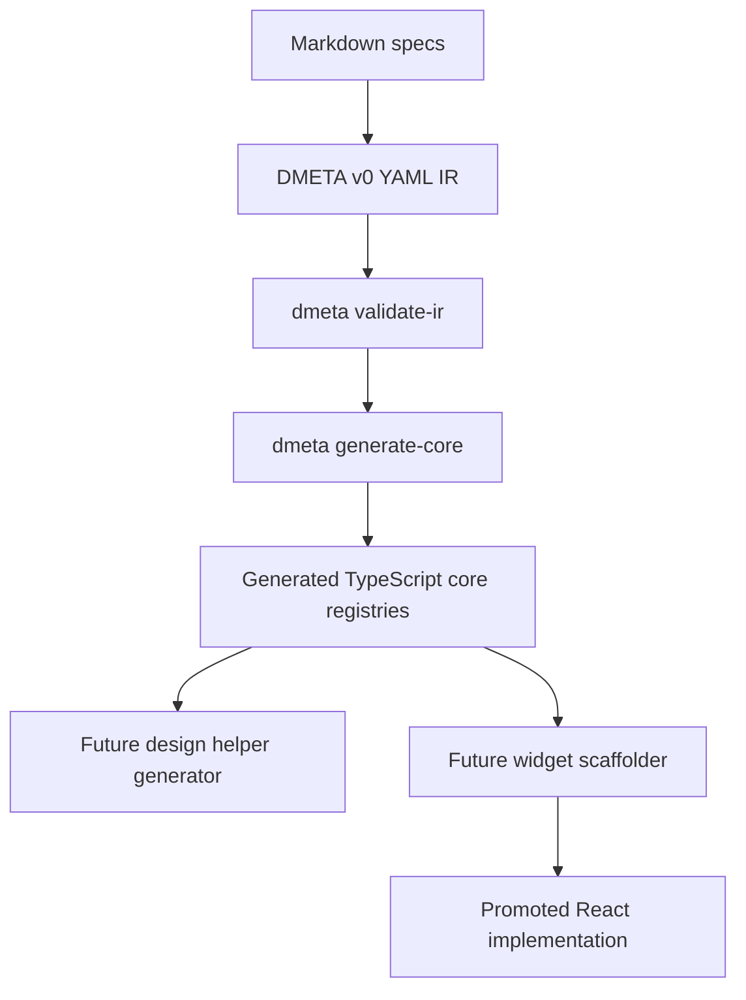
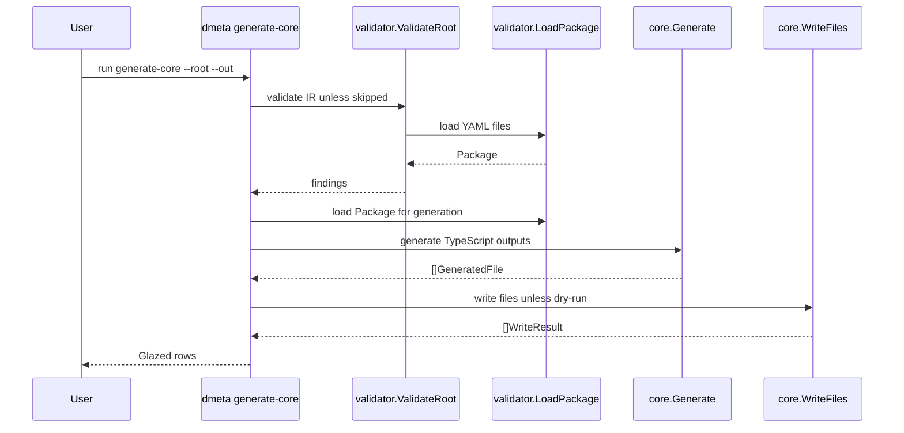

# DMETA TypeScript Core Registry Generator Intern Guide

## Executive Summary

This guide explains the next DMETA tool: a TypeScript core registry generator. The generator will read the validated DMETA v0 core model IR and emit TypeScript files that React widgets, adapters, Storybook fixtures, future generators, and action/presentation runtime code can import.

The command should eventually look like this:

```bash
GOWORK=off go run ./cmd/dmeta generate-core \
  --root ./sources/dmeta-ir \
  --out ./generated/dmeta-core
```

This guide is for review before implementation. Do **not** implement from it until the design is accepted.

The generator should depend on the existing DMETA validator. The validator answers: "Is the IR coherent enough to trust?" The generator answers: "Can we project the trusted IR into stable TypeScript types, constants, registries, and matching helpers?"

The first generated package should include:

```text
generated/dmeta-core/
  archetypes.ts
  capabilities.ts
  presentations.ts
  actions.ts
  PresentationRef.ts
  actionMatching.ts
  index.ts
```

The generator should be conservative. It should generate stable metadata and simple helper functions. It should not generate React components yet, and it should not invent behavior that is not present in the IR.

## Background: Where This Fits in DMETA

DMETA is a design-system factory for dense operational user interfaces. The system is not merely a component library. It is a small language-and-toolchain stack.

The current pipeline is:



DMETA-001 created the foundation and the v0 IR. DMETA-002 created the validator. DMETA-003 should create the first generator.

The generator is important because it proves that the IR is not just documentation. It becomes source material for typed frontend code.

## Required Reading

Read these files first:

```text
dmeta/design-docs/04-concrete-dmeta-system-spec.md
dmeta/design-docs/05-dmeta-core-model-and-widget-ir-spec.md
dmeta/design-docs/06-dmeta-design-language-and-tooling-spec.md

dmeta/sources/dmeta-ir/00-index.yaml
dmeta/sources/dmeta-ir/01-core-model.yaml
dmeta/sources/dmeta-ir/02-design-language.yaml
dmeta/sources/dmeta-ir/03-widgets.yaml

dmeta/pkg/dmeta/validator/model.go
dmeta/pkg/dmeta/validator/load.go
dmeta/pkg/dmeta/validator/validate.go
dmeta/pkg/dmeta/cmds/validate_ir.go
```

The implementation should reuse the validator package rather than writing a second YAML loader.

## Source IR: split core-model package

The core generator consumes the split core-model package. `01-core-model.yaml` is now a package index rather than a single huge semantic file. The semantic sections live in focused subfiles:

```text
dmeta/sources/dmeta-ir/
  01-core-model.yaml
  core-model/
    core-model.yaml
    archetypes.yaml
    capabilities.yaml
    presentations.yaml
    examples/
      agent-workflow.yaml
      retail-logistics.yaml
```

The index file has this shape:

```yaml
schema_version: 0
artifact_type: dmeta_core_model
summary: ...
long_summary: ...
references: ...
files:
  core_model: ./core-model/core-model.yaml
  archetypes: ./core-model/archetypes.yaml
  capabilities: ./core-model/capabilities.yaml
  presentations: ./core-model/presentations.yaml
  examples_dir: ./core-model/examples
  examples:
    - ./core-model/examples/agent-workflow.yaml
    - ./core-model/examples/retail-logistics.yaml
validation: ...
```

The generator should not manually traverse these files. It should call the existing validator loader, which merges the split package into `validator.CoreModelFile` for consumers.

### Archetypes

Archetypes are reusable operational roles such as:

- `Actor`
- `WorkItem`
- `Event`
- `Resource`
- `Metric`
- `TimelineSpan`
- `ActionSpec`
- `ActionInvocation`

They have default capabilities and recommended presentations.

Generated TypeScript should expose:

- union type of archetype ids;
- metadata object keyed by id;
- helper for checking if a string is an archetype id.

### Capabilities

Capabilities are reusable affordances such as:

- `identifiable`
- `labelable`
- `stateful`
- `temporal`
- `inspectable`
- `relatable`
- `measurable`

They define projections, presentations, actions, and filters.

Generated TypeScript should expose:

- union type of capability ids;
- projection metadata;
- metadata object keyed by capability id;
- helper for checking if a string is a capability id.

### Presentations

Presentations are display contracts such as:

- `compact_ref`
- `status_badge`
- `dense_row`
- `metric_cell`
- `detail_panel`

They declare which capability/archetype/domain layer they attach to and what projections they require.

Generated TypeScript should expose:

- union type of presentation ids;
- presentation metadata;
- helpers for matching a presentation to a subject's archetypes/capabilities.

### Actions

Actions are typed operations such as:

- `inspect`
- `copy_reference`
- `filter_by_state`
- `retry_work_item`
- `schedule_action`
- `compare_metrics`

They define accepted sources and typed arguments.

Generated TypeScript should expose:

- union type of action ids;
- action metadata;
- argument mode types;
- helper for discovering actions from a `PresentationRef`.

## Target Generated Files

### `archetypes.ts`

Purpose:

- type-safe archetype ids;
- metadata registry;
- small helpers.

Suggested output:

```ts
// Code generated by dmeta generate-core. DO NOT EDIT.

export const archetypeIds = [
  "Actor",
  "WorkItem",
] as const;

export type ArchetypeId = typeof archetypeIds[number];

export type ArchetypeDefinition = {
  id: ArchetypeId;
  description: string;
  defaultCapabilities: CapabilityId[];
  recommendedPresentations: PresentationId[];
  examples: string[];
};

export const archetypes: Record<ArchetypeId, ArchetypeDefinition> = {
  Actor: {
    id: "Actor",
    description: "...",
    defaultCapabilities: ["identifiable", "labelable"],
    recommendedPresentations: ["compact_ref"],
    examples: ["Agent", "Carrier"],
  },
};

export function isArchetypeId(value: string): value is ArchetypeId {
  return (archetypeIds as readonly string[]).includes(value);
}
```

### `capabilities.ts`

Purpose:

- type-safe capability ids;
- projection definitions;
- metadata registry.

Suggested output:

```ts
export const capabilityIds = ["identifiable", "stateful"] as const;
export type CapabilityId = typeof capabilityIds[number];

export type ProjectionDefinition = {
  name: string;
  type: string;
  required: boolean;
  description: string;
};

export type CapabilityDefinition = {
  id: CapabilityId;
  description: string;
  projections: Record<string, ProjectionDefinition>;
  presentations: PresentationId[];
  actions: ActionId[];
  filters: string[];
};
```

### `presentations.ts`

Purpose:

- type-safe presentation ids;
- presentation metadata;
- layer and applies-to structures.

Suggested output:

```ts
export type PresentationLayer = "capability" | "archetype" | "domain";

export type PresentationDefinition = {
  id: PresentationId;
  description: string;
  layer: PresentationLayer;
  appliesTo: {
    capabilities?: CapabilityId[];
    archetypes?: ArchetypeId[];
    domainTypes?: string[];
  };
  requires: string[];
  requiresAny: string[];
  optional: string[];
  role: string;
  density: "compact" | "regular" | "spacious" | "any" | string;
  styleRecipe?: string;
};
```

### `actions.ts`

Purpose:

- type-safe action ids;
- action metadata;
- selector and argument metadata.

Suggested output:

```ts
export type ActionSelector =
  | { capability: CapabilityId; requiresCapabilities?: CapabilityId[] }
  | { archetype: ArchetypeId; requiresCapabilities?: CapabilityId[] }
  | { presentation: PresentationId }
  | { domainType: string };

export type ArgumentMode =
  | "selected_presentation"
  | "presentation_candidate"
  | "free_text"
  | "number_input"
  | "choice"
  | "confirmation"
  | "parameter_form";

export type ActionDefinition = {
  id: ActionId;
  description: string;
  category: string;
  accepts: ActionSelector[];
  arguments: Record<string, ActionArgumentDefinition>;
  result: { kind: string };
};
```

### `PresentationRef.ts`

Purpose:

Defines the runtime object that connects rendered semantic values to actions.

Suggested output:

```ts
export type PresentationRef = {
  semanticId: string;
  domainType: string;
  archetypes: ArchetypeId[];
  capabilities: CapabilityId[];
  presentationId: PresentationId;
  label: string;
  value?: unknown;
  copyValue?: string;
  sourceSurface: string;
  sourcePath?: string;
};
```

This type should be stable. Widgets and action matching code will rely on it.

### `actionMatching.ts`

Purpose:

Provide small pure helpers for action discovery.

Suggested output:

```ts
export function selectorMatchesPresentationRef(
  selector: ActionSelector,
  ref: PresentationRef,
): boolean {
  if ("capability" in selector) {
    if (!ref.capabilities.includes(selector.capability)) return false;
    return requiresCapabilitiesMatch(selector.requiresCapabilities, ref);
  }

  if ("archetype" in selector) {
    if (!ref.archetypes.includes(selector.archetype)) return false;
    return requiresCapabilitiesMatch(selector.requiresCapabilities, ref);
  }

  if ("presentation" in selector) {
    return ref.presentationId === selector.presentation;
  }

  if ("domainType" in selector) {
    return ref.domainType === selector.domainType;
  }

  return false;
}

export function actionsForPresentationRef(ref: PresentationRef): ActionDefinition[] {
  return actionIds
    .map((id) => actions[id])
    .filter((action) => action.accepts.some((selector) => selectorMatchesPresentationRef(selector, ref)));
}
```

### `index.ts`

Purpose:

Barrel export.

Suggested output:

```ts
export * from "./archetypes";
export * from "./capabilities";
export * from "./presentations";
export * from "./actions";
export * from "./PresentationRef";
export * from "./actionMatching";
```

## Generator Command Shape

The command should be Glazed, matching the style of `validate-ir`.

Desired command:

```bash
dmeta generate-core --root ./sources/dmeta-ir --out ./generated/dmeta-core --output table
```

Suggested flags:

| Flag | Type | Default | Purpose |
| --- | --- | --- | --- |
| `--root` | string | `sources/dmeta-ir` | IR root directory. |
| `--out` | string | `generated/dmeta-core` | Output directory for generated TypeScript files. |
| `--force` | bool | `false` | Overwrite generated files if they exist. |
| `--dry-run` | bool | `false` | Validate and report planned writes without writing files. |
| `--skip-validate` | bool | `false` | Skip pre-generation validation. Use rarely. |

Structured output row fields:

| Field | Meaning |
| --- | --- |
| `file` | Generated file path. |
| `status` | `planned`, `written`, `skipped`, or `error`. |
| `bytes` | Number of bytes that would be/were written. |
| `reason` | Explanation for skipped/error rows. |

## Proposed Go Package Layout

Reuse the existing `dmeta` Go module.

Add:

```text
pkg/dmeta/generator/core/
  model.go
  generate.go
  render_archetypes.go
  render_capabilities.go
  render_presentations.go
  render_actions.go
  render_presentation_ref.go
  render_action_matching.go
  write.go

pkg/dmeta/cmds/generate_core.go
```

### Why a separate generator package?

The command package should only handle CLI concerns:

- decode flags;
- call validator/generator;
- emit Glazed rows;
- return command errors.

The generator package should handle:

- deriving output strings;
- sorting ids;
- rendering TypeScript;
- writing files;
- reporting output file statuses.

This keeps the generator testable without Cobra/Glazed.

## Data Flow



## Sorting and Determinism

Generated output must be deterministic.

Rules:

- sort map keys before rendering;
- preserve stable field ordering;
- use consistent indentation;
- include a generated header;
- format arrays consistently;
- avoid timestamps in generated files unless the team explicitly wants non-deterministic output.

Header suggestion:

```ts
// Code generated by dmeta generate-core from sources/dmeta-ir/01-core-model.yaml and core-model/*.yaml. DO NOT EDIT.
```

Do **not** include current time in the generated header for v0. It makes golden tests noisy.

## TypeScript Rendering Rules

### String escaping

Use Go helpers that safely quote strings for TypeScript. The simplest safe approach is to use JSON encoding for string literals:

```go
func tsString(s string) string {
    b, _ := json.Marshal(s)
    return string(b)
}
```

JSON string literals are valid TypeScript string literals.

### Arrays

Pseudocode:

```text
renderConstArray(name, values):
  sort values
  write `export const <name> = [`
  for value in values:
    write `  "value",`
  write `] as const;`
```

### Objects

Sort object keys:

```text
for id in sorted(keys(archetypes)):
  render object entry
```

### Cross-file imports

Generated files depend on each other:

```text
archetypes.ts -> imports CapabilityId, PresentationId
capabilities.ts -> imports PresentationId, ActionId
presentations.ts -> imports ArchetypeId, CapabilityId
actions.ts -> imports ArchetypeId, CapabilityId, PresentationId
PresentationRef.ts -> imports ArchetypeId, CapabilityId, PresentationId
actionMatching.ts -> imports actions, ActionDefinition, ActionSelector, PresentationRef
```

Avoid circular runtime imports where possible. Type-only imports are fine:

```ts
import type { CapabilityId } from "./capabilities";
```

For registries that need values, import values directly.

## Validation Before Generation

The generator should call the validator before rendering.

Pseudocode:

```go
if !settings.SkipValidate {
    findings, err := validator.ValidateRoot(ctx, settings.Root, false)
    if err != nil { return err }
    if validator.HasErrors(findings) {
        emit findings or return validation error
    }
}
```

Design choice to review:

- Should `generate-core` emit validation findings as rows itself?
- Or should it fail with a short message telling users to run `validate-ir`?

Recommendation:

For v0, fail with a concise error if validation has errors. Keep generated-file rows as the main output of `generate-core`. Users can run `validate-ir` for detailed validation rows.

## Generated File Model

Suggested Go structs:

```go
type GeneratedFile struct {
    Path    string
    Content []byte
}

type WriteResult struct {
    File   string
    Status string // planned, written, skipped
    Bytes  int
    Reason string
}
```

Generator API:

```go
func Generate(pkg *validator.Package, outDir string) ([]GeneratedFile, error)
```

Writer API:

```go
func WriteFiles(files []GeneratedFile, force bool, dryRun bool) ([]WriteResult, error)
```

## Pseudocode: Top-Level Generation

```text
generate-core command:
  decode flags
  if not skip_validate:
    findings = validator.ValidateRoot(root)
    if errors:
      return error "IR validation failed; run validate-ir"

  pkg = validator.LoadPackage(root)
  files = core.Generate(pkg, out)
  results = core.WriteFiles(files, force, dry_run)

  for result in results:
    emit glazed row
```

Generator pseudocode:

```text
Generate(pkg, outDir):
  core = pkg.CoreModel
  files = []
  files.append(outDir/archetypes.ts, RenderArchetypes(core))
  files.append(outDir/capabilities.ts, RenderCapabilities(core))
  files.append(outDir/presentations.ts, RenderPresentations(core))
  files.append(outDir/actions.ts, RenderActions(core))
  files.append(outDir/PresentationRef.ts, RenderPresentationRef(core))
  files.append(outDir/actionMatching.ts, RenderActionMatching(core))
  files.append(outDir/index.ts, RenderIndex())
  return files
```

## Pseudocode: Action Matching

Generated `actionMatching.ts` should implement the same semantic matching as the Go validator understands.

```text
selectorMatchesPresentationRef(selector, ref):
  if selector.capability exists:
    if ref.capabilities does not include selector.capability: return false
    return all selector.requiresCapabilities are in ref.capabilities

  if selector.archetype exists:
    if ref.archetypes does not include selector.archetype: return false
    return all selector.requiresCapabilities are in ref.capabilities

  if selector.presentation exists:
    return ref.presentationId == selector.presentation

  if selector.domainType exists:
    return ref.domainType == selector.domainType

  return false
```

This is the first actual runtime behavior generated from DMETA semantics.

## Tests and Smoke Checks

Because this is code generation, tests should focus on determinism and compilation plausibility.

Minimum checks after implementation:

1. Run validator:

```bash
GOWORK=off go run ./cmd/dmeta validate-ir --root ./sources/dmeta-ir --include-info --output table
```

2. Dry-run generator:

```bash
GOWORK=off go run ./cmd/dmeta generate-core --root ./sources/dmeta-ir --out ./generated/dmeta-core --dry-run --output table
```

3. Real generation:

```bash
GOWORK=off go run ./cmd/dmeta generate-core --root ./sources/dmeta-ir --out ./generated/dmeta-core --force --output table
```

4. Inspect generated files:

```bash
find generated/dmeta-core -type f -maxdepth 1 -print
```

5. Optional TypeScript check:

If/when a TypeScript project exists around generated output, run `tsc --noEmit`. Until then, generated code should be manually inspected and possibly checked by a small temporary TS config later.

## Golden Testing Strategy

The first version can skip golden tests if time is short, but the preferred direction is:

```text
pkg/dmeta/generator/core/testdata/expected/
  archetypes.ts
  capabilities.ts
  presentations.ts
  actions.ts
  PresentationRef.ts
  actionMatching.ts
  index.ts
```

Test pattern:

```go
func TestGenerateCurrentCore(t *testing.T) {
    pkg, err := validator.LoadPackage(context.Background(), "../../../sources/dmeta-ir")
    require.NoError(t, err)

    files, err := core.Generate(pkg, "/virtual/out")
    require.NoError(t, err)

    compare each file content to testdata/expected
}
```

Golden tests become important once generated output is consumed by widget scaffolding.

## Design Decisions to Review Before Implementation

### Decision 1: Generate into `generated/dmeta-core` for now

This keeps generated code separate from hand-written source until we decide the final React package layout.

Alternative: generate into `src/dmeta/core`. Rejected for now because there is no concrete React package yet.

### Decision 2: Use TypeScript `as const` arrays and derived union types

This is simple and readable:

```ts
export const actionIds = ["inspect"] as const;
export type ActionId = typeof actionIds[number];
```

Alternative: generate enums. Rejected because string unions compose better with JSON and UI metadata.

### Decision 3: Generate runtime metadata as plain objects

Plain objects are easy to inspect, import, test, and serialize.

Alternative: generate classes. Rejected because the IR is data, not behavior-heavy domain logic.

### Decision 4: Generate matching helpers now, not just types

`actionMatching.ts` is small but valuable. It proves that presentation-based UI behavior can be projected from IR.

Alternative: leave matching hand-written. Rejected because matching semantics are central and should remain tied to IR.

### Decision 5: Do not generate React components in this ticket

React component scaffolding comes later. This ticket only establishes the core semantic registries.

## Failure Modes

### Failure mode: generator duplicates validator logic

The generator should call validator functions, not reimplement reference checks.

### Failure mode: non-deterministic output

Map iteration order in Go is random. Always sort keys.

### Failure mode: generated TypeScript imports create runtime cycles

Prefer `import type` when only using types.

### Failure mode: output paths overwrite hand-written code

For v0, generate into `generated/dmeta-core`. If files exist and `--force` is false, skip or fail with a clear row.

### Failure mode: generator invents semantics

The generator must project the IR. If behavior is not in the IR or the approved spec, do not invent it.

## Implementation Plan After Review

1. Add `pkg/dmeta/generator/core` package.
2. Add `GeneratedFile` and `WriteResult` structs.
3. Add deterministic key sorting helpers.
4. Add TypeScript string/array/object rendering helpers.
5. Implement `RenderArchetypes`.
6. Implement `RenderCapabilities`.
7. Implement `RenderPresentations`.
8. Implement `RenderActions`.
9. Implement `RenderPresentationRef`.
10. Implement `RenderActionMatching`.
11. Implement `RenderIndex`.
12. Implement file writer with `--dry-run` and `--force` semantics.
13. Add `pkg/dmeta/cmds/generate_core.go` Glazed command.
14. Register it in `cmd/dmeta/main.go`.
15. Run validator, dry-run, real generation.
16. Review generated TypeScript.
17. Add tests/golden outputs if time allows.
18. Commit.

## Definition of Done for DMETA-003 Implementation

After implementation begins, the ticket is complete when:

- `dmeta generate-core` exists as a Glazed command.
- It validates IR before generation by default.
- It emits structured rows for generated files.
- It supports `--dry-run` and `--force`.
- It generates the seven target TypeScript files.
- Generated output is deterministic.
- `go test ./...` passes.
- `validate-ir` still passes.
- The diary records commands, failures, fixes, and review notes.

## Current Review Request

Before implementation, please review these questions:

1. Should output go to `generated/dmeta-core` or another directory?
2. Should `generate-core` emit validation findings directly, or simply fail and tell users to run `validate-ir`?
3. Should we generate domain example metadata now, or leave examples out of runtime output?
4. Should generated TypeScript include helper functions beyond action matching, such as `presentationsForCapabilities`?
5. Should golden tests be required in the first implementation pass?

The safest v0 answer is:

- output to `generated/dmeta-core`;
- fail on validation errors with a concise message;
- do not generate domain examples yet;
- generate only essential helpers;
- add golden tests if the first output stabilizes quickly.
