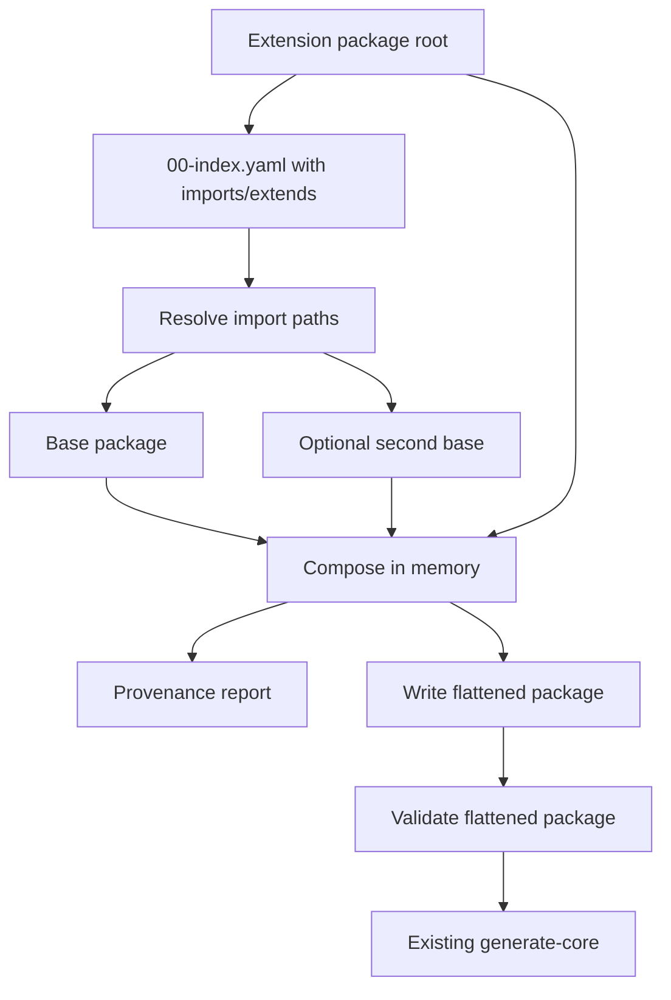

# IR Imports and Extension Composition Implementation Guide

## Executive Summary

DMETA currently has the conceptual shape of a layered design-system factory, but its tooling only accepts one complete IR package root for the semantic/design layers. A complete root contains `00-index.yaml`, `01-core-model.yaml`, `02-design-language.yaml`, `03-widgets.yaml`, split `core-model/*` files, and, after commit `5177344e8df7246e40eeed02c469e0e1e6a54194`, split `widget-templates/*` files. That is enough for the base package, but it is not enough for downstream projects that want to reuse base archetypes, capabilities, presentations, actions, and design-language rules while adding only their own domain-specific deltas.

This guide designs a new feature: **IR imports and extension composition**. The feature should let a downstream package declare that it extends a base package, add or override selected IR fragments, and produce a complete flattened package that the existing validator and generator can consume. The recommended first implementation is a conservative `dmeta compose` command:

```text
base package + extension package
  -> composed/flattened package
  -> existing validate-ir
  -> existing generate-core
```

The goal is not to replace validation or generation. The goal is to add a deterministic preprocessing layer that makes inheritance real. Today, Readwise has `inherited_from_base` fields that document intent, but those fields are not interpreted by the Go loader. Claw wants to avoid copying the whole base package by hand. A compose/flatten step solves both problems while preserving the current tooling pipeline.

The first usable version should take about 3-5 focused engineering days for an intern familiar with Go basics and YAML if it focuses on the **core model and design language**. A tiny prototype is possible in 1-2 days. Do not make widget-template inheritance the first milestone: widgets now have a separate template package model, which should be treated as a related follow-up once semantic/design composition is stable.

### Scope correction after widget-template split

Commit `5177344e8df7246e40eeed02c469e0e1e6a54194` split widget IR into a widget-template package:

```text
sources/dmeta-ir/03-widgets.yaml
sources/dmeta-ir/widget-templates/00-index.yaml
sources/dmeta-ir/widget-templates/presentations.yaml
sources/dmeta-ir/widget-templates/streams.yaml
sources/dmeta-ir/widget-templates/tables.yaml
sources/dmeta-ir/widget-templates/surfaces.yaml
sources/dmeta-ir/widget-templates/actions.yaml
sources/dmeta-ir/widget-templates/filters.yaml
sources/dmeta-ir/widget-templates/layout.yaml
sources/dmeta-ir/widget-templates/dashboards.yaml
sources/dmeta-ir/widget-templates/forms.yaml
sources/dmeta-ir/widget-templates/states.yaml
sources/dmeta-ir/widget-templates/data-display.yaml
```

That commit changes the composition plan. Widgets are no longer just another monolithic list to merge by `Widget.ID`. They are selectable/adaptable templates. Template selection, specialization, and promotion are a different problem from semantic IR inheritance. Therefore this ticket's v1 implementation should focus on:

- `00-index.yaml` package-level imports and composition metadata;
- `01-core-model.yaml`;
- `core-model/core-model.yaml`;
- `core-model/archetypes.yaml`;
- `core-model/capabilities.yaml`;
- `core-model/presentations.yaml` including actions;
- `core-model/examples/*.yaml`;
- `02-design-language.yaml`.

For `03-widgets.yaml` and `widget-templates/*`, v1 should only preserve/load/copy-through the chosen package's template catalog so existing validation keeps working. Proper widget-template extension semantics should be a follow-up design after core-model/design-language composition is implemented.


## Problem Statement

The current DMETA workflow has a gap between conceptual inheritance and executable tooling.

The desired authoring model is:

```text
Base DMETA package
  defines generic archetypes, capabilities, presentations, actions, and design rules. It also provides a widget-template catalog, but widget templates are handled as a separate layer.

Domain extension package
  references the base package and adds only domain-specific archetypes, capabilities, presentations, actions, examples, and design choices. Widget-template selection/specialization can be added later as an instance-planning layer.

Composer
  resolves imports, merges maps/lists according to explicit policy, records provenance, and writes a complete package.

Existing validator/generator
  operate on the composed package with minimal changes.
```

The current model is:

```text
One complete root directory
  must contain every required file and every referenced id.

validator.LoadPackage
  reads only that root and split files directly referenced by that root.

validate-ir and generate-core
  fail if a downstream package is partial.
```

This forces downstream projects into a poor choice:

- copy the entire base package and risk drift;
- write partial package files that express inheritance but cannot validate/generate;
- hand-code TypeScript and React abstractions without generated lineage;
- wait for future tooling before building any concrete design-system instance.

The new feature should remove that choice.

## Current System Overview

### Repository layout

Project root:

```text
/home/manuel/code/wesen/go-go-golems/dmeta
```

Important files:

```text
cmd/dmeta/main.go
pkg/dmeta/cmds/validate_ir.go
pkg/dmeta/cmds/generate_core.go
pkg/dmeta/validator/load.go
pkg/dmeta/validator/model.go
pkg/dmeta/validator/validate.go
pkg/dmeta/generator/core/model.go
pkg/dmeta/generator/core/render.go
pkg/dmeta/generator/core/write.go
sources/dmeta-ir/00-index.yaml
sources/dmeta-ir/01-core-model.yaml
sources/dmeta-ir/02-design-language.yaml
sources/dmeta-ir/03-widgets.yaml
sources/dmeta-ir/core-model/*.yaml
sources/dmeta-ir/widget-templates/*.yaml
examples/street-deli-ordering/*
generated/dmeta-core/*.ts
```

### Current CLI commands

`cmd/dmeta/main.go` creates a Cobra root command and registers two Glazed commands:

- `validate-ir`
- `generate-core`

The code path is:

```go
validateIR, err := dmetacmds.NewValidateIRCommand()
addGlazedCommand(rootCmd, "validate-ir", validateIR)

generateCore, err := dmetacmds.NewGenerateCoreCommand()
addGlazedCommand(rootCmd, "generate-core", generateCore)
```

### Current package loading

`pkg/dmeta/validator/load.go` defines `LoadPackage(ctx, root string)`. It resolves the root and loads these files:

```go
index, err := loadYAML[IndexFile](filepath.Join(absRoot, "00-index.yaml"))
core, err := loadYAML[CoreModelFile](filepath.Join(absRoot, "01-core-model.yaml"))
loadSplitCoreModel(absRoot, &core)
design, err := loadYAML[DesignLanguageFile](filepath.Join(absRoot, "02-design-language.yaml"))
widgets, err := loadWidgetTemplates(absRoot)
```

`loadSplitCoreModel` merges split subfiles into the in-memory `CoreModelFile`, but only from the same root. `loadWidgetTemplates` now loads `03-widgets.yaml` as a `dmeta_widget_template_package` and appends templates from the referenced `widget-templates/*.yaml` files into `Package.Widgets.Widgets` for validation compatibility. It supports this split:

```text
core-model/core-model.yaml
core-model/archetypes.yaml
core-model/capabilities.yaml
core-model/presentations.yaml
core-model/examples/*.yaml
```

It does **not**:

- load imports;
- follow `extends` fields;
- interpret `inherited_from_base`;
- merge package A and package B;
- track provenance;
- support partial packages.

### Current validation

`pkg/dmeta/validator/validate.go` validates a complete `validator.Package`. Important checks include:

- artifact identity and schema version;
- index artifact paths;
- archetype capability references;
- archetype presentation references;
- capability projection types;
- capability presentation/action references;
- presentation applies-to references;
- presentation `style_recipe` references into design language;
- action selector references;
- domain example mappings;
- design-language theme axes, typography, recipes, interaction states, lint severities;
- widget-template IDs, consumed presentations/capabilities/archetypes, metadata outputs, duplicate outputs. Widget templates are validated after `loadWidgetTemplates` flattens the template files into `Package.Widgets.Widgets`.

This means composition should ideally happen **before** validation, so validation can continue checking the final effective package.

### Current generation

`pkg/dmeta/cmds/generate_core.go` validates the root by default, loads the package, and calls `coregen.Generate`. The generator emits TypeScript registries:

```text
archetypes.ts
capabilities.ts
presentations.ts
actions.ts
PresentationRef.ts
actionMatching.ts
index.ts
```

The generated `PresentationRef.ts` is already the shape downstream React code should import:

```ts
export type PresentationRef = {
  semanticId: string;
  domainType: string;
  archetypes: ArchetypeId[];
  capabilities: CapabilityId[];
  presentationId: PresentationId;
  label: string;
  value?: unknown;
  copyValue?: string;
  sourceSurface: string;
  sourcePath?: string;
};
```

The generated `actionMatching.ts` already implements a generic action-discovery mechanism:

```ts
export function actionsForPresentationRef(ref: PresentationRef): ActionDefinition[] {
  return Object.values(actions).filter((action) => actionMatchesPresentationRef(action, ref));
}
```

Composition should feed better complete packages into this existing generation path.

## Existing Precedents

### Base DMETA package

Base source package:

```text
sources/dmeta-ir/
```

It is the current canonical complete package. It validates and generates.

Its `00-index.yaml` declares three main artifacts:

```yaml
artifacts:
  core_model:
    path: ./01-core-model.yaml
    artifact_type: dmeta_core_model
  design_language:
    path: ./02-design-language.yaml
    artifact_type: dmeta_design_language
  widgets:
    path: ./03-widgets.yaml
    artifact_type: dmeta_widget_template_package
```

### Street Deli example

Street Deli has an older full package-like shape:

```text
examples/street-deli-ordering/
  00-index.yaml
  01-core-model.yaml
  02-design-language.yaml
  03-widgets.yaml
  core-model/*.yaml
  prototype*/...
```

It is valuable because it shows domain widget inventories and design-language adaptation. However, it predates the base package's widget-template split and currently fails YAML loading at `03-widgets.yaml` because at least one scalar contains an unquoted colon. It should be used as a design precedent, not as a copy-paste template until fixed, validated, and either migrated to `dmeta_widget_template_package` or intentionally kept as a legacy example.

### Readwise Viewer

Readwise has a partial package:

```text
/home/manuel/code/wesen/2026-05-21--readwise-viewer/sources/dmeta-ir/
  00-index.yaml
  01-core-model.yaml
  core-model/archetypes.yaml
  core-model/capabilities.yaml
  core-model/core-model.yaml
  core-model/presentations.yaml
  core-model/examples/readwise-reader.yaml
```

It uses an `inherited_from_base` pattern:

```yaml
inherited_from_base:
  summary: Base DMETA archetypes are inherited and reused for operational aspects of the Readwise Viewer.
  archetypes:
    - Actor
    - WorkItem
    - Event
    - Resource
    - Relation
    - Metric
    - TimelineSpan
    - ActionSpec
    - ActionInvocation
    - Annotation
```

This is conceptually correct, but currently documentation-only. The loader ignores it. Readwise also lacks `02-design-language.yaml` and `03-widgets.yaml`, so the current validator cannot load it as a complete root.

### Claw dashboard need

The Claw dashboard should become a downstream package that extends base DMETA with agent-dashboard domain mappings, actions, presentations, and design-language choices. Without composition, Claw must copy base DMETA files to get generation working. With composition, Claw can be a thin extension package for semantic/design IR first. Widget-template selection and migration lineage should be handled in a later instance-planning/template-specialization pass.

## Proposed Solution

Add a new DMETA package composition feature with two user-facing commands:

```bash
dmeta compose --root ./sources/dmeta-ir --out ./var/dmeta-composed --output table

dmeta flatten --root ./sources/dmeta-ir --out ./var/dmeta-composed --output table
```

`compose` and `flatten` can be aliases initially. Use whichever naming feels better in docs; I recommend `compose` as the primary command because it describes merging packages, and `flatten` as an alias because it describes the artifact produced.

The command should:

1. Load an extension package root.
2. Detect whether it extends one or more base packages.
3. Load those base packages recursively.
4. Merge them into one in-memory `validator.Package`.
5. Record provenance for each merged artifact/id.
6. Write a complete flattened package to `--out`.
7. Optionally validate the flattened package.
8. Print structured rows describing what was copied, added, overridden, skipped, or conflicted.

### High-level flow



### Recommended schema extension

Add optional `extends` to `00-index.yaml`.

```yaml
schema_version: 0
artifact_type: dmeta_ir_index
id: claw_agent_dashboard
summary: Claw dashboard DMETA extension package.
status: draft

extends:
  - id: dmeta_base
    path: /home/manuel/code/wesen/go-go-golems/dmeta/sources/dmeta-ir
    version: 0
    import_policy: merge

artifacts:
  core_model:
    path: ./01-core-model.yaml
    artifact_type: dmeta_core_model
  design_language:
    path: ./02-design-language.yaml
    artifact_type: dmeta_design_language
  widgets:
    path: ./03-widgets.yaml
    artifact_type: dmeta_widget_template_package
```

The field should live in `IndexFile` because it describes package-level composition.

Go model addition:

```go
type IndexFile struct {
    SchemaVersion int                      `yaml:"schema_version"`
    ArtifactType  string                   `yaml:"artifact_type"`
    ID            string                   `yaml:"id"`
    Summary       string                   `yaml:"summary"`
    Status        string                   `yaml:"status"`
    Extends       []PackageImport          `yaml:"extends"`
    Artifacts     map[string]IndexArtifact `yaml:"artifacts"`
    References    map[string]string        `yaml:"references"`
    Validation    map[string]bool          `yaml:"validation"`
}

type PackageImport struct {
    ID           string `yaml:"id"`
    Path         string `yaml:"path"`
    Version      int    `yaml:"version"`
    ImportPolicy string `yaml:"import_policy"`
}
```

### Merge policy in v1

Keep v1 conservative and deterministic.

#### Maps merge by key

Maps include:

- `CoreModel.Archetypes`
- `CoreModel.Capabilities`
- `CoreModel.Presentations`
- `CoreModel.Actions`
- `CoreModel.DomainExamples`
- `DesignLanguage.ThemeAxes`
- `DesignLanguage.Typography.Families`
- `DesignLanguage.Typography.Roles`
- `DesignLanguage.Density.Modes`
- `DesignLanguage.PresentationRecipes`
- `DesignLanguage.InteractionStates.States`
- `DesignLanguage.LintRules`

Policy:

- If key exists only in base: keep base.
- If key exists only in extension: add extension.
- If key exists in both and values are deeply equal: keep one and record same.
- If key exists in both and values differ:
  - default: error conflict;
  - allowed only with explicit override marker in extension.

#### Lists merge by identity where possible

Lists include:

- `CoreModel.Files.Examples`
- maybe future imports.

Do **not** implement widget-template list merging in v1. The widget layer now uses `dmeta_widget_template_package` plus split `widget-templates/*.yaml` files. Treat that catalog as copy-through/inherited-whole-package data until a separate widget-template composition design exists.

#### Scalar fields use extension value for package metadata

For top-level summary/status fields:

- Flattened package should identify itself as the extension package.
- It may include a generated `composition` section describing bases.

### Explicit overrides

There are two practical ways to support overrides.

#### Option A: inline extension field

Allow any object to include:

```yaml
x_compose:
  operation: override
  reason: "Claw chooses a concrete theme value for the base archetype range."
```

Pros:

- Local to the object being overridden.
- Easy to read.
- Unknown fields already survive YAML parsing only if model captures them; many current structs do not, so this requires adding `Extra map[string]any` to more model types.

Cons:

- Current Go structs drop unknown fields except `Presentation.Extra`.
- More model changes.

#### Option B: package-level compose section

Add to `00-index.yaml` or `01-core-model.yaml`:

```yaml
composition:
  overrides:
    - path: core_model.presentations.status_badge
      reason: "Concrete Claw status badge uses stricter status tone mapping."
    - path: design_language.presentation_recipes.status_badge
      reason: "Claw hardens base range into concrete visual recipe."
```

Pros:

- Less model churn.
- Easy for composer to check before merging.

Cons:

- Override permission is separated from override content.

Recommendation for v1: use **package-level override declarations**. Add inline `x_compose` later if needed.

Go model:

```go
type CompositionPolicy struct {
    Overrides []OverrideDeclaration `yaml:"overrides"`
    Removes   []RemoveDeclaration   `yaml:"removes"`
}

type OverrideDeclaration struct {
    Path   string `yaml:"path"`
    Reason string `yaml:"reason"`
}

type RemoveDeclaration struct {
    Path   string `yaml:"path"`
    Reason string `yaml:"reason"`
}
```

### Widget-template scope for v1

For v1, composer output should keep a valid widget-template package, but it should not try to solve widget-template inheritance. Use this policy:

- if the extension package has its own `03-widgets.yaml`, copy/write that widget-template package and files to the flattened output;
- otherwise inherit the base widget-template package unchanged;
- do not merge individual templates across packages yet;
- do not implement template selection/specialization in `dmeta compose`; that belongs to a future `plan-dmeta-instance` / `scaffold-dmeta-instance` workflow.

This keeps `validate-ir` working while keeping the core composition problem small.

### Remove semantics

Avoid remove semantics in the first implementation unless absolutely necessary. They complicate provenance and validation. If needed, support package-level remove declarations only:

```yaml
composition:
  removes:
    - path: core_model.presentations.legacy_presentation
      reason: "Not part of this concrete package."
```

For v1, it is acceptable to say:

- base items are inherited by default;
- extension packages can add or override;
- removal is not supported yet.

### Provenance

Every composed id should know where it came from. Provenance is useful for review, generated docs, debugging drift, and proving lineage.

Add an optional output file:

```text
<out>/.dmeta-composition/provenance.json
```

Example:

```json
{
  "generatedAt": "2026-05-22T20:00:00Z",
  "root": "/path/to/claw/sources/dmeta-ir",
  "bases": [
    {
      "id": "dmeta_base",
      "path": "/home/manuel/code/wesen/go-go-golems/dmeta/sources/dmeta-ir"
    }
  ],
  "entries": [
    {
      "kind": "archetype",
      "id": "ActionInvocation",
      "operation": "inherited",
      "sourcePackage": "dmeta_base",
      "sourceFile": "core-model/archetypes.yaml"
    },
    {
      "kind": "domain_example",
      "id": "claw_agent_dashboard",
      "operation": "added",
      "sourcePackage": "claw_agent_dashboard",
      "sourceFile": "core-model/examples/claw-agent-dashboard.yaml"
    }
  ]
}
```

For v1, provenance can be coarse. It does not need exact line numbers.

## Proposed Go Package Design

Add a new package:

```text
pkg/dmeta/composer/
  model.go
  load.go
  compose.go
  flatten.go
  provenance.go
  write.go
  compose_test.go
```

Add a command:

```text
pkg/dmeta/cmds/compose.go
```

Wire it in:

```text
cmd/dmeta/main.go
```

### Composer data model

```go
package composer

import "github.com/go-go-golems/dmeta/pkg/dmeta/validator"

type Options struct {
    Root           string
    Out            string
    Validate       bool
    Force          bool
    DryRun         bool
    MaxDepth       int
    IncludeReports bool
}

type Result struct {
    Package    *validator.Package
    Provenance Provenance
    Writes     []WriteResult
    Findings   []ComposeFinding
}

type ComposeFinding struct {
    Severity string
    Code     string
    Path     string
    Message  string
    Hint     string
}
```

Use a separate finding type initially. Later, it can converge with `validator.Finding`.

### Load with imports

Do **not** modify `validator.LoadPackage` to recursively compose packages. Keep it simple. Add a composer loader that uses `validator.LoadPackage` for complete packages and possibly a new partial loader for extension packages.

For v1, make extension packages complete enough to load with `validator.LoadPackage`. That means they still need `02-design-language.yaml` and a valid `03-widgets.yaml` widget-template package entrypoint, even if the widget-template package is inherited or copied through unchanged. This avoids implementing partial loading immediately.

V1 flow:

```go
func Compose(ctx context.Context, opts Options) (*Result, error) {
    graph, err := LoadGraph(ctx, opts.Root, opts.MaxDepth)
    if err != nil { return nil, err }

    pkg, provenance, findings := ComposeGraph(graph)
    if HasComposeErrors(findings) { return result, nil }

    if opts.Out != "" {
        writes, err := WriteFlattenedPackage(pkg, provenance, opts)
        if err != nil { return nil, err }
        result.Writes = writes
    }

    if opts.Validate {
        result.ValidatorFindings = validator.ValidatePackage(pkg)
    }
    return result, nil
}
```

### Dependency graph

```go
type PackageNode struct {
    ID       string
    Root     string
    Package  *validator.Package
    Imports  []PackageImport
    Children []*PackageNode
}
```

Load order should be base-first, extension-last. If an extension extends a base that itself extends another base, compose recursively:

```text
grandbase -> base -> extension
```

Cycle detection is required:

```go
func loadNode(root string, stack []string) (*PackageNode, error) {
    abs := filepath.Abs(root)
    if contains(stack, abs) {
        return nil, fmt.Errorf("composition cycle: %s", append(stack, abs))
    }
    pkg := validator.LoadPackage(ctx, abs)
    for _, imp := range pkg.Index.Extends {
        child := loadNode(resolveImport(abs, imp.Path), append(stack, abs))
        node.Children = append(node.Children, child)
    }
    return node, nil
}
```

### Merge helpers

Use explicit merge functions. Avoid reflection for v1; explicit code is easier for interns to debug.

```go
func mergeCoreModel(dst *validator.CoreModelFile, src validator.CoreModelFile, source SourceRef, policy Policy, prov *Provenance) []ComposeFinding {
    findings := []ComposeFinding{}
    findings = append(findings, mergeArchetypes(dst.Archetypes, src.Archetypes, source, policy, prov)...)
    findings = append(findings, mergeCapabilities(dst.Capabilities, src.Capabilities, source, policy, prov)...)
    findings = append(findings, mergePresentations(dst.Presentations, src.Presentations, source, policy, prov)...)
    findings = append(findings, mergeActions(dst.Actions, src.Actions, source, policy, prov)...)
    findings = append(findings, mergeDomainExamples(dst.DomainExamples, src.DomainExamples, source, policy, prov)...)
    return findings
}
```

Generic map merge helper:

```go
func mergeMap[T any](dst map[string]T, src map[string]T, kind string, source SourceRef, policy Policy, prov *Provenance) []ComposeFinding {
    for id, incoming := range src {
        existing, exists := dst[id]
        if !exists {
            dst[id] = incoming
            prov.Add(kind, id, "added", source)
            continue
        }
        if reflect.DeepEqual(existing, incoming) {
            prov.Add(kind, id, "same", source)
            continue
        }
        path := kind + "." + id
        if policy.AllowsOverride(path) {
            dst[id] = incoming
            prov.Add(kind, id, "overridden", source)
            continue
        }
        findings = append(findings, Error(path, "compose_conflict", ...))
    }
    return findings
}
```

Although reflection is acceptable for a small helper, be careful. It can hide merge mistakes. A compromise is to use generic helper plus `reflect.DeepEqual` only for equality, not for traversal.

### Writing flattened package

The composer should write a complete package root that the existing loader can read.

```text
<out>/00-index.yaml
<out>/01-core-model.yaml
<out>/02-design-language.yaml
<out>/03-widgets.yaml
<out>/core-model/core-model.yaml
<out>/core-model/archetypes.yaml
<out>/core-model/capabilities.yaml
<out>/core-model/presentations.yaml
<out>/core-model/examples/*.yaml
<out>/widget-templates/*.yaml          # v1 copy-through/inherit-whole-package
<out>/.dmeta-composition/provenance.json
```

For v1, writing split files is preferable to monolithic `01-core-model.yaml`, because the base package already uses split files and humans can inspect the output.

Pseudocode:

```go
func WriteFlattenedPackage(pkg *validator.Package, prov Provenance, opts Options) ([]WriteResult, error) {
    files := []GeneratedFile{
        renderIndex(pkg),
        renderCoreModelIndex(pkg),
        renderCoreModelMetadata(pkg),
        renderArchetypes(pkg),
        renderCapabilities(pkg),
        renderPresentations(pkg),
        renderDomainExamples(pkg),
        renderDesignLanguage(pkg),
        renderOrCopyWidgetTemplatePackage(pkg), // v1 copy-through, no per-template merge
        renderProvenance(prov),
    }
    return writeFiles(files, opts.Force, opts.DryRun)
}
```

Rendering YAML can use `yaml.Marshal` for v1. It will not preserve comments, but flattened output is generated. Put a generated header-like field into YAML:

```yaml
x_generated_by: dmeta compose
x_generated_note: Do not edit this flattened package by hand; edit source packages instead.
```

## CLI Design

Add `compose` command with flags:

```bash
dmeta compose \
  --root ./sources/dmeta-ir \
  --out ./var/dmeta-composed \
  --validate \
  --force \
  --output table
```

Flags:

| Flag | Type | Default | Purpose |
| --- | --- | --- | --- |
| `--root` | string | `sources/dmeta-ir` | Extension or complete package root to compose. |
| `--out` | string | `var/dmeta-composed` | Directory for flattened package. |
| `--validate` | bool | `true` | Run `validator.ValidatePackage` on composed package. |
| `--force` | bool | `false` | Overwrite existing output files. |
| `--dry-run` | bool | `false` | Report planned writes without writing. |
| `--max-depth` | int | `8` | Prevent runaway recursive imports. |
| `--include-provenance` | bool | `true` | Write provenance report. |
| `--strict` | bool | `false` | Treat warnings as failure. |

Glazed row output should include both compose findings and write results. Keep rows simple:

```text
kind | id | operation | source | target | status | message
```

Examples:

```text
archetype | ActionInvocation | inherited | dmeta_base | core-model/archetypes.yaml | ok | inherited from base
presentation | status_badge | overridden | claw | core-model/presentations.yaml | ok | override declared
widget_template_package | sources/dmeta-ir/widget-templates | inherited | dmeta_base | 03-widgets.yaml | ok | copied through unchanged
write | 00-index.yaml | written | composer | out | ok | 1234 bytes
```

## Extension Package Authoring Guide

A downstream extension package should have this minimal shape:

```text
sources/dmeta-ir/
  00-index.yaml
  01-core-model.yaml
  02-design-language.yaml
  03-widgets.yaml                  # widget-template package entrypoint; v1 inherited/copy-through
  widget-templates/                 # optional; do not merge individual templates in v1
  core-model/
    core-model.yaml
    archetypes.yaml
    capabilities.yaml
    presentations.yaml
    examples/
      domain.yaml
```

Even if it only adds one domain example, v1 should include minimal artifact files so current loader can parse it. Later, partial-package loading can make these optional.

### Example `00-index.yaml`

```yaml
schema_version: 0
artifact_type: dmeta_ir_index
id: claw_agent_dashboard
summary: Claw agent dashboard DMETA extension package.
status: draft

extends:
  - id: dmeta_base
    path: /home/manuel/code/wesen/go-go-golems/dmeta/sources/dmeta-ir
    version: 0
    import_policy: merge

composition:
  overrides: []

artifacts:
  core_model:
    path: ./01-core-model.yaml
    artifact_type: dmeta_core_model
    description: Claw dashboard core-model extension.
    consumers: [dmeta-compose]
  design_language:
    path: ./02-design-language.yaml
    artifact_type: dmeta_design_language
    description: Claw concrete design language overrides and additions.
    consumers: [dmeta-compose]
  widgets:
    path: ./03-widgets.yaml
    artifact_type: dmeta_widget_template_package
    description: Claw widget additions and migration lineage.
    consumers: [dmeta-compose]
```

### Example domain extension

```yaml
schema_version: 0
artifact_type: dmeta_domain_example
id: claw_agent_dashboard
summary: Claw agent dashboard semantic mapping.
domain_example:
  description: Agent dashboard mapping for runs, tool calls, messages, and raw frames.
  domain_types:
    ClawRun:
      description: Agent run/session observed by the dashboard.
      archetypes: [TimelineSpan, WorkItem]
      capabilities:
        identifiable:
          id: run_id
        stateful:
          state: status
        temporal:
          start_time: started_at_ms
          end_time: finished_at_ms
          duration_ms: duration_ms
```

## Implementation Plan

### Phase 0: Fix or document example validity

Before implementing composition, add tests or TODOs around known downstream examples.

Tasks:

- Add a test that base `sources/dmeta-ir` validates.
- Add a skipped or failing-known test for Street Deli validation with current YAML parse error.
- Add a skipped or partial test for Readwise until it has `02-design-language.yaml` and a valid `03-widgets.yaml` widget-template package entrypoint, or until partial loading exists.

Suggested test names:

```go
func TestBasePackageValidates(t *testing.T)
func TestStreetDeliPackageValidity(t *testing.T)
func TestReadwiseExtensionPackageFixture(t *testing.T)
```

### Phase 1: Add schema fields and command skeleton

Files:

- `pkg/dmeta/validator/model.go`
- `pkg/dmeta/cmds/compose.go`
- `cmd/dmeta/main.go`

Add model fields:

```go
IndexFile.ID string
IndexFile.Extends []PackageImport
IndexFile.Composition CompositionPolicy
```

Add command skeleton similar to `NewGenerateCoreCommand`.

Register command in `main.go`:

```go
compose, err := dmetacmds.NewComposeCommand()
if err != nil { ... }
addGlazedCommand(rootCmd, "compose", compose)
```

### Phase 2: Implement package graph loading

Files:

- `pkg/dmeta/composer/model.go`
- `pkg/dmeta/composer/load.go`

Implement:

- root path resolution;
- import path resolution relative to importing package root;
- recursive loading;
- max depth;
- cycle detection;
- deterministic base-first order.

Test cases:

- no imports returns one-node graph;
- one base import returns base then extension;
- relative import path resolves correctly;
- cycle returns clear error;
- missing import path returns clear error.

### Phase 3: Implement merge/composition

Files:

- `pkg/dmeta/composer/compose.go`
- `pkg/dmeta/composer/provenance.go`

Implement base-first merge:

```go
func ComposeGraph(graph *PackageGraph, opts Options) (*validator.Package, Provenance, []ComposeFinding)
```

Merge these first:

- core archetypes;
- core capabilities;
- core presentations;
- core actions;
- domain examples;
- no per-widget-template merge in v1; preserve/copy-through the effective widget-template package.

Then add design-language map merges:

- theme axes;
- typography families and roles;
- density modes;
- presentation recipes;
- interaction states;
- lint rules.

Leave deep color/border/elevation/layout maps as whole-object override in v1 unless you want to implement generic `map[string]any` deep merge.

### Phase 4: Implement override policy

Files:

- `pkg/dmeta/composer/policy.go`

Implement package-level paths such as:

```text
core_model.archetypes.ActionInvocation
core_model.capabilities.stateful
core_model.presentations.status_badge
core_model.actions.inspect
design_language.presentation_recipes.status_badge
widget_template_package
```

Override logic:

```go
if conflict && !policy.AllowsOverride(path) {
    finding error compose_conflict
}
```

Every override declaration must include a reason. Validate missing reasons as warning or error.

### Phase 5: Write flattened package

Files:

- `pkg/dmeta/composer/flatten.go`
- `pkg/dmeta/composer/write.go`

Implement YAML writing. Use `yaml.Marshal`. Include generated metadata.

For domain examples, write one file per example:

```text
core-model/examples/<id>.yaml
```

For `01-core-model.yaml`, write a split-package index pointing to generated split files.

### Phase 6: Validate composed package

The command should support `--validate`. Because `validator.ValidatePackage` accepts in-memory packages, no reload is strictly necessary. But also add an integration test that reloads the flattened output from disk using `validator.LoadPackage`.

Test:

```go
func TestComposeWritesReloadableFlattenedPackage(t *testing.T) {
    out := t.TempDir()
    result := composer.Compose(...)
    pkg, err := validator.LoadPackage(context.Background(), out)
    if err != nil { t.Fatal(err) }
    findings := validator.ValidatePackage(pkg)
    if validator.HasErrors(findings) { t.Fatal(findings) }
}
```

### Phase 7: Add fixtures

Create small fixtures under:

```text
pkg/dmeta/composer/testdata/
  base/
  extension-additive/
  extension-conflict/
  extension-override/
  cycle-a/
  cycle-b/
```

Keep fixtures tiny. Do not copy full DMETA for unit tests. Use minimal valid package files.

### Phase 8: Update documentation

Update:

- `README.md`
- `playbooks/02-dmeta-design-system-factory-runthrough-playbook.md`
- possibly `design-docs/04-concrete-dmeta-system-spec.md`
- possibly `design-docs/06-dmeta-design-language-and-tooling-spec.md`

Add a new section:

```text
Base package + extension package + flattened output workflow
```

Include commands:

```bash
dmeta compose --root ./sources/dmeta-ir --out ./var/dmeta-composed --force
dmeta validate-ir --root ./var/dmeta-composed
dmeta generate-core --root ./var/dmeta-composed --out ./generated/dmeta-core --force
```

## Testing Strategy

### Unit tests

Add tests around:

- import path resolution;
- cycle detection;
- merge of map-only additions;
- conflict detection;
- explicit override;
- widget-template package copy-through/inheritance behavior;
- provenance entries;
- write dry-run;
- write force/no-force behavior.

### Integration tests

Add tests that compose real or realistic packages:

1. Base-only package composes to itself.
2. Base + tiny extension validates.
3. Flattened package reloads with `validator.LoadPackage`.
4. Flattened package can run `coregen.Generate`.

### CLI smoke tests

Manual commands:

```bash
cd /home/manuel/code/wesen/go-go-golems/dmeta
go test ./...
go run ./cmd/dmeta compose --root ./sources/dmeta-ir --out /tmp/dmeta-compose-base --force --output table
go run ./cmd/dmeta validate-ir --root /tmp/dmeta-compose-base --include-info --output table
go run ./cmd/dmeta generate-core --root /tmp/dmeta-compose-base --out /tmp/dmeta-compose-generated --force --output table
```

## API References

### Existing public-ish Go APIs

```go
validator.LoadPackage(ctx context.Context, root string) (*validator.Package, error)
validator.ValidateRoot(ctx context.Context, root string, includeInfo bool) ([]Finding, error)
validator.ValidatePackage(pkg *Package) []Finding
core.Generate(pkg *validator.Package, outDir string) ([]GeneratedFile, error)
core.WriteFiles(files []GeneratedFile, force bool, dryRun bool) ([]WriteResult, error)
```

### Proposed composer APIs

```go
package composer

func Compose(ctx context.Context, opts Options) (*Result, error)
func LoadGraph(ctx context.Context, root string, maxDepth int) (*PackageGraph, error)
func ComposeGraph(graph *PackageGraph, opts Options) (*validator.Package, Provenance, []ComposeFinding)
func WriteFlattenedPackage(pkg *validator.Package, provenance Provenance, opts Options) ([]WriteResult, error)
```

### Proposed CLI command construction

Mirror existing command style:

```go
func NewComposeCommand() (*ComposeCommand, error) {
    desc := cmds.NewCommandDescription(
        "compose",
        cmds.WithShort("Compose DMETA IR imports into a flattened package"),
        cmds.WithLong(`Compose a DMETA extension package with its base packages...`),
        cmds.WithFlags(...),
        cmds.WithSections(glazedSection, commandSettingsSection),
    )
    return &ComposeCommand{CommandDescription: desc}, nil
}
```

## Design Decisions

### Decision 1: Compose before validate/generate

Composition should produce the effective package. Validation and generation should operate on that package. This keeps validators simple and prevents every downstream tool from needing import awareness.

### Decision 2: Start with complete extension packages

Supporting partial packages is useful, but it adds complexity. For v1, require extension packages to have all three top-level artifacts, even if some files are minimal. This works with current `validator.LoadPackage` and keeps the first implementation bounded.

### Decision 3: Conflict by default, override explicitly

Silent overrides are dangerous. If base and extension define the same id differently, the composer should fail unless the extension declares an override reason.

### Decision 4: Write flattened packages as generated artifacts

Flattened output should not be edited by hand. It exists so current and future tools can consume a complete root.

### Decision 5: Keep provenance separate from core validation

Provenance is essential for review, but it should not complicate the core validator initially. Write it under `.dmeta-composition/provenance.json` and optionally add generated YAML metadata.

## Alternatives Considered

### Alternative A: Modify `validator.LoadPackage` to handle imports directly

This would make every existing command import-aware immediately.

Rejected for v1 because it hides composition inside validation and makes it harder to inspect flattened outputs. It also means generators and validators might see different effective packages if future tools load differently.

### Alternative B: Require downstream projects to copy base IR

This works today but causes drift. It is acceptable as a temporary manual workaround, but it should not be the intended DMETA workflow.

### Alternative C: Only support reference documentation, not executable imports

This is where Readwise is today. It expresses intent but cannot validate/generate. Not enough.

### Alternative D: Implement a fully generic JSON/YAML patch system

A JSON Patch-style system could support add/replace/remove precisely.

Rejected for v1 because it is less readable for design-system authors and harder for interns to debug. A map/list merge with explicit overrides is enough for the first use cases.

## Risks and Mitigations

| Risk | Why it matters | Mitigation |
| --- | --- | --- |
| Merge semantics become too magical | Authors cannot predict final package. | Keep v1 explicit: maps by id for core/design IR; widget templates are copy-through only in v1. |
| Flattened output gets edited manually | Source of truth becomes unclear. | Add generated note and provenance; document not to edit flattened output. |
| Partial packages remain unsupported | Some downstream packages need boilerplate minimal files. | Accept this in v1; add partial loading in v2. |
| Design-language deep maps are hard to merge | `color`, `layout`, `borders` are `map[string]any`. | Treat as whole-object add/override first; add deep merge later. |
| Existing examples fail tests | Street Deli/Readwise are not clean yet. | Use tiny test fixtures first; separately fix examples. |
| Override paths are brittle strings | Typos may silently not apply. | Validate override paths are used; warn/error on unused override declarations. |

## Intern Implementation Checklist

1. Read this guide.
2. Read `validator/load.go`, `validator/model.go`, `validate.go`, `cmds/generate_core.go`, and `generator/core/render.go`.
3. Add `Extends` and `Composition` fields to `IndexFile`.
4. Create `pkg/dmeta/composer` with model/load/compose/provenance/write files.
5. Create tiny `testdata` packages.
6. Implement graph loading and cycle detection.
7. Implement map merges for core-model maps.
8. Implement widget-template package copy-through/inheritance only; do not merge individual templates in v1.
9. Implement conflict findings and override declarations.
10. Implement flattened YAML writing.
11. Add `NewComposeCommand` and wire it into `cmd/dmeta/main.go`.
12. Add tests.
13. Run:

```bash
go test ./...
go run ./cmd/dmeta compose --root ./sources/dmeta-ir --out /tmp/dmeta-composed --force --output table
go run ./cmd/dmeta validate-ir --root /tmp/dmeta-composed --include-info --output table
```

## Suggested Follow-up Tickets

1. `DMETA-EXAMPLES-VALIDATE`: fix Street Deli YAML and make all examples validate in CI.
2. `DMETA-PARTIAL-PACKAGES`: allow extension packages to omit artifacts they do not modify.
3. `DMETA-COMPOSE-PROVENANCE-UI`: generate a Markdown/HTML lineage report from provenance JSON.
4. `DMETA-WIDGET-TEMPLATE-COMPOSITION`: design how `dmeta_widget_template_package` imports, selects, overrides, and specializes individual templates.
5. `DMETA-FILTER-ABSTRACTION`: add `filterable`, `filter_chip`, `FilterSpec`, and `FilterBar` once Claw/Readwise needs are confirmed.

## Open Questions

1. Should the command be named `compose`, `flatten`, or both?
2. Should `extends` live only in `00-index.yaml`, or should individual artifacts support imports too?
3. Should extension packages be allowed to omit `02-design-language.yaml` and `03-widgets.yaml` in v1? If not, they need a minimal valid widget-template package entrypoint.
4. Should flattened output be committed in downstream repos, or generated in CI?
5. Should provenance include git commit hashes automatically?
6. Should override declarations live in `00-index.yaml` or in each artifact file?

## References

### Current DMETA tooling

- `/home/manuel/code/wesen/go-go-golems/dmeta/cmd/dmeta/main.go`
- `/home/manuel/code/wesen/go-go-golems/dmeta/pkg/dmeta/cmds/validate_ir.go`
- `/home/manuel/code/wesen/go-go-golems/dmeta/pkg/dmeta/cmds/generate_core.go`
- `/home/manuel/code/wesen/go-go-golems/dmeta/pkg/dmeta/validator/load.go`
- `/home/manuel/code/wesen/go-go-golems/dmeta/pkg/dmeta/validator/model.go`
- `/home/manuel/code/wesen/go-go-golems/dmeta/pkg/dmeta/validator/validate.go`
- `/home/manuel/code/wesen/go-go-golems/dmeta/pkg/dmeta/generator/core/render.go`
- `/home/manuel/code/wesen/go-go-golems/dmeta/pkg/dmeta/generator/core/write.go`
- `/home/manuel/code/wesen/go-go-golems/dmeta/pkg/dmeta/generator/core/render_test.go`

### Current base IR and generated output

- `/home/manuel/code/wesen/go-go-golems/dmeta/sources/dmeta-ir/00-index.yaml`
- `/home/manuel/code/wesen/go-go-golems/dmeta/sources/dmeta-ir/01-core-model.yaml`
- `/home/manuel/code/wesen/go-go-golems/dmeta/sources/dmeta-ir/02-design-language.yaml`
- `/home/manuel/code/wesen/go-go-golems/dmeta/sources/dmeta-ir/03-widgets.yaml`
- `/home/manuel/code/wesen/go-go-golems/dmeta/sources/dmeta-ir/widget-templates/00-index.yaml`
- `/home/manuel/code/wesen/go-go-golems/dmeta/sources/dmeta-ir/widget-templates/filters.yaml`
- `/home/manuel/code/wesen/go-go-golems/dmeta/generated/dmeta-core/PresentationRef.ts`
- `/home/manuel/code/wesen/go-go-golems/dmeta/generated/dmeta-core/actionMatching.ts`

### Precedents and downstream pressure

- `/home/manuel/code/wesen/go-go-golems/dmeta/examples/street-deli-ordering/00-index.yaml`
- `/home/manuel/code/wesen/go-go-golems/dmeta/examples/street-deli-ordering/03-widgets.yaml`
- `/home/manuel/code/wesen/2026-05-21--readwise-viewer/sources/dmeta-ir/00-index.yaml`
- `/home/manuel/code/wesen/2026-05-21--readwise-viewer/sources/dmeta-ir/core-model/archetypes.yaml`
- `/home/manuel/code/wesen/2026-05-21--readwise-viewer/sources/dmeta-ir/core-model/presentations.yaml`
- `/home/manuel/workspaces/2026-05-12/pi-agent-dashboard/2026-04-28--go-go-claw/ttmp/2026/05/22/CLAW-DMETA-IR-WORKFLOWS--dmeta-ir-workflow-alternatives-for-claw-dashboard-design-system/design-doc/01-dmeta-ir-workflow-alternatives-and-recommendation.md`
