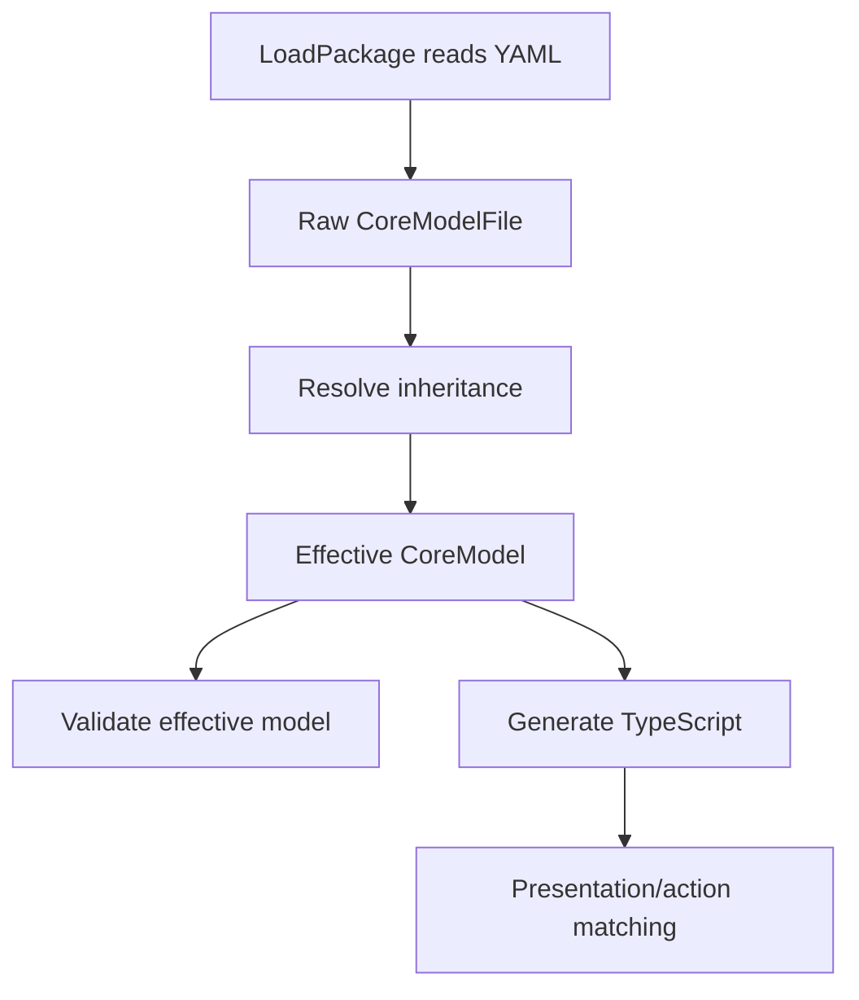

# Archetype and Capability Inheritance Implementation Guide

## Executive Summary

This document replaces the earlier package-composition direction with a simpler semantic inheritance model. The new design treats **Archetype** and **Capability** as the two base classes in DMETA's core model. Every concrete archetype is a class in the `Archetype` hierarchy, and every concrete capability is a class in the `Capability` hierarchy. Domain types then map to leaf or intermediate archetypes/capabilities and inherit the ancestors' presentations, action matching, projections, and validation obligations.

The desired model is not a one-level `inherited_from_base` annotation and not a package flattening system. It is a real multi-level inheritance graph inside the semantic core model:

```text
Archetype
  Entity
    WorkItem
      Order
      OrderItem
    Resource
      Ingredient
    Relation
      Substitution
        IngredientSubstitutionRule

Capability
  identifiable
  stateful
  composable
    ingredient_composable
  substitutable
    role_preserving_substitutable
      dietary_substitutable
```

The first implementation should be an intentional schema overhaul. It should add explicit `extends` and `abstract` fields to `Archetype` and `Capability`, make the inheritance graph required for all non-root semantic classes, implement a deterministic inheritance resolver, validate parent graphs and conflicts, and update TypeScript generation so downstream UI code can ask questions such as:

- Is `OrderItem` a `WorkItem`?
- Does `SandwichSpec` inherit from `ProductComposition`?
- Does `dietary_substitutable` satisfy selectors that accept `substitutable`?
- Which required projections does a domain type need after inherited capabilities are expanded?
- Which presentations/actions apply to descendants, not just exact archetype IDs?

The implementation should **not** solve widget-template inheritance yet. Widget templates remain a separate package/template-selection layer. This design focuses on the semantic layer: archetypes, capabilities, domain examples, presentations, and actions.

## Why This Direction Changed

The earlier `DMETA-IR-COMPOSITION` guide focused on package import/flatten mechanics: base package plus extension package becomes a flattened package. That may still be useful later for physical package distribution, but it is not the right first abstraction for the user's intended mental model.

The user clarified the desired simplification:

- DMETA should stick to `Archetype` and `Capability` as base classes.
- Archetypes should be able to inherit from archetypes.
- Capabilities should be able to inherit from capabilities.
- Inheritance must support more than one level.
- A deli ordering system should be expressible as a semantic inheritance tree, not as a copied package or ad-hoc package composition.

This guide therefore treats inheritance as **core semantic IR behavior**, not as package import behavior.

Because backwards compatibility is not required, the implementation should prefer a clean replacement over compatibility shims. Validators should reject stale flat definitions once the migration lands, generated TypeScript should expose the new inheritance primitives directly, and examples should be rewritten to teach the new model rather than carrying old and new schemas side by side.


## Current System Overview

### Current repository and relevant files

Repository root:

```text
/home/manuel/code/wesen/go-go-golems/dmeta
```

Important files for this implementation:

```text
cmd/dmeta/main.go
pkg/dmeta/cmds/validate_ir.go
pkg/dmeta/cmds/generate_core.go
pkg/dmeta/validator/load.go
pkg/dmeta/validator/model.go
pkg/dmeta/validator/validate.go
pkg/dmeta/generator/core/render.go
pkg/dmeta/generator/core/write.go
sources/dmeta-ir/01-core-model.yaml
sources/dmeta-ir/core-model/archetypes.yaml
sources/dmeta-ir/core-model/capabilities.yaml
sources/dmeta-ir/core-model/presentations.yaml
sources/dmeta-ir/core-model/examples/*.yaml
examples/street-deli-ordering/core-model/archetypes.yaml
examples/street-deli-ordering/core-model/capabilities.yaml
examples/street-deli-ordering/core-model/street-deli-ordering.yaml
```

### Current model shape

`pkg/dmeta/validator/model.go` currently defines flat archetype and capability structs. The key current fields are:

```go
type Archetype struct {
    Description              string   `yaml:"description"`
    LongDescription          string   `yaml:"long_description"`
    DefaultCapabilities      []string `yaml:"default_capabilities"`
    RecommendedPresentations []string `yaml:"recommended_presentations"`
    Examples                 []string `yaml:"examples"`
    Notes                    string   `yaml:"notes"`
}

type Capability struct {
    Description     string                `yaml:"description"`
    LongDescription string                `yaml:"long_description"`
    Projections     map[string]Projection `yaml:"projections"`
    Presentations   []string              `yaml:"presentations"`
    Actions         []string              `yaml:"actions"`
    Filters         []string              `yaml:"filters"`
    Notes           string                `yaml:"notes"`
}
```

Current domain types are also flat:

```go
type DomainType struct {
    Description  string                    `yaml:"description"`
    Archetypes   []string                  `yaml:"archetypes"`
    Capabilities map[string]map[string]any `yaml:"capabilities"`
}
```

That means a domain type must currently list the archetypes and capabilities it uses directly. There is no built-in notion that `OrderItem` is a `WorkItem`, or that `dietary_substitutable` is a specialized `substitutable` capability.

### Current validation behavior

`pkg/dmeta/validator/validate.go` validates a complete package. The relevant current behavior is:

- `validateCoreModel` checks that archetype default capabilities exist.
- It checks that archetype recommended presentations exist.
- It checks capability projection types and references to presentations/actions.
- It checks presentation `applies_to` archetype/capability references.
- It checks action selectors.
- It checks domain examples against direct archetype/capability references.

There is no inheritance resolver today, so every reference is exact-match only.

### Current code generation behavior

`pkg/dmeta/generator/core/render.go` currently emits flat TypeScript registries:

```text
archetypes.ts
capabilities.ts
presentations.ts
actions.ts
PresentationRef.ts
actionMatching.ts
index.ts
```

The generated `ArchetypeDefinition` includes:

```ts
export type ArchetypeDefinition = {
  id: ArchetypeId;
  description: string;
  longDescription: string;
  defaultCapabilities: CapabilityId[];
  recommendedPresentations: PresentationId[];
  examples: string[];
};
```

The generated `CapabilityDefinition` includes:

```ts
export type CapabilityDefinition = {
  id: CapabilityId;
  description: string;
  longDescription: string;
  projections: Record<string, ProjectionDefinition>;
  presentations: PresentationId[];
  actions: ActionId[];
  filters: string[];
};
```

There is no generated ancestry map or `isA` helper yet.

## Problem Statement

The current model forces concepts to be either flat or copied. This creates four problems.

### Problem 1: Reusable semantic roles cannot specialize naturally

Street Deli currently adds `Composition` and `Substitution` as standalone archetypes. That works for validation, but it loses class meaning:

- `Substitution` is conceptually a specialized `Relation`.
- `MenuItem` is conceptually a product/action spec and a composition.
- `OrderItem` is conceptually both a `WorkItem` and a concrete composition instance.
- `Ingredient` is conceptually a `Resource`.

Without inheritance, every domain example has to repeat broad ancestors manually or lose action/presentation matching against them.

### Problem 2: Capability specialization becomes verbose and ambiguous

Street Deli currently defines `composable`, `substitutable`, `configurable`, and `dietary`. These should become part of a capability hierarchy:

```text
Capability
  composable
    ingredient_composable
    configurable_composition
  substitutable
    role_preserving_substitutable
      dietary_substitutable
      price_aware_substitutable
```

Without inheritance, a presentation/action that accepts `substitutable` will not automatically match `dietary_substitutable` unless every specialized capability is listed manually.

### Problem 3: Presentations and actions should apply to descendants

If a presentation applies to `WorkItem`, it should be valid for `Order`, `OrderItem`, `PrepTask`, and any other descendant. If an action accepts `substitutable`, it should be valid for `role_preserving_substitutable` and `dietary_substitutable` subjects.

Exact-match selectors are too weak for this.

### Problem 4: Domain examples should map to leaves while inheriting obligations

A domain type should be able to say:

```yaml
OrderItem:
  archetypes:
    - CustomizedOrderItem
```

and then have validation know that `CustomizedOrderItem` inherits from `OrderComposition`, `ProductComposition`, `Composition`, and `WorkItem`. The domain type should map projections required by all effective capabilities, but it should not need to list every ancestor archetype by hand.

## Design Goals

1. **Make semantic inheritance first-class.** Add `extends` to archetypes and capabilities.
2. **Support multi-level inheritance.** More than one level must work: `CustomizedOrderItem -> OrderComposition -> ProductComposition -> Composition -> Entity`.
3. **Support controlled multiple inheritance.** Some domain concepts really combine two branches, such as `OrderItem` being both `WorkItem` and `Composition`.
4. **Keep v1 deterministic.** Stable parent order, stable list union, clear conflict errors.
5. **Keep package loading simple.** This is not package import/flatten composition. It operates inside a loaded core model.
6. **Update validation and generation.** The resolver must feed effective definitions into validation and TypeScript generation.
7. **Allow a breaking schema overhaul.** Existing flat archetype/capability files should be migrated rather than silently accepted. Missing `extends` is an error for every non-root class.
8. **Make roots explicit.** `Archetype` and `Capability` should become explicit abstract root definitions in the source IR and generated registries.
9. **Defer widget-template inheritance.** Widget templates consume the resolved semantic model but do not inherit through this mechanism in v1.

## Non-Goals

- Do not preserve backwards compatibility with the old flat archetype/capability schema. This is an overhaul: old files should be migrated and validators should fail stale flat definitions.
- Do not implement package imports in this design.
- Do not merge `sources/dmeta-ir` packages in this design.
- Do not implement widget-template specialization in this design.
- Do not create a full object-oriented runtime language.
- Do not support arbitrary method overriding or behavior inheritance.
- Do not allow silent conflict resolution for projections or incompatible inherited fields.

## Proposed Schema Changes

### Archetype schema

Add these fields to `Archetype`:

```go
type Archetype struct {
    Description              string   `yaml:"description"`
    LongDescription          string   `yaml:"long_description"`
    Extends                  []string `yaml:"extends"`
    Abstract                 bool     `yaml:"abstract"`
    DefaultCapabilities      []string `yaml:"default_capabilities"`
    RecommendedPresentations []string `yaml:"recommended_presentations"`
    Examples                 []string `yaml:"examples"`
    Notes                    string   `yaml:"notes"`
}
```

Meaning:

- `extends`: parent archetype IDs. Required for every archetype except the explicit root `Archetype`.
- `abstract`: authoring hint and validation signal. Abstract archetypes organize the tree but should usually not be used as final domain type mappings.
- `default_capabilities`: capabilities introduced by this archetype. Effective capabilities are inherited from parents plus this list.
- `recommended_presentations`: presentations introduced by this archetype. Effective presentations are inherited from parents plus this list.

Example:

```yaml
archetypes:
  Archetype:
    abstract: true
    description: Root semantic role class.
    long_description: Every semantic archetype inherits from Archetype.
    extends: []
    default_capabilities: []
    recommended_presentations: []

  Entity:
    extends: [Archetype]
    abstract: true
    description: Thing with identity, labels, inspection, and relations.
    default_capabilities: [identifiable, labelable, inspectable, relatable]
    recommended_presentations: [compact_ref, detail_panel]

  WorkItem:
    extends: [Entity]
    abstract: true
    description: Unit of work that moves through a lifecycle.
    default_capabilities: [stateful, temporal, actionable]
    recommended_presentations: [dense_row, summary_card]

  Order:
    extends: [WorkItem, TimelineSpan]
    description: Customer order moving through placement, preparation, and pickup.
    default_capabilities: [priced]
```

### Capability schema

Add these fields to `Capability`:

```go
type Capability struct {
    Description     string                `yaml:"description"`
    LongDescription string                `yaml:"long_description"`
    Extends         []string              `yaml:"extends"`
    Abstract        bool                  `yaml:"abstract"`
    Projections     map[string]Projection `yaml:"projections"`
    Presentations   []string              `yaml:"presentations"`
    Actions         []string              `yaml:"actions"`
    Filters         []string              `yaml:"filters"`
    Notes           string                `yaml:"notes"`
}
```

Meaning:

- `extends`: parent capability IDs. Required for every capability except the explicit root `Capability`.
- `abstract`: authoring hint. Abstract capabilities can group behaviors but should usually not be mapped directly by domain types if they have no concrete projections.
- `projections`: projections introduced by this capability. Effective projections inherit from parents and are merged with local projections.
- `presentations`, `actions`, `filters`: inherited and appended in stable order.

Example:

```yaml
capabilities:
  Capability:
    abstract: true
    description: Root affordance/projection class.
    long_description: Every semantic capability inherits from Capability.
    extends: []
    projections: {}

  substitutable:
    extends: [Capability]
    description: Subject can be replaced by alternatives.
    projections:
      replaces:
        type: string
        required: true
        description: Subject or part being replaced.
      replacement_candidates:
        type: list
        required: true
        description: Candidate replacements.
    actions: [see_alternatives]

  role_preserving_substitutable:
    extends: [substitutable]
    description: Replacement must preserve functional roles.
    projections:
      role_preservation:
        type: list
        required: true
        description: Roles preserved by the replacement.
    actions: [apply_substitution]

  dietary_substitutable:
    extends: [role_preserving_substitutable]
    description: Replacement is filtered by dietary/allergen constraints.
    projections:
      dietary_compatibility:
        type: list
        required: false
        description: Dietary tags satisfied by the replacement.
      allergen_flags:
        type: list
        required: false
        description: Allergen differences or warnings.
```

## Inheritance Semantics

### Roots

There are two explicit roots:

```text
Archetype
Capability
```

They should be ordinary abstract definitions in the source IR and generated registries. Because backwards compatibility is not required, the root classes should be declared explicitly instead of being hidden conceptual defaults. This makes diagrams, generated TypeScript, validation errors, and authoring rules easier to explain.

Example root declarations:

```yaml
archetypes:
  Archetype:
    abstract: true
    description: Root semantic role class.
    long_description: Every semantic archetype inherits from Archetype.
    extends: []
    default_capabilities: []
    recommended_presentations: []

capabilities:
  Capability:
    abstract: true
    description: Root affordance/projection class.
    long_description: Every semantic capability inherits from Capability.
    extends: []
    projections: {}
```

### Parent graph

Each archetype and capability forms a directed acyclic graph:

```text
parent -> child
```

A child can have multiple parents, but cycles are invalid.

Invalid:

```text
A extends B
B extends C
C extends A
```

Valid:

```text
OrderItem extends WorkItem, OrderComposition
OrderComposition extends ProductComposition
ProductComposition extends Composition
```

### Stable linearization

Use deterministic base-first traversal in declared parent order.

For a node:

1. Resolve each parent in the order listed in `extends`.
2. Append parent ancestors in stable de-duplicated order.
3. Append the direct parent.
4. Append the node itself.

Example:

```yaml
OrderItem:
  extends: [WorkItem, OrderComposition]
```

If:

```text
WorkItem -> Entity
OrderComposition -> ProductComposition -> Composition -> Entity
```

Then effective ancestry should be:

```text
Entity, WorkItem, Composition, ProductComposition, OrderComposition, OrderItem
```

If an ancestor appears more than once, keep the first occurrence.

### Field merge rules

#### Archetype merge rules

| Field | Rule |
| --- | --- |
| `description` | local only; not inherited |
| `long_description` | local only; not inherited |
| `abstract` | local only |
| `default_capabilities` | stable union of inherited + local |
| `recommended_presentations` | stable union of inherited + local |
| `examples` | stable union of inherited + local, or local only if examples become confusing; v1 should use stable union but generated docs may display local/effective separately |
| `notes` | local only |

#### Capability merge rules

| Field | Rule |
| --- | --- |
| `description` | local only |
| `long_description` | local only |
| `abstract` | local only |
| `projections` | map merge from parents then local |
| `presentations` | stable union inherited + local |
| `actions` | stable union inherited + local |
| `filters` | stable union inherited + local |
| `notes` | local only |

Projection conflicts:

- Same projection name and deeply equal definition: OK.
- Same projection name and different definition: error in v1.
- Do not silently change `required`, `type`, or description.
- Future versions may add explicit override syntax, but v1 should reject conflict.

## Deli Ordering Inheritance Tree

This is the concise target shape for Street Deli.

### Archetype tree

```text
Archetype
├─ Entity (abstract)
│  ├─ Actor
│  │  ├─ Customer
│  │  └─ PrepStation
│  │
│  ├─ Resource
│  │  ├─ Ingredient
│  │  ├─ Packaging
│  │  └─ KitchenLocation
│  │
│  ├─ WorkItem
│  │  ├─ Order
│  │  ├─ OrderItem
│  │  └─ PrepTask
│  │
│  ├─ Event
│  │  ├─ OrderPlacedEvent
│  │  ├─ PrepStatusEvent
│  │  └─ SubstitutionAppliedEvent
│  │
│  └─ Relation
│     ├─ ContainsPart
│     ├─ AssignedToStation
│     └─ Substitution
│        ├─ IngredientSubstitutionRule
│        ├─ SubstitutionSuggestion
│        └─ AppliedSubstitution
│
├─ Spec (abstract)
│  ├─ ProductSpec
│  │  ├─ MenuItem
│  │  │  ├─ SandwichSpec
│  │  │  ├─ SaladBowlSpec
│  │  │  └─ ComboMealSpec
│  │  └─ IngredientRoleSpec
│  │     ├─ ProteinRole
│  │     ├─ StructuralRole
│  │     ├─ RichnessRole
│  │     ├─ CrunchRole
│  │     └─ MoistureRole
│  │
│  └─ ActionSpec
│     ├─ AddToOrderAction
│     ├─ SubstituteIngredientAction
│     └─ ChangeConfigAction
│
└─ Composition
   ├─ ProductComposition
   │  ├─ SandwichComposition
   │  ├─ SaladComposition
   │  └─ BowlComposition
   │
   └─ OrderComposition
      └─ CustomizedOrderItem
```

### Capability tree

```text
Capability
├─ identifiable
├─ labelable
├─ inspectable
├─ relatable
├─ actionable
│
├─ stateful
│  ├─ order_stateful
│  └─ prep_stateful
│
├─ temporal
│  ├─ placed_at
│  ├─ prepared_at
│  └─ completed_at
│
├─ composable
│  ├─ role_composable
│  │  └─ ingredient_composable
│  └─ configurable_composition
│
├─ substitutable
│  ├─ role_preserving_substitutable
│  │  ├─ dietary_substitutable
│  │  └─ price_aware_substitutable
│  └─ substitution_rankable
│
├─ configurable
│  ├─ size_configurable
│  ├─ temperature_configurable
│  └─ spice_configurable
│
├─ dietary
│  ├─ allergen_aware
│  ├─ vegan_aware
│  ├─ gluten_free_aware
│  └─ dairy_free_aware
│
├─ measurable
│  ├─ priced
│  ├─ prep_time_estimate
│  └─ calorie_estimate
│
└─ filterable
   ├─ dietary_filterable
   ├─ ingredient_filterable
   ├─ status_filterable
   └─ price_filterable
```

### Example YAML sketch

```yaml
archetypes:
  Entity:
    abstract: true
    description: Base archetype for identifiable semantic things.
    default_capabilities: [identifiable, labelable, inspectable]
    recommended_presentations: [compact_ref, detail_panel]

  ProductSpec:
    extends: [ActionSpec]
    abstract: true
    description: Definition of a purchasable product or menu item.
    default_capabilities: [parameterized, priced]
    recommended_presentations: [summary_card, detail_panel]

  Composition:
    extends: [Entity]
    abstract: true
    description: Whole assembled from parts with roles.
    default_capabilities: [composable]
    recommended_presentations: [composition_card, composition_detail]

  ProductComposition:
    extends: [Composition]
    abstract: true
    description: Food product assembled from ingredients.
    default_capabilities: [ingredient_composable, dietary]

  SandwichComposition:
    extends: [ProductComposition]
    description: Sandwich with structural, protein, richness, moisture, acidity, and crunch roles.
    default_capabilities: [configurable_composition]

  MenuItem:
    extends: [ProductSpec, ProductComposition]
    description: Menu item definition that can be configured and added to an order.
    default_capabilities: [dietary_filterable]

  CustomizedOrderItem:
    extends: [WorkItem, OrderComposition]
    description: Concrete configured item in a customer's order.
    default_capabilities: [stateful, temporal, substitutable]

  IngredientSubstitutionRule:
    extends: [Substitution]
    description: Rule mapping one ingredient to compatible alternatives.
    default_capabilities: [role_preserving_substitutable, dietary_substitutable, price_aware_substitutable]
```

```yaml
capabilities:
  Capability:
    abstract: true
    description: Root affordance/projection class.
    long_description: Every semantic capability inherits from Capability.
    extends: []
    projections: {}

  composable:
    extends: [Capability]
    description: Subject is assembled from parts.
    projections:
      parts:
        type: list
        required: true
        description: Parts or ingredient references.
      required_roles:
        type: list
        required: false
        description: Roles required for integrity.
    presentations: [ingredient_list, composition_card]
    actions: [add_part, remove_part]

  ingredient_composable:
    extends: [composable]
    description: Composition whose parts are ingredients.
    projections:
      ingredient_roles:
        type: map
        required: true
        description: Ingredient to role mapping.
    actions: [substitute_part]

  substitutable:
    extends: [Capability]
    description: Subject can be replaced by alternatives.
    projections:
      replaces:
        type: string
        required: true
        description: Removed or replaced item.
      replacement_candidates:
        type: list
        required: true
        description: Candidate replacements.
    presentations: [substitution_badge, substitution_pair]
    actions: [see_alternatives]

  role_preserving_substitutable:
    extends: [substitutable]
    description: Substitution preserves functional composition roles.
    projections:
      role_preservation:
        type: list
        required: true
        description: Roles preserved by replacement.
    actions: [apply_substitution]

  dietary_substitutable:
    extends: [role_preserving_substitutable]
    description: Substitution respects dietary and allergen constraints.
    projections:
      dietary_compatibility:
        type: list
        required: false
        description: Dietary tags satisfied by the replacement.
      allergen_flags:
        type: list
        required: false
        description: Allergen warnings introduced or removed.
```

### Concrete deli scenario

```text
Menu item: BLT Sandwich
Archetype: SandwichComposition
Effective ancestors:
  Archetype -> Entity -> Composition -> ProductComposition -> SandwichComposition

Parts:
  Bread   -> structural
  Bacon   -> protein, smoky, umami
  Lettuce -> crunch, freshness
  Tomato  -> moisture, acidity
  Mayo    -> richness, moisture

Customer removes Bacon.

System detects unfilled roles:
  protein, smoky, umami

System creates SubstitutionSuggestion:
  extends Substitution
  capabilities:
    role_preserving_substitutable
    dietary_substitutable
    price_aware_substitutable

Candidates:
  SmokedTofu:
    fills: protein, smoky, umami
    dietary: vegan, dairy_free
    price_delta_cents: 150

  Portobello:
    fills: umami, meaty_texture
    dietary: vegan, dairy_free
    price_delta_cents: 100

  Avocado:
    fills: richness, creaminess
    dietary: vegan, dairy_free
    price_delta_cents: 150
    note: good for richness, but does not fully replace protein/smoke
```

## Runtime / Tooling Architecture

The inheritance system should sit between package loading and validation/generation.



Important rule: keep raw YAML as the authoring source, but validate and generate from the resolved effective model.

## Proposed Go API

Create a small resolver layer. It can live in `pkg/dmeta/validator` initially, or in a new `pkg/dmeta/inheritance` package if it grows.

Recommended v1 file:

```text
pkg/dmeta/validator/inheritance.go
```

### Data structures

```go
type ResolvedCoreModel struct {
    Raw CoreModelFile

    Archetypes map[string]ResolvedArchetype
    Capabilities map[string]ResolvedCapability

    ArchetypeAncestors map[string][]string
    CapabilityAncestors map[string][]string
    ArchetypeDescendants map[string][]string
    CapabilityDescendants map[string][]string
}

type ResolvedArchetype struct {
    ID string
    Raw Archetype
    Ancestors []string
    EffectiveDefaultCapabilities []string
    EffectiveRecommendedPresentations []string
    EffectiveExamples []string
}

type ResolvedCapability struct {
    ID string
    Raw Capability
    Ancestors []string
    EffectiveProjections map[string]Projection
    EffectivePresentations []string
    EffectiveActions []string
    EffectiveFilters []string
}
```

### Resolver function

```go
func ResolveCoreInheritance(core CoreModelFile) (*ResolvedCoreModel, []Finding) {
    resolver := &coreInheritanceResolver{
        core: core,
        resolvedArchetypes: map[string]ResolvedArchetype{},
        resolvedCapabilities: map[string]ResolvedCapability{},
    }

    for id := range core.Archetypes {
        resolver.resolveArchetype(id, nil)
    }
    for id := range core.Capabilities {
        resolver.resolveCapability(id, nil)
    }

    resolver.buildDescendantIndexes()
    return resolver.result(), resolver.findings
}
```

### Cycle detection pseudocode

```go
func (r *resolver) resolveArchetype(id string, stack []string) (ResolvedArchetype, bool) {
    if value, ok := r.resolvedArchetypes[id]; ok {
        return value, true
    }
    if contains(stack, id) {
        r.error("core_model", "archetypes."+id+".extends", "archetype_inheritance_cycle", stack)
        return ResolvedArchetype{}, false
    }

    raw, ok := r.core.Archetypes[id]
    if !ok {
        r.error("core_model", "archetypes."+id, "unknown_archetype", "parent does not exist")
        return ResolvedArchetype{}, false
    }

    lineage := []string{}
    caps := []string{}
    presentations := []string{}
    examples := []string{}

    for _, parentID := range raw.Extends {
        parent, ok := r.resolveArchetype(parentID, append(stack, id))
        if !ok { continue }
        lineage = stableUnion(lineage, parent.Ancestors)
        lineage = stableAppend(lineage, parentID)
        caps = stableUnion(caps, parent.EffectiveDefaultCapabilities)
        presentations = stableUnion(presentations, parent.EffectiveRecommendedPresentations)
        examples = stableUnion(examples, parent.EffectiveExamples)
    }

    caps = stableUnion(caps, raw.DefaultCapabilities)
    presentations = stableUnion(presentations, raw.RecommendedPresentations)
    examples = stableUnion(examples, raw.Examples)

    out := ResolvedArchetype{
        ID: id,
        Raw: raw,
        Ancestors: lineage,
        EffectiveDefaultCapabilities: caps,
        EffectiveRecommendedPresentations: presentations,
        EffectiveExamples: examples,
    }
    r.resolvedArchetypes[id] = out
    return out, true
}
```

### Capability projection merge pseudocode

```go
func mergeProjectionMaps(dst map[string]Projection, incoming map[string]Projection, path string) map[string]Projection {
    for name, projection := range incoming {
        existing, exists := dst[name]
        if !exists {
            dst[name] = projection
            continue
        }
        if reflect.DeepEqual(existing, projection) {
            continue
        }
        finding := Error(
            "core_model",
            path+".projections."+name,
            "projection_inheritance_conflict",
            fmt.Sprintf("projection %q differs between inherited capabilities", name),
            "Rename the projection or make the inherited definitions identical. Explicit override can be added in a future version.",
        )
        r.findings = append(r.findings, finding)
    }
    return dst
}
```

## Validation Changes

### New validation checks

Add inheritance checks before existing reference checks:

1. Parent archetypes exist.
2. Parent capabilities exist.
3. No archetype cycles.
4. No capability cycles.
5. No duplicate parent IDs in one `extends` list.
6. No projection conflicts in capability inheritance.
7. Abstract archetypes/capabilities are not used in domain examples unless explicitly allowed.
8. Effective default capabilities all exist.
9. Effective recommended presentations all exist.
10. Effective domain type capability mappings include required inherited projections.

### Domain type validation should use effective capabilities

Today, domain examples validate only direct capability mappings. With inheritance, this must change.

Example:

```yaml
capabilities:
  Capability:
    abstract: true
    extends: []

  substitutable:
    extends: [Capability]
    projections:
      replaces: { type: string, required: true }
      replacement_candidates: { type: list, required: true }

  role_preserving_substitutable:
    extends: [substitutable]
    projections:
      role_preservation: { type: list, required: true }
```

If a domain type maps `role_preserving_substitutable`, validation must require:

- `replaces`
- `replacement_candidates`
- `role_preservation`

Pseudocode:

```go
for capID, mapping := range domainType.Capabilities {
    resolvedCap := resolved.Capabilities[capID]
    for projID, proj := range resolvedCap.EffectiveProjections {
        if proj.Required && mapping[projID] == nil {
            error("missing_required_projection_mapping")
        }
    }
}
```

### Presentation matching should use descendants

If a presentation applies to `Composition`, it applies to descendants like `ProductComposition` and `SandwichComposition`. Because the old exact-match-only model is being replaced, descendant matching should be the default behavior.

Validation should still ensure `Composition` exists, but generated matching should use `isArchetypeA(child, parent)`.

```go
func PresentationAppliesToArchetype(p Presentation, archetypeID string, resolved *ResolvedCoreModel) bool {
    for _, accepted := range p.AppliesTo.Archetypes {
        if accepted == archetypeID || resolved.IsArchetypeA(archetypeID, accepted) {
            return true
        }
    }
    return false
}
```

### Action selectors should use descendants

If an action accepts `WorkItem`, it should match `Order`, `OrderItem`, and `PrepTask`.

If an action accepts `substitutable`, it should match `role_preserving_substitutable` and `dietary_substitutable`.

```go
func SelectorMatchesSubject(selector Selector, subject SubjectRef, resolved *ResolvedCoreModel) bool {
    if selector.Archetype != "" {
        for _, subjectArch := range subject.Archetypes {
            if subjectArch == selector.Archetype || resolved.IsArchetypeA(subjectArch, selector.Archetype) {
                return true
            }
        }
    }
    if selector.Capability != "" {
        for _, subjectCap := range subject.Capabilities {
            if subjectCap == selector.Capability || resolved.IsCapabilityA(subjectCap, selector.Capability) {
                return true
            }
        }
    }
    return false
}
```

## Generator Changes

### Generated archetypes

Extend generated `ArchetypeDefinition`:

```ts
export type ArchetypeDefinition = {
  id: ArchetypeId;
  description: string;
  longDescription: string;
  extends: ArchetypeId[];
  abstract: boolean;
  defaultCapabilities: CapabilityId[];
  effectiveDefaultCapabilities: CapabilityId[];
  recommendedPresentations: PresentationId[];
  effectiveRecommendedPresentations: PresentationId[];
  examples: string[];
  ancestors: ArchetypeId[];
};
```

Generate helpers:

```ts
export function isArchetypeA(child: ArchetypeId, ancestor: ArchetypeId): boolean {
  return child === ancestor || archetypes[child].ancestors.includes(ancestor);
}

export function archetypeHasCapability(archetype: ArchetypeId, capability: CapabilityId): boolean {
  return archetypes[archetype].effectiveDefaultCapabilities.includes(capability);
}
```

### Generated capabilities

Extend generated `CapabilityDefinition`:

```ts
export type CapabilityDefinition = {
  id: CapabilityId;
  description: string;
  longDescription: string;
  extends: CapabilityId[];
  abstract: boolean;
  projections: Record<string, ProjectionDefinition>;
  effectiveProjections: Record<string, ProjectionDefinition>;
  presentations: PresentationId[];
  effectivePresentations: PresentationId[];
  actions: ActionId[];
  effectiveActions: ActionId[];
  filters: string[];
  effectiveFilters: string[];
  ancestors: CapabilityId[];
};
```

Generate helper:

```ts
export function isCapabilityA(child: CapabilityId, ancestor: CapabilityId): boolean {
  return child === ancestor || capabilities[child].ancestors.includes(ancestor);
}
```

### Generated action matching

Update `actionMatching.ts` so selector matching uses inheritance helpers:

```ts
function selectorMatchesRef(selector: ActionSelector, ref: PresentationRef): boolean {
  if ('archetype' in selector) {
    return ref.archetypes.some((id) => isArchetypeA(id, selector.archetype));
  }
  if ('capability' in selector) {
    return ref.capabilities.some((id) => isCapabilityA(id, selector.capability));
  }
  if ('presentation' in selector) {
    return ref.presentationId === selector.presentation;
  }
  if ('domainType' in selector) {
    return ref.domainType === selector.domainType;
  }
  return false;
}
```

## Implementation Plan

### Phase 1: Add schema fields and make the break explicit

Files:

- `pkg/dmeta/validator/model.go`
- `sources/dmeta-ir/core-model/archetypes.yaml`
- `sources/dmeta-ir/core-model/capabilities.yaml`

Tasks:

1. Add `Extends []string` and `Abstract bool` to `Archetype`.
2. Add `Extends []string` and `Abstract bool` to `Capability`.
3. Add explicit root definitions `Archetype` and `Capability` to the source IR.
4. Make missing `extends` a validation error for every non-root archetype/capability.
5. Add a minimal test that unmarshals archetype/capability YAML with explicit roots and multi-level `extends`.

### Phase 2: Add inheritance resolver

Files:

- `pkg/dmeta/validator/inheritance.go`
- `pkg/dmeta/validator/inheritance_test.go`

Tasks:

1. Implement archetype graph resolution.
2. Implement capability graph resolution.
3. Implement stable union helper.
4. Implement cycle detection.
5. Implement projection conflict detection.
6. Build ancestor and descendant indexes.

Test cases:

- single parent inheritance;
- three-level inheritance;
- multiple parent inheritance;
- cycle detection;
- unknown parent;
- projection conflict;
- stable order de-duplication.

### Phase 3: Integrate resolver into validation

Files:

- `pkg/dmeta/validator/validate.go`

Tasks:

1. Call `ResolveCoreInheritance` inside `ValidatePackage` or `validateCoreModel`.
2. Return inheritance findings before regular findings.
3. Validate references against effective fields where needed.
4. Validate domain examples against effective capability projections.
5. Add warnings/errors for abstract direct usage.

### Phase 4: Update generator model

Files:

- `pkg/dmeta/generator/core/render.go`
- `pkg/dmeta/generator/core/render_test.go`

Tasks:

1. Resolve inheritance before rendering archetypes/capabilities.
2. Render `extends`, `abstract`, `ancestors`, and effective fields.
3. Render `isArchetypeA` and `isCapabilityA` helpers.
4. Update `actionMatching.ts` rendering to use inheritance-aware matching.
5. Update golden tests or snapshot expectations.

### Phase 5: Rewrite base DMETA into the inheritance model

Files:

- `sources/dmeta-ir/core-model/archetypes.yaml`
- `sources/dmeta-ir/core-model/capabilities.yaml`
- `sources/dmeta-ir/core-model/presentations.yaml`

Suggested base tree:

```yaml
archetypes:
  Archetype:
    abstract: true
    extends: []
    default_capabilities: []
    recommended_presentations: []

  Entity:
    extends: [Archetype]
    abstract: true
    default_capabilities: [identifiable, labelable, inspectable]

  Actor:
    extends: [Entity]

  WorkItem:
    extends: [Entity]
    default_capabilities: [stateful, temporal, actionable, relatable]

  Event:
    extends: [Entity]
    default_capabilities: [temporal, append_only, relatable]

  Resource:
    extends: [Entity]
    default_capabilities: [relatable]

  Relation:
    extends: [Entity]
    default_capabilities: [relatable]

  ActionSpec:
    extends: [Entity]
    default_capabilities: [actionable, parameterized]

  ActionInvocation:
    extends: [WorkItem]
    default_capabilities: [executable, schedulable]
```

Do this after resolver tests pass. This is allowed to be a breaking rewrite. Keep changes reviewable, but do not keep compatibility shims for the old flat style.

### Phase 6: Migrate Street Deli example

Files:

- `examples/street-deli-ordering/core-model/archetypes.yaml`
- `examples/street-deli-ordering/core-model/capabilities.yaml`
- `examples/street-deli-ordering/core-model/street-deli-ordering.yaml`

Tasks:

1. Replace `inherited_from_base` documentation with real `extends` fields.
2. Convert `Composition` and `Substitution` into descendants of base archetypes.
3. Add deli-specific intermediate classes like `ProductComposition`, `SandwichComposition`, `CustomizedOrderItem`.
4. Convert `composable`/`substitutable` specializations into capability inheritance.
5. Update domain examples to list leaf archetypes/capabilities where possible.
6. Fix the known Street Deli `03-widgets.yaml` YAML issue separately if validating the whole example.

## Testing Strategy

### Unit tests

Add resolver tests in `pkg/dmeta/validator/inheritance_test.go`.

Minimal test table:

```go
func TestResolveArchetypeInheritance(t *testing.T) {
    core := CoreModelFile{Archetypes: map[string]Archetype{
        "Archetype": {Abstract: true, Extends: []string{}},
        "Entity": {Extends: []string{"Archetype"}, Abstract: true, DefaultCapabilities: []string{"identifiable"}},
        "WorkItem": {Extends: []string{"Entity"}, DefaultCapabilities: []string{"stateful"}},
        "Order": {Extends: []string{"WorkItem"}, DefaultCapabilities: []string{"priced"}},
    }}

    resolved, findings := ResolveCoreInheritance(core)
    require.NoError(t, firstError(findings))
    assert.Equal(t, []string{"Archetype", "Entity", "WorkItem"}, resolved.Archetypes["Order"].Ancestors)
    assert.Equal(t, []string{"identifiable", "stateful", "priced"}, resolved.Archetypes["Order"].EffectiveDefaultCapabilities)
}
```

### Validation tests

Add tests that prove:

- unknown parent is an error;
- cycle is an error;
- descendant presentation references are accepted;
- domain examples using inherited capabilities require inherited projections;
- abstract direct domain mapping warns or errors according to policy.

### Generator tests

Update `pkg/dmeta/generator/core/render_test.go` to assert generated output includes:

- `extends` arrays;
- `ancestors` arrays;
- effective capabilities/projections;
- `isArchetypeA`;
- `isCapabilityA`;
- inheritance-aware action matching.

### CLI validation tests

Run:

```bash
go run ./cmd/dmeta validate-ir --root ./sources/dmeta-ir --include-info --output table

go run ./cmd/dmeta generate-core --root ./sources/dmeta-ir --out /tmp/dmeta-core-inheritance --dry-run --output table
```

## Migration Guidance

### Existing flat packages

Existing flat packages should be migrated, not supported indefinitely. A missing `extends` field should become a validation error for every non-root archetype/capability. The migration is mechanical:

1. Add explicit root classes `Archetype` and `Capability`.
2. Add intermediate abstract classes such as `Entity`, `Spec`, `Composition`, and specialized capability parents.
3. Add `extends` to every existing archetype and capability.
4. Remove `inherited_from_base` documentation blocks once real parents exist.
5. Update generated tests and snapshots to expect ancestry/effective fields.

### `inherited_from_base` fields

Existing `inherited_from_base` fields are documentation-only. They should be removed during the overhaul and replaced by real inheritance. For example:

Before:

```yaml
inherited_from_base:
  archetypes:
    - Actor
    - WorkItem
```

After:

```yaml
archetypes:
  Customer:
    extends: [Actor]

  Order:
    extends: [WorkItem, TimelineSpan]
```

### Package composition relationship

Package composition may still exist later for physical distribution, but it should not be the main semantic mechanism. The semantic mechanism is now:

```text
Archetype extends Archetype
Capability extends Capability
DomainType maps to leaf classes
Validation/generation use effective inherited model
```

## Risks and Mitigations

| Risk | Why it matters | Mitigation |
| --- | --- | --- |
| Multiple inheritance becomes hard to reason about | Deli examples need it, but arbitrary diamonds can be confusing. | Use stable parent order, de-duplication, and conflict errors. |
| Projection conflicts become common | Capability specializations may reuse projection names differently. | Require identical definitions in v1; reject conflicts. |
| Abstract classes are misused as concrete mappings | Domain examples may map to broad concepts like `Entity`. | Add warning/error for abstract direct use. |
| Generated code bloats | Effective fields and ancestry maps add output. | Keep generated helpers simple and deterministic. |
| Old flat examples break | This is expected during the overhaul. | Migrate base and example packages in the same implementation branch; validation should fail stale flat definitions clearly. |
| Package composition confusion remains | Previous ticket discussed flattening. | State clearly that inheritance is the semantic core; package composition is later packaging. |

## Alternatives Considered

### Alternative 1: Package import/flatten composition

This was the previous guide's direction. It helps avoid copying files but does not directly model `OrderItem is a WorkItem` or `dietary_substitutable is substitutable`. It solves packaging, not semantics.

### Alternative 2: Keep flat archetypes and use `inherited_from_base`

This is documentation-only and cannot drive validation/generation/action matching.

### Alternative 3: Use only capabilities, no archetype inheritance

Capabilities alone do not explain higher-level semantic roles such as `WorkItem`, `Composition`, `Substitution`, or `ProductSpec`. The model needs both class hierarchies.

### Alternative 4: Full object-oriented DSL

A full OO language would be overkill. DMETA needs inheritance of metadata, projections, presentations, and selectors, not methods, constructors, or runtime behavior.

## Open Questions

1. Should v1 allow multiple inheritance immediately? This guide recommends yes, because the deli model needs `MenuItem extends ProductSpec, ProductComposition` and `OrderItem extends WorkItem, OrderComposition`.
2. Should `abstract: true` be an error or warning when used directly in domain examples?
3. Should projection conflicts eventually support explicit override declarations?
4. Should generated TypeScript include both raw and effective definitions, or only effective definitions plus ancestry?
5. Should explicit roots `Archetype` and `Capability` be emitted as generated IDs? This guide now recommends yes because no backwards compatibility is required.
6. Should presentations/actions match descendants by default, or require an explicit `match_descendants: true` flag? This guide recommends descendant matching by default.

## Intern Starting Checklist

If you are implementing this, do this first:

1. Read `pkg/dmeta/validator/model.go` and understand the current flat structs.
2. Read `pkg/dmeta/validator/validate.go`, especially `validateCoreModel`.
3. Read `pkg/dmeta/generator/core/render.go`, especially `RenderArchetypes`, `RenderCapabilities`, and `RenderActionMatching`.
4. Add `extends`/`abstract` fields to the model structs.
5. Add explicit root classes and make missing non-root `extends` a validation error.
6. Write resolver tests before changing the rest of base YAML.
7. Implement `ResolveCoreInheritance` against tiny in-memory fixtures.
8. Only then wire resolver into validation.
9. Only after validation works, update generator output.
10. Only after generator tests pass, migrate base DMETA YAML and Street Deli examples.

## File References

### Core implementation files

- `/home/manuel/code/wesen/go-go-golems/dmeta/pkg/dmeta/validator/model.go`
- `/home/manuel/code/wesen/go-go-golems/dmeta/pkg/dmeta/validator/load.go`
- `/home/manuel/code/wesen/go-go-golems/dmeta/pkg/dmeta/validator/validate.go`
- `/home/manuel/code/wesen/go-go-golems/dmeta/pkg/dmeta/generator/core/render.go`
- `/home/manuel/code/wesen/go-go-golems/dmeta/pkg/dmeta/generator/core/render_test.go`
- `/home/manuel/code/wesen/go-go-golems/dmeta/pkg/dmeta/cmds/validate_ir.go`
- `/home/manuel/code/wesen/go-go-golems/dmeta/pkg/dmeta/cmds/generate_core.go`

### Base IR files

- `/home/manuel/code/wesen/go-go-golems/dmeta/sources/dmeta-ir/01-core-model.yaml`
- `/home/manuel/code/wesen/go-go-golems/dmeta/sources/dmeta-ir/core-model/archetypes.yaml`
- `/home/manuel/code/wesen/go-go-golems/dmeta/sources/dmeta-ir/core-model/capabilities.yaml`
- `/home/manuel/code/wesen/go-go-golems/dmeta/sources/dmeta-ir/core-model/presentations.yaml`
- `/home/manuel/code/wesen/go-go-golems/dmeta/sources/dmeta-ir/core-model/examples/agent-workflow.yaml`
- `/home/manuel/code/wesen/go-go-golems/dmeta/sources/dmeta-ir/core-model/examples/retail-logistics.yaml`

### Street Deli pressure-test files

- `/home/manuel/code/wesen/go-go-golems/dmeta/examples/street-deli-ordering/core-model/archetypes.yaml`
- `/home/manuel/code/wesen/go-go-golems/dmeta/examples/street-deli-ordering/core-model/capabilities.yaml`
- `/home/manuel/code/wesen/go-go-golems/dmeta/examples/street-deli-ordering/core-model/presentations.yaml`
- `/home/manuel/code/wesen/go-go-golems/dmeta/examples/street-deli-ordering/core-model/street-deli-ordering.yaml`

## Summary

The new design is simple at the conceptual level:

```text
Archetype is the explicit base class for semantic role classes.
Capability is the explicit base class for affordance/projection classes.
Archetypes can extend archetypes.
Capabilities can extend capabilities.
Domain types map to leaf classes.
Presentations and actions match descendants.
Validation and generation use the effective inherited model.
```

That gives DMETA a real semantic inheritance system without first solving package composition or widget-template inheritance.
