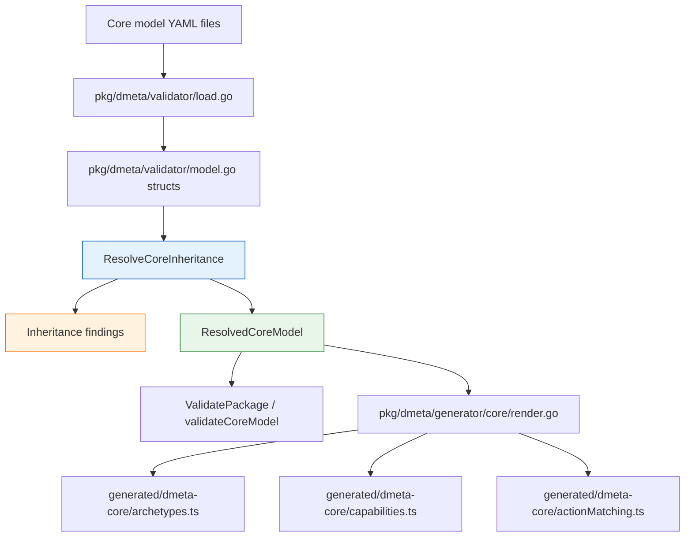
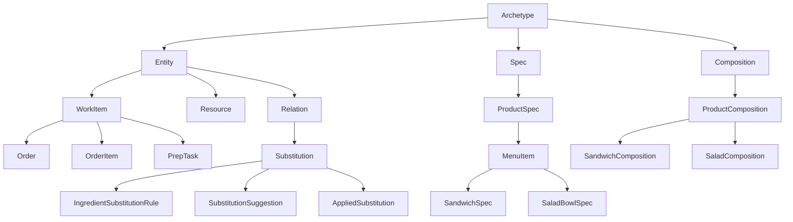
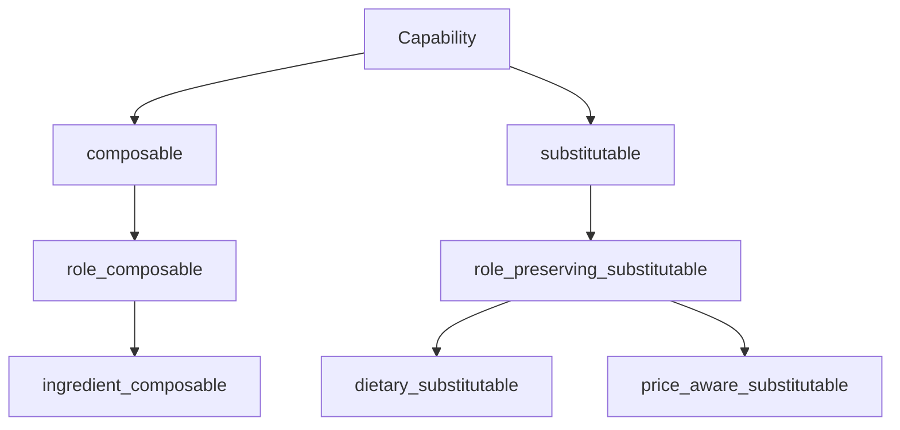

# Implemented Inheritance System Intern Guide

## Executive summary

DMETA now treats `Archetype` and `Capability` as explicit abstract base classes rather than as informal lists of reusable names. Every non-root archetype and capability declares `extends`, the validator computes a resolved inherited view, and the TypeScript generator emits both local fields and effective inherited fields. This is a breaking overhaul: older flat definitions are intentionally rejected until they declare their semantic parentage.

The most important mental model is: **authors write local semantic intent; tools consume effective inherited contracts**. An archetype definition may only list the extra capabilities and presentations it contributes locally, but validation and generated runtime metadata see the complete inherited capability/presentation set. A capability definition may only list local projections/actions, but domain examples must map all required projections inherited from every parent.

## Problem statement

The previous flat model made every archetype and capability look independent. That caused four problems:

- **Duplication:** descendants repeated parent capabilities and presentations by hand.
- **Weak semantics:** there was no formal way to say that `ActionInvocation` is a kind of `WorkItem`, or that a deli `MenuItem` is both a product specification and a composition-aware semantic object.
- **Poor validation:** required capability projections were only checked on the directly mapped capability, not on projections inherited from reusable parents.
- **Limited generation:** generated TypeScript could test exact equality only; action matching could not say “this concrete type is a kind of `WorkItem`” or “this capability satisfies `filterable` through inheritance.”

The new system fixes this by building an explicit, validated semantic class hierarchy.

## Core vocabulary

### Archetype

An archetype is a reusable semantic role for domain objects. Examples in the base model include `Entity`, `Actor`, `WorkItem`, `Resource`, `Relation`, `Metric`, and `ActionInvocation`.

Archetypes answer: **what kind of operational thing is this?**

```yaml
archetypes:
  WorkItem:
    extends:
      - Entity
    description: A unit of work that can be tracked, progressed, completed, failed, retried, or inspected.
    default_capabilities:
      - stateful
      - temporal
      - actionable
```

### Capability

A capability is a reusable affordance/projection contract. Examples include `identifiable`, `labelable`, `stateful`, `temporal`, `filterable`, `searchable`, and domain-specific capabilities like `ingredient_composable`.

Capabilities answer: **what can the object do or expose to UI/actions?**

```yaml
capabilities:
  stateful:
    extends:
      - Capability
    projections:
      state:
        type: string
        required: true
        description: Current semantic state.
    presentations:
      - status_badge
```

### Abstract root

There are two required roots:

```yaml
archetypes:
  Archetype:
    abstract: true
    extends: []

capabilities:
  Capability:
    abstract: true
    extends: []
```

The roots exist so every semantic role and affordance has a single well-known ancestry base. Domain examples must never map to these roots directly.

### Abstract helper parent

A helper parent groups shared semantics but should not be assigned directly to domain types. For example, `Entity` is useful because many concrete archetypes inherit identity, labels, inspection, and relation behavior from it, but a domain type should usually map to `WorkItem`, `Resource`, or `Relation` rather than generic `Entity`.

```yaml
Entity:
  abstract: true
  extends:
    - Archetype
  default_capabilities:
    - identifiable
    - labelable
    - inspectable
    - relatable
```

## Architecture overview



The load step only parses YAML into Go structs. It does not perform semantic inheritance. Inheritance is resolved in one place, `pkg/dmeta/validator/inheritance.go`, so validation and generation agree on the same effective model.

## Source files and responsibilities

| File | Responsibility |
| --- | --- |
| `pkg/dmeta/validator/model.go` | Defines parsed YAML structs. `Archetype` and `Capability` now expose `Extends []string` and `Abstract bool`. |
| `pkg/dmeta/validator/inheritance.go` | Resolves parent graphs, validates roots, detects cycles/duplicates/unknown parents, merges effective fields, and exposes `IsArchetypeA` / `IsCapabilityA`. |
| `pkg/dmeta/validator/inheritance_test.go` | Unit tests for ancestry, multiple inheritance order, projection inheritance, cycles, missing `extends`, and conflicts. |
| `pkg/dmeta/validator/validate.go` | Calls `ResolveCoreInheritance` and validates the rest of the model against inherited effective fields. |
| `pkg/dmeta/generator/core/render.go` | Generates TypeScript metadata for local and effective semantic fields and inheritance-aware action routing. |
| `sources/dmeta-ir/core-model/archetypes.yaml` | Base semantic archetype hierarchy. |
| `sources/dmeta-ir/core-model/capabilities.yaml` | Base semantic capability hierarchy. |
| `generated/dmeta-core/*.ts` | Committed generated runtime metadata consumed by downstream TypeScript systems. |

## Data model changes

The parsed structs are intentionally small. They represent author intent, not the fully resolved model.

```go
// pkg/dmeta/validator/model.go
type Archetype struct {
    Description              string   `yaml:"description"`
    LongDescription          string   `yaml:"long_description"`
    Extends                  []string `yaml:"extends"`
    Abstract                 bool     `yaml:"abstract"`
    DefaultCapabilities      []string `yaml:"default_capabilities"`
    RecommendedPresentations []string `yaml:"recommended_presentations"`
    Examples                 []string `yaml:"examples"`
}

type Capability struct {
    Description     string                `yaml:"description"`
    LongDescription string                `yaml:"long_description"`
    Extends         []string              `yaml:"extends"`
    Abstract        bool                  `yaml:"abstract"`
    Projections     map[string]Projection `yaml:"projections"`
    Presentations   []string              `yaml:"presentations"`
    Actions         []string              `yaml:"actions"`
    Filters         []string              `yaml:"filters"`
}
```

The important detail is that `DefaultCapabilities`, `RecommendedPresentations`, `Projections`, `Actions`, and similar fields are **local contributions**. The resolver computes the inherited/effective versions.

## Resolved model API

The public resolver API is:

```go
func ResolveCoreInheritance(core CoreModelFile) (*ResolvedCoreModel, []Finding)
```

It returns:

```go
type ResolvedCoreModel struct {
    Raw                   CoreModelFile
    Archetypes            map[string]ResolvedArchetype
    Capabilities          map[string]ResolvedCapability
    ArchetypeDescendants  map[string][]string
    CapabilityDescendants map[string][]string
}
```

The most useful methods are:

```go
func (r *ResolvedCoreModel) IsArchetypeA(child, ancestor string) bool
func (r *ResolvedCoreModel) IsCapabilityA(child, ancestor string) bool
```

Use these methods whenever code needs semantic “is-a” behavior. Do not reimplement ancestry traversal at each call site.

## Resolver algorithm

The resolver does a depth-first walk for archetypes and capabilities. It is deliberately simple and deterministic.

```text
resolveArchetype(id):
  if already resolved:
    return cached result

  load raw archetype by id
  reject unknown id
  reject cycle if id is already in current recursion stack
  reject missing extends unless id == "Archetype"
  reject duplicate parent ids

  ancestors = []
  effectiveCapabilities = []
  effectivePresentations = []
  effectiveExamples = []

  for parent in raw.extends, in author order:
    resolvedParent = resolveArchetype(parent)
    ancestors += stable unique resolvedParent.ancestors
    ancestors += stable unique parent
    effectiveCapabilities += stable unique resolvedParent.effectiveCapabilities
    effectivePresentations += stable unique resolvedParent.effectivePresentations
    effectiveExamples += stable unique resolvedParent.effectiveExamples

  effectiveCapabilities += stable unique raw.defaultCapabilities
  effectivePresentations += stable unique raw.recommendedPresentations
  effectiveExamples += stable unique raw.examples

  cache and return resolved archetype
```

Capability resolution is the same pattern, except projection maps are merged with conflict detection.

```text
mergeProjections(dst, incoming):
  for each projection name in incoming:
    if name not in dst:
      copy projection
    else if existing projection is byte-for-byte/deep-equal same:
      keep one copy
    else:
      emit projection_inheritance_conflict
```

Explicit overrides are not supported in this overhaul. If two parents define the same projection name differently, the author must rename one projection or make the definitions identical. This keeps the model predictable for interns and generated TypeScript.

## Validation behavior

`ValidatePackage` now resolves inheritance before running regular checks:

```go
func ValidatePackage(pkg *Package) []Finding {
    resolved, inheritanceFindings := ResolveCoreInheritance(pkg.CoreModel)
    findings := append([]Finding{}, inheritanceFindings...)
    findings = append(findings, validateArtifactIdentity(pkg)...)
    findings = append(findings, validateIndex(pkg)...)
    findings = append(findings, validateCoreModel(pkg, resolved)...)
    findings = append(findings, validateDesignLanguage(pkg)...)
    findings = append(findings, validateWidgets(pkg)...)
    return findings
}
```

Validation now enforces these inheritance-specific rules:

- `Archetype` root must exist.
- `Archetype` root must be abstract.
- `Archetype` root must have `extends: []`.
- `Capability` root must exist.
- `Capability` root must be abstract.
- `Capability` root must have `extends: []`.
- every non-root archetype must declare `extends`;
- every non-root capability must declare `extends`;
- parent ids must exist;
- duplicate parents are errors;
- inheritance cycles are errors;
- conflicting inherited projection definitions are errors;
- domain examples may not map abstract archetypes/capabilities directly;
- domain examples must map every required projection in the effective inherited capability.

## Generation behavior

The generator resolves inheritance before rendering TypeScript registries. It emits both local and effective fields so TypeScript consumers can choose the right layer.

### Archetype TypeScript shape

```ts
export type ArchetypeDefinition = {
  id: ArchetypeId;
  description: string;
  longDescription: string;
  extends: ArchetypeId[];
  abstract: boolean;
  ancestors: ArchetypeId[];
  defaultCapabilities: CapabilityId[];
  effectiveDefaultCapabilities: CapabilityId[];
  recommendedPresentations: PresentationId[];
  effectiveRecommendedPresentations: PresentationId[];
  examples: string[];
  effectiveExamples: string[];
};
```

### Capability TypeScript shape

```ts
export type CapabilityDefinition = {
  id: CapabilityId;
  description: string;
  longDescription: string;
  extends: CapabilityId[];
  abstract: boolean;
  ancestors: CapabilityId[];
  projections: Record<string, ProjectionDefinition>;
  effectiveProjections: Record<string, ProjectionDefinition>;
  presentations: PresentationId[];
  effectivePresentations: PresentationId[];
  actions: ActionId[];
  effectiveActions: ActionId[];
  filters: string[];
  effectiveFilters: string[];
};
```

Generated helpers:

```ts
export function isArchetypeA(child: ArchetypeId, ancestor: ArchetypeId): boolean
export function archetypeHasCapability(archetype: ArchetypeId, capability: CapabilityId): boolean
export function isCapabilityA(child: CapabilityId, ancestor: CapabilityId): boolean
```

### Action matching

`generated/dmeta-core/actionMatching.ts` now treats selector matches as semantic ancestry tests rather than exact string equality.

```text
selectorMatchesPresentationRef(selector, ref):
  if selector has capability:
    return any ref capability isCapabilityA(candidate, selector.capability)
       and required capabilities match through inheritance

  if selector has archetype:
    return any ref archetype isArchetypeA(candidate, selector.archetype)
       and required capabilities match through inheritance

  if selector has presentation:
    return exact presentation id match

  if selector has domainType:
    return exact domain type match
```

This lets an action registered for `WorkItem` match `ActionInvocation` or a domain-specific descendant that extends `WorkItem`.

## Authoring workflow

When adding a new archetype:

1. Find the nearest existing parent in `sources/dmeta-ir/core-model/archetypes.yaml`.
2. If the new concept is only a grouping/taxonomy concept, set `abstract: true`.
3. Add only local capabilities/presentations/examples that are not already inherited.
4. Run validation.
5. Regenerate TypeScript registries if the base source package changed.

```yaml
PrepTask:
  extends:
    - WorkItem
  description: Kitchen task that tracks preparation work for one order or order item.
  default_capabilities:
    - assigned
  recommended_presentations:
    - dense_row
  examples:
    - Toast bread
    - Assemble salad
```

When adding a new capability:

1. Find the nearest reusable parent in `sources/dmeta-ir/core-model/capabilities.yaml`.
2. Add local projections only when the parent does not already provide them.
3. Add local presentations/actions/filters only when the descendant actually contributes them.
4. Avoid projection name conflicts across multiple parents.
5. Validate all domain examples that claim the new capability.

```yaml
ingredient_composable:
  extends:
    - role_composable
  projections:
    ingredient_role:
      type: string
      required: true
      description: Role the ingredient plays inside the product composition.
```

## Commands

Validate the base package:

```bash
go run ./cmd/dmeta validate-ir --root ./sources/dmeta-ir --include-info --output table
```

Regenerate committed TypeScript registries:

```bash
go run ./cmd/dmeta generate-core --root ./sources/dmeta-ir --out ./generated/dmeta-core --force --output table
```

Run Go tests:

```bash
go test ./... -count=1
```

Validate the Street Deli package after rewriting it:

```bash
go run ./cmd/dmeta validate-ir --root ./examples/street-deli-ordering --include-info --output table
```

## Common failure modes

### Missing root

Symptom:

```text
missing_root_archetype: core model is missing explicit root archetype "Archetype"
```

Fix: add `Archetype` with `abstract: true` and `extends: []`.

### Missing extends

Symptom:

```text
missing_capability_extends: capability "stateful" has no extends list
```

Fix: choose a parent, usually `Capability` for first-level base capabilities.

### Abstract domain mapping

Symptom:

```text
abstract_archetype_mapping: domain type "Order" maps abstract archetype "Entity"
```

Fix: map to a concrete descendant such as `WorkItem`, `Order`, or another domain-specific leaf.

### Inherited required projection missing

Symptom:

```text
missing_required_projection_mapping: domain type "OrderItem" capability "ingredient_composable" is missing required projection "role"
```

Fix: inspect `capabilities[ingredient_composable].effectiveProjections` in generated TypeScript or the resolver output, then map every required inherited projection in the domain example.

### Projection conflict

Symptom:

```text
projection_inheritance_conflict: capability "foo" inherits conflicting projection "state" from "bar"
```

Fix: rename one projection or make the projection definitions identical. Do not add ad hoc override behavior unless a future ticket deliberately designs override semantics.

## Implementation checklist for future changes

- Update YAML source first.
- Add or update resolver tests if inheritance behavior changes.
- Run `go test ./pkg/dmeta/validator -count=1` before touching generator behavior.
- Run `go test ./... -count=1` before committing.
- Regenerate TypeScript registries after base `sources/dmeta-ir` semantic changes.
- Update playbooks and durable design docs when authoring rules change.
- Update domain examples such as Street Deli as pressure tests.
- Record failures and commands in the ticket diary.

## Design decisions

### Required explicit extends

Missing `extends` is an error for every non-root definition. This is intentionally strict. If authors can omit parentage, the hierarchy will silently degrade back into a flat list.

### No compatibility shim

The overhaul does not auto-parent missing definitions to `Archetype` or `Capability`. That would hide stale files. We prefer loud validation failures.

### Stable parent order

Multiple inheritance is allowed, but parent order is meaningful. Arrays merge in author order, then local contributions are appended. This gives deterministic generated output and reviewable diffs.

### No projection overrides

Projection overrides are not supported. Identical inherited projections deduplicate; conflicting projections fail validation. This avoids confusing cases where a child appears to have one projection contract in one context and a different contract in another.

## Street Deli rewrite target

The Street Deli ordering example should use inheritance to model domain semantics such as:



And capability semantics such as:



The example should not preserve old `inherited_from_base` documentation blocks as a substitute for real parent declarations. If the example needs inherited behavior, it should use `extends` and let validation/generation compute the effective model.
