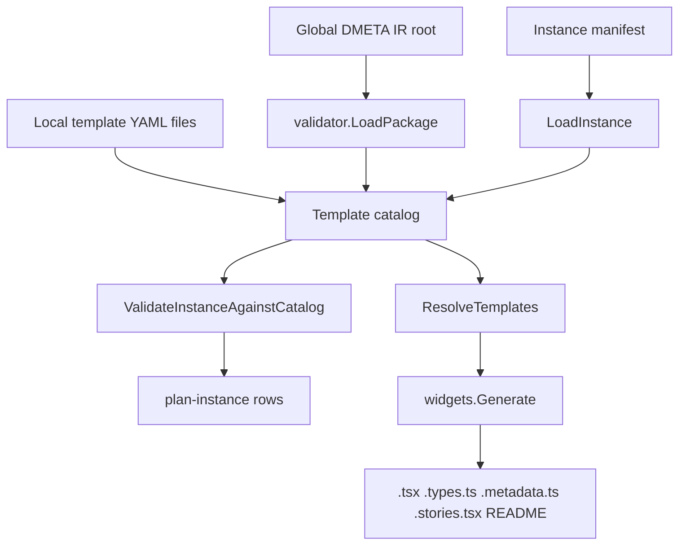

# Reflection First Widget Scaffold Implementation Guide

## Executive summary

DMETA now has an explicit semantic inheritance system for `Archetype` and `Capability`. The natural next question is how widget templates should use that semantic information. This guide proposes a deliberately conservative answer: **widget generation should be reflection-first**.

Reflection-first means that widget templates should use inherited archetype/capability information primarily to explain applicability, generate metadata, emit implementation notes, seed Storybook documentation, and create optional adapter TODOs. The generator may suggest projection-derived code, but it should not force every widget that mentions a capability into one rigid prop shape or layout.

The target outcome is a better scaffold, not a brittle UI compiler. A generated widget should tell an implementor:

- why this widget was selected;
- which semantic archetypes/capabilities are relevant;
- which inherited descriptions, examples, actions, and projections may matter;
- which projection mappings are probably useful;
- which adapter functions still need human/domain decisions;
- which generated pieces are safe to edit/promote.

It should not pretend to know the final product UI. A `MenuItem`, `OrderItem`, kitchen ticket, cart row, menu card, and receipt line may all involve `ingredient_composable`, but each surface makes different design choices.

## Problem statement

The current widget scaffolder is intentionally simple. Instance manifests select widget templates, and `dmeta scaffold-instance` writes placeholder React files:

```tsx
export function StreetDeliCompositionCard(props: StreetDeliCompositionCardProps) {
  return (
    <section data-dmeta-widget="deli.composition_card">
      <pre>{JSON.stringify(props, null, 2)}</pre>
    </section>
  );
}
```

This proves that the template catalog, instance manifest, selected component name, metadata sidecar, and Storybook seed can be generated. But it does not yet use the new inheritance model except indirectly through existing `consumes` references.

A naive next step would be to generate rigid prop contracts directly from all consumed capabilities:

```text
widget consumes ingredient_composable
therefore generate one mandatory IngredientComposableProps shape
therefore force every composition widget to render the same fields
```

That is too rigid. Semantic inheritance is valuable, but widgets are design artifacts. A browsing card, detail customizer, cart row, kitchen station ticket, and order receipt may all draw from the same inherited capability graph while exposing different fields and interactions.

The implementation challenge is to use semantics strongly enough to help authors, reviewers, and LLMs, but softly enough to preserve widget-side design flexibility.

## Design thesis

> DMETA widget generation should produce semantically informed scaffolds, not semantically mandated components.

The inheritance model should inform:

- template applicability;
- generated metadata;
- generated doc comments;
- Storybook descriptions;
- scaffold review checklists;
- adapter TODOs;
- optional projection helper stubs;
- action/presentation reference hints.

The inheritance model should not automatically force:

- exact React prop surfaces;
- exact layout structure;
- exact visible fields;
- exact component composition;
- exact generated projection adapters for every widget;
- React class/component inheritance.

## Current system overview

### Core semantic inheritance already exists

The inheritance resolver lives in:

```text
pkg/dmeta/validator/inheritance.go
```

Important API:

```go
func ResolveCoreInheritance(core CoreModelFile) (*ResolvedCoreModel, []Finding)

func (r *ResolvedCoreModel) IsArchetypeA(child, ancestor string) bool
func (r *ResolvedCoreModel) IsCapabilityA(child, ancestor string) bool
```

The core generator already emits TypeScript helpers such as:

```ts
export function isArchetypeA(child: ArchetypeId, ancestor: ArchetypeId): boolean;
export function isCapabilityA(child: CapabilityId, ancestor: CapabilityId): boolean;
```

This gives the widget system a reliable way to ask semantic questions like:

```text
Does OrderItem satisfy WorkItem?
Does dietary_substitutable satisfy role_preserving_substitutable?
```

### Current widget YAML shape

Widget template structs currently live in:

```text
pkg/dmeta/validator/model.go
```

The relevant part is:

```go
type Widget struct {
    ID             string            `yaml:"id"`
    Name           string            `yaml:"name"`
    Status         string            `yaml:"status"`
    Classification map[string]any    `yaml:"classification"`
    Intent         WidgetIntent      `yaml:"intent"`
    Template       TemplateMetadata  `yaml:"template"`
    Consumes       Consumes          `yaml:"consumes"`
    Contract       WidgetContract    `yaml:"contract"`
    Stories        []string          `yaml:"stories"`
    Outputs        map[string]string `yaml:"outputs"`
}

type Consumes struct {
    Presentations []string `yaml:"presentations"`
    Capabilities  []string `yaml:"capabilities"`
    Archetypes    []string `yaml:"archetypes"`
}
```

Current YAML therefore says what a template consumes, but it cannot distinguish:

- hard requirements;
- recommended semantic context;
- optional projection hints;
- documentation-only hints;
- adapter TODOs;
- strict versus reflective generation policy.

### Current widget generation path

The main widget generator files are:

```text
pkg/dmeta/generator/widgets/model.go
pkg/dmeta/generator/widgets/load.go
pkg/dmeta/generator/widgets/render.go
pkg/dmeta/generator/widgets/write.go
```

The commands are:

```text
pkg/dmeta/cmds/plan_instance.go
pkg/dmeta/cmds/scaffold_instance.go
```

High-level flow:



The scaffold renderer currently generates:

- `<Name>.types.ts`
- `<Name>.tsx`
- `<Name>.metadata.ts`
- `<Name>.stories.tsx`
- `index.ts`
- generated widget package `README.md`

The metadata sidecar currently records template provenance, but not inherited semantic context.

## Key distinction: hard contracts vs soft semantic guidance

A capability projection can be a hard semantic contract. For example, if a domain type claims `stateful`, validation can require a mapping for `state`.

```yaml
stateful:
  projections:
    state:
      type: string
      required: true
```

A widget, however, may only need to know that `stateful` context exists. A compact card may use a badge; a dense row may use a cell; a kitchen ticket may use a station color; a receipt may omit it entirely.

So the widget schema needs more nuance than `consumes.capabilities` alone.

```text
Hard semantic contract:
  This domain type claims capability X, so required projection Y must be mapped.

Soft widget guidance:
  This widget is semantically about capability X, so generated docs and adapter TODOs should mention projection Y, but final UI decides whether/how to render it.
```

## Proposed YAML model

Add three optional sections to widget templates:

```yaml
semantic_context:
  archetypes: []
  capabilities: []
  presentations: []
  intent: ""
  inherited_context_note: ""

projection_hints:
  required: []
  recommended: []
  optional: []
  documentation_only: []
  adapter_todos: []

generation:
  scaffold_mode: reflective
  emit_semantic_metadata: true
  emit_doc_comments: true
  emit_adapter_todos: true
  strict_projection_adapter: false
```

These sections do not replace `consumes` and `contract` immediately. They refine author intent.

### `consumes`

Keep `consumes` as the compatibility and validation field for existing templates. It says which known presentations/archetypes/capabilities the template is related to.

```yaml
consumes:
  presentations:
    - composition_card
  archetypes:
    - ProductComposition
  capabilities:
    - ingredient_composable
    - dietary
```

Existing validators can keep checking these references.

### `semantic_context`

`semantic_context` is reflective. It says what the template is about and why inherited semantics may matter.

```yaml
semantic_context:
  archetypes:
    - ProductComposition
  capabilities:
    - ingredient_composable
    - dietary
    - measurable
  intent: >
    This card is for browsing and selecting a sellable product composition. It may use
    ingredient roles, dietary tags, price, and availability, but the concrete variant
    decides which fields are visible.
  inherited_context_note: >
    MenuItem satisfies this context through MenuItem -> ProductComposition and through
    inherited product/dietary/measurable capabilities.
```

A generator should preserve this in metadata and comments.

### `projection_hints`

`projection_hints` tells the generator which projections are worth mentioning or scaffolding.

```yaml
projection_hints:
  recommended:
    - labelable.label
    - measurable.value
    - ingredient_composable.parts
    - dietary.dietary_tags
  optional:
    - available.availability_state
    - ingredient_composable.required_roles
  documentation_only:
    - ingredient_composable.role_profile
  adapter_todos:
    - Map raw ingredient rows to ingredient_composable.parts only when this variant renders full composition detail.
    - Decide whether dietary tags are shown inline or summarized.
```

The categories mean:

| Category | Meaning | Suggested validation |
| --- | --- | --- |
| `required` | Widget cannot function without this projection. | Error if unknown or unmapped in strict mode. |
| `recommended` | Usually useful to expose in this widget family. | Warning if unknown. Generate comments/TODOs. |
| `optional` | Useful in some variants or densities. | Warning or info if unknown. Generate comments. |
| `documentation_only` | Context for humans/LLMs, not a code obligation. | Info or no validation. |
| `adapter_todos` | Human-readable implementation checklist. | No semantic validation. |

### `generation`

`generation` controls how much code the scaffolder emits.

```yaml
generation:
  scaffold_mode: reflective # reflective | adapter_todos | strict
  emit_semantic_metadata: true
  emit_doc_comments: true
  emit_adapter_todos: true
  strict_projection_adapter: false
```

Modes:

| Mode | Behavior |
| --- | --- |
| `reflective` | Emit metadata, comments, Storybook docs, and README context. Do not emit projection adapter code. |
| `adapter_todos` | Also emit `.adapter.todo.ts` files with TODO mapping functions and projection hints. |
| `strict` | Emit typed projection adapter stubs and fail validation on unresolved required hints. Use only when explicitly requested. |

The default should be `reflective`.

## Example: Street Deli composition card

A good Street Deli template would look like this:

```yaml
- id: deli.composition_card
  name: StreetDeliCompositionCard
  status: template
  intent:
    purpose: Render a mobile menu item card for a sellable ingredient composition.
    adapter_boundary: Receives normalized menu-item view model and emits typed presentation/action requests.
  consumes:
    archetypes:
      - ProductComposition
    capabilities:
      - ingredient_composable
      - dietary
      - measurable
  semantic_context:
    archetypes:
      - ProductComposition
    capabilities:
      - ingredient_composable
      - dietary
      - measurable
      - available
    intent: >
      The card presents a sellable product composition. It should be able to explain why
      a MenuItem can be rendered here without forcing every variant to display the full
      ingredient role graph.
    inherited_context_note: >
      MenuItem extends ProductSpec and ProductComposition, so it satisfies the card's
      product/composition context. OrderItem may also satisfy ProductComposition, but it
      usually belongs in cart/order widgets rather than menu browsing.
  projection_hints:
    recommended:
      - labelable.label
      - measurable.value
      - ingredient_composable.parts
      - dietary.dietary_tags
    optional:
      - available.availability_state
      - ingredient_composable.required_roles
    documentation_only:
      - ingredient_composable.role_profile
    adapter_todos:
      - Decide whether this variant shows full ingredient list or short ingredient summary.
      - Keep dietary/allergen information visible when safety-relevant.
  generation:
    scaffold_mode: adapter_todos
    emit_semantic_metadata: true
    emit_doc_comments: true
    emit_adapter_todos: true
    strict_projection_adapter: false
```

## Generated output design

### Metadata sidecar

Generate richer metadata, but keep it safe to inspect without executing app code.

```ts
export const StreetDeliCompositionCardMetadata = {
  generatedBy: "dmeta scaffold-instance",
  instanceId: "street_deli_ordering",
  templateId: "deli.composition_card",
  selectedAs: "StreetDeliCompositionCard",
  variant: "mobile_default",
  reason: "Sandwiches and bowls need compact composition summaries with dietary and price data.",
  semanticContext: {
    archetypes: ["ProductComposition"],
    capabilities: ["ingredient_composable", "dietary", "measurable", "available"],
    intent: "The card presents a sellable product composition...",
    inheritedContextNote: "MenuItem extends ProductSpec and ProductComposition..."
  },
  projectionHints: {
    recommended: ["labelable.label", "measurable.value", "ingredient_composable.parts", "dietary.dietary_tags"],
    optional: ["available.availability_state", "ingredient_composable.required_roles"],
    documentationOnly: ["ingredient_composable.role_profile"],
    adapterTodos: ["Decide whether this variant shows full ingredient list or short ingredient summary."]
  },
  generation: {
    scaffoldMode: "adapter_todos",
    strictProjectionAdapter: false
  }
} as const;
```

### Component doc comments

Generated components should explain semantic context directly in the file a human will edit.

```tsx
/**
 * StreetDeliCompositionCard
 *
 * Reflection-first scaffold generated from `deli.composition_card`.
 *
 * Semantic context:
 * - Archetype: ProductComposition
 * - Capability: ingredient_composable
 * - Capability: dietary
 * - Capability: measurable
 *
 * Implementation guidance:
 * - A MenuItem satisfies this because MenuItem extends ProductSpec + ProductComposition.
 * - Use ingredient roles when they help explain substitutions or composition integrity.
 * - Dietary/allergen data may be safety-critical and should not be hidden casually.
 * - This scaffold does not require a rigid projection adapter unless promoted into strict mode.
 */
export function StreetDeliCompositionCard(props: StreetDeliCompositionCardProps) {
  return (...);
}
```

### Adapter TODO file

For `adapter_todos` mode, generate a file that is intentionally a TODO scaffold.

```ts
// Code generated by dmeta scaffold-instance. Promote and edit intentionally.

import type { StreetDeliCompositionCardProps } from "./StreetDeliCompositionCard.types";

/**
 * TODO adapter for semantic context:
 * - ProductComposition
 * - ingredient_composable
 * - dietary
 * - measurable
 *
 * Recommended projection hints:
 * - labelable.label
 * - measurable.value
 * - ingredient_composable.parts
 * - dietary.dietary_tags
 */
export function mapDomainToStreetDeliCompositionCardProps(input: unknown): StreetDeliCompositionCardProps {
  return {
    // TODO: map labelable.label
    // TODO: map measurable.value if this variant displays price
    // TODO: map ingredient_composable.parts as list or compact summary
    // TODO: map dietary.dietary_tags if visible on this surface
    subject: input,
  };
}
```

This is useful without pretending the generator knows the final domain view model.

### Storybook docs

Generated stories can include semantic notes in `parameters.docs.description.component`.

```ts
export default {
  title: "Hudson Street Deli/StreetDeliCompositionCard",
  component: StreetDeliCompositionCard,
  parameters: {
    docs: {
      description: {
        component: "Selected for ProductComposition + ingredient_composable. Projection hints are guidance, not mandatory layout."
      }
    }
  }
};
```

## Validation design

Validation should support the reflection-first philosophy. It should catch real mistakes without turning guidance into rigid rules.

### Reference validation

These should be errors:

- unknown `semantic_context.archetypes` id;
- unknown `semantic_context.capabilities` id;
- unknown `semantic_context.presentations` id;
- invalid `generation.scaffold_mode` value.

These can be warnings:

- `projection_hints.recommended` references unknown capability/projection;
- `projection_hints.optional` references unknown capability/projection;
- template uses `strict_projection_adapter: true` but has no `projection_hints.required`.

These can be info or no validation:

- `projection_hints.documentation_only` entries;
- `projection_hints.adapter_todos` entries.

### Projection hint parsing

Use a simple format first:

```text
<capability_id>.<projection_name>
```

Pseudocode:

```go
func resolveProjectionHint(hint string, core CoreModelFile, resolved *ResolvedCoreModel) (ProjectionRef, bool) {
    capabilityID, projectionName, ok := strings.Cut(hint, ".")
    if !ok {
        return ProjectionRef{}, false
    }
    cap, ok := resolved.Capabilities[capabilityID]
    if !ok {
        return ProjectionRef{}, false
    }
    projection, ok := cap.EffectiveProjections[projectionName]
    if !ok {
        return ProjectionRef{}, false
    }
    return ProjectionRef{Capability: capabilityID, Name: projectionName, Projection: projection}, true
}
```

Important: check effective projections, not only local projections. If `dietary_substitutable` inherits `dietary.dietary_tags`, a hint should be allowed to refer to the parent capability or the concrete descendant depending on author intent.

### Strict mode validation

Strict mode is opt-in. Only then should unresolved required hints block generation.

```go
if widget.Generation.StrictProjectionAdapter {
    for _, hint := range widget.ProjectionHints.Required {
        if _, ok := resolveProjectionHint(hint, core, resolved); !ok {
            findings = append(findings, Error(...))
        }
    }
}
```

## Go model changes

Add the following structs in or near `pkg/dmeta/validator/model.go`:

```go
type Widget struct {
    ID               string                   `yaml:"id"`
    Name             string                   `yaml:"name"`
    Status           string                   `yaml:"status"`
    Classification   map[string]any           `yaml:"classification"`
    Intent           WidgetIntent             `yaml:"intent"`
    Template         TemplateMetadata         `yaml:"template"`
    Consumes         Consumes                 `yaml:"consumes"`
    SemanticContext  WidgetSemanticContext    `yaml:"semantic_context"`
    ProjectionHints  WidgetProjectionHints    `yaml:"projection_hints"`
    Generation       WidgetGenerationPolicy   `yaml:"generation"`
    Contract         WidgetContract           `yaml:"contract"`
    Stories          []string                 `yaml:"stories"`
    Outputs          map[string]string        `yaml:"outputs"`
}

type WidgetSemanticContext struct {
    Presentations         []string `yaml:"presentations"`
    Capabilities          []string `yaml:"capabilities"`
    Archetypes            []string `yaml:"archetypes"`
    Intent                string   `yaml:"intent"`
    InheritedContextNote  string   `yaml:"inherited_context_note"`
}

type WidgetProjectionHints struct {
    Required          []string `yaml:"required"`
    Recommended       []string `yaml:"recommended"`
    Optional          []string `yaml:"optional"`
    DocumentationOnly []string `yaml:"documentation_only"`
    AdapterTODOs      []string `yaml:"adapter_todos"`
}

type WidgetGenerationPolicy struct {
    ScaffoldMode            string `yaml:"scaffold_mode"`
    EmitSemanticMetadata    *bool  `yaml:"emit_semantic_metadata"`
    EmitDocComments         *bool  `yaml:"emit_doc_comments"`
    EmitAdapterTODOs        *bool  `yaml:"emit_adapter_todos"`
    StrictProjectionAdapter *bool  `yaml:"strict_projection_adapter"`
}
```

Use pointer booleans if you need to distinguish unspecified from explicit false. Otherwise plain booleans are fine and defaults can be applied in generator code.

## Generator changes

### New resolved scaffold context

Add a richer resolved structure near `pkg/dmeta/generator/widgets/model.go`:

```go
type ResolvedTemplate struct {
    Selected Selected
    Template validator.Widget
    Reflection WidgetReflection
}

type WidgetReflection struct {
    SemanticContext validator.WidgetSemanticContext
    ProjectionHints validator.WidgetProjectionHints
    Generation      validator.WidgetGenerationPolicy
    ArchetypeDocs   []ResolvedArchetypeDoc
    CapabilityDocs  []ResolvedCapabilityDoc
    ProjectionDocs  []ResolvedProjectionHint
}
```

At first, `Reflection` can simply copy YAML fields. Later it can include resolved descriptions/ancestors from `ResolvedCoreModel`.

### Load resolved core model for reflection

`LoadTemplateCatalog` already calls `validator.LoadPackage(ctx, globalRoot)`. That package includes the core model. The widget generator can call:

```go
resolvedCore, findings := validator.ResolveCoreInheritance(pkg.CoreModel)
```

Then use `resolvedCore` to enrich widget metadata.

A minimal first version does not need to fail on inheritance findings because `LoadPackage` + validation handles that elsewhere. But if errors exist, return them clearly.

### Render metadata

Extend `renderMetadata` to include:

- `semanticContext`;
- `projectionHints`;
- `generationPolicy`;
- optionally `resolvedArchetypes` with ancestors/descriptions;
- optionally `resolvedCapabilities` with ancestors/descriptions/effective projection names.

### Render comments

`renderComponent` should conditionally add doc comments when `emit_doc_comments` is true or defaulted.

Pseudocode:

```go
func renderComponent(name string, rt ResolvedTemplate) string {
    doc := ""
    if emitDocComments(rt) {
        doc = renderSemanticDocComment(name, rt)
    }
    return header + imports + doc + component
}
```

### Render adapter TODO file

If `emit_adapter_todos` is true or `scaffold_mode` is `adapter_todos`, append:

```text
<Name>.adapter.todo.ts
```

Also export it from the barrel only if desired. One option is not to export TODO files from `index.ts` to avoid accidental production import.

## CLI output changes

### `plan-instance`

Add optional rows or columns that summarize reflection status:

```text
kind       template                 semantic_context                 projection_hints       generation
selected   deli.composition_card     ProductComposition + dietary     4 recommended          adapter_todos
finding    deli.composition_card     warning                          recommended hint unknown: foo.bar
```

Keep the table compact. Detailed semantic docs belong in generated metadata and README.

### `scaffold-instance`

Continue writing files. New file types may appear:

```text
StreetDeliCompositionCard.adapter.todo.ts
```

The command should report them like other generated files.

## YAML files to update

### Global docs and playbooks

Update these durable docs first:

```text
README.md
playbooks/01-collaborative-schema-design-sessions-for-presentation-based-ui.md
playbooks/02-dmeta-design-system-factory-runthrough-playbook.md
design-docs/05-dmeta-core-model-and-widget-ir-spec.md
design-docs/07-generated-instance-widget-review-guide.md
```

### Global widget-template YAML

Start with:

```text
sources/dmeta-ir/widget-templates/00-index.yaml
sources/dmeta-ir/widget-templates/presentations.yaml
sources/dmeta-ir/widget-templates/data-display.yaml
sources/dmeta-ir/widget-templates/filters.yaml
sources/dmeta-ir/widget-templates/tables.yaml
sources/dmeta-ir/widget-templates/surfaces.yaml
```

Do not update every template deeply in the first implementation. Add a few high-quality examples and a package-level authoring policy.

### Street Deli widget-template YAML

Use Street Deli as the concrete pressure test:

```text
examples/street-deli-ordering/widget-templates/00-index.yaml
examples/street-deli-ordering/widget-templates/item-cards.yaml
examples/street-deli-ordering/widget-templates/customization.yaml
examples/street-deli-ordering/widget-templates/substitutions.yaml
examples/street-deli-ordering/widget-templates/ordering.yaml
examples/street-deli-ordering/widget-templates/menu-browsing.yaml
examples/street-deli-ordering/widget-templates/tracking.yaml
```

The key examples should be:

- `deli.composition_card` — product/composition/dietary/measurable context;
- `deli.composition_customizer` — full ingredient composition and substitution context;
- `deli.substitution_chip` — role-preserving substitution context;
- `deli.order_cart` — order-item/work-item/product-composition context;
- `deli.order_tracker` — order/work-item/timeline/stateful context.

## Implementation plan

### Phase 1: Documentation-only schema guidance

Goal: teach the new model without breaking tooling.

Actions:

- Update durable docs and playbooks.
- Add `authoring_guidance` and prose examples to widget-template index YAMLs.
- Add optional fields to a small number of global and Street Deli templates if the current YAML decoder safely ignores unknown fields or after structs are updated.

Validation:

```bash
go run ./cmd/dmeta validate-ir --root ./sources/dmeta-ir --include-info --output table
go run ./cmd/dmeta validate-ir --root ./examples/street-deli-ordering --include-info --output table
```

### Phase 2: Add schema structs and validation

Goal: make fields first-class.

Actions:

- Add `WidgetSemanticContext`, `WidgetProjectionHints`, and `WidgetGenerationPolicy` structs.
- Add them to `Widget`.
- Validate semantic context references.
- Validate projection hint syntax with severity based on category and strict mode.
- Add tests for valid and invalid widget reflection fields.

Validation:

```bash
go test ./pkg/dmeta/validator -count=1
```

### Phase 3: Reflective metadata and comments

Goal: improve generated scaffold usefulness without changing prop rigidity.

Actions:

- Extend `ResolvedTemplate` or add a separate `WidgetReflection` object.
- Populate reflection from YAML.
- Render semantic context/projection hints into `.metadata.ts`.
- Render doc comments in `.tsx`.
- Render README sections explaining selected templates' semantic context.

Validation:

```bash
go test ./pkg/dmeta/generator/widgets -count=1
go run ./cmd/dmeta scaffold-instance --instance ./examples/street-deli-ordering/instantiations/street-deli-ordering.yaml --dry-run --output table
```

### Phase 4: Adapter TODO generation

Goal: generate useful but non-rigid implementation aids.

Actions:

- Add `<Name>.adapter.todo.ts` output when `emit_adapter_todos` or `scaffold_mode: adapter_todos` is active.
- Include recommended/optional projection hints as TODO comments.
- Include semantic context and inherited descriptions when available.
- Decide whether TODO files are exported from barrels. Default recommendation: do not export from runtime barrels.

Validation:

```bash
go run ./cmd/dmeta scaffold-instance --instance ./examples/street-deli-ordering/instantiations/street-deli-ordering.yaml --force --output table
```

### Phase 5: Optional strict projection adapters

Goal: support strict generation only where explicitly requested.

Actions:

- Implement `strict` scaffold mode.
- Require `projection_hints.required` to resolve.
- Generate typed adapter stubs using effective projection types.
- Keep this opt-in.

Validation:

- Add fixtures for strict and reflective templates.
- Ensure reflective templates never fail because a recommended hint is not mapped.

## Testing strategy

### Validator tests

Add tests for:

- valid `semantic_context` references;
- unknown archetype/capability in `semantic_context` as error;
- valid projection hint against effective inherited projection;
- malformed `capability.projection` hint;
- unknown recommended hint as warning;
- unknown required hint in strict mode as error;
- documentation-only hints not blocking validation.

### Generator tests

Add tests for:

- metadata includes semantic context;
- component doc comment includes semantic context;
- adapter TODO file is generated in `adapter_todos` mode;
- reflective mode does not generate strict adapter code;
- generated README includes semantic scaffold notes.

### End-to-end tests

Use Street Deli as a smoke test:

```bash
go test ./... -count=1
go run ./cmd/dmeta validate-ir --root ./sources/dmeta-ir --include-info --output table
go run ./cmd/dmeta validate-ir --root ./examples/street-deli-ordering --include-info --output table
go run ./cmd/dmeta plan-instance --instance ./examples/street-deli-ordering/instantiations/street-deli-ordering.yaml --output table
go run ./cmd/dmeta scaffold-instance --instance ./examples/street-deli-ordering/instantiations/street-deli-ordering.yaml --dry-run --output table
```

## Design decisions

### Decision 1: Reflection first, strict generation opt-in

Reason: widget design needs flexibility. The same capability can support many visual surfaces.

### Decision 2: Keep `consumes` for compatibility

Reason: existing widget templates already use it, and it remains a useful compact reference field. New fields refine intent rather than replacing it immediately.

### Decision 3: Projection hints are categorized

Reason: not every projection hint is equally binding. A recommended field should not become a validation error in a low-density widget.

### Decision 4: Adapter TODOs are generated artifacts, not runtime code

Reason: mapping raw domain data to semantic props is domain-specific. TODO files are useful implementation scaffolds without pretending to solve the mapping automatically.

### Decision 5: Human annotations are first-class

Reason: `description`, `long_description`, examples, selection questions, and adapter notes are useful to humans and LLMs. They should be preserved in generated docs/metadata, not discarded as non-code.

## Alternatives considered

### Rigid projection-driven props for every widget

Rejected as too brittle. It would turn semantic inheritance into a one-size-fits-all UI compiler and overconstrain widget design.

### Ignore inheritance in widgets

Rejected as wasteful. The semantic model contains valuable context that can improve scaffolds, docs, metadata, Storybook, adapter TODOs, and action routing.

### Full widget-template inheritance

Deferred. Widget-template inheritance is a separate feature involving layout slots, variants, CSS parts, override policy, and promotion workflows. It should not be mixed into this reflection-first scaffold milestone.

### Generate production-ready widgets from semantics alone

Rejected. Semantics can guide implementation, but real product widgets require design choices, accessibility behavior, density decisions, and domain-specific interaction patterns.

## Review checklist for implementors

Before implementation:

- Read this guide.
- Read `design-docs/07-generated-instance-widget-review-guide.md`.
- Inspect current generated Street Deli widgets.
- Inspect current static Street Deli prototype to understand what promoted UI looks like.

During implementation:

- Keep validation severity aligned with field intent.
- Do not make recommended/optional hints hard failures.
- Keep generated adapter files clearly marked as TODO/promotion scaffolds.
- Do not overwrite promoted widgets blindly.

After implementation:

- Run validator and generator tests.
- Regenerate Street Deli scaffolds in a branch and inspect diffs.
- Confirm generated metadata helps a human reviewer understand semantic context.
- Confirm strict mode is opt-in.

## Open questions

- Should `semantic_context` default to `consumes` when omitted, or should it only appear when authors explicitly write it?
- Should adapter TODO files be exported from component barrels or kept local to avoid accidental production imports?
- Should generated Storybook docs include full inherited descriptions or a compact summary only?
- Should projection hints support aliases such as `labelable.label as title`, or should aliasing remain an adaptation point?
- Should `plan-instance` load the core model and report inheritance-aware matches, or should that wait until scaffold generation?

## Recommended first implementation slice

The smallest useful implementation is:

1. Add YAML structs for `semantic_context`, `projection_hints`, and `generation`.
2. Add validation for semantic context references and `generation.scaffold_mode`.
3. Render these fields into `.metadata.ts`.
4. Render a doc comment in `.tsx`.
5. Add one or two Street Deli templates using the new fields.
6. Validate and scaffold Street Deli.

Do **not** implement strict projection adapters in the first slice. Prove that reflection metadata and comments improve the scaffold first.
