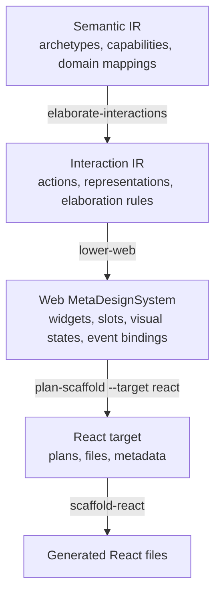
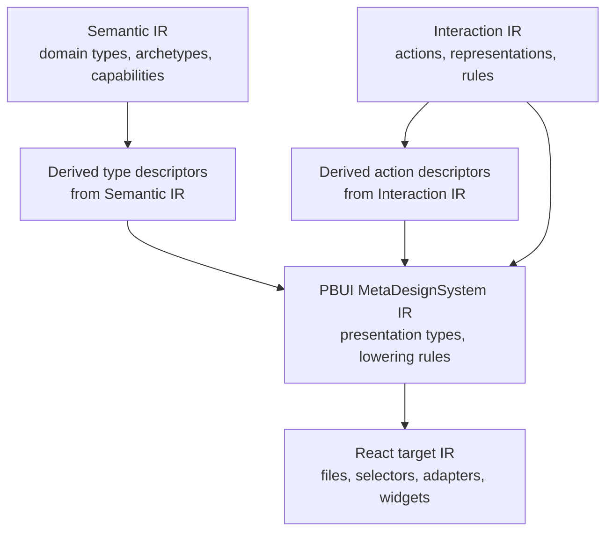

# CLIM Presentation MetaDesignSystem architecture and first-pass implementation guide

## Executive summary

DMETA now has a compiler-shaped architecture for the Web path:

```text
Semantic IR -> Interaction IR -> Web MetaDesignSystem -> React target
```

The next architectural step is to design a second MetaDesignSystem that is closer to CLIM and to the presentation-based user-interface thesis imported into this ticket. The most important lesson from that thesis is that a user interface is not just a set of widgets. It is a system of typed objects and translators. Domain objects are typed objects. Presentations are typed objects. Commands are typed objects. The state and controls of the interface itself may also become presentable objects.

That lesson fits DMETA well, but the full thesis model is too large for a first implementation pass. The most practical first pass is smaller. We should keep semantic object facts in the existing Semantic IR, keep interaction obligations in the existing Interaction IR, and introduce a new CLIM/PBUI MetaDesignSystem that authors only the genuinely new presentation-system concepts. In this first pass, the new authored layer should primarily define **presentation types** and **lowering rules**. Type descriptors can be derived from Semantic IR. Action descriptors can be derived from Interaction IR. React should remain a target below this MetaDesignSystem.

The recommended first pass is therefore:

```text
Semantic IR
  -> derived type descriptors
Interaction IR
  -> derived action descriptors
PBUI / CLIM MetaDesignSystem
  -> authored presentation types
  -> authored lowering rules
React target
  -> registries, slices, selectors, event adapters, widgets, metadata sidecars
```

This guide explains the conceptual model, the relationship to the original thesis, the relationship to the Readwise Viewer CLIM frontend, the minimum IR we should author, the runtime shape the React target should compile to, and the concrete implementation sequence an intern can follow.

## Why this guide exists

The current DMETA refactor established a clean split between semantic meaning and Web/React realization, but the project still lacks a second MetaDesignSystem that is not organized around browser widgets. The imported thesis, *Presentation Based User Interfaces*, gives a deeper architecture than the Web path alone. It explains how to think about presentations, commands, presenters, recognizers, command planning, and interfaces to the state of the interaction machinery itself.

At the same time, the thesis is broader than what should be implemented immediately. It is a model of user interfaces in general and of a prototype system base. A direct implementation of every concept in the thesis would overload the first DMETA pass with too many new object families. The purpose of this guide is to extract the part of the thesis that should become DMETA architecture now, separate it from what should remain future work, and explain the resulting design in a way that is precise enough for implementation.

This guide uses three kinds of evidence:

- the imported thesis at `/home/manuel/code/wesen/go-go-golems/dmeta/ttmp/2026/05/24/DMETA-CLIM-MDS--design-clim-presentation-metadesignsystem-and-react-target-lowering/sources/local/01-aitr-794.md`;
- the current DMETA compiler pipeline under `/home/manuel/code/wesen/go-go-golems/dmeta/pkg/dmeta/` and `/home/manuel/code/wesen/go-go-golems/dmeta/sources/dmeta-ir/`;
- the CLIM-style Readwise Viewer frontend under `/home/manuel/code/wesen/2026-05-21--readwise-viewer/pkg/web/clim/`.

The result is not a final formal specification. It is a detailed analysis and implementation guide for the first pass.

## Current DMETA compiler baseline

Before discussing the CLIM/PBUI MetaDesignSystem, it is important to understand what DMETA already has. The current compiler path already enforces one major design rule:

```text
Universal DMETA layers stop before target-specific widgets or components.
```

The current implementation files are:

```text
pkg/dmeta/validator/
pkg/dmeta/interaction/
pkg/dmeta/metadesign/web/
pkg/dmeta/generator/react/
pkg/dmeta/instance/
```

The corresponding source packages are:

```text
sources/dmeta-ir/core-model/
sources/dmeta-ir/interactions/
sources/dmeta-ir/meta-design-systems/web/
```

The active command surface is:

```bash
dmeta validate-ir
dmeta validate-interactions
dmeta elaborate-interactions
dmeta lower-web
dmeta plan-instance
dmeta plan-scaffold --target react
dmeta scaffold-react
```

The compiler layering is shown below.



This matters for the CLIM/PBUI design because the same discipline should continue. The new MetaDesignSystem should not move semantic archetypes or interaction actions into the target layer. It should define the presentation-system-specific concepts that sit between interaction obligations and a concrete target.

## The thesis model in the vocabulary we should keep

The imported thesis is broad, but the core architectural contribution is compact. A presentation system consists of:

- an **application database**,
- a **presentation database**,
- a **presentation editor**,
- a **presenter**, and
- a **recognizer**.

These are not surface-level terms. They describe distinct responsibilities.

### Application database

The application database is the domain side. It is the state that the user interface exists to inspect or change. The thesis treats many kinds of applications as databases from the user interface point of view, including active computational systems and external processes.

In DMETA terms, this maps naturally to the semantic domain objects that the current Semantic IR already describes. In a React target, this often maps to Redux slices, RTK Query caches, or other authoritative domain state stores.

### Presentation database

The presentation database is not a bitmap or a DOM tree. It is a symbolic description of visible presentations and their structure. Presentations can be text, graphics, composite structures, properties of presentations, and relations between presentations.

In DMETA terms, this is the crucial gap between Interaction IR and concrete browser widgets. The thesis argues that the user-facing visible structure should be an explicit object space. That strongly supports a CLIM/PBUI MetaDesignSystem layer.

### Presenter

The thesis decomposes the presenter into three parts:

- **domain collector**: collects relevant domain facts,
- **semantic presenter**: maps domain information to presentation forms,
- **organizational presenter**: lays those forms out and imposes visual structure.

This decomposition is important. It means that a presenter is not merely a renderer. It is a mapping from domain state to presentation state with at least three internal responsibilities.

### Recognizer

The recognizer maps user editing or interaction with presentations back into domain commands. The thesis also decomposes the recognizer into parts that correspond broadly to organizational recognition, semantic interpretation, and domain change.

This matters because it means an action is not just a callback. There is an explicit layer that interprets interaction with a presentation into command objects or command applications.

### Commands as objects

The thesis describes a **database of commands** and command applications. Commands carry:

- name,
- documentation,
- parameter descriptions,
- parameter types,
- execution state,
- grouping into command sets.

This is directly relevant for DMETA. It supports the requirement that actions should be objects that can be introspected, documented, selected, presented, and manipulated.

### Type descriptions as objects

The thesis uses a uniform network for classes and instances. The class structure is used for application data and presentation data. This means type descriptions are first-class entities with inheritance, properties, and attached behavior. That strongly supports making object type descriptors first-class in a CLIM/PBUI system.

### Interfaces to presenter and recognizer state

One of the most important and most easily overlooked parts of the thesis is that the state and controls of the interface machinery itself may be presented. The thesis explicitly discusses adding interfaces to the presenter and recognizer state rather than controlling them only with primitive signals.

This should influence DMETA. It suggests that a mature CLIM/PBUI MetaDesignSystem should eventually include presentable objects for:

- presenter controls,
- recognizer controls,
- command planning,
- execution monitoring.

However, not all of those need to be in the first pass.

## What the thesis should mean for DMETA, in our words

A concise reformulation in DMETA vocabulary is:

> The CLIM/PBUI MetaDesignSystem should treat **types**, **actions**, and **presentations** as first-class typed objects. Presenters should map domain state into presentation structures. Recognizers should map user interaction with presentation structures back into action applications. React should be a target that compiles this model into selectors, adapters, and widgets, not the place where the model is defined.

That formulation keeps the strong part of the thesis while staying compatible with the current DMETA compiler architecture.

## What the Readwise Viewer CLIM frontend proves

The Readwise Viewer repository is useful because it shows what a smaller first pass already looks like in code. The important files are:

```text
/home/manuel/code/wesen/2026-05-21--readwise-viewer/pkg/web/clim/types.ts
/home/manuel/code/wesen/2026-05-21--readwise-viewer/pkg/web/clim/store.ts
/home/manuel/code/wesen/2026-05-21--readwise-viewer/pkg/web/clim/commands.ts
/home/manuel/code/wesen/2026-05-21--readwise-viewer/pkg/web/clim/actions.ts
/home/manuel/code/wesen/2026-05-21--readwise-viewer/pkg/web/clim/render.ts
/home/manuel/code/wesen/2026-05-21--readwise-viewer/pkg/web/clim/app.ts
/home/manuel/code/wesen/2026-05-21--readwise-viewer/pkg/readwiseviewer/api.go
```

The repo has three especially valuable patterns.

### Pattern 1: `PresentationRef` as the common object shape

The frontend uses a common wrapper for meaningful visible objects:

```ts
export interface PresentationRef {
  semanticId: string
  domainType: string
  presentationType: string
  label: string
  capabilities: string[]
  copyValue?: string
}
```

This is a strong first-pass design. A selected object, a rendered object, a compatible target for an action, and an inspectable runtime object all share one common shape.

### Pattern 2: actions as presentation objects

The frontend extends the presentation shape for actions:

```ts
export interface ActionPresentation extends PresentationRef {
  domainType: 'ClimAction'
  presentationType: 'Action'
  actionId: string
  intents: ActionIntent[]
  accepts: string[]
  requiresConfirmation: boolean
  enabled: boolean
  disabledReason?: string
}
```

This is exactly the kind of simplification DMETA should use in the first pass. It proves that actions can become first-class presentable and selectable objects without implementing an enormous command framework first.

### Pattern 3: a small explicit interaction state machine

The Readwise Viewer uses a small discriminated union for interaction state:

```ts
type InteractionState =
  | { kind: 'normal' }
  | { kind: 'select'; action: ClimAction }
  | { kind: 'confirm'; action: ClimAction; ref: PresentationRef }
```

This is not the full thesis model, but it is a good practical first step. It is strong enough to support selection, argument collection, and confirmation without inventing a large runtime architecture prematurely.

### What the Readwise Viewer does not yet prove

The repo is not yet a proper React target. It uses Redux and a manual string-based renderer, not React components and `useSelector` hooks. It also does not make object type descriptors first-class objects. Types are mostly strings such as `domainType` and `presentationType`.

Those limits are useful for us. They show what to keep and what to replace.

## The main simplification for the first pass

The most important simplification is:

```text
Do not author new object-type and action taxonomies from scratch in the PBUI layer.
```

DMETA already has:

- **Semantic IR** for domain types, archetypes, capabilities, and inheritance;
- **Interaction IR** for action descriptors, representation descriptors, and elaboration rules.

We should reuse those.

### What should be derived

For the first pass:

- **type descriptors** should be derived from Semantic IR;
- **action descriptors** should be derived from Interaction IR.

That means the new PBUI/CLIM MetaDesignSystem does not need to start by authoring separate `object-types.yaml` and `actions.yaml` files.

### What should be authored

The genuinely new first-pass authored layer is:

- **presentation types**;
- **lowering rules** from Interaction IR obligations into PBUI presentation types;
- **React target configuration** for PBUI.

This keeps the new surface area small enough to implement and reason about.

## Proposed first-pass PBUI/CLIM architecture

The recommended first-pass pipeline is:



The practical reading of this diagram is:

- Semantic IR continues to own semantic object structure.
- Interaction IR continues to own action and representation obligations.
- PBUI MetaDesignSystem IR introduces presentation-system concepts.
- React compiles those concepts into a concrete runtime and file set.

## Proposed first-pass source package layout

I recommend the following minimal authored package:

```text
sources/dmeta-ir/meta-design-systems/pbui/
  meta-design-system.yaml
  presentation-types.yaml
  lowering-rules.yaml
  targets/
    react.yaml
```

That is deliberately small. It is enough to prove the architecture without requiring six new catalog families immediately.

## Proposed PBUI MetaDesignSystem IR shape

### 1. `meta-design-system.yaml`

This file should identify the package and point to the other files.

Pseudocode shape:

```yaml
schema_version: 0
artifact_type: dmeta_meta_design_system
id: pbui
name: Presentation Based UI MetaDesignSystem
summary: CLIM/presentation-system MetaDesignSystem for DMETA.
files:
  presentation_types: ./presentation-types.yaml
  lowering_rules: ./lowering-rules.yaml
  react_target: ./targets/react.yaml
validation:
  require_unique_presentation_type_ids: true
  require_known_representations: true
  require_known_actions: true
```

### 2. `presentation-types.yaml`

This is the most important authored file. A presentation type should define:

- what it presents,
- which Interaction IR representations/actions it realizes,
- what structural roles it contains,
- how it projects state,
- what interactions it supports.

Proposed shape:

```yaml
presentation_types:
  document_icon:
    presents:
      object_types: [ReaderDocument]
    realizes:
      representations: [compact_reference]
      actions: [inspect_subject, open_reference]
    structure:
      roles:
        - icon_shape
        - label
        - status
    project:
      props:
        label:
          from: object.label
        status:
          from: object.location
        selected:
          from: session.selection.current_object_id == object.id
    interactions:
      on_select:
        action: select_object
        argument_from: object.id
      on_open:
        action: inspect_subject
        argument_from: object.id
```

This file intentionally merges some thesis concepts into a compact first-pass structure. It does not separate domain collector, semantic presenter, and organizational presenter into distinct authored catalogs yet. Instead, it captures enough information to compile presenter behavior into selectors and hooks.

### 3. `lowering-rules.yaml`

This file should map Interaction IR obligations into PBUI presentation choices.

Proposed shape:

```yaml
rules:
  - id: compact_reference_to_document_icon
    when:
      domain_types: [ReaderDocument]
      representations: [compact_reference]
      actions: [inspect_subject]
    emits:
      presentation_types: [document_icon]

  - id: inspectable_object_to_inspector_panel
    when:
      representations: [inspection_entrypoint]
      actions: [inspect_subject]
    emits:
      presentation_types: [object_inspector]

  - id: action_descriptor_to_action_chip
    when:
      action_types: [Action]
    emits:
      presentation_types: [action_chip]
```

The first two rules are immediately useful. The third is optional in the first pass but shows where action presentations fit conceptually.

### 4. `targets/react.yaml`

This target file should parallel the current Web/React target style, but for PBUI.

Proposed shape:

```yaml
schema_version: 0
artifact_type: dmeta_pbui_react_target
id: react
name: React target for PBUI MetaDesignSystem
defaults:
  output_dir: ./generated/react
  package_name: dmeta-pbui-react
  storybook: true
  metadata_sidecars: true
file_kinds:
  - registry
  - slice
  - selectors
  - presenter_hook
  - event_adapter
  - component
  - metadata
  - stories
  - barrel
provenance:
  meta_design_system: pbui
  codegen_target: react
  source_passes:
    - semantic-ir
    - interaction-elaboration
    - pbui-lowering
    - react-planning
```

## What should be first-class runtime objects in the React target

The React target should compile to several families of artifacts. Not all of them are Redux state.

### Static registries

These are generated modules, not slices.

They should include:

- object type registry;
- action descriptor registry;
- presentation type registry.

Proposed TypeScript shapes:

```ts
export interface ObjectTypeDescriptor {
  id: string
  domainType: string
  capabilities: string[]
  documentation?: string
}

export interface ActionDescriptor {
  id: string
  accepts: string[]
  intents: string[]
  requiresConfirmation: boolean
  documentation?: string
}

export interface PresentationTypeDescriptor {
  id: string
  presents: string[]
  realizes: {
    representations: string[]
    actions: string[]
  }
  roles: string[]
}
```

These registries satisfy the requirement that actions and object types are introspectable first-class entities at the target layer.

### Application databases

These are the thesis-style application databases mapped into React runtime state. In practical terms they will usually be:

- RTK Query cache, or
- normalized Redux slices.

Examples:

- documents;
- sources;
- tags;
- runs;
- clusters.

### Session / presentation-system state

This is where the interface-specific state should live. A first pass should keep this small.

Recommended initial slice shape:

```ts
type PbuiSessionState = {
  selection: {
    currentObjectId?: string
    currentObjectType?: string
  }
  interaction:
    | { kind: 'idle' }
    | { kind: 'objectSelected'; ref: PresentationRef }
    | { kind: 'choosingAction'; ref: PresentationRef }
    | { kind: 'choosingArgument'; action: ActionPresentation }
    | { kind: 'confirming'; action: ActionPresentation; target: PresentationRef }
  commandBuffer: string
  commandHistory: string[]
  commandHint: string
  actionResult: string
}
```

This is only one slice, but it gives a real place for selection, action choice, argument collection, confirmation, and command-line state.

### Derived presentation database

The presentation database should **not** usually be stored as raw Redux state in the first pass. It should be derived.

This is where your `useSelector` observation is exactly right.

For the first pass, presenters should compile to:

- selectors,
- memoized projection functions,
- `useSelector`-based hooks.

For example:

```ts
export const selectDocumentIconModel = createSelector(
  [selectDocumentById, selectSessionSelection],
  (doc, selection) => ({
    semanticId: doc.id,
    domainType: 'ReaderDocument',
    presentationType: 'DocumentIcon',
    label: doc.title,
    capabilities: ['contentful', 'readable'],
    selected: selection.currentObjectId === doc.id,
  })
)

export function useDocumentIconPresentation(id: string) {
  return useSelector((state: RootState) => selectDocumentIconModel(state, id))
}
```

This is the right first-pass interpretation of the presenter in React. The presenter remains architecturally explicit, but its runtime form is a selector/projection/hook rather than a standalone runtime object system.

## How presenters should be modeled in the first pass

The thesis gives a detailed decomposition of the presenter. For a first implementation pass, that full decomposition does not need to become separate authored catalogs.

Instead, we should encode presenter behavior inside presentation type definitions. The decomposition is still useful conceptually:

- **domain collector** → which objects and properties are read;
- **semantic presenter** → which presentation type and roles are emitted;
- **organizational presenter** → how subpresentations are structured.

But in the authored IR, all of this can remain inside one compact `project` section of a presentation type.

This is a simplification, but a disciplined one.

## How recognizers should be modeled in the first pass

The thesis gives recognizers a central role. The Readwise Viewer proves that a first implementation can remain simpler.

For the first pass, recognizer behavior should also stay embedded inside presentation definitions rather than breaking out into `recognizers.yaml` immediately.

That means a presentation type can define interaction bindings such as:

```yaml
interactions:
  on_select:
    action: select_object
    argument_from: object.id
  on_open:
    action: inspect_subject
    argument_from: object.id
  on_context_menu:
    action: show_action_choices
    argument_from: object.id
```

The React target can compile that into event adapters and dispatch helpers.

Later, if we need:

- drag/drop recognition,
- annotation recognizers,
- structural parsing,
- ambiguity resolution,
- continual recognizers,

then we can extract a separate recognizer IR family. The first pass does not need that yet.

## What should be deferred from the full thesis model

The following concepts are valid and likely useful, but should be deferred out of the first pass unless the initial concrete example demands them.

### Planned command databases

The thesis strongly supports planned command objects, annotation systems, and explicit command databases. These are important for CLIM-style planning UIs. However, they are not necessary to prove the first pass of a PBUI MetaDesignSystem.

### Presenter-control and recognizer-control databases

These are conceptually strong, but they are second-pass features. We should add them after the base presentation/action/type machinery is working.

### Full command-table object hierarchy

A full hierarchy of command descriptions, command applications, command sets, parameter type objects, and execution monitors is likely correct in the long term. For the first pass, we only need action descriptors plus action-presentations and selector/confirmation flows.

### Persistent presentation database state

The first pass should keep the presentation database mostly derived, not stored. Explicit presentation-database persistence is a later optimization or later architectural choice.

## What the first-pass React target should generate

A first-pass React target should generate at least these artifact families.

### 1. Registries

- `objectTypes.ts`
- `actions.ts`
- `presentationTypes.ts`

### 2. Session state

- `pbuiSessionSlice.ts`

### 3. Selectors and hooks

- `selectors.ts`
- `useDocumentIconPresentation.ts`
- `useActionChoices.ts`
- `useInspectorPresentation.ts`

### 4. Event adapters

- `actionRequest.ts`
- `eventAdapters.ts`
- `commandParser.ts`

### 5. Components

- `DocumentIcon.tsx`
- `ActionPresentation.tsx`
- `InspectorPanel.tsx`
- `CommandLine.tsx`

### 6. Metadata sidecars

These should mirror the current DMETA React provenance approach, but for PBUI concepts. A metadata sidecar should include:

- object type provenance,
- action provenance,
- presentation type provenance,
- source lowering rule,
- source passes.

## Recommended Go package layout

For the first pass, I recommend the following package structure.

```text
pkg/dmeta/metadesign/pbui/
  model.go
  load.go
  validate.go
  lower.go

pkg/dmeta/generator/react/
  pbui_plan.go
  pbui_render.go
```

The existing React target package can remain the home for the target-specific planning and rendering logic. If PBUI rendering grows significantly, it may eventually deserve a dedicated subpackage. For the first pass, reusing the existing React target package is simpler.

## Recommended implementation sequence

An intern should not start by writing a large schema. The implementation should proceed in phases.

### Phase 0: freeze the conceptual boundaries

Before coding:

- keep Semantic IR as the source of type/object facts;
- keep Interaction IR as the source of action facts;
- keep PBUI MetaDesignSystem responsible only for presentation-system concepts;
- keep React as a target below PBUI.

Deliverable:

- a short architecture note extracted from this guide.

### Phase 1: add PBUI source package and loader

Create:

```text
sources/dmeta-ir/meta-design-systems/pbui/
pkg/dmeta/metadesign/pbui/
```

Implement:

- `meta-design-system.yaml`
- `presentation-types.yaml`
- `targets/react.yaml`
- Go model and loader

Validation should check:

- unique presentation type ids;
- known referenced Interaction IR representations/actions;
- known referenced semantic object/domain types.

### Phase 2: lower Interaction IR obligations into PBUI presentation obligations

Add `lower.go` and a CLI command analogous to `lower-web`.

The result should be a table like:

```text
example | domain_type | presentation_type | source_representations | source_actions | source_rule
```

The first goal is not React output. The first goal is to prove that PBUI presentation obligations can be derived from the current semantic+interaction stack.

### Phase 3: compile PBUI presentation obligations into React plans

Add PBUI-aware React planning.

The planner should emit:

- registry files,
- session slice file,
- selectors/hooks,
- event adapters,
- components,
- metadata sidecars.

### Phase 4: render a minimal generated target

For the first generated target, choose a very small set of presentation types. For example:

- one object presentation,
- one action presentation,
- one inspector presentation,
- one command-line/selector surface.

The goal is to validate the pattern, not to generate a whole application in the first commit.

## Suggested first-pass example scope

A good first-pass scope would be to generate these conceptual pieces:

- `DocumentPresentation`
- `ActionPresentation`
- `InspectorPresentation`
- `ActionSelectorPresentation`

That is enough to prove:

- types are inspectable objects;
- actions are inspectable objects;
- presentations are typed objects;
- selectors/hooks can project slices into props;
- action request and confirmation can be modeled without a full command-planning system.

## Suggested API references for the intern

Read these files in order.

### Current DMETA compiler baseline

```text
/home/manuel/code/wesen/go-go-golems/dmeta/pkg/dmeta/validator/model.go
/home/manuel/code/wesen/go-go-golems/dmeta/pkg/dmeta/interaction/model.go
/home/manuel/code/wesen/go-go-golems/dmeta/pkg/dmeta/interaction/elaborate.go
/home/manuel/code/wesen/go-go-golems/dmeta/pkg/dmeta/metadesign/web/model.go
/home/manuel/code/wesen/go-go-golems/dmeta/pkg/dmeta/generator/react/model.go
/home/manuel/code/wesen/go-go-golems/dmeta/examples/street-deli-ordering/instantiations/street-deli-ordering.yaml
```

### Thesis source

```text
/home/manuel/code/wesen/go-go-golems/dmeta/ttmp/2026/05/24/DMETA-CLIM-MDS--design-clim-presentation-metadesignsystem-and-react-target-lowering/sources/local/01-aitr-794.md
```

Focus especially on chapters 2, 3, and 5.

### Readwise Viewer reference

```text
/home/manuel/code/wesen/2026-05-21--readwise-viewer/pkg/readwiseviewer/api.go
/home/manuel/code/wesen/2026-05-21--readwise-viewer/pkg/web/clim/types.ts
/home/manuel/code/wesen/2026-05-21--readwise-viewer/pkg/web/clim/store.ts
/home/manuel/code/wesen/2026-05-21--readwise-viewer/pkg/web/clim/commands.ts
/home/manuel/code/wesen/2026-05-21--readwise-viewer/pkg/web/clim/actions.ts
/home/manuel/code/wesen/2026-05-21--readwise-viewer/pkg/web/clim/render.ts
/home/manuel/code/wesen/2026-05-21--readwise-viewer/pkg/web/clim/app.ts
```

## A concrete first-pass pseudocode sketch

The following pseudocode shows the whole intended first-pass flow.

```text
load semantic package
resolve semantic inheritance

load interaction package
validate interaction package
elaborate interaction obligations

load pbui metadesignsystem package
validate pbui package
lower interaction obligations -> pbui presentation obligations

compile semantic objects -> object descriptors
compile interaction actions -> action descriptors
compile pbui presentation obligations -> presentation descriptors

plan react target:
  generate registries
  generate session slice
  generate selectors/hooks
  generate event adapters
  generate components
  generate metadata sidecars

optional:
  scaffold-react-pbui --dry-run
```

And at runtime in the React target:

```text
state = {
  domain databases,
  session database
}

selector hooks project state -> presentation props
components render presentations
user events -> event adapters
adapters -> action requests / confirmations / executions
state changes -> selectors re-run -> components re-render
```

## Risks and design decisions

### Decision: keep authored PBUI IR small in v1

**Why:** the first risk is over-design. DMETA already has two upstream layers that can supply much of the needed structure.

### Decision: keep presenter and recognizer explicit conceptually but embedded structurally

**Why:** the thesis decomposition is correct, but a first pass should not require separate authored catalogs for every conceptual role.

### Decision: keep presentation database mostly derived in the React target

**Why:** explicit stored presentation-database state would introduce unnecessary duplication and synchronization pressure in the first pass.

### Decision: make actions first-class presentation objects in the target runtime

**Why:** this is one of the clearest shared lessons from both the thesis and the Readwise Viewer.

## Alternatives considered

### Alternative 1: author full PBUI object/action/presenter/recognizer catalogs immediately

This would be theoretically cleaner, but it would significantly increase the number of new schemas before we have evidence that each one needs to be authored separately.

### Alternative 2: skip the PBUI MetaDesignSystem and compile Interaction IR directly to React

This would collapse the presentation-system layer into the target layer. It would repeat the mistake that the Web refactor just fixed.

### Alternative 3: model everything as Redux slices

This would over-persist derived state. Type descriptors, action descriptors, and many presentation structures are better as static registries or selector outputs.

## Testing and validation strategy

The first implementation pass should validate at three levels.

### Source package validation

Add a command analogous to:

```bash
dmeta validate-pbui --root ./sources/dmeta-ir/meta-design-systems/pbui --output table
```

Checks should include:

- known references to Semantic and Interaction ids;
- unique presentation type ids;
- valid lowering rules.

### Lowering validation

Add a command analogous to:

```bash
dmeta lower-pbui \
  --root ./examples/... \
  --interactions-root ./sources/dmeta-ir \
  --pbui-root ./sources/dmeta-ir/meta-design-systems/pbui \
  --output table
```

### React target validation

Add planning first:

```bash
dmeta plan-scaffold --instance ... --target react-pbui --output yaml
```

Then rendering:

```bash
dmeta scaffold-react-pbui --instance ... --dry-run --output table
```

Unit-test focus for the first pass:

- presentation type loading;
- lowering rule matching;
- derived object descriptor generation;
- derived action descriptor generation;
- selector/hook planning;
- action-presentation generation;
- metadata sidecar provenance.

## Open questions

These questions should remain visible during implementation.

1. Should command sets be first-pass authored IR, or can they be embedded as action groups inside presentation definitions?
2. Should PBUI action descriptors include confirmation and danger metadata directly, or should that remain purely derived from Interaction IR plus target policy?
3. Should the first generated target compile to a new demo package, or should it compile into a small experimental subtree of an existing app?
4. How much of the Readwise Viewer command-line behavior should become universal PBUI command parsing shape, and how much should remain a target-specific recognizer strategy?
5. When should presenter-control and recognizer-control objects be introduced as explicit PBUI catalogs?

## Final guidance for the intern

Start small and preserve the layer boundaries.

If you are choosing between a more abstract design and a smaller one, prefer the smaller one when the larger one duplicates structure that Semantic IR or Interaction IR already provides. The most important thing in the first pass is not completeness. It is proving that DMETA can support a second MetaDesignSystem in which actions, object types, and presentations are all explicit typed objects, while React remains a lower target rather than the definition of the model.

If you preserve that rule, the rest of the design can evolve safely.
