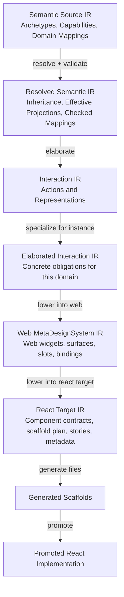

# Layered Compiler Pipeline and Web MetaDesignSystem Refactor Guide

## Executive summary

DMETA already behaves like the beginning of a design-system compiler. It reads YAML source artifacts, validates references, resolves archetype and capability inheritance, loads widget template catalogs, plans a concrete instance, and generates TypeScript/React scaffolds with semantic metadata. The next architecture step is to make that compiler shape explicit and to split the current overloaded `presentation` concept into two levels: modality-neutral **Representations** and target-specific **presentations/widgets/commands** owned by a **MetaDesignSystem**.

This guide proposes a concrete implementation path for refactoring the current repository into a layered compiler pipeline:

```text
Semantic Source IR
  -> Resolved Semantic IR
  -> Interaction IR: Actions + Representations
  -> MetaDesignSystem IR: web-style UI widgets/surfaces/bindings
  -> React Target IR: scaffold plan, files, symbols, stories, metadata
  -> generated scaffolds
  -> promoted React implementation
```

## Hard-cut implementation policy

The repository is still experimental. The goal is not to preserve every current path or schema shape. The goal is to remove conceptual complexity and make the target architecture clean. Therefore this ticket should use a hard cutover policy:

- Do not add compatibility wrappers for old widget-template paths.
- Do not keep aliases from top-level `widget-templates` into the new Web MetaDesignSystem package.
- Do not keep generic “widget” concepts in the universal DMETA layer.
- Do not keep `consumes.presentations` as a parallel source of truth once `realizes.representations/actions` exists.
- Do not keep `generation` as a parallel instance-manifest path once `targets` exists.
- Prefer deleting or moving WIP artifacts over supporting both old and new layouts.
- Keep the promoted React app as an acceptance test, but do not preserve old generator APIs only for compatibility.


The scope of this ticket is the web-style UI path. We will create a Web MetaDesignSystem and a React target under that MetaDesignSystem. This is now a **hard cutover**, not a compatibility migration. The existing top-level widget-template package should be moved into the Web MetaDesignSystem, the old paths should be deleted, generic widget terminology should be removed from the universal DMETA layer, and the tooling should be rewritten toward the elegant target architecture. A CLIM-style MetaDesignSystem is explicitly out of scope for this ticket and should be implemented in a separate ticket. The CLIM ticket can reuse the same Semantic IR and Interaction IR, but it should define its own target IR for presentation types, commands, translators, recognizers, and a React CLIM runtime representation.

The intended reader is a new intern joining the DMETA project. This document explains the current system, the target architecture, the hard-cut cutover sequence, the Go API changes, the YAML schemas, the command-line tools, the Street Deli example, the testing plan, and the risks. It is written as an implementation guide, not only as a conceptual proposal.

## Scope and non-scope

This ticket should produce the first production-quality version of the layered compiler architecture for the existing web/React path.

In scope:

- Add a first-class Interaction IR with Actions and Representations.
- Move web/visual widget templates under a Web MetaDesignSystem package.
- Delete the old top-level widget-template layout instead of wrapping it.
- Add abstract/concrete validation for interaction definitions and Web widget templates.
- Add `realizes` metadata so Web widgets explicitly realize representations and actions.
- Define a `web` MetaDesignSystem package in YAML.
- Define a `react` target under the Web MetaDesignSystem.
- Refactor planner/generator code from generic widget templates toward target-specific Web lowerings and React scaffold plans.
- Hard-cut the Street Deli instance manifest and local templates to the new Web/React layout.
- Keep the current promoted React app as the acceptance test for the new metadata model.
- Add commands that expose the new pipeline stages.

Out of scope:

- Building the CLIM MetaDesignSystem. That should be a separate ticket.
- Preserving old top-level widget-template paths.
- Preserving old generic widget generator APIs.
- Rewriting the promoted Street Deli React application from scratch.
- Building a complete visual editor for the IR.
- Building a full typechecker for every possible projection type.

## Current-state evidence

This section describes the repository as it exists before the refactor. It anchors the proposal to concrete files so a new implementor knows where to start.

### Current CLI entry points

The CLI entry point is `cmd/dmeta/main.go`. It registers four commands:

- `validate-ir`
- `generate-core`
- `plan-instance`
- `scaffold-instance`

Evidence: `cmd/dmeta/main.go:20-46` creates those commands and adds them to the Cobra root. This means the current pipeline already has validation, core generation, instance planning, and scaffold generation as named passes. The refactor should extend this structure rather than replacing it.

Current command flow:

```bash
go run ./cmd/dmeta validate-ir \
  --root ./examples/street-deli-ordering \
  --include-info \
  --output table

go run ./cmd/dmeta plan-instance \
  --instance ./examples/street-deli-ordering/instantiations/street-deli-ordering.yaml \
  --output table

go run ./cmd/dmeta scaffold-instance \
  --instance ./examples/street-deli-ordering/instantiations/street-deli-ordering.yaml
```

The first two commands pass today for Street Deli. `validate-ir` reports `validation_ok`, and `plan-instance` reports eight selected templates and six excluded templates.

### Current semantic model structs

The semantic model lives in `pkg/dmeta/validator/model.go`. The important structs are:

- `Archetype` at `pkg/dmeta/validator/model.go:107-116`.
- `Capability` at `pkg/dmeta/validator/model.go:118-128`.
- `Presentation` at `pkg/dmeta/validator/model.go:136-150`.
- `Action` and action selectors at `pkg/dmeta/validator/model.go:158-183`.
- `Widget` and widget-related fields at `pkg/dmeta/validator/model.go:322-336`.
- `TemplateMetadata` at `pkg/dmeta/validator/model.go:338-347`.
- `Consumes`, `WidgetSemanticContext`, `WidgetProjectionHints`, and `WidgetGenerationPolicy` at `pkg/dmeta/validator/model.go:361-389`.

The current semantic layer already has an abstract/concrete distinction for archetypes and capabilities:

```go
type Archetype struct {
    Description              string   `yaml:"description"`
    LongDescription          string   `yaml:"long_description"`
    Extends                  []string `yaml:"extends"`
    Abstract                 bool     `yaml:"abstract"`
    DefaultCapabilities      []string `yaml:"default_capabilities"`
    RecommendedPresentations []string `yaml:"recommended_presentations"`
    Examples                 []string `yaml:"examples"`
    Notes                    string   `yaml:"notes"`
}

type Capability struct {
    Description     string                `yaml:"description"`
    LongDescription string                `yaml:"long_description"`
    Extends         []string              `yaml:"extends"`
    Abstract        bool                  `yaml:"abstract"`
    Projections     map[string]Projection `yaml:"projections"`
    Presentations   []string              `yaml:"presentations"`
    Actions         []string              `yaml:"actions"`
    Filters         []string              `yaml:"filters"`
    Notes           string                `yaml:"notes"`
}
```

This is the right starting point, but it is incomplete. The widget template layer has no equivalent `abstract` or `selectable` field today. The interaction layer is not separate from the semantic layer. Presentations and actions are attached directly to capabilities.

### Current inheritance resolution

Inheritance resolution lives in `pkg/dmeta/validator/inheritance.go`. `ResolveCoreInheritance` computes resolved archetypes, resolved capabilities, descendant maps, effective capability projections, effective presentations, effective actions, and effective filters. Evidence: `pkg/dmeta/validator/inheritance.go:14-39` defines `ResolvedCoreModel`, `ResolvedArchetype`, and `ResolvedCapability`; `pkg/dmeta/validator/inheritance.go:50-75` resolves the full model.

The resolver validates that roots exist and are abstract. Evidence: `pkg/dmeta/validator/inheritance.go:77-99` checks `Archetype` and `Capability` roots. It also validates missing parents and inheritance cycles. Evidence: `pkg/dmeta/validator/inheritance.go:102-140` begins archetype resolution and reports missing `extends`, duplicate parents, unknown parents, and cycles.

This is directly reusable for the new Interaction IR. Actions and Representations should use the same pattern:

- root definitions may be abstract;
- non-root definitions declare `extends`;
- cycles are errors;
- resolved definitions expose ancestors and effective inherited fields;
- final emitted obligations must not be abstract.

### Current semantic validation

`pkg/dmeta/validator/validate.go` validates domain mappings. The current validator rejects concrete domain mappings to abstract archetypes and abstract capabilities. Evidence: `pkg/dmeta/validator/validate.go:210-230` iterates domain examples and emits `abstract_archetype_mapping` or `abstract_capability_mapping` errors.

This is the rule we should generalize. The refined compiler should also reject:

- selected abstract widget templates;
- elaborated abstract representations;
- elaborated abstract actions;
- target IR artifacts that claim to realize abstract-only definitions;
- React scaffold plans that attempt to generate files for abstract templates.

### Current widget template model

Widget templates are represented by the same `validator.Widget` struct used for global templates and local templates. Important current fields:

```go
type Widget struct {
    ID              string                 `yaml:"id"`
    Name            string                 `yaml:"name"`
    Status          string                 `yaml:"status"`
    Classification  map[string]any         `yaml:"classification"`
    Intent          WidgetIntent           `yaml:"intent"`
    Template        TemplateMetadata       `yaml:"template"`
    Consumes        Consumes               `yaml:"consumes"`
    SemanticContext WidgetSemanticContext  `yaml:"semantic_context"`
    ProjectionHints WidgetProjectionHints  `yaml:"projection_hints"`
    Generation      WidgetGenerationPolicy `yaml:"generation"`
    Contract        WidgetContract         `yaml:"contract"`
    Stories         []string               `yaml:"stories"`
    Outputs         map[string]string      `yaml:"outputs"`
}
```

Evidence: `pkg/dmeta/validator/model.go:322-336`.

The current `Consumes` struct only knows `presentations`, `capabilities`, and `archetypes`. Evidence: `pkg/dmeta/validator/model.go:361-365`.

```go
type Consumes struct {
    Presentations []string `yaml:"presentations"`
    Capabilities  []string `yaml:"capabilities"`
    Archetypes    []string `yaml:"archetypes"`
}
```

This is where the muddiness is encoded. A widget can say it consumes `presentation: substitution_badge`, but the model does not distinguish whether `substitution_badge` is a modality-neutral interaction representation or a web-specific visual badge. The refactor should add a separate `Realizes` field and migrate current `presentations` toward `representations`.

### Current template package

The global widget package entry point is `sources/dmeta-ir/03-widgets.yaml`. It already describes widgets as meta-design-system templates:

```yaml
artifact_type: dmeta_widget_template_package
summary: Widget template package index for DMETA v0.
long_summary: DMETA widgets are meta-design-system templates. Concrete instances select templates, adapt them, and generate only the selected widgets.
```

Evidence: `sources/dmeta-ir/03-widgets.yaml:1-6`.

This is useful wording, but the repository does not yet have a formal `MetaDesignSystem` artifact type. The new architecture should turn that existing statement into an explicit package under something like:

```text
sources/dmeta-ir/meta-design-systems/web/
```

### Current global template example

The global template `dmeta.status_badge` lives in `sources/dmeta-ir/widget-templates/presentations.yaml`. It consumes `status_badge` and `state_cell` presentations and the `stateful` capability. Evidence: `sources/dmeta-ir/widget-templates/presentations.yaml:88-103`.

This is a good migration example. Under the new architecture:

- `state_indicator` should be an Interaction IR representation.
- `status_badge` should be a web-style target realization.
- The widget template should live under the Web MetaDesignSystem.
- The template should say it realizes `state_indicator`, not that the semantic model contains a universal badge.

### Current instance manifest

The Street Deli instance manifest is `examples/street-deli-ordering/instantiations/street-deli-ordering.yaml`. It declares a `dmeta_instance`, references global and local template sources, declares generation output, selects eight templates, and excludes six templates. Evidence: `examples/street-deli-ordering/instantiations/street-deli-ordering.yaml:1-67`.

Selected templates:

| Template | Concrete component | Variant |
|---|---|---|
| `deli.menu_browser` | `StreetDeliMenuBrowser` | `mobile_cards` |
| `deli.composition_card` | `StreetDeliCompositionCard` | `mobile_default` |
| `deli.composition_customizer` | `StreetDeliCompositionCustomizer` | `bottom_sheet` |
| `deli.ingredient_row` | `StreetDeliIngredientRow` | `mobile_default` |
| `deli.substitution_chip` | `StreetDeliSubstitutionChip` | `mobile_default` |
| `deli.order_cart` | `StreetDeliOrderCart` | `mobile_bottom_sheet` |
| `deli.order_tracker` | `StreetDeliOrderTracker` | `compact_status` |
| `deli.role_tag` | `StreetDeliRoleTag` | `compact_mode` |

The new manifest should not need to change radically, but it should identify the target MetaDesignSystem and codegen target. The current `generation` block only has `output_dir` and `package_name`. It should grow toward:

```yaml
targets:
  - id: web_react
    meta_design_system: web
    codegen_target: react
    output_dir: ../generated/widgets
    package_name: street-deli-ordering-widgets
```

Replace `generation` with explicit `targets` in the instance manifest during the cutover. Do not maintain both fields as supported paths.

### Current planner

The planner is `pkg/dmeta/cmds/plan_instance.go`. It loads an instance, loads a template catalog, validates selected and excluded template ids, and emits rows. Evidence: `pkg/dmeta/cmds/plan_instance.go:72-150`.

The actual validation logic is in `pkg/dmeta/generator/widgets/load.go`. Evidence: `pkg/dmeta/generator/widgets/load.go:98-150`.

It currently validates:

- missing instance id;
- no selected templates;
- unknown selected templates;
- duplicate component aliases;
- missing selection reasons;
- undeclared variant names;
- unknown adaptations;
- missing required adaptations;
- unknown excluded templates;
- missing exclusion reasons.

It does **not** validate:

- selected template is abstract;
- selected template is not selectable;
- selected template realizes required interaction representations;
- selected template action slots are wired to known actions;
- selected target matches a declared MetaDesignSystem;
- selected target has a React codegen backend.

These missing validations are a central implementation target for this ticket.

### Current scaffold generator

The scaffold generator is `pkg/dmeta/generator/widgets/render.go`. `Generate` writes TypeScript types, React component placeholder, metadata sidecar, Storybook file, barrel export, optional adapter TODO, package index, and README. Evidence: `pkg/dmeta/generator/widgets/render.go:17-47`.

The current generated component includes runtime `data-dmeta-*` attributes:

```tsx
<section data-dmeta-widget=%q data-dmeta-template=%q data-dmeta-variant=%q>
```

Evidence: `pkg/dmeta/generator/widgets/render.go:84-105`.

The generated doc comment includes semantic context and projection hints. Evidence: `pkg/dmeta/generator/widgets/render.go:107-155`.

The generated metadata sidecar includes instance id, template id, variant, reason, category, adaptations, generation policy, semantic context, projection hints, and resolved inherited semantic context. Evidence: `pkg/dmeta/generator/widgets/render.go:157-188`.

This is one of the strongest parts of the current system. The new architecture should keep this pattern and expand it to include:

- `representations` realized;
- `actions` realized;
- `metaDesignSystem` id;
- `codegenTarget` id;
- lowering pass id/version;
- scaffold plan id;
- provenance source paths.

### Current generated metadata

Generated metadata already proves that the scaffold pipeline carries inherited context. For example, `examples/street-deli-ordering/generated/widgets/StreetDeliSubstitutionChip/StreetDeliSubstitutionChip.metadata.ts` includes:

- `generatedBy`, `instanceId`, `templateId`, selected variant and reason;
- projection hints for `substitutable.replaces`, `substitutable.replacement_candidates`, and role overlap;
- resolved archetype context for `Substitution`;
- resolved capability context for `role_preserving_substitutable`, `dietary_substitutable`, and `price_aware_substitutable`;
- effective presentations and actions inherited from capabilities.

Evidence: `examples/street-deli-ordering/generated/widgets/StreetDeliSubstitutionChip/StreetDeliSubstitutionChip.metadata.ts:3-220`.

This generated metadata should become source-map-like provenance in the new pipeline.

### Current promoted React app

The promoted React app lives under `examples/street-deli-ordering/www/mobile-react`. The app uses Vite, React 19, TypeScript, Storybook 10.4, Vitest, and Playwright. Evidence: `examples/street-deli-ordering/www/mobile-react/package.json:6-43`.

The main app uses state-based routing:

- `menu`: dietary filter bar, menu browser, cart floating action button, bottom-sheet customizer;
- `cart`: order cart;
- `tracker`: order tracker.

Evidence: `examples/street-deli-ordering/www/mobile-react/src/App.tsx:1-141`.

The current promoted app has a local reducer action model. Evidence: `examples/street-deli-ordering/www/mobile-react/src/state/types.ts:35-51` defines actions such as `OPEN_CUSTOMIZER`, `REMOVE_INGREDIENT`, `APPLY_SUBSTITUTION`, `CHANGE_CONFIG`, `ADD_TO_ORDER`, `PLACE_ORDER`, and `ADVANCE_TRACKER_STEP`.

Those reducer actions are not currently generated or traced back to DMETA actions. The React target should eventually produce typed action-binding metadata that links React callbacks/reducer events to Interaction IR actions.

### Current runtime metadata helpers

The promoted React app already has a data attribute helper at `examples/street-deli-ordering/www/mobile-react/src/design-tokens/dataAttributes.ts`. It supports attributes such as:

- `data-dmeta-widget`
- `data-dmeta-template`
- `data-dmeta-variant`
- `data-dmeta-domain-type`
- `data-dmeta-archetypes`
- `data-dmeta-capabilities`
- `data-dmeta-presentation`
- `data-dmeta-semantic-id`
- `data-dmeta-action-id`

Evidence: `dataAttributes.ts:11-48`.

This helper should be migrated to include `representation`, `metaDesignSystem`, and `codegenTarget`, while keeping `presentation` for target-specific web/UI presentation details.

## Problem statement

The current system validates and generates useful artifacts, but it collapses several levels of abstraction:

1. **Semantic capabilities directly mention presentations and actions.** Capabilities such as `stateful`, `composable`, `substitutable`, and `dietary` directly list `presentations` and `actions`. This makes the semantic layer know too much about interaction realization.

2. **The term `presentation` is overloaded.** It sometimes means modality-neutral display intent, sometimes a graphical UI part, and sometimes a CLIM-like presentation concept. This makes it hard to add non-web targets.

3. **Widget templates are target-specific but not declared as such.** Files under `sources/dmeta-ir/widget-templates` and `examples/street-deli-ordering/widget-templates` are web/React-oriented templates, but their artifact type is generic `dmeta_widget_templates`.

4. **The widget layer lacks an abstract/concrete distinction.** Archetypes and capabilities have `abstract: true`; widget templates do not. The planner cannot reject a selected abstract base template.

5. **Generated React scaffolds do not know which Interaction IR definitions they realize.** They carry archetypes, capabilities, presentations, and projection hints, but not representation/action provenance.

6. **The planner and scaffold generator are named as generic widget tools.** This is accurate for the current implementation but will become imprecise once DMETA has multiple MetaDesignSystems and multiple codegen targets.

7. **The CLIM direction needs a shared upper layer.** We want to build a CLIM-style MetaDesignSystem later. That target should not need to reuse web widget names such as badge, card, drawer, chip, or bottom sheet.

The solution is to make the compiler pipeline explicit and add a modality-neutral Interaction IR between Semantic IR and target-specific MetaDesignSystem IR.

## Compiler vocabulary for this project

Use these terms consistently in code, docs, CLI names, and commit messages.

| Term | Meaning in DMETA | Example |
|---|---|---|
| Source IR | Author-written YAML at a given layer. | `archetypes.yaml`, `capabilities.yaml`, `representations.yaml`, `web/widgets.yaml`. |
| Resolved IR | Normalized output after inheritance/reference resolution. | Effective projections for `dietary_substitutable`. |
| Pass | A named analysis or transformation over IR. | `resolve-semantic`, `elaborate-interactions`, `lower-web`, `generate-react-scaffold`. |
| Analysis pass | Reads and checks IR without changing its conceptual level. | Validate unknown archetype references. |
| Elaboration pass | Makes implied structure explicit while staying modality-neutral. | `ingredient_composable` implies `composition_breakdown`. |
| Lowering pass | Converts higher-level IR to a more target-specific IR. | `substitution_candidate` becomes `web.substitution_chip`. |
| Specialization | Binds a generic definition to a narrower domain or context. | `composition_breakdown` specialized for Street Deli ingredients. |
| Instantiation | Selects and names a concrete target artifact for an instance. | `deli.substitution_chip` as `StreetDeliSubstitutionChip`. |
| Realization | Target-specific implementation of an interaction concept. | A representation realized as a React chip. |
| Code generation | Writes files from target IR or scaffold plan. | Emit `.tsx`, `.types.ts`, `.metadata.ts`, `.stories.tsx`. |
| Promotion | Manual/LLM/human transition from generated scaffold to maintained code. | Move from generated scaffold to `www/mobile-react/src/widgets/*`. |
| Source map / provenance | Metadata linking output back to input. | Component metadata lists template, representation, action, capability, archetype. |

Do not use `promote` as a generic word for IR-to-IR transformation. Use `lower` or `elaborate` instead.

## Target architecture

The target architecture has seven layers.



Each layer should be inspectable. Some layers may initially exist only in memory, but the implementation should be structured so they can be written as YAML or JSON for debugging, tests, and review.

## New artifact types

Add the following artifact types gradually.

| Artifact type | Purpose | Likely path |
|---|---|---|
| `dmeta_interaction_actions` | Shared action catalog. | `sources/dmeta-ir/interactions/actions.yaml` |
| `dmeta_interaction_representations` | Shared representation catalog. | `sources/dmeta-ir/interactions/representations.yaml` |
| `dmeta_interaction_elaboration_rules` | Rule table for deriving interactions from semantic selectors. | `sources/dmeta-ir/interactions/elaboration-rules.yaml` |
| `dmeta_elaborated_interaction_ir` | Generated or inspectable interaction obligations for an instance. | `examples/.../generated/elaborated-interactions.yaml` |
| `dmeta_meta_design_system` | Target-family definition. | `sources/dmeta-ir/meta-design-systems/web/meta-design-system.yaml` |
| `dmeta_web_widget_templates` | Web-specific widget templates. | `sources/dmeta-ir/meta-design-systems/web/widgets/*.yaml` |
| `dmeta_web_lowering_rules` | Rules from Interaction IR to Web templates. | `sources/dmeta-ir/meta-design-systems/web/lowering-rules.yaml` |
| `dmeta_react_codegen_target` | React-specific generation target config. | `sources/dmeta-ir/meta-design-systems/web/targets/react.yaml` |
| `dmeta_react_scaffold_plan` | Concrete plan for files and symbols before writing. | `examples/.../generated/react-scaffold-plan.yaml` |

Old widget artifact types and paths should disappear as part of the cutover. The implementation should prefer moving/deleting WIP artifacts over supporting both old and new forms.

## Proposed repository layout

The target layout should be the canonical layout after the cutover. The implementation should move files into this shape and update tools to load this shape directly.

```text
sources/dmeta-ir/
  01-core-model.yaml
  core-model/
    archetypes.yaml
    capabilities.yaml
  interactions/
    00-index.yaml
    actions.yaml
    representations.yaml
    elaboration-rules.yaml
  meta-design-systems/
    web/
      meta-design-system.yaml
      widgets/
        00-index.yaml
        presentation-token.yaml
        states.yaml
        tables.yaml
        surfaces.yaml
        filters.yaml
        forms.yaml
        layout.yaml
        data-display.yaml
      targets/
        react.yaml
      lowering-rules.yaml
      schemas/
        web-widget-template.schema.yaml
        web-surface.schema.yaml
        web-action-binding.schema.yaml
        react-scaffold-plan.schema.yaml

examples/street-deli-ordering/
  interactions/
    actions.yaml                 # optional local extensions
    representations.yaml          # optional local extensions
  meta-design-systems/
    web/
      widgets/
        menu-browsing.yaml
        item-cards.yaml
        customization.yaml
        substitutions.yaml
        ordering.yaml
        tracking.yaml
  instantiations/
    street-deli-ordering.yaml     # target-aware instance manifest
  generated/
    interactions/
      elaborated-interactions.yaml
    web/
      widget-ir.yaml
    react/
      scaffold-plan.yaml
      widgets/
```

After this cutover, these paths should not remain as source-of-truth locations:

```text
sources/dmeta-ir/widget-templates/
examples/street-deli-ordering/widget-templates/
```

If a file still lives in one of those paths after the cutover, treat it as unfinished work, not as a supported legacy mode.

## Interaction IR design

The Interaction IR introduces two first-class concepts: Actions and Representations.

### Representation definition

A Representation is a modality-neutral way of making semantic information available for interaction. It is not a card, badge, row, drawer, chip, command, voice phrase, or CLIM presentation type. Those are target-specific realizations.

Proposed Go struct:

```go
type Representation struct {
    Description     string                 `yaml:"description"`
    LongDescription string                 `yaml:"long_description"`
    Extends         []string               `yaml:"extends"`
    Abstract        bool                   `yaml:"abstract"`
    Intent          string                 `yaml:"intent"`
    Subjects        []SemanticSelector     `yaml:"subjects"`
    Exposes         RepresentationExposes  `yaml:"exposes"`
    SupportsActions []string               `yaml:"supports_actions"`
    Constraints     map[string]any         `yaml:"constraints"`
    Notes           string                 `yaml:"notes"`
}

type RepresentationExposes struct {
    RequiredProjections    []string `yaml:"required_projections"`
    RecommendedProjections []string `yaml:"recommended_projections"`
    OptionalProjections    []string `yaml:"optional_projections"`
}
```

The `SemanticSelector` should reuse or extend the current `Selector` concept at `pkg/dmeta/validator/model.go:167-173`. The current selector can match one capability, archetype, presentation, domain type, or required capabilities. The new selector should support all/any semantics more explicitly:

```go
type SemanticSelector struct {
    AllArchetypes    []string `yaml:"all_archetypes"`
    AnyArchetypes    []string `yaml:"any_archetypes"`
    AllCapabilities  []string `yaml:"all_capabilities"`
    AnyCapabilities  []string `yaml:"any_capabilities"`
    DomainTypes      []string `yaml:"domain_types"`
    Excludes         []string `yaml:"excludes"`
}
```

Example YAML:

```yaml
representations:
  composition_breakdown:
    abstract: false
    intent: Expose the parts of a composition, their functional roles, and the role constraints affected by removal or substitution.
    subjects:
      - all_capabilities: [composable]
        any_capabilities: [ingredient_composable]
    exposes:
      required_projections:
        - composable.parts
      recommended_projections:
        - role_composable.role_profile
        - ingredient_composable.ingredient_roles
    supports_actions:
      - remove_part
      - add_part
      - apply_substitution
    constraints:
      preserve_part_roles: true
      explain_removed_roles: true
```

### Action definition

An Action is a modality-neutral operation over semantic subjects. It is not a React callback, DOM event, CLI subcommand, CLIM command, or voice intent. Those are target realizations.

Proposed Go struct:

```go
type InteractionAction struct {
    Description     string             `yaml:"description"`
    LongDescription string             `yaml:"long_description"`
    Extends         []string           `yaml:"extends"`
    Abstract        bool               `yaml:"abstract"`
    Intent          string             `yaml:"intent"`
    Subjects        []SemanticSelector `yaml:"subjects"`
    Inputs          map[string]Input   `yaml:"inputs"`
    Effects         ActionEffects      `yaml:"effects"`
    Result          ActionResult       `yaml:"result"`
    Safety          ActionSafety       `yaml:"safety"`
    Notes           string             `yaml:"notes"`
}

type Input struct {
    Type        string             `yaml:"type"`
    Required    bool               `yaml:"required"`
    Accepts     []SemanticSelector `yaml:"accepts"`
    Description string             `yaml:"description"`
}

type ActionEffects struct {
    Scope          string `yaml:"scope"`
    MutatesBackend bool   `yaml:"mutates_backend"`
}

type ActionSafety struct {
    RequiresConfirmation bool `yaml:"requires_confirmation"`
    Reversible           bool `yaml:"reversible"`
}
```

Example YAML:

```yaml
actions:
  apply_substitution:
    abstract: false
    intent: Replace a removed or selected composition part with a compatible replacement candidate.
    subjects:
      - all_capabilities: [substitutable]
    inputs:
      composition_ref:
        type: SemanticRef
        required: true
      original_part_ref:
        type: SemanticRef
        required: true
      replacement_candidate_ref:
        type: SemanticRef
        required: true
    effects:
      scope: local_draft
      mutates_backend: false
    result:
      kind: updated_composition
    safety:
      requires_confirmation: false
      reversible: true
```

### Interaction inheritance

Actions and Representations should support inheritance like archetypes and capabilities. Use the same root/abstract pattern:

```yaml
representations:
  Representation:
    abstract: true
    extends: []
    intent: Root interaction representation.

  object_reference:
    abstract: true
    extends: [Representation]
    intent: Base representation for referring to a semantic subject.

  compact_reference:
    abstract: false
    extends: [object_reference]
    intent: Compact identity representation suitable for dense contexts.
```

```yaml
actions:
  Action:
    abstract: true
    extends: []
    intent: Root interaction action.

  mutate_composition:
    abstract: true
    extends: [Action]
    intent: Base class for changing a mutable composition draft.

  remove_part:
    abstract: false
    extends: [mutate_composition]
    intent: Mark a composition part as removed while preserving role provenance.
```

Implement a generic inheritance resolver if possible. The current `inheritanceResolver` is specific to archetypes and capabilities, but the algorithm can be generalized:

```go
type Inheritable interface {
    GetExtends() []string
    IsAbstract() bool
}

func ResolveInheritance[T Inheritable](rootID string, nodes map[string]T, merge MergeFunc[T]) (map[string]Resolved[T], []Finding)
```

If generics make the code too complex for the first implementation, copy the pattern into `pkg/dmeta/validator/interaction_inheritance.go` and refactor later.

## Elaboration rules

Elaboration turns resolved semantic facts into explicit interaction obligations. It should not choose a web widget. It should only emit modality-neutral actions and representations.

Rule schema sketch:

```yaml
schema_version: 0
artifact_type: dmeta_interaction_elaboration_rules
rules:
  - id: identifiable_labelable_to_compact_reference
    when:
      all_capabilities: [identifiable, labelable]
    emits:
      representations: [compact_reference]
      actions: [copy_reference]

  - id: inspectable_to_inspect_action
    when:
      all_capabilities: [inspectable]
    emits:
      actions: [inspect_subject]

  - id: ingredient_composable_to_composition_breakdown
    when:
      all_capabilities: [ingredient_composable]
    emits:
      representations: [composition_breakdown]
      actions: [remove_part, add_part, apply_substitution]

  - id: substitutable_to_substitution_candidate
    when:
      all_capabilities: [role_preserving_substitutable]
    emits:
      representations: [substitution_candidate]
      actions: [apply_substitution, see_alternatives]
```

Elaboration algorithm pseudocode:

```text
function elaborateInteractions(resolvedSemantic, actionCatalog, representationCatalog, rules):
    output = empty ElaboratedInteractionIR

    for each domainType in resolvedSemantic.domainTypes:
        facts = collectEffectiveFacts(domainType)

        for each rule in rules:
            if selectorMatches(rule.when, facts):
                for each representationID in rule.emits.representations:
                    rep = representationCatalog[representationID]
                    if rep.abstract:
                        error("rule emitted abstract representation")
                    if !requiredProjectionsAvailable(rep, facts):
                        error("representation requires unavailable projection")
                    output.addRepresentationObligation(domainType, rep, rule.id)

                for each actionID in rule.emits.actions:
                    action = actionCatalog[actionID]
                    if action.abstract:
                        error("rule emitted abstract action")
                    if !actionSubjectsMatch(action, facts):
                        error("action subject selector does not match domain type")
                    output.addActionObligation(domainType, action, rule.id)

    return output
```

Expected Street Deli elaboration results:

| Domain type | Representations | Actions |
|---|---|---|
| `MenuItem` | `compact_reference`, `composition_summary`, `composition_breakdown`, `dietary_summary`, `configuration_summary` | `inspect_subject`, `select_subject`, `filter_by_dietary`, `change_config` |
| `Ingredient` | `compact_reference`, `ingredient_role_reference`, `dietary_marker` | `inspect_subject`, `copy_reference` |
| `SubstitutionRule` | `substitution_candidate`, `substitution_explanation`, `substitution_price_delta` | `apply_substitution`, `reject_substitution`, `see_alternatives` |
| `Order` | `compact_reference`, `order_lifecycle_progress`, `state_indicator` | `inspect_subject`, `filter_by_state`, `cancel_or_return` |
| `OrderItem` | `composition_breakdown`, `configuration_summary`, `state_indicator` | `remove_part`, `apply_substitution`, `change_config` |

The first implementation can emit a table and YAML file. It does not need to drive generation immediately, but the schema should be designed for generation.

## Web MetaDesignSystem

A MetaDesignSystem is a formal target-family definition. It consumes Interaction IR and defines a custom target IR. This ticket should create the first one: a web-style graphical UI MetaDesignSystem.

Proposed file:

```text
sources/dmeta-ir/meta-design-systems/web/meta-design-system.yaml
```

Schema sketch:

```yaml
schema_version: 0
artifact_type: dmeta_meta_design_system
id: web
name: Web MetaDesignSystem
summary: Realizes modality-neutral DMETA actions and representations as graphical web UI widgets, surfaces, slots, layouts, and event bindings.

consumes:
  artifact_types:
    - dmeta_resolved_semantic_ir
    - dmeta_interaction_actions
    - dmeta_interaction_representations
    - dmeta_elaborated_interaction_ir

owned_ir:
  widget_templates: ./widgets/00-index.yaml
  lowering_rules: ./lowering-rules.yaml
  targets:
    react: ./targets/react.yaml

primitive_concepts:
  component_levels:
    - atom
    - molecule
    - organism
    - surface
    - screen
  surfaces:
    - inline
    - card
    - sheet
    - drawer
    - route
    - modal
  interaction_events:
    - click
    - tap
    - submit
    - keyboard
    - focus
    - drag
  state_bindings:
    - local_state
    - context_reducer
    - external_store
    - server_mutation

validation:
  require_realizes: true
  reject_abstract_selected_templates: true
  require_action_bindings_for_realized_actions: true
  require_projection_coverage_for_realized_representations: true
```

The Web MetaDesignSystem should own graphical terms such as card, badge, chip, drawer, sheet, tab, table, row, and floating action button. These terms should no longer appear as universal semantic concepts.

## Web widget template schema

Web widget templates are target-specific artifacts. They should not live in the universal validator model as generic `Widget` definitions. They belong under the Web MetaDesignSystem package and should be represented by Web-specific Go types.

Proposed Go shape:

```go
type WebWidgetTemplate struct {
    ID               string                 `yaml:"id"`
    Name             string                 `yaml:"name"`
    Status           string                 `yaml:"status"`
    Abstract         bool                   `yaml:"abstract"`
    Selectable       bool                   `yaml:"selectable"`
    Extends          []string               `yaml:"extends"`
    Classification   map[string]any         `yaml:"classification"`
    Intent           WidgetIntent           `yaml:"intent"`
    Realizes         Realizes               `yaml:"realizes"`
    SemanticContext  WidgetSemanticContext  `yaml:"semantic_context"`
    ProjectionHints  WidgetProjectionHints  `yaml:"projection_hints"`
    WebContract      WebWidgetContract      `yaml:"web_contract"`
    ReactContract    *ReactContract         `yaml:"react_contract,omitempty"`
    Stories          []string               `yaml:"stories"`
}

type Realizes struct {
    Representations []string `yaml:"representations"`
    Actions         []string `yaml:"actions"`
}
```

There is intentionally no `Consumes.Presentations` compatibility field. A Web widget realizes modality-neutral representations and actions. Web-specific presentation vocabulary may appear inside `web_contract`, visual-state definitions, layout slots, CSS/token hints, and React target contracts, but it should not be confused with the universal Interaction IR.

Template YAML after the cutover:

```yaml
- id: deli.web.substitution_chip
  name: SubstitutionChip
  status: template
  abstract: false
  selectable: true
  extends: []
  classification:
    level: atom
    role: substitution_suggestion
  intent:
    purpose: Render a compact graphical control for a substitution candidate.
    adapter_boundary: Receives normalized substitution candidate view model and emits action bindings.
  realizes:
    representations:
      - substitution_candidate
      - substitution_price_delta
    actions:
      - apply_substitution
      - see_alternatives
  semantic_context:
    archetypes:
      - SubstitutionSuggestion
    capabilities:
      - role_preserving_substitutable
      - dietary_substitutable
      - price_aware_substitutable
  projection_hints:
    recommended:
      - substitutable.replaces
      - substitutable.replacement_candidates
      - role_preserving_substitutable.role_overlap_score
  web_contract:
    surface: inline_chip
    interaction_events:
      primary: tap
      secondary: long_press
  react_contract:
    props:
      SubstitutionChipProps:
        fields:
          suggestion:
            type: SubstitutionCandidateViewModel
            required: true
    action_slots:
      onApply:
        action: apply_substitution
```

Hard-cut validation rules:

- Web loaders read from `meta-design-systems/web/widgets/` only.
- Selected Web templates must have `abstract: false` and `selectable: true`.
- Selected Web templates must declare `realizes.representations` or `realizes.actions`.
- `consumes.presentations` is invalid in Web widget templates after the cutover.
- React-specific props and file outputs belong to the React target, not to the universal semantic layer.

## React target

The React target is not the same thing as the Web MetaDesignSystem. The Web MetaDesignSystem says the target family has widgets, surfaces, slots, graphical states, and web interactions. The React target says how to generate files for React and TypeScript.

Proposed file:

```text
sources/dmeta-ir/meta-design-systems/web/targets/react.yaml
```

Schema sketch:

```yaml
schema_version: 0
artifact_type: dmeta_react_codegen_target
id: react
meta_design_system: web
summary: Generates React + TypeScript + Storybook scaffolds from Web widget IR.

file_kinds:
  component:
    extension: .tsx
    template: react_component
  types:
    extension: .types.ts
    template: react_types
  metadata:
    extension: .metadata.ts
    template: dmeta_metadata
  stories:
    extension: .stories.tsx
    template: storybook
  barrel:
    filename: index.ts

runtime_metadata:
  data_attributes:
    widget: data-dmeta-widget
    template: data-dmeta-template
    variant: data-dmeta-variant
    meta_design_system: data-dmeta-meta-design-system
    representation: data-dmeta-representation
    action: data-dmeta-action-id
    domain_type: data-dmeta-domain-type
    archetypes: data-dmeta-archetypes
    capabilities: data-dmeta-capabilities

storybook:
  title_prefix: DMETA/Web
  include_autodocs: true
  require_semantic_description: true
```

React scaffold plan schema:

```yaml
schema_version: 0
artifact_type: dmeta_react_scaffold_plan
id: street_deli_ordering.web.react
instance: street_deli_ordering
meta_design_system: web
codegen_target: react
files:
  - path: ../generated/widgets/StreetDeliSubstitutionChip/StreetDeliSubstitutionChip.tsx
    kind: component
    symbol: StreetDeliSubstitutionChip
    source:
      widget_template: web.substitution_chip
      representations:
        - substitution_candidate
        - substitution_price_delta
      actions:
        - apply_substitution
        - see_alternatives
      archetypes:
        - Substitution
      capabilities:
        - role_preserving_substitutable
        - dietary_substitutable
        - price_aware_substitutable
```

The current `Generate` function in `pkg/dmeta/generator/widgets/render.go` should be split conceptually:

1. `BuildReactScaffoldPlan(instance, loweredWidgets) ([]PlannedFile, findings)`
2. `RenderReactScaffold(plan) ([]GeneratedFile, error)`
3. `WriteGeneratedFiles(files)`

This makes the generation decision inspectable before files are written.

## Updated command set

Keep the current commands, but add explicit compiler-stage commands.

Recommended commands:

```bash
# Existing: validates current source package.
dmeta validate-ir --root ./examples/street-deli-ordering --include-info --output table

# New: writes or prints resolved semantic model.
dmeta resolve-semantic --root ./examples/street-deli-ordering --output yaml

# New: derives interaction obligations from resolved semantic model.
dmeta elaborate-interactions --root ./examples/street-deli-ordering --output table

# New: validates Interaction IR definitions and elaborated obligations.
dmeta validate-interactions --root ./examples/street-deli-ordering --output table

# New: lowers elaborated interactions into a target MetaDesignSystem.
dmeta lower-metadesign --instance ./examples/street-deli-ordering/instantiations/street-deli-ordering.yaml --target web --output yaml

# Existing names can be replaced; no compatibility alias is required.
dmeta plan-instance --instance ./examples/street-deli-ordering/instantiations/street-deli-ordering.yaml --output table

# New or renamed: build a scaffold plan without writing files.
dmeta plan-scaffold --instance ./examples/street-deli-ordering/instantiations/street-deli-ordering.yaml --target react --output yaml

# Existing: write generated scaffold files.
dmeta scaffold-instance --instance ./examples/street-deli-ordering/instantiations/street-deli-ordering.yaml
```

Implementation advice:

- Do not remove `plan-instance` or `scaffold-instance` yet.
- Add aliases or flags first.
- Make `plan-instance` call the new planner internally once the new code exists.
- Keep output table columns stable where possible so existing scripts do not break.

## Go package plan

Current packages:

```text
pkg/dmeta/validator/
  model.go
  load.go
  validate.go
  inheritance.go

pkg/dmeta/generator/widgets/
  model.go
  load.go
  render.go
  write.go

pkg/dmeta/cmds/
  validate_ir.go
  generate_core.go
  plan_instance.go
  scaffold_instance.go
```

Proposed additions:

```text
pkg/dmeta/interaction/
  model.go                  # Action, Representation, selectors, elaboration rules
  load.go                   # load interaction files
  inheritance.go            # resolve action/representation inheritance
  validate.go               # validate catalogs and elaborated IR
  elaborate.go              # rules engine

pkg/dmeta/metadesign/
  model.go                  # MetaDesignSystem, target definitions
  load.go                   # load web package
  validate.go               # validate MDS definitions

pkg/dmeta/metadesign/webui/
  model.go                  # WebWidget, surface, slot, action binding if separate from Widget
  lower.go                  # Interaction IR -> Web widget IR
  validate.go               # validate web UI target artifacts

pkg/dmeta/generator/react/
  model.go                  # ReactScaffoldPlan, PlannedFile
  plan.go                   # Web widget IR -> scaffold plan
  render.go                 # scaffold plan -> GeneratedFile
  write.go                  # file writer, maybe shared with widgets/write.go

pkg/dmeta/cmds/
  resolve_semantic.go
  elaborate_interactions.go
  validate_interactions.go
  lower_metadesign.go
  plan_scaffold.go
```

Keep shared utility code small. The goal is not to create many packages for its own sake. The goal is to keep the layer boundaries visible in code.

## Planner changes

The current validation entry point is `ValidateInstanceAgainstCatalog` in `pkg/dmeta/generator/widgets/load.go:98-150`. Extend it in stages.

Stage 1 additions:

```go
if widget.Abstract {
    findings = append(findings, PlanFinding{
        Severity: "error",
        Subject: selected.Template,
        Code: "abstract_template_selected",
        Message: "selected template is abstract and cannot be generated directly",
    })
}
if !widget.IsSelectable() {
    findings = append(findings, PlanFinding{
        Severity: "error",
        Subject: selected.Template,
        Code: "template_not_selectable",
        Message: "selected template is not selectable in an instance manifest",
    })
}
if metaDesignSystemEnabled && len(widget.Realizes.Representations) == 0 && len(widget.Realizes.Actions) == 0 {
    findings = append(findings, PlanFinding{
        Severity: "warning",
        Subject: selected.Template,
        Code: "missing_realizes",
        Message: "selected template should declare representations/actions it realizes",
    })
}
```

Stage 2 additions:

```go
for _, representationID := range widget.Realizes.Representations {
    rep, ok := interactionCatalog.Representations[representationID]
    if !ok { error unknown_realized_representation }
    if rep.Abstract { error abstract_representation_realized }
}
for _, actionID := range widget.Realizes.Actions {
    action, ok := interactionCatalog.Actions[actionID]
    if !ok { error unknown_realized_action }
    if action.Abstract { error abstract_action_realized }
    if !hasActionBinding(widget, actionID) { warning missing_action_binding }
}
```

Stage 3 additions:

```go
for _, representationID := range widget.Realizes.Representations {
    rep := resolvedRepresentations[representationID]
    if !projectionHintsCover(rep.Exposes.RequiredProjections, widget.ProjectionHints) {
        warning or error missing_projection_coverage
    }
}
```

The first pass should prefer warnings for coverage issues while templates are being migrated. Once the Street Deli templates are fully migrated, turn the most important missing references into errors.

## Generator changes

The current `renderMetadata` function at `pkg/dmeta/generator/widgets/render.go:157-188` should include the new provenance fields.

Target metadata shape:

```json
{
  "generatedBy": "dmeta scaffold-instance",
  "compilerPipeline": {
    "semanticResolver": "resolve-core-inheritance/v1",
    "interactionElaborator": "interaction-elaboration/v1",
    "metaDesignLowerer": "web-lowering/v1",
    "codegenTarget": "react/v1"
  },
  "instanceId": "street_deli_ordering",
  "metaDesignSystem": "web",
  "codegenTarget": "react",
  "templateId": "web.substitution_chip",
  "selectedAs": "StreetDeliSubstitutionChip",
  "variant": "mobile_default",
  "realizes": {
    "representations": ["substitution_candidate", "substitution_price_delta"],
    "actions": ["apply_substitution", "see_alternatives"]
  },
  "semanticContext": {
    "archetypes": ["Substitution"],
    "capabilities": ["role_preserving_substitutable", "dietary_substitutable", "price_aware_substitutable"]
  },
  "projectionHints": {...},
  "resolvedSemanticContext": {...}
}
```

Generated component data attributes should include:

```tsx
<section
  data-dmeta-widget="StreetDeliSubstitutionChip"
  data-dmeta-template="web.substitution_chip"
  data-dmeta-meta-design-system="web"
  data-dmeta-codegen-target="react"
  data-dmeta-representation="substitution_candidate"
  data-dmeta-action-id="apply_substitution"
>
```

The promoted app helper `dataAttributes.ts` should be updated:

```ts
export type DmetaAttrOptions = {
  widget?: string;
  template?: string;
  variant?: string;
  metaDesignSystem?: string;
  codegenTarget?: string;
  domainType?: string;
  archetypes?: string[];
  capabilities?: string[];
  representation?: string;
  webPresentation?: string; // target-specific Web presentation detail, not universal Interaction IR
  semanticId?: string;
  label?: string;
  copyValue?: string;
  actionId?: string;
  actionCategory?: string;
};
```

## Street Deli migration plan

The Street Deli example should remain the acceptance test. The goal is not to change the user-visible app first. The goal is to change the metadata and generation path while preserving the same eight promoted widgets.

### Current selected widgets to new realizations

| Current template | New web template | Representations | Actions |
|---|---|---|---|
| `deli.menu_browser` | `web.menu_browser` or `deli.web.menu_browser` | `menu_browse_surface`, `menu_item_orderable_summary`, `category_filter_summary` | `select_menu_item`, `select_category`, `filter_by_dietary` |
| `deli.composition_card` | `deli.web.composition_card` | `composition_summary`, `dietary_summary`, `price_summary` | `select_menu_item`, `inspect_subject` |
| `deli.composition_customizer` | `deli.web.composition_customizer` | `composition_breakdown`, `configuration_summary`, `substitution_candidate`, `dietary_constraint_summary` | `remove_part`, `undo_remove_part`, `apply_substitution`, `change_config`, `add_to_order` |
| `deli.ingredient_row` | `deli.web.ingredient_row` | `ingredient_composition_row`, `role_label`, `dietary_marker` | `remove_part`, `undo_remove_part`, `see_alternatives` |
| `deli.substitution_chip` | `deli.web.substitution_chip` | `substitution_candidate`, `substitution_price_delta`, `substitution_role_fit` | `apply_substitution`, `reject_substitution`, `see_alternatives` |
| `deli.order_cart` | `deli.web.order_cart` | `cart_summary`, `order_item_summary`, `price_total_summary` | `remove_cart_item`, `submit_order`, `return_to_menu` |
| `deli.order_tracker` | `deli.web.order_tracker` | `order_lifecycle_progress`, `state_indicator` | `return_to_menu`, `inspect_subject` |
| `deli.role_tag` | `deli.web.role_tag` | `role_label` | none or `filter_by_role` later |

### Deli semantic facts to interaction obligations

The Street Deli domain source already contains the important facts:

- `MenuItem` maps to `Composition` and `ActionSpec` with `composable`, `configurable`, and `dietary` capabilities (`street-deli-ordering.yaml:50-87`).
- `Ingredient` maps to `Resource` with `dietary` capability (`street-deli-ordering.yaml:89-102`).
- `SubstitutionRule` maps to `Substitution` and `Relation` with `substitutable` projections (`street-deli-ordering.yaml:104-127`).
- `Order` maps to `WorkItem` and `TimelineSpan` with `stateful` and `temporal` projections (`street-deli-ordering.yaml:129-148`).
- `OrderItem` maps to `WorkItem` and `Composition` with state and composition projections (`street-deli-ordering.yaml:150-171`).

The elaboration pass should use these facts to produce interaction obligations. For example:

```yaml
subject: SubstitutionRule
source_capabilities:
  - substitutable
  - role_preserving_substitutable
  - dietary_substitutable
  - price_aware_substitutable
representations:
  - substitution_candidate
  - substitution_explanation
  - substitution_price_delta
actions:
  - apply_substitution
  - reject_substitution
  - see_alternatives
```

### Deli local templates

The local templates currently live under `examples/street-deli-ordering/widget-templates/`. Do not delete them immediately. Migrate them by adding fields:

```yaml
abstract: false
selectable: true
meta_design_system: web
codegen_targets: [react]
realizes:
  representations:
    - composition_breakdown
    - substitution_candidate
  actions:
    - remove_part
    - apply_substitution
```

Remove `consumes.presentations` from Street Deli Web templates during the cutover. Each Web template should declare `realizes.representations/actions` as the source of truth.

### Deli instance manifest

Add target configuration without removing current generation:

```yaml
targets:
  - id: web_react
    meta_design_system: web
    codegen_target: react
    generation:
      output_dir: ../generated/widgets
      package_name: street-deli-ordering-widgets
```

Then update planner behavior:

- `targets` is required after the cutover.
- `generation` should be removed from the manifest.
- `plan-instance` or its replacement should print target columns unconditionally for target-aware instances.

Table output can become:

```text
kind      target     template                    component                      variant       status
selected  web_react  deli.web.menu_browser    StreetDeliMenuBrowser          mobile_cards  selected
selected  web_react  deli.web.substitution_chip StreetDeliSubstitutionChip    mobile_default selected
```

## React target acceptance criteria

The React target is successful when all of the following are true:

1. `go run ./cmd/dmeta validate-ir --root ./examples/street-deli-ordering --include-info --output table` still passes.
2. `go run ./cmd/dmeta plan-instance --instance ./examples/street-deli-ordering/instantiations/street-deli-ordering.yaml --output table` still reports the same eight selected widgets.
3. A new interaction elaboration command can show Street Deli representations/actions in table form.
4. Selected templates include `realizes` metadata and pass validation.
5. Abstract widget templates cannot be selected.
6. Generated metadata includes `metaDesignSystem`, `codegenTarget`, `realizes.representations`, and `realizes.actions`.
7. Generated React placeholder components still compile.
8. Promoted React app still builds with `npm run build`.
9. Storybook still builds with `npm run build-storybook`.
10. The promoted app can optionally expose new `data-dmeta-representation` attributes.

## Testing strategy

### Unit tests

Add tests for model parsing:

```text
pkg/dmeta/interaction/model_test.go
pkg/dmeta/metadesign/model_test.go
pkg/dmeta/generator/react/model_test.go
```

Test cases:

- Parses minimal `dmeta_interaction_representations` file.
- Parses minimal `dmeta_interaction_actions` file.
- Parses minimal `dmeta_meta_design_system` file.
- Parses widget template with `abstract`, `selectable`, `extends`, and `realizes`.

Add inheritance tests:

```text
pkg/dmeta/interaction/inheritance_test.go
```

Test cases:

- Root `Representation` must be abstract.
- Non-root representation must have parent.
- Cycles are rejected.
- Inherited `supports_actions` are merged.
- Abstract representation cannot be emitted as final obligation.

Add planner tests:

```text
pkg/dmeta/generator/widgets/plan_instance_test.go
```

Test cases:

- Selecting `abstract: true` template returns error finding.
- Selecting `selectable: false` template returns error finding.
- Missing `realizes` returns warning when web strict validation is enabled.
- Unknown realized representation returns error.
- Unknown realized action returns error.

### Golden tests

Add golden tests for Street Deli:

```text
testdata/street-deli/elaborated-interactions.golden.yaml
testdata/street-deli/web-lowering.golden.yaml
testdata/street-deli/react-scaffold-plan.golden.yaml
```

Golden tests should be stable enough to catch accidental changes but not so large that every description edit breaks them. Prefer stable ids, source paths, and relationship fields over full long descriptions.

### CLI smoke tests

Add smoke tests that run:

```bash
go run ./cmd/dmeta validate-ir --root ./examples/street-deli-ordering --include-info --output table

go run ./cmd/dmeta plan-instance --instance ./examples/street-deli-ordering/instantiations/street-deli-ordering.yaml --output table

go run ./cmd/dmeta elaborate-interactions --root ./examples/street-deli-ordering --output table

go run ./cmd/dmeta lower-metadesign --instance ./examples/street-deli-ordering/instantiations/street-deli-ordering.yaml --target web --output yaml
```

The first implementation may not have all commands. Add tests as commands land.

### React target tests

After generation:

```bash
cd examples/street-deli-ordering/www/mobile-react
npm run build
npm run build-storybook
```

For generated scaffolds only:

```bash
cd examples/street-deli-ordering/generated/widgets
# If standalone tsconfig is added later, run tsc here.
```

The promoted app should not be overwritten by scaffold generation.

## Implementation phases

The implementation should proceed top-down. Define the target architecture and move the source files first; do not add compatibility wrappers around the old layout.

### Phase 1: hard-cut target layout and vocabulary reset

Create the canonical Web MetaDesignSystem package under `sources/dmeta-ir/meta-design-systems/web/`. Move the current global widget templates into `meta-design-systems/web/widgets/` and delete `sources/dmeta-ir/widget-templates/`. Move the Street Deli local widget templates into `examples/street-deli-ordering/meta-design-systems/web/widgets/` and delete `examples/street-deli-ordering/widget-templates/`. Update indexes and docs so widgets are only described as Web MetaDesignSystem artifacts.

### Phase 2: top-level compiler source packages

Define the universal layers before target-specific tooling. Add `interactions/actions.yaml`, `interactions/representations.yaml`, and `interactions/elaboration-rules.yaml`. Decide whether current semantic `presentations.yaml` is deleted, moved under Web, or split into interaction representations plus Web presentation contracts. Do not keep it as a universal bridge concept.

### Phase 3: Web-specific Go model

Replace generic widget models with Web-specific models. `WidgetTemplatesFile` and `Widget` should not remain universal validator concepts if they only apply to visual/web UI. The Web model should contain `WebWidgetTemplate`, `Realizes`, web contracts, and optional React target contracts.

### Phase 4: Interaction IR validation and inheritance

Implement Actions and Representations as first-class IRs with inheritance, abstract/concrete validation, selector validation, and projection requirements.

### Phase 5: semantic-to-interaction elaboration

Implement the elaboration pass that derives interaction obligations from resolved semantic facts. This pass remains modality-neutral and emits Actions/Representations, not Web widgets.

### Phase 6: Web MetaDesignSystem lowering

Implement Web lowering from elaborated interactions into Web widget/surface IR. This is where cards, chips, sheets, tables, tabs, rows, and visual event bindings become valid terms.

### Phase 7: React target and scaffold plan

Define React as a target under the Web MetaDesignSystem. Replace generic widget scaffolding with a React scaffold plan and React renderer.

### Phase 8: Street Deli hard cutover

Rewrite the Street Deli instance manifest and local templates to use the new `meta-design-systems/web/` structure, new template ids, explicit targets, and `realizes` metadata. Regenerate scaffolds through the new React target.

### Phase 9: promoted React metadata and Storybook alignment

Update the promoted React app to expose representation/action provenance instead of legacy presentation metadata. Update Storybook docs so they explain semantic -> representation/action -> Web widget -> React component provenance.

### Phase 10: delete obsolete paths and prepare CLIM handoff

Remove obsolete paths, obsolete docs, and obsolete generic widget generator code. Record the final shape and create the follow-up CLIM MetaDesignSystem ticket.

## Risks and mitigations

### Risk: hard cutover breaks current commands temporarily

The repository is WIP, so this is acceptable inside a focused implementation branch/commit sequence. Mitigation: keep each commit internally understandable, run validation after each phase, and restore the Street Deli acceptance path before considering the ticket implemented.

### Risk: deleting old paths before new loaders exist causes confusion

Mitigation: do the move and loader updates in the same phase. The old paths should not remain as supported inputs, but the commit that deletes them should also add the new canonical source paths.

### Risk: Web concepts leak back into the universal layer

Mitigation: enforce naming and directory boundaries. Widgets, chips, cards, sheets, drawers, tables, and React contracts belong under `meta-design-systems/web/` or its React target. Universal DMETA layers should talk about archetypes, capabilities, actions, representations, selectors, and projections.

### Risk: React target becomes too coupled to Street Deli

The first target will be exercised by Street Deli, but generic Web widgets should not encode deli-specific assumptions. Mitigation: keep generic templates under `web.*` and deli-specific templates under `deli.web.*` in the Street Deli package.

### Risk: promoted React code falls behind generated provenance

Mitigation: update generated metadata first, then update promoted React `data-dmeta-*` attributes and Storybook docs after the compiler-side schema stabilizes.

## Open questions

1. Should Interaction IR live under `sources/dmeta-ir/interactions/` or under `sources/dmeta-ir/core-model/`? Recommendation: separate `interactions/` because it is a distinct layer.
2. Should current `core-model/presentations.yaml` be deleted or moved? Recommendation: hard-cut it out of the universal semantic layer; split useful entries into Interaction representations or Web presentation contracts.
3. Should Web MetaDesignSystem be named `web`, `graphical-web`, or `mobile-web`? Recommendation: `web` because it can include mobile and desktop web styles without implying only mobile.
4. Should React be modeled as a target under web or as its own MetaDesignSystem? Recommendation: target under web. React is an implementation technology; web is the interaction family.
5. Should local Street Deli web templates be named `deli.web.*` or another prefix? Recommendation: rename during the cutover; do not keep `deli.*` as a compatibility form.
6. Should `realizes.actions` be required for every widget? Recommendation: no. Some widgets are purely representational, but if a widget has action slots, those slots should reference known actions.
7. Should elaboration rules emit domain-local representations? Recommendation: yes. Use global representations for common patterns and local representations for domain-specific concepts.

## Intern implementation checklist

Use this checklist when starting the implementation.

1. Run the current validation commands and save output for comparison.
2. Create the canonical `sources/dmeta-ir/meta-design-systems/web/` package.
3. Move global widget templates into the Web package and delete the old top-level widget-template directory.
4. Move Street Deli widget templates into `examples/street-deli-ordering/meta-design-systems/web/widgets/` and delete the old local widget-template directory.
5. Define Interaction IR actions/representations at the universal layer.
6. Replace generic widget structs with Web-specific template structs.
7. Add validation for abstract/non-selectable Web templates.
8. Implement semantic-to-interaction elaboration.
9. Implement Web lowering rules for `substitution_candidate -> substitution_chip` and `composition_breakdown -> composition_customizer`.
10. Define React as a target under the Web MetaDesignSystem.
11. Add React scaffold plan model and renderer.
12. Update generated metadata to include `realizes` and target provenance.
13. Hard-cut the Street Deli instance manifest to explicit Web/React targets.
14. Run `validate-ir`, elaboration, Web lowering, React scaffold planning, Go tests, React build, and Storybook build.
15. Update docs, changelog, and the CLIM handoff note.

## File reference index

Current source files that define the existing system:

- `/home/manuel/code/wesen/go-go-golems/dmeta/cmd/dmeta/main.go` — registers CLI commands.
- `/home/manuel/code/wesen/go-go-golems/dmeta/pkg/dmeta/validator/model.go` — semantic, presentation, action, widget, and design-language model structs.
- `/home/manuel/code/wesen/go-go-golems/dmeta/pkg/dmeta/validator/inheritance.go` — archetype/capability inheritance resolver.
- `/home/manuel/code/wesen/go-go-golems/dmeta/pkg/dmeta/validator/validate.go` — core validation, including abstract mapping rejection.
- `/home/manuel/code/wesen/go-go-golems/dmeta/pkg/dmeta/generator/widgets/model.go` — instance manifest and widget reflection structs.
- `/home/manuel/code/wesen/go-go-golems/dmeta/pkg/dmeta/generator/widgets/load.go` — instance loading, template catalog loading, planner validation.
- `/home/manuel/code/wesen/go-go-golems/dmeta/pkg/dmeta/generator/widgets/render.go` — TypeScript/React scaffold rendering.
- `/home/manuel/code/wesen/go-go-golems/dmeta/pkg/dmeta/cmds/plan_instance.go` — planner command.
- `/home/manuel/code/wesen/go-go-golems/dmeta/pkg/dmeta/cmds/scaffold_instance.go` — scaffold command.
- `/home/manuel/code/wesen/go-go-golems/dmeta/sources/dmeta-ir/03-widgets.yaml` — global widget template package entry point.
- `/home/manuel/code/wesen/go-go-golems/dmeta/sources/dmeta-ir/widget-templates/presentations.yaml` — current global presentation/widget templates.
- `/home/manuel/code/wesen/go-go-golems/dmeta/examples/street-deli-ordering/instantiations/street-deli-ordering.yaml` — current concrete instance manifest.
- `/home/manuel/code/wesen/go-go-golems/dmeta/examples/street-deli-ordering/core-model/street-deli-ordering.yaml` — Street Deli domain type mappings.
- `/home/manuel/code/wesen/go-go-golems/dmeta/examples/street-deli-ordering/core-model/archetypes.yaml` — Street Deli extended archetype hierarchy.
- `/home/manuel/code/wesen/go-go-golems/dmeta/examples/street-deli-ordering/core-model/capabilities.yaml` — Street Deli extended capability hierarchy.
- `/home/manuel/code/wesen/go-go-golems/dmeta/examples/street-deli-ordering/widget-templates/customization.yaml` — current local customizer template.
- `/home/manuel/code/wesen/go-go-golems/dmeta/examples/street-deli-ordering/widget-templates/substitutions.yaml` — current ingredient/substitution templates.
- `/home/manuel/code/wesen/go-go-golems/dmeta/examples/street-deli-ordering/generated/widgets/StreetDeliSubstitutionChip/StreetDeliSubstitutionChip.metadata.ts` — generated metadata example with resolved inherited context.
- `/home/manuel/code/wesen/go-go-golems/dmeta/examples/street-deli-ordering/www/mobile-react/src/App.tsx` — promoted React app routing and widget wiring.
- `/home/manuel/code/wesen/go-go-golems/dmeta/examples/street-deli-ordering/www/mobile-react/src/state/types.ts` — promoted React reducer action surface.
- `/home/manuel/code/wesen/go-go-golems/dmeta/examples/street-deli-ordering/www/mobile-react/src/design-tokens/dataAttributes.ts` — current runtime metadata helper.

## Final guidance

Do the refactor in focused passes, but do not preserve old paths as supported APIs. Temporary breakage inside a phase is acceptable because the repository is experimental; each completed phase should restore a coherent target architecture. The first milestone is the canonical Web MetaDesignSystem layout. The second milestone is a visible `elaborate-interactions` command. The third milestone is Web lowering that explains the existing Street Deli widgets without relying on top-level widget-template paths. The fourth milestone is React scaffold metadata that traces each generated component through template, representation, action, capability, archetype, and domain type.

The CLIM target should begin only after those shared layers are stable. At that point, CLIM should consume the same Semantic IR and Interaction IR, then define its own MetaDesignSystem and final React CLIM framework representation without inheriting web widget vocabulary.
