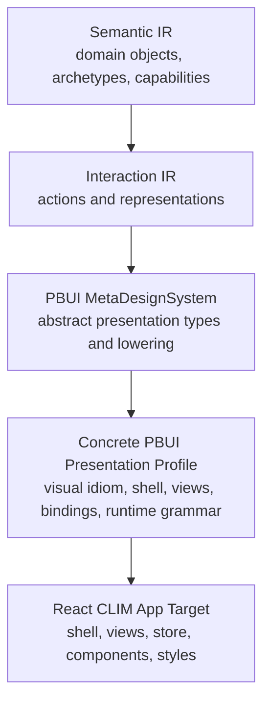

# Concrete PBUI Presentation Profile Pass Guide

## Executive summary

DMETA now has a working PBUI compiler path. The current path can elaborate Street Deli Semantic IR into Interaction IR, lower those obligations into PBUI presentation obligations, derive object/action descriptors, plan a PBUI React target, render a buildable generated TypeScript scaffold, and validate it with `npm run build`.

That is a real compiler proof, but it is not yet the final user interface. The generated scaffold under:

```text
examples/street-deli-ordering/generated/pbui-react/
```

is intentionally generic. It proves that `pbui.presentation_ref`, `pbui.action_presentation`, `pbui.inspector_panel`, `pbui.action_chooser`, `pbui.lifecycle_status`, and `pbui.composition_presentation` can become React-oriented files, registries, metadata, and buildable TypeScript. It does **not** yet explain how those abstract PBUI presentations should be arranged, styled, and operated as the actual Street Deli CLIM interface.

The missing concept is a **concrete PBUI presentation-system profile pass**. This pass sits between abstract PBUI lowering and concrete React app generation:

```text
Semantic IR
  -> Interaction IR
  -> PBUI MetaDesignSystem lowering
  -> Concrete PBUI Presentation Profile
  -> React CLIM app target
```

The profile pass answers questions that abstract PBUI should not answer:

- What visual idiom does the presentation system use?
- What shell regions exist?
- Where does the command line live?
- How are actions presented?
- How does select mode look?
- What views exist?
- Which concrete renderer implements each PBUI presentation type?
- Which runtime architecture should the target use?

For Street Deli, the concrete profile should be derived from two references:

1. `examples/street-deli-ordering/prototype-clim/` is the **visual and interaction UX reference**.
2. `/home/manuel/code/wesen/2026-05-21--readwise-viewer/pkg/web/clim/` is the **runtime architecture reference**.

The implementation should not smuggle this profile into React components. It should model it as an explicit DMETA pass so future PBUI systems can instantiate other looks: a monochrome CLIM shell, a graphical dashboard, a terminal UI, a voice/prompt system, or a mobile command palette.

## The problem this ticket solves

The current PBUI pipeline knows that a subject should have a presentation. It does not know what concrete interface world that presentation belongs to.

For example, current PBUI lowering can produce this obligation:

```text
Domain type: MenuItem
Presentation type: pbui.composition_presentation
Source representations: composition_summary, composition_breakdown
Source actions: remove_part, add_part
Presenter intent: Project a composed item and its parts into role-aware sections.
Recognizer intent: Build typed action requests for part removal, addition, substitution, configuration, and cart actions.
```

That is meaningful, but it is still abstract. It does not say whether the presentation should look like a mobile card, a dense table row, a terminal line, a command palette result, or a CLIM text object. It does not say whether the ingredient rows are indented, whether action choices appear in a command bar, or whether compatible selection targets should turn red.

The static CLIM prototype answers those concrete questions. It uses:

- a black monochrome background;
- Berkeley Mono typography;
- a header with brand and mode label;
- command bars above and below each view's presentation area;
- text-object presentations such as `<MenuItem> Classic BLTA #classic-blta $11.95`;
- selected presentation state;
- red compatible targets in select mode;
- right-click context menus;
- a command-line footer;
- a small set of views: menu, detail, substitution, cart, help, tracker.

The Readwise Viewer CLIM browser reference answers runtime questions. It uses:

- `PresentationRef` as the common object wrapper;
- `ActionPresentation` as a first-class presentable action object;
- a Redux state machine for normal/select/confirm interaction states;
- a pure command parser;
- action compatibility derivation;
- event delegation from DOM presentations into action requests;
- rendering as a pure mapping from state to visible presentations.

Neither of these belongs directly in abstract PBUI lowering. They belong in a new explicit profile/instantiation pass.

## Current architecture baseline

The current PBUI work created the following important files:

```text
sources/dmeta-ir/meta-design-systems/pbui/meta-design-system.yaml
sources/dmeta-ir/meta-design-systems/pbui/presentation-types.yaml
sources/dmeta-ir/meta-design-systems/pbui/lowering-rules.yaml
sources/dmeta-ir/meta-design-systems/pbui/targets/react.yaml

pkg/dmeta/metadesign/pbui/model.go
pkg/dmeta/metadesign/pbui/load.go
pkg/dmeta/metadesign/pbui/validate.go
pkg/dmeta/metadesign/pbui/lower.go
pkg/dmeta/metadesign/pbui/descriptors.go
pkg/dmeta/metadesign/pbui/react_plan.go
pkg/dmeta/metadesign/pbui/react_render.go
pkg/dmeta/metadesign/pbui/react_write.go

pkg/dmeta/cmds/validate_pbui.go
pkg/dmeta/cmds/lower_pbui.go
pkg/dmeta/cmds/plan_pbui_react.go
pkg/dmeta/cmds/scaffold_pbui_react.go
```

Those files define the abstract PBUI layer and the first generic React scaffold target. The active PBUI commands are:

```bash
dmeta validate-pbui
dmeta lower-pbui
dmeta plan-pbui-react
dmeta scaffold-pbui-react
```

The current generated Street Deli PBUI scaffold lives at:

```text
examples/street-deli-ordering/generated/pbui-react/
```

That generated scaffold is useful and should remain. It is the generic target output. The new work should add a more concrete path, not replace the generic proof.

## Evidence from `prototype-clim`

The Street Deli CLIM prototype lives at:

```text
examples/street-deli-ordering/prototype-clim/
```

The important files are:

```text
examples/street-deli-ordering/prototype-clim/index.html
examples/street-deli-ordering/prototype-clim/styles.css
examples/street-deli-ordering/prototype-clim/js/app-main.js
examples/street-deli-ordering/prototype-clim/js/data.js
examples/street-deli-ordering/prototype-clim/fonts/BerkeleyMono-Regular.woff2
examples/street-deli-ordering/prototype-clim/fonts/BerkeleyMono-Bold.woff2
examples/street-deli-ordering/prototype-clim/fonts/BerkeleyMono-Oblique.woff2
```

### Shell structure

`index.html` defines a stable shell:

```text
header
  brand
  mode label
main
  menu view
  detail view
  substitution view
  cart view
  help view
  tracker view
footer command line
  action result
  command buffer
  command hint
```

This is not just HTML chrome. It is a concrete presentation-system organization. The abstract PBUI layer says that there are presentations and actions; the shell says where those presentations and actions live.

### Visual grammar

`styles.css` defines the graphical language:

```css
--bg: #000000;
--fg: #CCCCCC;
--fg-dim: #666666;
--fg-bright: #FFFFFF;
--highlight-bg: #333333;
--selection-bg: #444444;
--border: #333333;
--size: 13px;
--line: 1.5;
```

Important class concepts include:

```text
.pres
.pres-block
.pres.selected
.pres.selectable
.pres.select-disabled
.pres-type
.pres-id
.section-label
.action
.cmd-bar
.cmd-buffer
.cmd-cursor
.context-menu
.tracker-step
```

These should not be recreated by intuition in React. They are the concrete style profile for this presentation system.

### Interaction grammar

`app-main.js` has two key modes:

```text
normal mode:
  click presentation -> select it -> show applicable actions
  click action -> execute action on selected presentation

select mode:
  type action -> compatible presentations turn red
  click compatible presentation -> execute pending action
  ESC -> cancel select mode
```

The prototype also includes:

- command buffer and history;
- right-click context menu;
- action result line;
- no-argument command execution;
- typed command names;
- view-local action bars;
- contextual action lists.

This is the concrete recognizer behavior. Abstract PBUI has recognizer intent; the profile defines how recognition appears in this interface.

### View grammar

The prototype has these views:

| View | Role |
| --- | --- |
| `menu` | Browse menu items grouped by category. |
| `detail` | Customize a selected menu item and inspect ingredient/role rows. |
| `substitution` | Present substitution candidates. |
| `cart` | Review order items and submit/remove/edit. |
| `help` | Present actions and presentation types as documentation. |
| `tracker` | Show order lifecycle/status progress. |

The new pass should model these views explicitly rather than expecting a React app to invent them.

## Evidence from Readwise Viewer CLIM browser

The Readwise Viewer reference lives at:

```text
/home/manuel/code/wesen/2026-05-21--readwise-viewer/pkg/web/clim/
```

The important files are:

```text
pkg/web/clim/types.ts
pkg/web/clim/store.ts
pkg/web/clim/actions.ts
pkg/web/clim/commands.ts
pkg/web/clim/render.ts
pkg/web/clim/app.ts
```

### PresentationRef

`types.ts` defines the core common object shape:

```ts
export interface PresentationRef {
  semanticId: string
  domainType: string
  presentationType: string
  label: string
  capabilities: string[]
  copyValue?: string
}
```

This is the runtime bridge between semantic objects and UI interactions. It is also the shape that the profile pass should expect concrete presentation renderers to produce.

### ActionPresentation

`types.ts` also defines actions as first-class presentations:

```ts
export interface ActionPresentation extends PresentationRef {
  domainType: 'ClimAction'
  presentationType: 'Action'
  actionId: string
  intents: ActionIntent[]
  accepts: string[]
  requiresConfirmation: boolean
  enabled: boolean
  disabledReason?: string
}
```

This is a direct match for the PBUI goal. The profile pass should define where action presentations are displayed: hint bar, command bar, context menu, action chooser, or inspector panel.

### Interaction state machine

Readwise uses:

```ts
export type InteractionState =
  | { kind: 'normal' }
  | { kind: 'select'; action: ClimAction }
  | { kind: 'confirm'; action: ClimAction; ref: PresentationRef }
```

The new pass should preserve this runtime grammar, but the concrete profile should say how each state looks:

- normal mode: selected presentation highlighted;
- select mode: compatible presentations red, incompatible presentations dimmed;
- confirm mode: confirmation prompt or command-line confirmation text.

### Rendering and event wiring

`render.ts` maps CLIM state into presentation markup. `app.ts` wires browser events back into action dispatch. In React, these become:

```text
selectors/hooks -> view models
components -> DOM presentations
event handlers -> action request builders
store reducer -> interaction state transitions
```

The new pass should make that mapping explicit enough for the React app generator to create useful shell and runtime scaffolds.

## Proposed architecture

Add a new layer called the **Concrete PBUI Presentation Profile**.



The new layer should have two responsibilities:

1. **Instantiation.** Apply a concrete graphical/interaction design to abstract PBUI obligations.
2. **Planning.** Produce a target-ready app plan containing views, surfaces, components, style tokens, runtime modes, and binding metadata.

It should not own domain semantics. It should not redefine Interaction IR actions. It should not become React-specific. React is still a target below it.

## Proposed source layout

Create a local Street Deli PBUI profile package:

```text
examples/street-deli-ordering/meta-design-systems/pbui/
  presentation-system.yaml
  style-profile.yaml
  surfaces.yaml
  view-models.yaml
  presentation-bindings.yaml
  targets/
    react-app.yaml
```

This package is local because it captures the Street Deli CLIM look. Later, a global reusable profile can be extracted if another app wants the same monochrome CLIM idiom.

## File 1: `presentation-system.yaml`

This is the package entrypoint.

```yaml
schema_version: 0
artifact_type: dmeta_pbui_presentation_system
id: street_deli_clim
name: Hudson Street Deli CLIM Presentation System
summary: Concrete monochrome command-oriented PBUI instantiation for Street Deli.
intent: >-
  Instantiate abstract PBUI presentation obligations as a concrete CLIM-like
  browser interface. This profile follows prototype-clim: monochrome Berkeley
  Mono typography, command bars, presentation text objects, selected
  presentations, red select-mode compatible targets, context menus, and a
  persistent command-line footer.
references:
  visual_reference: ../../prototype-clim
  runtime_reference: /home/manuel/code/wesen/2026-05-21--readwise-viewer/pkg/web/clim
files:
  style_profile: ./style-profile.yaml
  surfaces: ./surfaces.yaml
  view_models: ./view-models.yaml
  presentation_bindings: ./presentation-bindings.yaml
  react_app_target: ./targets/react-app.yaml
```

Important fields:

- `id` is the concrete system id, not the abstract MetaDesignSystem id.
- `visual_reference` anchors the profile to prototype-clim.
- `runtime_reference` anchors runtime design to Readwise.
- `intent` must explain what kind of interface this profile creates.

## File 2: `style-profile.yaml`

This file captures the graphical design.

```yaml
schema_version: 0
artifact_type: dmeta_pbui_style_profile
id: street_deli_clim_mono
summary: Monochrome CLIM visual profile derived from prototype-clim.
intent: >-
  Preserve the prototype-clim aesthetic as a concrete graphical design:
  black background, gray/white foreground, Berkeley Mono, one primary text
  scale, command-line shell structure, and text-object presentations.
tokens:
  color:
    background: "#000000"
    foreground: "#CCCCCC"
    foreground_dim: "#666666"
    foreground_bright: "#FFFFFF"
    border: "#333333"
    selection_bg: "#444444"
    select_mode_target: "#ff4444"
  typography:
    family: Berkeley Mono
    size: 13px
    line_height: 1.5
  spacing:
    page_padding_x: 8px
    command_bar_padding_y: 4px
classes:
  presentation: pres
  presentation_block: pres-block
  presentation_selected: selected
  select_mode_compatible: selectable
  select_mode_disabled: select-disabled
  presentation_type: pres-type
  presentation_id: pres-id
  action: action
```

The React app target should render CSS from this file rather than hardcoding a new style.

## File 3: `surfaces.yaml`

This file defines the shell regions and reusable surfaces.

```yaml
schema_version: 0
artifact_type: dmeta_pbui_surfaces
summary: Concrete shell and surface layout for the Street Deli CLIM app.
surfaces:
  shell:
    component: ClimShell
    regions:
      - id: header
        role: mode_and_brand
        component: ClimHeader
      - id: main
        role: active_view
        component: ClimMain
      - id: command_line
        role: command_input_and_feedback
        component: ClimCommandLine
  command_bar:
    role: view_local_command_echo
    component: ClimCommandBar
  context_menu:
    role: compatible_action_menu
    component: ClimContextMenu
  confirm_prompt:
    role: dangerous_action_confirmation
    component: ClimConfirmPrompt
```

This prevents the React target from inventing shell layout. It also gives future non-React targets a shared layout description.

## File 4: `view-models.yaml`

This file describes concrete app views.

```yaml
schema_version: 0
artifact_type: dmeta_pbui_view_models
summary: Street Deli CLIM view model definitions.
views:
  menu:
    mode_label: MENU
    primary_presentations:
      - pbui.presentation_ref
      - pbui.action_chooser
    presenter_intent: >-
      Show menu items as compact presentation refs grouped by category, with
      compatible actions available after selection.
  detail:
    mode_label: DETAIL
    primary_presentations:
      - pbui.composition_presentation
      - pbui.action_presentation
    presenter_intent: >-
      Show a selected menu item as a composition with ingredient/role rows,
      substitution actions, and add-to-order actions.
  substitution:
    mode_label: SUBSTITUTION
    primary_presentations:
      - pbui.action_presentation
      - pbui.composition_presentation
  cart:
    mode_label: CART
    primary_presentations:
      - pbui.composition_presentation
      - pbui.action_presentation
  help:
    mode_label: HELP
    primary_presentations:
      - pbui.action_presentation
      - pbui.inspector_panel
  tracker:
    mode_label: TRACKER
    primary_presentations:
      - pbui.lifecycle_status
```

These view models are concrete. They do not say that all PBUI systems need a `cart` view. They say this Street Deli presentation system has one.

## File 5: `presentation-bindings.yaml`

This file binds abstract PBUI types to concrete renderers.

```yaml
schema_version: 0
artifact_type: dmeta_pbui_presentation_bindings
summary: Bind PBUI presentation types to Street Deli CLIM visual renderers.
bindings:
  pbui.presentation_ref:
    component: PresentationRefLine
    display:
      block: true
      show_type_tag: true
      show_id: true
      show_role_meta: true
    classes:
      base: pres pres-block
      selected: selected
      selectable: selectable
      disabled: select-disabled

  pbui.action_presentation:
    component: ActionPresentationInline
    display:
      inline: true
      show_danger_marker: true
      show_disabled_reason: true
    classes:
      base: pres action pres-action
      dangerous: pres-danger
      disabled: pres-disabled

  pbui.composition_presentation:
    component: CompositionPresentationBlock
    subpresentations:
      part_rows:
        component: IngredientPresentationRow
      role_labels:
        component: RoleLabelInline
      substitution_candidates:
        component: SubstitutionCandidateLine
```

This is the most important practical file. It maps abstract PBUI concepts to concrete renderer names and style behavior.

## File 6: `targets/react-app.yaml`

The existing `targets/react.yaml` is a generic scaffold target. The new target should be an app target.

```yaml
schema_version: 0
artifact_type: dmeta_pbui_react_app_target
id: react_app
name: React CLIM app target for PBUI presentation systems
summary: Generate or promote a concrete React app from a PBUI presentation-system profile.
defaults:
  output_dir: ./www/clim-react
  package_name: street-deli-clim-react
  vite: true
  storybook: true
file_kinds:
  - package_json
  - tsconfig
  - vite_config
  - app_shell
  - clim_store
  - clim_types
  - clim_actions
  - clim_commands
  - clim_selectors
  - style_profile_css
  - font_assets
  - view_component
  - presentation_component
  - action_presentation_component
  - context_menu_component
  - command_line_component
  - metadata
provenance:
  source_passes:
    - semantic-ir
    - interaction-elaboration
    - pbui-lowering
    - pbui-presentation-profile-instantiation
    - pbui-react-app-planning
```

## New Go package layout

Add a new package below PBUI:

```text
pkg/dmeta/metadesign/pbui/profile/
  model.go
  load.go
  validate.go
  instantiate.go
  react_app_plan.go
```

Alternatively, keep it under `pkg/dmeta/metadesign/pbui` for the first pass:

```text
pkg/dmeta/metadesign/pbui/profile_model.go
pkg/dmeta/metadesign/pbui/profile_load.go
pkg/dmeta/metadesign/pbui/profile_validate.go
pkg/dmeta/metadesign/pbui/profile_instantiate.go
pkg/dmeta/metadesign/pbui/react_app_plan.go
```

I recommend a subpackage once it has more than two files. The profile concept is substantial enough to deserve its own namespace.

## Core data model sketch

The Go model should mirror the YAML directly.

```go
type PresentationSystemPackage struct {
    Root string
    Meta PresentationSystemFile
    Style StyleProfileFile
    Surfaces SurfacesFile
    ViewModels ViewModelsFile
    Bindings PresentationBindingsFile
    ReactAppTarget ReactAppTargetFile
}

type PresentationSystemFile struct {
    SchemaVersion int               `yaml:"schema_version"`
    ArtifactType  string            `yaml:"artifact_type"`
    ID            string            `yaml:"id"`
    Name          string            `yaml:"name"`
    Summary       string            `yaml:"summary"`
    Intent        string            `yaml:"intent"`
    References    map[string]string `yaml:"references"`
    Files         map[string]string `yaml:"files"`
}

type StyleProfileFile struct {
    SchemaVersion int                  `yaml:"schema_version"`
    ArtifactType  string               `yaml:"artifact_type"`
    ID            string               `yaml:"id"`
    Summary       string               `yaml:"summary"`
    Intent        string               `yaml:"intent"`
    Tokens        map[string]any       `yaml:"tokens"`
    Classes       map[string]string    `yaml:"classes"`
}

type ViewModel struct {
    ModeLabel            string   `yaml:"mode_label"`
    PrimaryPresentations []string `yaml:"primary_presentations"`
    PresenterIntent      string   `yaml:"presenter_intent"`
}

type PresentationBinding struct {
    Component        string                     `yaml:"component"`
    Display          map[string]any             `yaml:"display"`
    Classes          map[string]string          `yaml:"classes"`
    Subpresentations map[string]Subpresentation `yaml:"subpresentations"`
}
```

## Instantiation pass

The new pass should take four inputs:

1. semantic package;
2. interaction package;
3. PBUI package;
4. concrete presentation-system profile package.

It should produce a **ConcretePresentationPlan**.

```go
type ConcretePresentationPlan struct {
    PresentationSystemID string
    StyleProfileID string
    Shell ShellPlan
    Views []ViewPlan
    Components []ComponentBindingPlan
    Runtime RuntimePlan
    SourcePBUIObligations []pbui.Obligation
}
```

The pseudocode is:

```text
load semantic package
resolve semantic inheritance
load interaction package
validate interaction package
elaborate interactions
load PBUI package
validate PBUI package
lower PBUI obligations
derive object descriptors
derive action descriptors
load presentation profile package
validate profile against PBUI package
instantiate profile:
  for each view model:
    resolve primary PBUI presentation types
    collect matching PBUI obligations
    bind presentation types to concrete components
    attach style classes and surface placements
    attach runtime mode behavior
emit concrete presentation plan
```

## New CLI commands

Add validation first:

```bash
dmeta validate-pbui-profile \
  --profile-root ./examples/street-deli-ordering/meta-design-systems/pbui \
  --pbui-root ./sources/dmeta-ir/meta-design-systems/pbui \
  --interactions-root ./sources/dmeta-ir \
  --output table
```

Then add instantiation:

```bash
dmeta instantiate-pbui \
  --root ./examples/street-deli-ordering \
  --interactions-root ./sources/dmeta-ir \
  --pbui-root ./sources/dmeta-ir/meta-design-systems/pbui \
  --profile-root ./examples/street-deli-ordering/meta-design-systems/pbui \
  --output table
```

Then add React app planning:

```bash
dmeta plan-pbui-react-app \
  --root ./examples/street-deli-ordering \
  --interactions-root ./sources/dmeta-ir \
  --pbui-root ./sources/dmeta-ir/meta-design-systems/pbui \
  --profile-root ./examples/street-deli-ordering/meta-design-systems/pbui \
  --output table
```

Finally add scaffolding:

```bash
dmeta scaffold-pbui-react-app \
  --root ./examples/street-deli-ordering \
  --interactions-root ./sources/dmeta-ir \
  --pbui-root ./sources/dmeta-ir/meta-design-systems/pbui \
  --profile-root ./examples/street-deli-ordering/meta-design-systems/pbui \
  --dry-run \
  --output table
```

## React app target structure

The generated or promoted app should live at:

```text
examples/street-deli-ordering/www/clim-react/
```

Recommended structure:

```text
www/clim-react/
  package.json
  tsconfig.json
  vite.config.ts
  public/
    fonts/
      BerkeleyMono-Regular.woff2
      BerkeleyMono-Bold.woff2
      BerkeleyMono-Oblique.woff2
  src/
    main.tsx
    App.tsx
    clim/
      types.ts
      store.ts
      actions.ts
      commands.ts
      selectors.ts
      runtime.ts
    components/
      ClimShell.tsx
      ClimHeader.tsx
      ClimCommandBar.tsx
      ClimCommandLine.tsx
      Presentation.tsx
      ActionPresentation.tsx
      ContextMenu.tsx
      ConfirmPrompt.tsx
    views/
      MenuView.tsx
      DetailView.tsx
      SubstitutionView.tsx
      CartView.tsx
      HelpView.tsx
      TrackerView.tsx
    generated/
      objectTypes.ts
      actions.ts
      presentationTypes.ts
      metadata.ts
    styles/
      clim.css
```

This app should be a promoted experiment, not a purely generated artifact on day one. The scaffold should create enough files to make the app compile, then maintained code can fill in the richer presenter and recognizer behavior. Once the app works, generator output can be improved to match it.

## Runtime behavior target

The runtime should follow the Readwise model but use React idioms.

```ts
export type InteractionState =
  | { kind: 'normal' }
  | { kind: 'select'; action: ClimAction }
  | { kind: 'confirm'; action: ClimAction; ref: PresentationRef }

export interface ClimUIState {
  view: 'menu' | 'detail' | 'substitution' | 'cart' | 'help' | 'tracker'
  interaction: InteractionState
  selected: PresentationRef | null
  commandBuffer: string
  commandHistory: string[]
  actionResult: string
  commandHint: string
  contextMenu: ContextMenuState
}
```

The app should expose these hooks:

```ts
useClimState()
useSelectedPresentation()
useCompatibleActions(ref)
useActionPresentations(ref)
useCommandBuffer()
usePresentationClasses(ref)
```

A component should not decide compatibility by itself. It should ask the runtime:

```tsx
const classes = usePresentationClasses(ref)
return <span className={classes} data-type={ref.presentationType}>...</span>
```

## Concrete rendering examples

### Presentation reference

A concrete `PresentationRefLine` should produce markup equivalent to the prototype:

```tsx
export function PresentationRefLine({ ref }: { ref: PresentationRef }) {
  const classes = usePresentationClasses(ref)
  return (
    <span className={classes} data-type={ref.presentationType} data-id={ref.semanticId}>
      <span className="pres-type">&lt;{ref.presentationType}&gt;</span>{' '}
      {ref.label}{' '}
      <span className="pres-id">#{shortId(ref.semanticId)}</span>
      {ref.copyValue ? <span className="role">{ref.copyValue}</span> : null}
    </span>
  )
}
```

### Action presentation

A concrete `ActionPresentationInline` should follow Readwise's action-as-object pattern:

```tsx
export function ActionPresentationInline({ action, target }: Props) {
  const disabled = !action.enabled
  const className = [
    'pres',
    'action',
    'pres-action',
    action.requiresConfirmation ? 'pres-danger' : '',
    disabled ? 'pres-disabled' : '',
  ].filter(Boolean).join(' ')

  return (
    <span
      className={className}
      data-type="Action"
      data-action-id={action.actionId}
      title={action.description}
    >
      {action.label}{action.requiresConfirmation ? ' ⚠' : ''}
    </span>
  )
}
```

### Shell

The app shell should preserve the prototype structure:

```tsx
export function ClimShell() {
  const view = useCurrentView()
  return (
    <>
      <ClimHeader brand="HUDSON STREET DELI" mode={view.modeLabel} />
      <main id="main">
        <ActiveView />
      </main>
      <ClimCommandLine />
    </>
  )
}
```

## Validation strategy

### Phase 1: profile package validation

```bash
dmeta validate-pbui-profile \
  --profile-root ./examples/street-deli-ordering/meta-design-systems/pbui \
  --pbui-root ./sources/dmeta-ir/meta-design-systems/pbui \
  --interactions-root ./sources/dmeta-ir \
  --include-info \
  --output table
```

Validation should check:

- package files exist;
- artifact types are correct;
- required `summary` and `intent` fields exist;
- view ids are unique;
- surface ids are unique;
- presentation bindings reference known PBUI presentation types;
- view models reference known PBUI presentation types;
- class references are defined in the style profile;
- React app target has an output dir and required file kinds.

### Phase 2: instantiation validation

```bash
dmeta instantiate-pbui \
  --root ./examples/street-deli-ordering \
  --interactions-root ./sources/dmeta-ir \
  --pbui-root ./sources/dmeta-ir/meta-design-systems/pbui \
  --profile-root ./examples/street-deli-ordering/meta-design-systems/pbui \
  --output table
```

Output rows should include:

```text
view | surface | presentation_type | component | domain_types | actions | representations | presenter_intent | recognizer_intent | style_profile
```

### Phase 3: React app scaffold validation

```bash
dmeta scaffold-pbui-react-app ... --dry-run --output table
```

Then:

```bash
cd examples/street-deli-ordering/www/clim-react
npm install
npm run build
```

### Phase 4: visual/runtime validation

Use Playwright or manual screenshots to compare:

```text
examples/street-deli-ordering/prototype-clim/index.html
examples/street-deli-ordering/www/clim-react/
```

Validate at least:

- menu view resembles prototype;
- clicking a presentation selects it;
- compatible actions are visible as action presentations;
- typing an action enters select mode;
- compatible presentations receive select-mode styling;
- cart and tracker views render;
- help view lists actions and presentation types.

## Implementation phases

### Phase 0: ticket setup and evidence lock

- Create this ticket.
- Relate source references.
- Keep the diary current.
- Treat `prototype-clim` and Readwise Viewer as primary references.

### Phase 1: author Street Deli profile YAML

Create:

```text
examples/street-deli-ordering/meta-design-systems/pbui/presentation-system.yaml
examples/street-deli-ordering/meta-design-systems/pbui/style-profile.yaml
examples/street-deli-ordering/meta-design-systems/pbui/surfaces.yaml
examples/street-deli-ordering/meta-design-systems/pbui/view-models.yaml
examples/street-deli-ordering/meta-design-systems/pbui/presentation-bindings.yaml
examples/street-deli-ordering/meta-design-systems/pbui/targets/react-app.yaml
```

### Phase 2: load and validate profile package

Add model/load/validate code and `dmeta validate-pbui-profile`.

### Phase 3: instantiate profile against PBUI obligations

Add `instantiate-pbui`. The first output can be table-only.

### Phase 4: plan React CLIM app

Add `plan-pbui-react-app`. It should produce an app file plan, not just generic presentation files.

### Phase 5: scaffold `www/clim-react`

Create a Vite/React app target that can build and visually resemble the prototype.

### Phase 6: visual and interaction parity pass

Use screenshots and manual/automated browser checks to compare against `prototype-clim`.

### Phase 7: backfill generator intelligence

Once the promoted app works, move repeated patterns back into generation:

- shell scaffolding;
- action compatibility selectors;
- view presenter hooks;
- command parsing;
- context menu wiring;
- confirm-mode handling.

## Design decisions

### Decision 1: Do not put concrete look in abstract PBUI

Abstract PBUI should stay reusable. `pbui.presentation_ref` is not inherently monochrome, red in select mode, or Berkeley Mono. Those choices belong in a concrete profile.

### Decision 2: Use `prototype-clim` as visual ground truth

The prototype already encodes the desired look and interaction grammar. Reusing it avoids inventing a second CLIM visual language.

### Decision 3: Use Readwise as runtime architecture ground truth

Readwise is not visually the Street Deli app, but it has the right runtime decomposition: presentation refs, action presentations, Redux state machine, commands, selectors, and event dispatch.

### Decision 4: Generate/promote a real app separately from generic scaffold output

`generated/pbui-react` should remain a generic scaffold/proof package. The actual app should live in `www/clim-react` so it can evolve as a maintained promoted experiment.

## Alternatives considered

### Alternative 1: hardcode the CLIM look in React components

This would be fast but wrong. It would make the React target the owner of presentation-system design and prevent future targets from sharing the same profile.

### Alternative 2: extend abstract PBUI presentation types with style fields

This would pollute abstract PBUI. A presentation type can say it is an action chooser; it should not say that it uses Berkeley Mono or red select-mode highlights.

### Alternative 3: skip the profile pass and keep improving generic scaffold generation

This would produce better skeletons but still not produce the actual prototype-like app. The missing concept is not file rendering; it is concrete presentation-system instantiation.

## Risks and open questions

### Risk: profile schema becomes too large too early

Keep v1 small. The first profile only needs enough structure to generate or guide Street Deli CLIM React.

### Risk: generated app fights promoted app work

Start with scaffolding plus promoted code. Do not require every line of the first app to be generated.

### Risk: view models duplicate domain logic

View models should describe presentation organization, not menu data or ingredient data. Domain data stays in Semantic IR and app state.

### Open question: should profile packages be global or local?

Street Deli's first profile should be local. If another app uses the same monochrome CLIM style, extract a global profile later.

### Open question: should `www/clim-react` import generated files or copy them?

For v1, copying generated registries into `src/generated/` may be simpler. Later, the app can import from `generated/pbui-react` if package boundaries are cleaned up.

## File reference map

### Current PBUI implementation

```text
/home/manuel/code/wesen/go-go-golems/dmeta/sources/dmeta-ir/meta-design-systems/pbui/meta-design-system.yaml
/home/manuel/code/wesen/go-go-golems/dmeta/sources/dmeta-ir/meta-design-systems/pbui/presentation-types.yaml
/home/manuel/code/wesen/go-go-golems/dmeta/sources/dmeta-ir/meta-design-systems/pbui/lowering-rules.yaml
/home/manuel/code/wesen/go-go-golems/dmeta/sources/dmeta-ir/meta-design-systems/pbui/targets/react.yaml
/home/manuel/code/wesen/go-go-golems/dmeta/pkg/dmeta/metadesign/pbui/model.go
/home/manuel/code/wesen/go-go-golems/dmeta/pkg/dmeta/metadesign/pbui/lower.go
/home/manuel/code/wesen/go-go-golems/dmeta/pkg/dmeta/metadesign/pbui/descriptors.go
/home/manuel/code/wesen/go-go-golems/dmeta/pkg/dmeta/metadesign/pbui/react_plan.go
/home/manuel/code/wesen/go-go-golems/dmeta/pkg/dmeta/metadesign/pbui/react_render.go
```

### Street Deli visual reference

```text
/home/manuel/code/wesen/go-go-golems/dmeta/examples/street-deli-ordering/prototype-clim/index.html
/home/manuel/code/wesen/go-go-golems/dmeta/examples/street-deli-ordering/prototype-clim/styles.css
/home/manuel/code/wesen/go-go-golems/dmeta/examples/street-deli-ordering/prototype-clim/js/app-main.js
/home/manuel/code/wesen/go-go-golems/dmeta/examples/street-deli-ordering/prototype-clim/js/data.js
```

### Readwise runtime reference

```text
/home/manuel/code/wesen/2026-05-21--readwise-viewer/pkg/web/clim/types.ts
/home/manuel/code/wesen/2026-05-21--readwise-viewer/pkg/web/clim/store.ts
/home/manuel/code/wesen/2026-05-21--readwise-viewer/pkg/web/clim/actions.ts
/home/manuel/code/wesen/2026-05-21--readwise-viewer/pkg/web/clim/commands.ts
/home/manuel/code/wesen/2026-05-21--readwise-viewer/pkg/web/clim/render.ts
/home/manuel/code/wesen/2026-05-21--readwise-viewer/pkg/web/clim/app.ts
```

## Final guidance for the intern

Do not start by generating React. Start by modeling the concrete presentation system.

If you find yourself writing a CSS class directly in `ClimShell.tsx`, ask whether that class belongs in `style-profile.yaml`. If you find yourself hardcoding a view name in a generator, ask whether it belongs in `view-models.yaml`. If you find yourself mapping `pbui.action_presentation` to a component by convention, ask whether it belongs in `presentation-bindings.yaml`.

The purpose of this pass is to make the graphical and interaction design explicit. Once that exists, React is only one target that realizes it.
